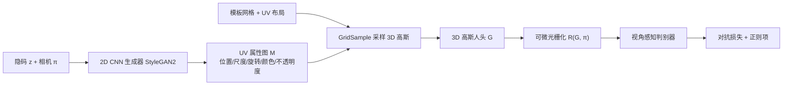

## 一句话总结

GGHead 把 3D Gaussian Splatting 放进 3D GAN 框架，用 2D CNN 在模板网格的 UV 空间里预测高斯属性图，只靠单视角 2D 图像就能训练出实时生成、严格 3D 一致的高质量 3D 人头先验，并首次实现 $$1024^2$$ 分辨率的实时生成与渲染。

## 研究背景

要从大规模 2D 图像里学到高质量的 3D 人头生成模型，需要同时满足两个约束：高渲染分辨率和严格的 3D 一致性。由于缺乏大规模 3D 人体数据，方法必须在训练时可微渲染，只用 2D 图像加相机位姿来监督 3D 生成，这就要求渲染流程在速度和分辨率上都可扩展。

主流 3D GAN 大多以 NeRF 作为可微渲染表示，但昂贵的光线步进（ray marching）严重限制了渲染分辨率与速度：

- EG3D 先在低分辨率渲染再用 2D 超分辨率上采样，代价是牺牲 3D 一致性；
- GRAM-HD 用 2D 流形简化 3D 表示来加速，但侧视质量变差；
- Mimic3D 用 EG3D 生成伪真值来直接监督，但只能用感知损失掩盖多视角不一致。

现有方法都无法在 $$512^2$$ 全分辨率下原生实时生成与渲染，而一次 3D GAN 训练要跑数百万次渲染，计算负担巨大。GGHead 的动机就是用基于光栅化的 3DGS 替换 NeRF，从根本上提升可扩展性。

## 方法

整体框架是一个 3D GAN：生成器预测 3D 表示，可微光栅化器渲染，视角感知的判别器用 2D 图像监督整个成像过程。核心是用模板网格的 UV 空间来组织无序的 3D 高斯，使得可以借助强大的 2D CNN（StyleGAN2）来预测。

关键设计一：模板 UV 空间参数化。3D 高斯本身无序、难以生成。方法为每个高斯属性生成一张 UV 图：

$$M_\star = B(z, \pi)$$

其中 $$\star \in \{\text{position}, \text{scale}, \text{rotation}, \text{color}, \text{opacity}\}$$，$$B$$ 是 StyleGAN2 生成器，把 $$z \in \mathbb{R}^{512}$$ 映射到 $$M \in \mathbb{R}^{256 \times 256 \times 14}$$。每个高斯在 UV 空间有固定坐标 $$x_i^{uv} \in [0,1]^2$$，通过双线性插值查询属性 $$G = \text{GridSample}(M, x_{uv})$$。这样生成器只需预测规整的 2D 图，且采样密度可变（训练中从 65k 高斯增到 262k），生成器基本与高斯数量无关。

关键设计二：属性激活与初始化保证稳定。位置用零初始化 CNN 层 $$Z$$ 让初始偏移为 0，把高斯锁在模板表面；位置偏移用 tanh 限幅：

$$G_i^{position} \leftarrow v_i + \gamma_{pos}\tanh\!\left(G_i^{position}\right)$$

FFHQ 上取 $$\gamma_{pos}=0.25$$（最多偏离模板 25cm），防止高斯早期跑出训练视锥。尺度用如下激活约束在 $$[0, e^{-s_{max}}]$$ 内，默认约 7mm、上限约 5cm：

$$G_i^{scale} \leftarrow \exp\!\left(-s_{max} - \text{softplus}\!\left(-(G_i^{scale}-s_{init}) - s_{max}\right)\right)$$

关键设计三：几何正则。位置和尺度用 L2 正则 $$L_{reg}^{pos} = \|M_{position}\|^2$$、$$L_{reg}^{scale} = \|M_{scale}\|^2$$ 保持稳定；不透明度用 $$\text{Beta}(0.5, 0.5)$$ 的负对数似然正则 $$L_{reg}^{opac}$$，鼓励高斯要么全透明要么全不透明。

关键设计四：UV 全变差损失（核心创新）。3DGS 缺乏真正的表面概念，生成器会靠"让后方高斯透出来"伪造高频细节，静态图看着好但视频渲染有明显伪影。直觉是：渲染图中相邻像素应由 UV 空间中也相邻的高斯建模。做法是把高斯颜色替换成其 UV 坐标再渲染得到 UV 图，反解 alpha 合成后做全变差正则：

$$\hat{G}_i^{color} \leftarrow (u_i, v_i, 0)$$

$$R_{uv} = R(\hat{G}, \pi)$$

$$R'_{uv} = R_{uv} - \frac{(1 - R_\alpha)}{R_\alpha}$$

$$L_{uv} = TV(R'_{uv})$$

这促成平滑表面、缝合空洞，并消除漂浮高斯。最终生成器目标为：

$$L_G = L_{adv} + \lambda_p L_{reg}^{pos} + \lambda_s L_{reg}^{scale} + \lambda_o L_{reg}^{opac} + \lambda_{uv} L_{uv}$$

训练用批大小 32，25M 图像，在 2 张 RTX A6000 上约 12 天；256 分辨率起步，7000k 图像后渐进增长到更高分辨率并加入不透明度与 UV 全变差损失（$$\lambda_o=1$$、$$\lambda_{uv}=100$$）。

## 实验结果

在 FFHQ 与 AFHQv2 Cats 上于 $$512^2$$ 分辨率与其他 3D GAN 对比。FID 衡量图像质量，$$\text{PSNR}_{mv}$$/$$\text{SSIM}_{mv}$$ 通过用 NeuS2 从 30 个多视角重建来衡量 3D 一致性与"表面性"。

| 方法 | FFHQ-M FID↓ | PSNR_mv↑ | SSIM_mv↑ | FFHQ FID↓ | AFHQ-M FID↓ |
|------|------|------|------|------|------|
| EG3D（含超分） | 3.28 | 28.74 | 0.899 | 4.70 | 2.82 |
| GSM（无超分） | 28.19 | 26.40 | 0.919 | - | - |
| Mimic3D（无超分） | 4.27 | 30.95 | 0.949 | 5.37 | 4.48 |
| Ours（无超分） | 4.06 | 33.29 | 0.964 | 5.15 | 3.40 |

GGHead 在全 3D 一致的方法中 FID 最好（优于 Mimic3D），仅次于依赖 2D 超分的 EG3D；而多视角重建 PSNR/SSIM 明显领先所有对手，说明 3D 一致性与表面质量最佳。

速度上（RTX A6000，batch=1）：Ours 在 $$512^2$$ 渲染仅 3.8ms，而 Mimic3D 需 286.7ms、GRAM-HD 38.2ms、EG3D（128 原生）23.4ms；训练前反向一次 127.78ms，且能在全 $$512^2$$ 下训练，而 EG3D/Mimic3D 训练时只能把原生分辨率降到 128/64。显存也更省（batch=32 仅 35.0GB，对手 OOM），总训练时间约 23.4 天（单卡等效），显著快于 EG3D（39 天）与 Mimic3D（80.2 天）。

消融表明：去掉尺度正则会训练崩溃；模板选择较鲁棒（调整版 FLAME 最好 4.03）；高斯数从 65k 增到 262k 把 FID 从 6.39 降到 4.28；UV 全变差损失进一步降到 4.06。

## 亮点与局限

亮点：

- 用模板 UV 空间把无序 3D 高斯的生成转化为规整 2D 图预测，直接复用成熟的 StyleGAN2，工程上优雅且高效。
- UV 全变差损失巧妙地把"表面性"问题转到 UV 渲染图上求解，无需时间维度监督就消除了透视穿帮与漂浮高斯。
- 首次实现 $$1024^2$$ 原生分辨率下 3D 一致人头的实时生成与渲染，训练速度、显存、渲染速度全面领先，可扩展性强。
- 在 UV 空间生成高斯天然形成表面归纳偏置，极端侧视仍表现良好。

局限：

- 只提供视角控制，缺乏表情等语义控制能力（作者建议引入 FLAME 表情码扩展）。
- 目前局限于人头这一狭窄域，泛化到 ImageNet 等更通用类别需要可学习模板等改造。
- 依赖领域特定的关键点检测与对齐流程。

## 延伸思考

GGHead 展示了"用规整 2D 表示去参数化非规整 3D 基元"这一思路的威力：只要能把 3D 结构锚定到一张 UV 图上，几十年积累的 2D CNN/GAN 架构就能直接迁移过来。这对其他 3D 生成任务（身体、物体、场景）都有启发——关键在于找到合适的模板与 UV 布局。UV 全变差损失也提供了一个通用范式：当某种质量属性（这里是表面连续性）无法在图像空间直接监督时，可以把它编码进一个辅助渲染通道再施加正则。顺着作者的展望，若能结合表情码并在大规模人脸视频上训练，有望"仅从 2D 数据"构建出可驱动的照片级 3DMM，这可能改变数字人资产的生产方式。
