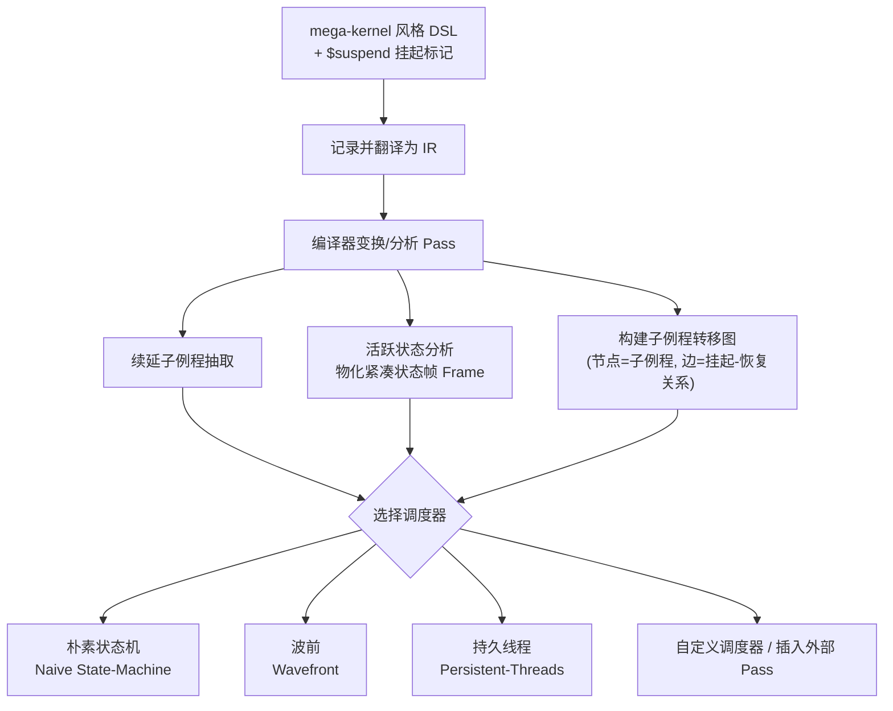

## 一句话总结

把 CPU 世界成熟的"协程（coroutine）"概念引入 GPU 内核编程：开发者只需在 mega-kernel 里打上挂起标记（`$suspend`），编译器就自动把巨核拆成一组子例程并算出跨挂起点需要保存的活跃状态，再交给内置调度器（波前 / 持久线程）执行，从而以极小的代码改动实现复杂渲染任务（如路径追踪）的灵活拆分与调度。

## 研究背景

现代 GPU 采用 SIMT 执行模型 + 延迟隐藏架构，把路径追踪这类重负载写成单一 mega-kernel 虽然方便，却往往不是最优：控制流发散、访存发散会导致硬件利用率低，寄存器压力过大也限制了并行度。

业界的经典应对是手工"拆核"，例如波前路径追踪（wavefront path tracing）：把巨核拆成若干阶段子核（生成光线、求交、光源采样、表面着色……），用一个调度核把路径状态按阶段排入队列后批量处理，以提升线程一致性、降低寄存器压力。

但手工拆分和调度极其繁琐易错，牵扯三件互相耦合的苦活：
- 重构嵌套控制流（分支、循环、`break`/`continue`/提前返回）；
- 收集散落在各处、跨拆分点仍需存活的中间状态；
- 管理各类运行时资源并安排子核执行顺序。

作者观察到：这三件事恰好对应协程的语义——挂起会把"当前程序状态 + 剩余指令"打包成续延（continuation）闭包交回调用方，之后可择机恢复。于是把"内核拆分"对应到"协程挂起"，把"子核调度"对应到"协程调度器"，寻求一个统一、自动化的解决方案。挑战在于 GPU 与 CPU 架构差异：线程上下文由硬件管理不可直接操作、每线程资源效率极其敏感、协程的延迟恢复又叠加了一层异步性。

## 方法

### 整体框架

作者选择**非对称、无栈（asymmetric, stackless）**的协程语言模型（与 Kotlin、C++20 一致），因为无栈协程可纯靠语言级变换实现、不依赖 GPU 上缺失的任意跳转/调用栈转储指令；非对称模型控制层次更结构化、便于编译实现。整个系统建立在 Luisa（一个 C++ 内嵌 DSL + JIT 渲染框架）之上，扩展了其 DSL 与运行时。

理论上该模型等价于对原程序做续延传递风格（CPS）变换：挂起 = 向调度器发起一次"带当前续延的调用"。

### 关键设计 1：显式挂起标记 + 自动子例程与状态帧抽取

用户只需在原 mega-kernel 里插入 `$suspend`（可选带语义标签），且允许出现在**任意嵌套控制流**（`$if` / `$while` / `$switch`，含 `$break` / `$continue` / 提前返回）中——这对路径追踪这类复杂逻辑至关重要。编译器随后自动解决两个问题：(1) 每个挂起点的续延要执行哪些指令；(2) 要向续延传递哪些上下文。为此做续延抽取 + 状态帧物化两大阶段。针对 GPU 每线程资源敏感的特点，作者把域内 use-define 分析与跨域活跃性分析下沉到**逐聚合成员（per-aggregate-member）**粒度，把跨挂起点存活的活跃状态拆成标量字段并打包进一个**紧凑状态帧**。为适配 Luisa 的结构化 IR，还做了控制流规范化与"条件重放（condition replay）"来重建续延的控制流。

### 关键设计 2：子例程转移图

编译产物被编码成图：每个子例程（对应入口或某挂起点）是一个节点，被物化为普通的 Luisa `Callable`（首参为状态帧，其余参数继承自协程定义）；挂起-恢复关系是有向边，边上带**逐字段的读写使用信息**（恢复时读哪些、挂起时写哪些）。调度器据此只加载/保存必要字段，显著降低访存量——尤其在配合 SoA 布局的波前调度器中。

### 关键设计 3：三种内置调度器（拆分与调度解耦）

调度器的设计空间有两维：状态帧的存放（thread-local / block-shared / global，AoS / SoA）与子例程执行时机的编排。作者提供三种代表性内置调度器，特性对比见下：

| 调度器 | 调度粒度 | 线程发散 | 寄存器压力 | 全局访存 | 调度开销 |
|---|---|---|---|---|---|
| Naive 状态机 | 线程 | 高 | 高 | 低 | 低 |
| Wavefront 波前 | 设备 | 低 | 低 | 高 | 高 |
| Persistent 持久线程 | 线程块 | 低 | 高 | 低 | 高 |

- **朴素状态机**：把子例程重新拼回一个 mega-kernel，线程本地存帧，循环轮询目标 token。无性能收益，主要作为验证正确性与性能基线。
- **波前**：把状态机拆成多个子核，帧存全局缓冲；每轮收集活跃实例索引入队，用稳定 multi-split 算法按目标子例程聚类以提升一致性；提供 SoA 帧布局与帧缓冲压紧（compaction）两项优化降低访存。
- **持久线程**：用块共享内存（低延迟片上 L1）存帧、跑块内同步的状态机；线程块通过一次全局原子加获取一批任务，领头线程挑选块内最常见的续延让全块线程执行同一子例程；提供 SoA 避免 bank 冲突、全局内存扩展（GME）保证占用率两项优化。

拆分（打标记）与调度（选调度器）完全解耦，用户可自由组合试验；高级用户还能用低层接口直接管理帧与调用子例程，构建自定义调度器或在挂起点插入外部计算 Pass。

## 实验结果

全部实验在 RTX-2080Ti（11GB）上、用 Luisa 的 CUDA 与 DirectX 后端完成。主实验为路径追踪：fork LuisaRender 的 mega-kernel 积分器，在求交前 / 光线逃逸 / 直接光采样前 / 表面材质求值前设 4 个挂起点，拆成 5 个子阶段。归一化渲染时间（以原 mega-kernel = 1.00× 为基准，越小越快，10 次弹射 / 第 2 次弹射起 RR）：

| 场景 / 后端 | 原 Mega-Kernel | 手写 Wavefront | 协程 Wavefront | 协程 Persistent |
|---|---|---|---|---|
| Bathroom / CUDA | 1.00× | 0.47× | 0.65× | —(注) |
| Bathroom / DirectX | 1.00× | 0.58× | 0.83× | 0.81× |
| Kitchen / CUDA | 1.00× | 0.45× | 0.63× | — |
| White Room / CUDA | 1.00× | 0.40× | 0.56× | — |
| Lone Monk / CUDA | 1.00× | 0.57× | 0.69× | — |
| Lone Monk / DirectX | 1.00× | 0.63× | 0.84× | 0.85× |

注：持久线程调度器在 CUDA + OptiX 光追下因缺少线程块同步支持而不可用。多数情况下两种协程调度器都快于原 mega-kernel，其中波前略优于持久线程，说明复杂渲染任务的主要瓶颈是寄存器压力与线程发散。

剖析数据（Lone Monk，CUDA，10 弹射）进一步印证：原 mega-kernel 单核寄存器用量高达 128、分支效率 88.7%、整体计算吞吐仅 6.4%；协程波前版把最耗资源的表面求值隔离进独立子核后，求交、光源采样等阶段的寄存器压力与发散明显下降（分支效率多在 97%~100%）。代价是通用调度器带来约 9.7% 的调度开销，因此相比手写波前仍有可见差距。

其他应用：SDF 渲染中持久线程调度器反超（CUDA 0.76×、DirectX 0.79×），因着色简单、寄存器不吃紧而更凸显波前的访存/调度开销；此外还演示了在挂起点插入外部有限差分 Pass 来估计光线微分、实现各向异性纹理过滤，展示协程作为通用控制流重构工具的潜力。

## 亮点与局限

亮点：
- 首次系统性地把协程概念引入 GPU 内核编程，并揭示其与"内核拆分 + 调度"技术的深层联系。
- 拆分与调度彻底解耦，用户几乎零逻辑改动即可尝试不同挂起点与调度策略组合，大幅降低手工拆核的繁琐与出错风险。
- 面向 GPU 特性做了务实优化：逐成员活跃性分析得到紧凑状态帧、转移图携带逐字段读写信息、SoA / 压紧 / 共享内存 / 全局扩展等多档调优。
- 通用性强：不仅服务性能优化，还能作为通用控制流构造支持 generator、`$await`、外部 Pass 插入等模式。

局限：
- 受限于系统内编译优化能力，自动变换与状态帧分析未必最优，相比手工拆分仍有可观性能差距（通用调度器额外引入约 9.7% 调度开销）。
- 挂起点放置、调度器选择与配置仍需人工经验，缺乏自动调参。
- 依赖 Luisa 框架及其 DSL / IR 基础设施；持久线程调度器在 CUDA+OptiX 光追路径下受限于块同步支持而不可用。

## 延伸思考

- 论文把"CPU 高级语言构造搬到 GPU"作为一条可推广的思路——协程只是范例，未来 entity-component 系统之类的数据导向调度、甚至神经网络 Pass 嵌入计算核，都可能借这套挂起-恢复+调度机制受益。
- "拆分/调度解耦"本质上把性能调优变成了可搜索的设计空间（挂起点位置 × 调度器 × 帧布局），天然适合自动调参 / 自动性能建模，这可能是把该工作从"专家工具"推向"默认即最优"的关键一步。
- 与 Dr.JIT 的对比很有启发：一个在"融合小算子成大核"，一个在"拆大核成小例程"，两者目标一致（生成合适粒度的核）却方向相反，暗示存在一个随负载而变的"最优核粒度"，若能让系统在两个方向上自动收敛，价值巨大。
- 剖析显示表面着色是寄存器与发散的主要来源，这与"材质求值多态性"的复杂度直接相关；把它作为独立可调度单元，或许能与 Shader Execution Reordering、Work Graphs 等硬件新特性形成协同。
