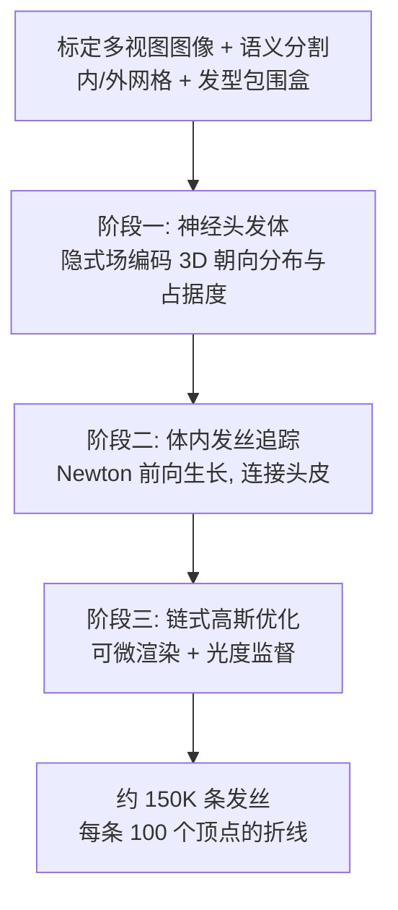

## 一句话总结

GroomCap 是一套无需任何数据先验的多视图头发捕获流水线：先用神经隐式场编码头发的 3D 朝向分布与占据度，再从体数据里追踪出初始发丝，最后用一种"链式高斯"表示在图像上做可微渲染优化，从而重建出高保真、发丝级、且保证连到头皮的头发几何。

## 研究背景

从图像重建发丝级头发几何长期是数字人领域最难的问题之一：头发结构层叠交错、风格材质千变万化。传统多视图流水线通常先重建可见外表面、再由各视图的 2D 朝向估计计算 3D 朝向场,然后靠扩散或 ribbon 补全整个发量并抽取发丝。这一路径存在几个根本缺陷:

- 用离散外表面或显式体来表示头发,会丢失大量空间结构细节与占据度的自然变化;
- 图像上每个像素其实是大量不同朝向发丝叠加而成,把它们聚合成"单一朝向角"会丢弃恢复结构所必需的信息;
- 即便初始投影结构准确,经过体补全和发丝追踪后质量仍会退化,出现分布不均、局部细节缺失、边界不一致、曲率不自然等问题。

近年方法转向数据驱动,把合成数据学到的先验塞进流水线。但头发真值数据稀缺、合成资产与真实存在域差,而且头发多样性极高,再大的发型库也难以覆盖特定个体的精细细节,结果往往过度正则化、几何被"压平"。本文主张:先验不是万能药,应当先从算法层面解决根本缺陷,于是提出完全不依赖数据先验的高保真捕获方案。

## 方法

整体流水线分三个阶段,全程使用同一套参数处理所有发型(含短发、中长发、长马尾、深色/染色发)。

输入准备:64 相机 4K 分辨率均匀光照采集,重建外网格(向外膨胀 2cm 作为硬边界)、拟合参数化头模作为内网格(近似头皮、定位发根),并投影分割得到发型包围盒。唯一的人工步骤是可选地在一张俯视图上标注分缝线,耗时不到一分钟。

### 关键设计一:3D 朝向的体渲染

直接对极角做 alpha 混合在数学上是错误的——若一条光线穿过朝向为 $$(\pi,0)$$ 与 $$(0,\pi)$$ 的两根发丝,前者透明度 0.5,朴素混合得到 $$(\pi/2,\pi/2)$$,把两根不同朝向的发丝抹成了同一方向。作者的做法是把单个 3D 朝向"展开"成一个分布,再对分布做 alpha 混合。对位置 x,以反比核构造朝向概率密度:

$$h_x(\theta,\phi) = \frac{1}{C_x} h'_x(\theta,\phi)$$

$$h'_x(\theta,\phi) = \frac{1}{\beta(\|\theta-\theta_x\|^2 + \|\phi-\phi_x\|^2) + \delta}$$

其中 $$\beta$$ 为缩放因子、$$\delta$$ 为阻尼因子、$$C_x$$ 把积分归一化为 1(实现中还考虑朝向的周期性与无方向性)。沿光线累积的 3D 朝向分布借助经典体渲染公式得到:

$$g_r(\theta,\phi) = \int_{t_n}^{t_f} T(t)\,\sigma(r(t))\,h_{r(t)}(\theta,\phi)\,dt$$

$$T(t) = \exp\left(-\int_{t_n}^{t}\sigma(r(\alpha))\,d\alpha\right)$$

实现上把 $$(0,\pi]$$ 离散成 64 个 bin,分布近似为 $$64\times64$$ 维向量逐维累积。

### 关键设计二:2D 朝向分布监督

以往用一组带方向的滤波器卷积图像,把最大响应对应的角度当作该像素的 2D 朝向。作者指出用单一角度不够:滤波器感受野可能覆盖多根不同朝向的发丝,多根发丝也可能叠加穿过同一像素。因此保留全部 64 个 Gabor 滤波器的响应,天然构成一个 2D 朝向分布,用它监督神经朝向场。把 3D 朝向分布投影到图像平面得到 2D 分布:

$$f(\eta) = \frac{1}{C_\eta}\max_{(\theta,\phi)\in u} h(\theta,\phi)$$

损失为投影分布与滤波器响应分布之差:

$$L_{ori} = \int_0^\pi \|f(\eta) - \bar f(\eta)\|^2\,d\eta$$

占据度场同时预测头发占据 $$\rho_h$$ 与身体占据 $$\rho_b$$,按标准体渲染累积成每像素标签,用伪真值分割监督:

$$L_{occ} = \|\psi_h - \bar\psi_h\|^2 + \|\psi_b - \bar\psi_b\|^2$$

训练分两阶段:先只用光度损失训特征与外观网络,再冻结它们、单独用 $$100 L_{ori} + 0.02 L_{occ}$$ 训结构网络,以提高稳定性并避免密度被噪声标签污染。

### 关键设计三:链式高斯发丝优化

追踪阶段用前向 Newton 法在体内生长发丝,生长方向带惯性项与表面排斥项:

$$m_k = \gamma\, m_{k-1} + (1-\gamma)\left[\operatorname{sign}(g\cdot m_{k-1})\,g + \lambda\min(n\cdot m_{k-1},0)\,n\right]$$

追踪出"体发丝"与"头皮发丝",再把体发丝沿邻近头皮发丝反向生长连回头皮(通常 >99% 可连上),保证 scalp-rooted。

最后阶段引入链式高斯:把每段线段近似为中点处的一个细高斯,协方差为

$$C = E D D^T E^T$$

其中 $$E$$ 为主轴($$e_i$$ 沿段方向)、$$D=\operatorname{diag}[\tau_l,\tau_d,\tau_d]$$ 为尺度。优化目标不是每个高斯的形状/外观,而是发丝几何本身。为抑制"高自由度外观参数幻觉出假细节"的问题,作者做了三重约束:(1) 不直接优化顶点,而是优化每条发丝在自监督训练的 strand-VAE 里的 128 维隐向量,整体形变、天然平滑;(2) 大幅削减外观自由度(SH 降到 0 阶、颜色/直径只用 8 个锚点插值、透明度只留 2 个值);(3) 自适应分裂与剪枝动态调节发量(30K→50K,末尾再放大分裂到 150K)。总损失综合光度项、体引导项、穿透防止项及若干启发式正则:

$$L = \lambda_i L_i + \lambda_n L_n + \lambda_p L_p + \lambda_d L_d + \lambda_l L_l + \lambda_b L_b$$

## 实验结果

论文以定性对比为主(无数值指标表),在受控影棚数据与野外数据上验证通用性与鲁棒性,核心设置与结论如下:

| 维度 | 设置 / 结论 |
| --- | --- |
| 影棚数据 | 27 位受试者,覆盖短发到长马尾等多样发型,统一流水线统一参数处理 |
| 野外数据 | 公开 NeuralHaircut(NHC)数据集,手持手机视频,用 COLMAP 估相机位姿,外网格用球面近似 |
| 对比方法 | MonoHair、NeuralHaircut(均在同一渲染器下比较) |
| 定性结论 | 影棚下能忠实还原发际线、刘海、发簇等个人细节;NHC 上与并行工作 MonoHair 相当、优于更早的 NeuralHaircut |
| 输出规模 | 约 150K 条发丝,每条 100 个顶点(优化阶段约 50K 条 ≈ 5M 高斯) |
| 计算量 | 隐式体训练约 28 小时(16×TPU v5);追踪 1.5 小时(A100);高斯优化 1.5 小时(8×H100);strand-VAE 2.5 小时 |

消融验证了三处关键设计:用最大响应角替代完整分布会导致局部过平滑;直接对 3D 极角做 alpha 混合(而非直方图)结果更差;去掉链式高斯的定制参数(退回原版 3DGS 高自由度)会把发丝压平;用合成数据预训练的通用 strand-VAE 因域外形状导致严重失败;去掉体引导与隐向量正则则结构性变差。应用上支持基于物理的重渲染、Houdini 仿真与发型编辑。

## 亮点与局限

亮点:

- 把"3D 朝向"作为分布纳入体渲染框架,解决了朝向朴素混合数学上不成立、结构被抹平的根本问题;配套的 2D 朝向分布监督保留了单像素多朝向信息。
- 完全无先验,能捕获超出任何现有数据集覆盖范围的个体细节(飞散发丝、深色/染色发、短发与长马尾),且同一套参数通吃。
- 链式高斯 + 主体特定 strand-VAE 隐空间优化,用极少参数(每条约 162 个 vs 原版 3DGS 约 1400 个)避免外观幻觉、保证发丝整体平滑与头皮连通。

局限:

- 计算开销大(整条流水线远超 NeuralHaircut、MonoHair),主要瓶颈在大 bin 数直方图朝向渲染与对隐式体的反复查询。
- 对极深色、极度卷曲发型仍会失败:朝向噪声大、追踪凌乱、优化难以改善,重建可能与输入不一致。
- 强依赖可靠的分割掩膜;掩膜不准会让发丝去"补偿"错标像素;二值掩膜也无法反映局部发量密度或秃斑变化。

## 延伸思考

作者明确把"无先验"当作一种立场而非否定先验的价值——结论里也承认对复杂发型先验知识很重要,并把"将先验知识与这套灵活的无先验流水线结合"列为未来方向(以 MonoHair 为例)。这提示了一个有意思的折中空间:先验可以在数据稀缺、遮挡严重的区域(如贴近头皮处)提供结构约束,而无先验路径负责恢复个体特异的飞散细节,两者的边界如何自适应划分值得探索。另一个可落地的改进是"发丝级 hair matting":把二值掩膜换成连续的头发密度/透明度估计,可能直接缓解密度变化与秃斑无法表达的问题。此外,朝向分布的直方图表示虽有效但昂贵,是否能用更紧凑的分布参数化(如球面上的混合模型)在保留多峰信息的同时大幅降本,是提升实用性的关键。
