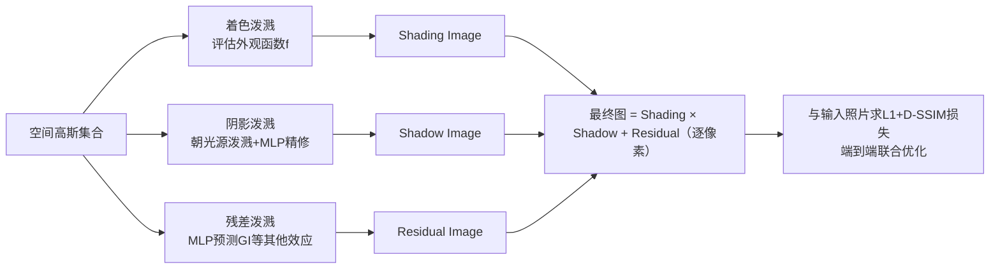

## 一句话总结

用"空间高斯 + 角度高斯"的表达配合三次泼溅（着色、阴影、残差）过程，从多视角点光源照片中重建出可实时、高质量重照明的物体，训练 40–70 分钟、渲染 90 fps。

## 研究背景

在虚拟世界中真实还原物体在不同视角与光照下的外观，是图形学与视觉的长期问题，广泛用于文化遗产、电商与视效。传统表达（网格 + 参数化 SVBRDF）难以对输入照片做联合优化，几何一旦出错就会污染后续外观重建；NeRF 等隐式表达质量高但训练慢、渲染慢。

3D 高斯泼溅（GS）带来了高效的可微光栅化管线，但原始 GS 用低阶球谐只擅长烘焙静态光照下的朗伯主导外观，无法换光。已有的 GS 重照明工作大多以未知环境光图像为输入，要面对光照-材质歧义，且依赖良好定义的表面法线做正则，只能处理不透明、边界清晰的几何，也普遍不建模各向异性反射与超出表面几何的阴影。本文要做的是第一个面向复杂几何与外观的通用 GS 可重照明表达。

## 方法

### 整体框架

输入是标定视角、每次开一盏点光（OLAT）拍摄的约 500–2000 张多视角图像。表达为一组空间高斯，每个高斯带不透明度与一个随视角/光照变化的外观函数。渲染采用延迟着色，通过"三次泼溅"合成图像：

三张中间图逐像素相乘再相加得到最终结果，与对应输入照片的差异端到端驱动整个表达的优化，同时沿用 GS 的自适应密度控制。

### 关键设计一：朗伯 + 角度高斯混合的外观函数（第 1 次泼溅）

每个空间高斯用一个视角/光照相关函数 $$f$$ 替代原始 GS 的球谐：

$$f(\omega'_i, \omega'_o) = \rho_d f_d(\omega'_i) + \rho_s f_s(\omega'_i, \omega'_o)$$

其中 $$\rho_d/\rho_s$$ 为漫反射/高光反照率。漫反射项改造了余弦加权朗伯，使其在整个球面上梯度非零，避免标准朗伯在下半球梯度为零导致优化"死区"：

$$f_d(\omega'_i) = \frac{\mathrm{ELU}(n' \cdot \omega'_i) + \varepsilon(1 - \frac{1}{e})}{(1 + \varepsilon(1 - \frac{1}{e}))\pi}$$

高光项是多个"角度高斯"（由各向同性的球面高斯扩展为各向异性）的加权混合，以半向量 $$h'$$ 为输入表达全频率高光：

$$f_s(\omega'_i, \omega'_o) = \sum_j \alpha_j\, G_{\mathrm{ang},j}(h')$$

一组基角度高斯（主实验为 8 个）在所有空间高斯间共享，借助空间一致性更好地约束优化。每个空间高斯的可学习参数包括着色帧 $$[n,t,b]$$、角度高斯局部帧与标准差、$$\rho_d$$、$$\rho_s$$ 以及线性权重 $$\{\alpha_j\}$$。

### 关键设计二：阴影泼溅 + MLP 精修（第 2 次泼溅）

自阴影若用逐点向光源追踪射线做不透明度线积分会很贵。作者借鉴传统 shadow mapping 复用光栅化管线的思路，把所有空间高斯朝点光源泼溅（把光源当作透视相机，方向光则改为正交投影）。对一条阴影射线，按到光源距离排序求累积不透明度 $$T_m$$ 作为阴影值；由于一个 2D splat 会与多条射线相交，用投影密度 $$\beta_m$$ 加权平均：

$$T = \frac{\sum_m \beta_m T_m}{\sum_m \beta_m}$$

并加 0.015 的 shadow bias 缓解 z-fighting。再用一个 3 层小 MLP $$\Phi$$ 对每个高斯的阴影值去噪精修：

$$T' = \Phi(T, \omega_i;\ \mu, l)$$

其中 $$\mu$$ 为高斯中心（让 MLP 具备空间感知），$$l$$ 为每高斯 6 维隐向量，$$\mu$$ 与 $$\omega_i$$ 经 4 频段位置编码。

### 关键设计三：残差 MLP 补偿其他光传输（第 3 次泼溅）

对全局光照等未建模效应，用另一个 3 层 MLP $$\Psi(\omega_o;\ \mu, l)$$ 为每个空间高斯预测一个 RGB 残差，泼溅成残差图。它只以出射方向 $$\omega_o$$ 为主参数，是实时渲染中表达间接光照的常见参数化。

训练用 GS 的损失 $$L = (1-\lambda)L_1 + \lambda L_{D\text{-}SSIM}$$（$$\lambda=0.2$$），不对任何中间量施加正则；采用两阶段策略先只训朗伯项 15K 次让着色帧稳定收敛，再开完整含高光的外观函数训 100K 次。

## 实验结果

在 RTX 4090 上训练 40–70 分钟（12 万–75 万空间高斯 + 8 个基角度高斯），渲染超 90 fps。测试涵盖合成 NeRF 渲染图、捕获 SVBRDF 渲染图、NRHints 手持相机/手机闪光拍摄、以及专业光台采集四类输入。下表为专业光台采集数据上的重照明质量（每项为该物体 SSIM / PSNR / LPIPS）：

| 物体 | SSIM | PSNR | LPIPS |
|------|------|------|-------|
| Li'lOnes | 0.9809 | 38.61 | 0.0182 |
| Container | 0.9745 | 36.65 | 0.016 |
| Nefertiti | 0.956 | 36.58 | 0.0434 |
| Fox | 0.9225 | 34.21 | 0.0745 |
| Zhaojun | 0.9321 | 32.08 | 0.1071 |
| Boot | 0.898 | 28.84 | 0.1013 |

对比方面：相较最新可重照明隐式表达 NRHints，质量相当或更高，而训练（40–70 分钟 vs. 15 小时）与渲染（90 fps vs. <1 fps）均快一个数量级以上。在处理次表面散射的 Translucent 上，与 OSF 相比取得更优结果（0.9740 / 32.34 / 0.0318 vs. 0.9378 / 26.09 / 0.0508）。相较以未知环境光为输入的 GaussianShader、GS-IR、Relightable 3D Gaussian、TensoIR 等方法，质量明显领先。

## 亮点与局限

亮点：
- 第一个面向复杂几何（从实心到毛绒）与复杂外观（从半透明到各向异性）的通用 GS 可重照明表达，且不依赖良定义法线等强先验/正则。
- "三次泼溅"把着色、自阴影、残差光传输统一在高效可微光栅化管线内，阴影泼溅复用 shadow mapping 思路避免昂贵射线追踪。
- 仅用简单端到端图像损失即可让各中间分量（着色/阴影/残差）自然解耦，训练与渲染均比同等质量的神经方法快一个数量级以上。

局限：
- 不处理玻璃、宝石等透明材质。
- 某些光照/视角下阴影不如网格几何那样锐利；对极高频各向异性外观，重建高光可能闪烁，主因是空间高斯粒度不足。

## 延伸思考

作者把 $$\Psi$$ 当成"兜底"网络来吸收折射、内反射、全局光照等一切未显式建模的光传输，这种"物理项 + 神经残差"的混合设计换来了鲁棒性与效率，但也意味着这些效应无法被真正分解或外推——例如残差网络学到的间接光在换新物体或大幅改变布光时能否泛化值得追问。未来若把 $$\Psi$$ 替换为显式的折射/内反射建模，有望同时提升透明材质支持与可解释性。另一个自然方向是结合学习式照明复用去优化采集视角/光照，减少输入图像数并进一步提升质量，乃至以该表达为基础构建大规模数据库支撑生成式任务。
