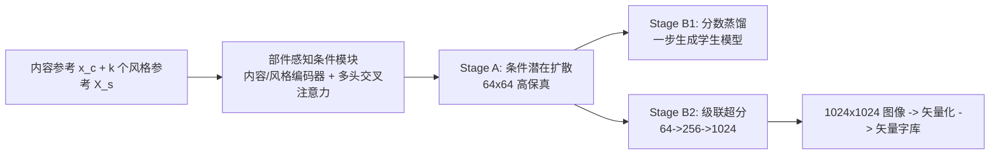

## 一句话总结

HFH-Font 用带有"部件感知条件"的潜在扩散模型做少样本中文字体合成，配合分数蒸馏实现一步推理、级联超分实现 1024×1024 高分辨率输出，首次让自动生成的大规模中文矢量字库达到接近专业设计师手工水准。

## 研究背景

自动字体合成的目标是仅用少量示例字就生成整套字库，对于包含成千上万字符的中日韩等书写系统尤为有价值（GB2312 标准 6763 字，GB18030-2022 标准 87887 字）。现有方法分两类：直接生成矢量字形，或先合成栅格图像再矢量化。前者只能处理简单形状，难以构造中文这类高拓扑复杂度字形的完整正确轮廓；后者则难以在保留局部细节的同时高效合成高分辨率图像。

主流方法多基于 GAN 并采用风格-内容解耦方案，但 GAN 训练困难、难以扩展、易模式崩塌、缺乏多样性。扩散模型质量更好、易扩展、能生成多样结果，但迭代推理慢，且如何把字形先验知识恰当融入扩散模型仍需精细设计。作者的观察是：一旦能合成局部细节保留良好的 1024×1024 高分辨率字形图像，就能矢量化出与手工制作难以区分的高质量矢量字形。

## 方法

整体框架由三部分组成：一个带部件感知编码器的条件潜在扩散模型（Stage A，生成 64×64 高保真低分辨率结果）、一个基于分数蒸馏的一步生成蒸馏分支（Stage B1）、以及一个级联超分模型（Stage B2，生成高分辨率字形）。Stage A 的权重用于初始化 B1 与 B2，两者相互并行。

关键设计一：部件感知条件（Component-aware Conditioning）。字体风格存在于不同结构层次——全局风格（字号、纵横比、笔画粗细、整体布局）为所有字符共享，笔画级风格由含相同笔画的字符共享，部件级风格仅由含相同部件的字符共享。受 FsFont 启发，方法用多头交叉注意力让内容特征的每个位置关注风格参考的相关位置：

$$
y = Attention(Q,K,V) = softmax\left(\frac{QK^{T}}{\sqrt{d}}\right)\cdot V,\quad Q = W_Q^{(i)}\tilde{f}_c,\ K = W_K^{(i)}\tilde{f}_s,\ V = W_V^{(i)}\tilde{f}_s
$$

其中风格特征由所有 $$k$$ 个风格参考编码并拼接而成。潜在扩散的条件损失为：

$$
L = \mathbb{E}_{z_0,\epsilon,t}\left[\lVert \epsilon - \epsilon_\theta(z_t,t,C(x_c,X_s)) \rVert_2^2\right]
$$

关键设计二：参考选择策略。基于 1032 类部件与 339 类笔画的定义，采用 775 个常用字的 OptSet 作为完整风格参考集（覆盖 GB2312 所有部件）。风格参考数 $$k$$ 设为 6（中文字符最多分解为 6 个部件），构建部件级与笔画级两套字符-参考映射，训练时分别以概率 $$1-p$$ 与 $$p$$ 使用，迫使模型在不同参考规模下学习不同层次的风格表示，兼顾风格保真度与输入参考量。

关键设计三：基于分数蒸馏采样（SDS）的一步生成。作者发现 10 步 DDPM 采样已足够好，但仍不够快。借鉴文本到 3D 领域的 SDS，用冻结的多步教师模型指导一步学生模型（时间步固定为 $$T$$），无需额外回归或对抗损失，蒸馏梯度近似为：

$$
\nabla_\phi L_{SDS} = \mathbb{E}_{t,\epsilon,y}\left[w(t)(\epsilon_\theta(z_t,t,y)-\epsilon)\frac{\partial \hat{z}_\phi}{\partial \phi}\right]
$$

与在像素空间蒸馏的做法不同，本方法在潜在空间操作。

关键设计四：级联超分走向高分辨率。用与 Stage A 相同的"潜在扩散+部件感知条件"框架做超分模块，从 64×64 逐级升到 256×256 再到 1024×1024。改动包括：将低分辨率图像替换内容参考并与噪声隐变量拼接输入、执行噪声条件增强（对低分图像加噪再解码）、为编码器增加下采样层以控制显存。最终 1024×1024 图像用 Adobe Illustrator 的 Image Trace 工具矢量化。

## 实验结果

在 38 个未见字体上评测（大数据集 3538 字体训练），与 8 个 SOTA 方法比较。以下为未见字体+已见字符的主实验精简结果（数字忠于原文）：

| 方法 | 训练集 | RMSE↓ | SSIM↑ | LPIPS↓ | FID↓ | Acc(C)↑ | Acc(S)↑ |
|------|--------|-------|-------|--------|------|---------|---------|
| DG-Font | Large | 0.301 | 0.540 | 0.199 | 9.914 | 0.921 | 0.061 |
| CF-Font | Large | 0.269 | 0.577 | 0.193 | 15.829 | 0.910 | 0.060 |
| Diff-Font | Large | 0.296 | 0.566 | 0.178 | 3.799 | 0.990 | 0.194 |
| FontDiffuser | Large | 0.309 | 0.522 | 0.189 | 14.264 | 0.992 | 0.243 |
| Ours (n_ref=1) | Large | 0.274 | 0.610 | 0.153 | 2.437 | 0.990 | 0.547 |
| Ours (n_ref=10) | Large | 0.266 | 0.627 | 0.142 | 1.780 | 0.989 | 0.642 |
| Ours (n_ref=100) | Large | 0.250 | 0.658 | 0.125 | 1.392 | 0.993 | 0.676 |
| Ours (n_ref=775) | Large | 0.234 | 0.690 | 0.109 | 1.209 | 0.997 | 0.705 |

除 Acc(C)（各强方法接近）外，本方法在所有指标上大幅领先；即使只用 10 个参考也达到 SOTA。一步蒸馏结果上，教师模型 1 步推理时 FID 高达 50.882 完全失效，而蒸馏后的学生模型 1 步即可达到 FID 1.683、RMSE/SSIM/LPIPS 甚至优于 10 步教师模型，速度显著快于扩散类方法、与 GAN 类相当。超分方面，相比通用 Real-ESRGAN，本方法在 1024 分辨率下 FID 从 15.315 降至 5.996、风格准确率更高。

用户研究：非专家图灵测试中平均判别准确率 51.07%（接近随机猜测）；11 位专业字体设计师排名中，本方法在 10 款字体里有 4 款得分最高、6 款仅次于真值，接近设计师手工制作水准。

## 亮点与局限

亮点：把部件级先验知识以交叉注意力形式融入潜在扩散，显著提升风格准确度与一致性；用简单的分数蒸馏（无需额外回归/对抗损失）实现一步推理，兼顾质量与速度；级联超分能恢复低分辨率丢失的风格细节并弥合图像与矢量域的差距，首次让自动生成的大规模中文矢量字库达到专业水准；还能扩展到艺术字合成，迁移特殊纹理效果。

局限：模型对字符结构没有显式控制，参考数少或字符复杂时内容准确率下降，偶有笔画重复/缺失或密集笔画模糊；风格迁移存在极端 corner case（如混淆阴影/描边与实际字形）；方法基于中文结构分解，对 GB2312 不存在的形状（如圆形）跨语言泛化差；矢量化依赖商业工具，偶有二值化失败的不理想案例。

## 延伸思考

用一步蒸馏后主要开销转移到自编码器解码部分，说明进一步提速需优化 autoencoder 架构，这是通用潜在扩散加速的共性方向。部件感知条件本质是把领域结构知识注入注意力，这一思路对其他高度结构化、可组合的生成任务（如公式、乐谱、化学结构式）或许同样适用。跨语言泛化的困境也提示：如何在保留局部部件迁移能力的同时学到可迁移的全局风格表示，是拓展到韩文/英文乃至任意书写系统的关键。
