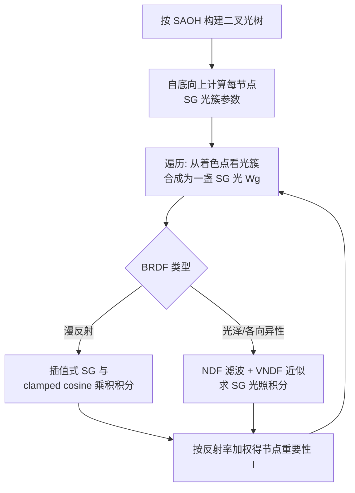

## 一句话总结

用球面高斯（SG）为光树每个节点构造更精确的重要性近似，配合把 NDF 滤波扩展到 SG 光照的技巧，让"每次树遍历只取一个光样本"也能显著压低多光源渲染中掠射角高光的蒙特卡洛噪声。

## 研究背景

在拥有大量自发光物体的场景里做直接光照，逐个追踪阴影线并评估贡献是不现实的，必须高效地对重要光源做重要性采样。理想采样应正比于"入射辐射 × BRDF"的乘积积分，但精确解不可行；现代物理材质的微表面 BRDF 又具有高频、各向异性的散射特性，进一步加大了难度。

基于光树（层次化光簇）的重要性采样是主流方案：通过按每个节点的重要性随机遍历树来选择光源。关键在于节点重要性要尽量接近该光簇的光照积分，并满足无偏采样约束：

$$ I > 0 \quad \text{if} \quad \int_{S^2} L(\mathbf{x}, \mathbf{o}) f(\mathbf{i}, \mathbf{o}) |\mathbf{o}\cdot\mathbf{n}|\, d\mathbf{o} > 0 $$

以往方法只能用粗糙近似（上界、忽略 BRDF、用各向同性瓣近似各向异性反射），导致在靠近根节点处误差很大，只能在遍历时自适应地拆分光簇、每次查询生成多个样本，增加了计算量与实现复杂度。已有的高质量 SG 光照近似虽精确，却会因近似误差产生零或负的重要性，违反无偏约束，因而不能直接用于层次采样。本文要解决的正是在满足约束前提下，如何用 SG 给出足够精确的节点重要性。

## 方法

整体框架：构建一棵"SG 光树"，每个节点用紧凑的分布参数描述光簇，遍历时把光簇视为从着色点看到的一盏 SG 光，再用满足无偏约束的解析近似计算漫反射与光泽两类 BRDF 的乘积积分作为重要性。

### 紧凑的 SG 光簇表示

沿用虚拟 SG 光的思路：光簇的空间位置分布用各向同性高斯（均值 $$\boldsymbol{\mu}$$、方差 $$\sigma^2$$）表示，辐射强度的方向分布用 vMF（即归一化 SG，轴 $$\boldsymbol{\nu}$$、锐度 $$\lambda$$）表示。参数在建树时自底向上以辐射通量加权聚合，例如方向平均：

$$ \bar{\boldsymbol{\nu}} = w_{\text{left}}\bar{\boldsymbol{\nu}}_{\text{left}} + w_{\text{right}}\bar{\boldsymbol{\nu}}_{\text{right}} $$

每节点只需存 $$\boldsymbol{\nu},\lambda,\boldsymbol{\mu},\sigma_s^2,r,\Phi$$ 共 10 个浮点数，比 Conty & Kulla 的包围盒加包围锥表示（12 个浮点）更紧凑。遍历时把空间高斯与 vMF 在光方向空间上相乘，得到一盏 SG 光 $$W g(\mathbf{o};\boldsymbol{\xi},\kappa)$$，天然避开了以簇中心求逆平方距离带来的奇异性。

### 插值式漫反射 SG 光照

漫反射用 Lambert 模型，重要性即 SG 与 clamped cosine 的乘积积分。作者利用 SG 轴恰为 $$\pm\mathbf{n}$$ 时的两个闭式解 $$\hat{B}(\kappa)$$、$$\check{B}(\kappa)$$，再用单次插值得到任意轴的结果：

$$ I \mathrel{\dot\propto} \frac{W}{\pi}\left[\hat{B}(\kappa)u + \check{B}(\kappa)(1-u)\right] $$

由于 $$\hat{B}(\kappa)>0$$ 且 $$\check{B}(\kappa)>0$$，插值形式恒满足无偏约束。插值因子 $$u$$ 用平面高斯与 clamped cosine 的解析卷积近似，在 $$\boldsymbol{\xi}\cdot\mathbf{n}\to\pm1$$ 与 $$0$$ 处都很准。该方法只算一次插值（此前方法要算一次 SG 乘积加两次插值），在 RX 7900 XTX 上比 SOTA 快 1.4 倍，且精度更高。

### 面向各向异性微表面 BRDF 的 NDF 滤波

这是提升采样质量的主贡献。原始 NDF 滤波把像素足迹投影到半程向量空间做抗锯齿，本文反过来把 SG 光投影到半程向量空间去卷积 NDF。NDF 在 $$[h_x,h_y]$$ 空间用二元高斯表示，SG 光的方差 $$1/\kappa$$ 经雅可比矩阵 $$\mathbf{J}$$ 变换后加到协方差上：

$$ \bar{\Sigma}_D \approx \Sigma_D + \frac{1}{\kappa}\mathbf{J}\mathbf{J}^\top $$

由此得到"变粗糙"的滤波 NDF，其卷积近似为：

$$ \int_{S^2} D(\mathbf{h};\mathbf{A})\, g(\mathbf{o};\boldsymbol{\xi},\kappa)\, d\mathbf{o} \mathrel{\dot\propto} D\!\left(\frac{\mathbf{i}+\boldsymbol{\xi}}{\|\mathbf{i}+\boldsymbol{\xi}\|};\bar{\mathbf{A}}\right) $$

与之前用各向异性 SG（ASG）近似反射瓣不同，NDF 滤波保留了原 NDF 模型，不会把 GGX 这类长尾 NDF 的尾部低估为零，也不会扭曲各向异性反射瓣。为进一步满足无偏约束，作者再用无 Heaviside 的 VNDF 近似反射瓣，并引入滤波可见性 $$V$$，最终光泽重要性为：

$$ I \mathrel{\dot\propto} W V\, p(\boldsymbol{\xi};\mathbf{i},\bar{\mathbf{A}}) \int_{S^2} g(\mathbf{o};\boldsymbol{\xi},\kappa)\, d\mathbf{o} $$

## 实验结果

在 3840×2160、HIPRT、AMD Radeon RX 7900 XTX 上，与 CK2018、CK2018+LY2020、LXY2019 对比。等时（5 秒）直接光照（不用 BRDF 采样）主结果：

| 场景 | 方法 | RMSPE | MAPE | spp |
|------|------|-------|------|-----|
| Hangarship | CK2018 | 216.5% | 35.2% | 303 |
| (4,775 光源) | CK2018+LY2020 | 89.1% | 32.2% | 294 |
|  | LXY2019 | 482.3% | 29.6% | 102 |
|  | **Ours** | **65.9%** | **20.9%** | 213 |
| Museum | CK2018 | 55.1% | 25.6% | 246 |
| (16,940 光源) | CK2018+LY2020 | 45.2% | 23.0% | 237 |
|  | LXY2019 | 26.5% | 25.1% | 82 |
|  | **Ours** | **18.5%** | **20.1%** | 170 |
| Toyshop | CK2018 | 64.9% | 26.2% | 233 |
| (167,493 光源) | CK2018+LY2020 | 30.8% | 25.4% | 217 |
|  | LXY2019 | 29.9% | 27.3% | 75 |
|  | **Ours** | **20.7%** | **18.8%** | 167 |

尽管本文方法因 SG 光照的数学函数开销 spp 低于 CK2018+LY2020，但误差更低，掠射角光泽高光尤为明显。路径追踪（配合 MIS）下，光泽场景收敛更快；在漫反射主导的 Bistro 场景与 CK2018+LY2020 在 RMSPE 上相当、MAPE 略优。对高各向异性材质，其优势最突出。本文方法比需两次树遍历的 LXY2019 更快，只用一次遍历就降噪，光簇参数计算也比 CK2018 略快（如 Toyshop 13.5 ms vs 20.1 ms）。

## 亮点与局限

亮点：
- 用满足无偏约束的高质量 SG 光照近似替代粗糙上界，使"每次查询单样本"也能高质量渲染，避免了自适应拆分的复杂度。
- 把用于抗锯齿的 NDF 滤波创造性地扩展到 SG 光照，正确处理半程向量与光方向之间的变换（推导了雅可比矩阵），对 GGX 长尾与各向异性反射都不失真、不低估。
- 光簇表示更紧凑（10 vs 12 浮点），参数计算更快。
- 提供了数值稳定的开源实现。

局限：
- 光簇是各向同性单瓣，无法表示复杂的多瓣入射辐射与各向异性光源分布（如细长光元）。
- SG 光照计算带来指数等数学函数开销，单样本成本高于忽略 BRDF 的方法。
- 多瓣 BRDF 仅用简单的漫反射-光泽加权模型近似，两层光泽瓣被合并为单瓣。

## 延伸思考

该方法可作为 ReSTIR 初始候选采样的强力生成器，因为 ReSTIR 方差正比于初始候选技术的质量，更准的层次采样有望直接改善重采样效果。把 NDF 滤波与光照积分统一在半程向量空间的思路，也提示了"抗锯齿工具"与"重要性近似"之间的深层联系，或可推广到折射、分层材质与体渲染等场景。若能对光簇参数做量化压缩，或引入多瓣/各向异性簇表示，有望在保持精度的同时进一步降低存储与带宽成本。
