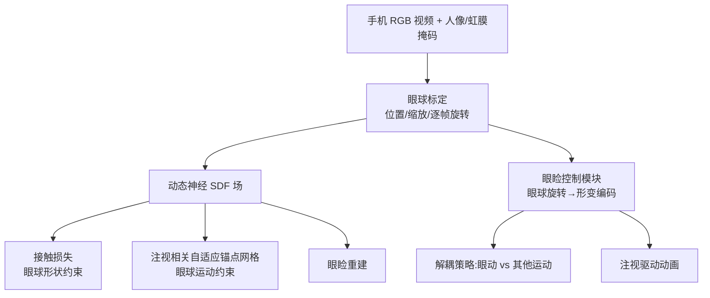

## 一句话总结

只用一部手机拍摄的 RGB 视频，就能重建带精细褶皱的眼睑几何，并实现由眼球转动语义驱动的眼睑动画，其关键是把眼球的形状与运动信息注入到动态神经 SDF 场中作为额外约束。

## 研究背景

眼睛是数字人"心灵的窗户"，眼睑的质量直接影响数字人是否跨越"恐怖谷"。但高质量眼睑既难重建也难驱动：一方面眼睑形状因人而异、含有褶皱与凸起等细节；另一方面眼睑运动伴随皮肤折叠展开等复杂非刚性形变。

以往方法在采集成本与细节质量之间被迫权衡。基于多相机的时空重建能拿到细节，却无法驱动且设备昂贵；基于预设 blendshape 的单 RGB-D 方案可保留部分细节并支持跟踪，但几何被模型空间的表达能力所限。作者观察到 SDF 表示在静态几何建模与动态场景上都有优势，且天然避免自相交、易与连续神经场结合，因此选择基于 SDF 的路线，目标是仅靠一部手机的轻量采集实现既能重建又能驱动的高质量眼睑。

## 方法

整体框架：输入是一段手机在人脸前方移动、被拍者执行不同注视方向的 RGB 视频（约 500 帧）。系统先做眼球标定拿到眼球位置、缩放与逐帧旋转，再用这些参数辅助学习一个动态神经 SDF 场完成重建，最后训练眼睑控制模块实现语义驱动动画。动态建模沿用规范超空间加可逆形变场的思路，观测空间的点经形变网络与拓扑网络映射到规范超空间，在超空间上定义 SDF 并做体渲染。

关键设计一：无需注视目标的自动眼球标定。核心思想是只有位置正确的眼球才能同时解释所有注视方向下的外观。给定一个符合生理比例（虹膜与眼球半径比例，含截球体加凸角膜）的 3D 眼球模板，通过可微网格渲染，以对齐虹膜掩码为目标同时优化一个共享的眼球位置、一个统一缩放和逐帧的眼球旋转（俯仰、偏航）：

$$
E(\mathbf{P}_e, \mathbf{R}^e_i, s; \mathbf{P}^c_i, \mathbf{T}, \mathbf{M}) = \sum_i^n \lVert \mathbf{M}_i - \hat{\mathbf{M}}_i \rVert_2^2
$$

该标定复用重建同一段视频，不需要额外的 2D/3D 注视目标输入。

关键设计二：接触损失提供眼球形状先验。单目 RGB 缺乏深度信息，作者同时建模眼睑内外表面，并鼓励眼睑内表面紧贴眼球表面——即在眼球表面采样点上 SDF 值为零且法向相反：

$$
\mathcal{L}_{contact} = \frac{1}{V}\sum_i^V \lVert f(\mathbf{v}_i) \rVert_1 + \frac{1}{V}\sum_i^V \lVert \nabla f(\mathbf{v}_i)\cdot \mathbf{n}_i + 1 \rVert_1
$$

其中所有背面顶点和可见的正面顶点（投影落在眼睑掩码外）都被排除，因为它们不与眼睑接触。

关键设计三：注视相关的自适应锚点网格。为把静态细节重建技术扩展到动态场景，作者在 NeuDA 的可学习锚点网格基础上，让锚点位置随眼球旋转变化。由于超空间的拓扑变化与注视姿态高度相关，锚点网格被建模为一个基础网格加上与俯仰、偏航角相关的两个偏移网格的线性组合：

$$
\mathbf{A}_i = \mathbf{A}_0 + p_i \cdot \mathbf{A}_p + y_i \cdot \mathbf{A}_y
$$

这样避免了直接关联拓扑坐标导致的计算图爆炸，又能表达注视变化下的细节。

关键设计四：眼睑控制与解耦策略。把逐帧形变编码拆成眼动部分（由眼球旋转经 MLP 映射得到）和其他运动部分（自由可学习的隐编码）：

$$
\boldsymbol{\varphi}_i = [\boldsymbol{\varphi}^e_i, \boldsymbol{\varphi}^o_i] = [F_e(\mathbf{R}^e_i), \boldsymbol{\varphi}^o_i]
$$

训练时用随机隐编码替换其中一部分生成"伪编码"，并通过解耦损失约束未改变部分对应控制区域的超空间坐标保持不变，从而防止眼动之外的运动（如抿嘴、动头）污染眼部区域的控制。

## 实验结果

作者用 iPhone 13 采集六位不同种族与性别参与者的真实数据，并基于 MetaHuman 生成四段合成视频用于定量评估（只在眼部区域计算深度误差和 Chamfer 距离）。在合成数据上与动态 SDF 方法（NDR、Tensor4D）、轻量采集人脸方法（PointAvatar、FLARE）以及基于模型的眼睑跟踪方法（Wen 等）对比：

| 方法 | 深度误差↓ (ID-1~4) | Chamfer 距离↓ (ID-1~4) |
|------|------|------|
| NDR | 1.76 / 1.39 / 1.90 / 1.29 | 0.131 / 0.219 / 0.241 / 0.187 |
| Tensor4D | 1.29 / 1.11 / 1.22 / 1.39 | 0.204 / 0.226 / 0.221 / 0.201 |
| PointAvatar | 3.49 / 3.58 / 3.42 / 3.54 | 2.450 / 2.139 / 1.477 / 1.409 |
| FLARE | 1.79 / 1.81 / 1.26 / 1.48 | 0.584 / 0.527 / 0.261 / 0.382 |
| Wen 等 | 2.43 / 2.87 / 1.77 / 2.14 | 1.029 / 1.406 / 0.540 / 0.849 |
| 本文 | **0.79 / 0.48 / 0.60 / 0.49** | **0.044 / 0.038 / 0.062 / 0.034** |

在两项指标上本文方法都显著优于所有对比方法。消融实验表明：去掉接触损失会导致上眼睑出现凹陷；去掉偏移网格（退化为固定锚点网格）会丢失细节并造成眼睑轮廓错位；去掉解耦损失则眼球旋转无法正确控制眼部区域，动画中混入抿嘴、动头等意外运动。训练在单张 RTX 3090 上跑约 12 小时、1.2×10⁵ 次迭代。

## 亮点与局限

亮点在于首次实现仅用一部手机的轻量采集完成高质量眼睑重建与驱动；把眼球的形状（接触损失）和运动（注视相关自适应锚点网格）两方面信息都用来弥补单目输入的不足；自动眼球标定无需额外注视目标；解耦策略让语义驱动在含无关面部运动的真实数据上依然稳健。

局限方面，作者坦言方法可能漏掉浅褶皱等细节（几何与外观之间存在歧义，网络可用光滑形状配深色来满足光度损失），在深肤色人群或暗场景下也会遇到类似问题；难以重建高质量的睫毛、眉毛和刘海；训练测试耗时偏长；方法只考虑眼球对眼睑的影响，忽略了眼睑反过来对眼球的影响。

## 延伸思考

这项工作的核心巧思是把"难以直接观测的几何"转化为"可由物理先验约束的几何"——眼球的形状和运动本身有强生理先验，作者把它当作杠杆撬动了单目 RGB 难以求解的眼睑深度与细节。这种"用一个易建模的相邻结构约束另一个难建模结构"的思路，对头发-头皮、牙齿-嘴唇等其他强耦合但一方难观测的部位或许同样适用。

自适应锚点网格随控制信号线性组合的设计，本质是把"动态几何"分解为"静态细节表达 + 低维语义调制"，用极小的参数增量换取注视相关的形变表达，避免了直接把高维拓扑坐标接入网格带来的计算爆炸，这种低秩调制思路值得在其他动态神经场里借鉴。作者提到的眼睑与眼球联合优化，以及引入加速与神经参数化技术做配准，都是自然的后续方向。
