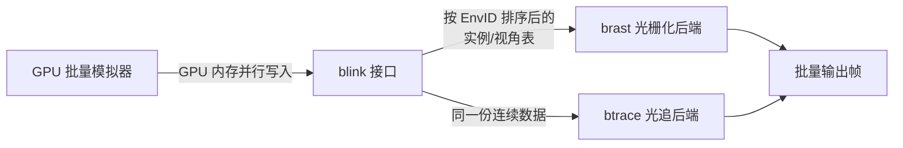

## 一句话总结

面向具身智能训练这种「海量、低分辨率、低画质、多环境多视角」的渲染负载，本文设计了 GPU 端的批量渲染接口 blink，并实现并对比了光栅化渲染器 brast 与软件光线追踪渲染器 btrace，得出一个反直觉结论：在数据中心级 GPU（H100）上，软件光追反而显著优于硬件光栅化。

## 研究背景

现代具身智能采用「像素到动作」的训练范式：智能体通过虚拟相机观察 3D 环境的渲染图像，学习最优动作。训练一个复杂技能常需数亿个 episode、数十亿个时间步，意味着一次实验要在数千个场景里渲染数十亿帧图像。

这类渲染负载与传统实时渲染诉求完全不同：

- 多环境多视角：批量模拟器同时跑数千个独立环境，每个环境可能还有多个相机（多智能体、多传感器），一步模拟后要一次性完成数千个独立渲染任务。
- 吞吐优先：目标是最大化聚合帧率，而单帧延迟、稳定帧率这些实时渲染的核心指标在这里都不重要。
- 几何复杂度跨度大：从几千三角形的简单原语场景，到 HSSD 这类平均 740 万三角形的公寓级扫描场景。
- 低分辨率低画质：图像通常在 $$64\times64$$ 到 $$256\times256$$ 之间，很多任务只需深度或语义 ID，即使开 RGB 也多用简单 Blinn-Phong、关阴影。

近年策略推理与环境模拟（批量物理引擎）都已被优化了几个数量级，渲染成为瓶颈。但由于「渲染太贵」的固有印象，多数高性能批量模拟器干脆不渲染图像观测，只支持直接读取世界状态的智能体。此前唯一专注该场景的工作是 BPS3D 批量光栅化器，但它只有 CPU 侧接口、且每环境仅支持单视角。

## 方法

整体框架由三部分组成：一个连接 GPU 批量模拟器与渲染后端的接口 blink，以及基于它实现的两个渲染后端——批量光栅化器 brast 与批量光线追踪器 btrace。

### 关键设计一：blink —— 全 GPU 内存的模拟器/渲染器接口

传统渲染系统假设环境状态由 CPU 控制、驻留在 CPU 内存，只提供 CPU 侧接口。而 GPU 批量模拟器的状态在 GPU 上，被迫做昂贵的同步与回读，把状态从 GPU 拷到 CPU、再经 CPU API 拷回 GPU 渲染。

blink（Batch renderer/simulator Linkage）让模拟逻辑完全通过 GPU 内存并行地把状态更新传给渲染器。它把所有环境的全部实例数据存在一张列主序（struct-of-arrays）的「可渲染实例表」里：

- 并行分配：原子递增指针在表尾追加新实例。
- 并行删除：把行的 EnvID 标记为 -1。
- 更新：GPU 线程并行改写变换矩阵等内容。

模拟器写完后，blink 做一次全局同步，按 EnvID 对整张表做基数排序，使每个环境的数据在内存中连续，并生成「环境偏移缓冲」交给渲染后端。排序还顺带把已删除行（EnvID = -1）挪到表尾，靠截断表即可回收内存。对象几何/纹理资产单独存放，一次分配、跨所有环境共享。

### 关键设计二：brast —— 批量光栅化器

brast 是 bps3d 的演进版，用 blink 替换掉 bps3d 的 CPU 侧接口与状态管理。它直接在 GPU compute pass 里访问 blink 暴露的实例/视角缓冲，跨实例并行做视锥剔除，从而消除逐实例的 CPU-GPU 传输开销；并且因为 blink 提供了逐环境数据，brast 支持了 bps3d 无法做到的多视角渲染。视锥剔除以一个 warp（32 线程）处理一个视角，即便不同环境视角数不同也能保持高执行一致性。

### 关键设计三：btrace —— 软件批量光线追踪器

低分辨率 + 高几何复杂度会产生大量亚像素小三角形，这对现代 GPU 图形管线极不友好。btrace 因此用 CUDA 持久线程写了一个软件光追器，采用两级 BVH 处理动态场景、压缩宽 BVH 降低带宽。每个对象的底层 BVH 离线构建并跨批次摊销；每个环境的顶层 BVH 每帧用 LBVH 重建。

blink 带来两个关键优化：一是复用 blink 已有的排序，加一个可选的次级排序键，让 btrace 在建 BVH 前按 Morton 码在环境内预排序，省掉单独的并行排序；二是利用逐环境数据连续布局，用单个 compute kernel 通过环境边界检查，一次性并行构建所有环境的 LBVH。值得注意的是，btrace **不使用**硬件光追 API（Vulkan/Optix），因为它们在构建大量小顶层 BVH 时吞吐很差，而数据中心 AI GPU 本身也缺乏光追加速硬件。

## 实验结果

在四个具身智能数据集（Hide & Seek、MJX Barkour、ProcTHOR、HSSD）上，固定 batch 为 1024 个环境，在消费级 RTX 4090 与数据中心级 H100 上测吞吐。核心发现：

- H100 上 btrace 在几乎所有配置全面碾压 brast，因为 H100 面向 AI 负载、固定功能三角形处理硬件较少。极端情形下即使在 HSSD、$$256\times256$$ 分辨率，btrace 仍比 brast 快 22 倍。
- RTX 4090 上 brast 在简单/高分辨率场景占优（光栅化硬件强），但在高几何复杂度的 MJX Barkour 与 HSSD 上 btrace 已具竞争力，其瓶颈定位为 Primitive Distributor。
- 多视角越多，btrace 越占优，因为它能跨视角摊销顶层 BVH 构建；ProcTHOR 上超过 2 个视角后 btrace 反超 brast。
- 性能剖析显示 btrace 绝大部分时间花在光线求交，blink 排序 <10%、LBVH 构建 <10%，提示后续可用更慢但更高质量的 BVH 构建换取整体加速。

下表为 blink 接口带来的收益（$$64\times64$$ 分辨率），brast 相比此前 SOTA 批量光栅化器 bps3d：

| 渲染器 | Hide and Seek (FPS) | MJX Barkour (FPS) |
| --- | --- | --- |
| brast | 1056K | 111K |
| bps3d | 589K | 76K |

brast 借助 blink 消除 CPU 侧拷贝与同步开销，在 Hide and Seek 上快 1.8 倍、MJX Barkour 上快 1.5 倍，同时还额外支持了多视角渲染而无性能损失。

## 亮点与局限

亮点：

- 首次系统性研究「像素到动作」训练场景下的高性能渲染架构，并给出反直觉却有说服力的结论：数据中心 GPU 上软件光追优于硬件光栅化。
- blink 用全 GPU 内存的列主序表 + 排序，优雅解决了 GPU 模拟器与渲染器之间的高效通信，避免 CPU 中转。
- 构建了覆盖不同几何复杂度与任务多样性的批量渲染 benchmark，为社区后续研究提供基准。

局限：

- btrace 明确是原型质量实现，仅含基础光追优化，作者预期进一步工程可继续拉大在 H100 的领先、并缩小在 4090 的差距。
- 画质仍停留在简单 Phong 光照，未探索高保真渲染对训练效果的实际影响。
- benchmark 仅四个数据集、batch 固定 1024，未系统探究更大 batch 或端到端训练中渲染与策略推理的协同瓶颈。

## 延伸思考

这篇工作最有意思的地方在于揭示了「性能余量」的意外出现：在 RTX 4090 上 $$128\times128$$ 渲染时 btrace 已接近 $$100K$$ FPS，快到需要大力优化 DNN 推理才能喂饱渲染器。这意味着长期以来「渲染太贵所以能省则省」的假设可能已被推翻，具身智能训练首次有了预算去尝试更真实的光照、传感器噪声模拟等，用以缩小 sim-to-real 差距。

另一个值得延展的判断是硬件设计层面的暗示：既然数据中心 AI GPU 砍掉了大量固定功能三角形处理硬件，那么为具身训练服务的渲染器要么等硬件厂商重新配备光栅化硬件，要么就应当全面转向充分利用可编程算力的软件光追路线。考虑到 GPU 演进方向明显偏向 AI 张量算力，后者看起来是更务实的长期选择。批量场景独有的「跨环境并行构建 BVH」也是传统实时渲染没有的并行维度，是后续 BVH 质量与构建算法研究的一片新空间。
