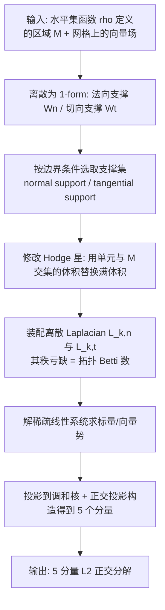

## 一句话总结

在规则笛卡尔网格上，直接基于水平集函数装配离散算子，实现对 2D/3D 向量场的完整 5 分量、$$L_2$$ 正交且保持拓扑的 Hodge 分解，无需把区域三角化/四面体化。

## 研究背景

Hodge 分解是微分几何与代数拓扑的基础结果：紧致带边流形上的向量场可正交分解为无散、无旋以及调和分量。对于带边区域，调和场空间本是无穷维的，必须引入法向（Dirichlet）与切向（Neumann）边界条件，才能让核空间变成有限维并与区域拓扑（Betti 数）一一对应。进一步地，完整分解可细化为 5 个分量：

$$\Omega^k = d\Omega^{k-1}_n \oplus \delta\Omega^{k+1}_t \oplus H^k_n \oplus H^k_t \oplus (d\Omega^{k-1} \cap \delta\Omega^{k+1})$$

对应到向量场即：法向梯度场（grounded gradient）、切向旋度场（fluxless knot）、法向调和场（harmonic gradient）、切向调和场（harmonic knot）、以及卷曲梯度场（curly gradient）。

已有的完整 5 分量离散方法（如三角/四面体网格、Whitney 基下的 Nédélec/Raviart-Thomas 元、FEEC 框架）全部依赖单纯形网格离散，需要高质量网格剖分工具，且在水平集演化时要反复重网格化。而笛卡尔网格在有限差分、有限体积、谱方法、以及体素化数据的卷积网络中更有优势。作者要填补的空白是：如何在笛卡尔网格上、对由水平集定义的区域，直接算出保拓扑的 $$L_2$$ 正交 5 分量分解，而不做显式剖分。

## 方法

### 整体框架

核心思路是把离散外微分（DEC）从单纯形网格推广到笛卡尔网格，并用"修改 Hodge 星算子"的方式来隐式施加边界条件，而不切割边界单元。

### 关键设计 1：法向支撑与切向支撑的双支撑体素化

不切割边界单元，而是通过整体包含/排除 $$k$$-cell 来限定计算范围。法向边界条件下，包含"至少一个顶点在 $$M$$ 内"的单元（法向支撑）；切向边界条件下，包含"对偶单元至少一个顶点在 $$M$$ 内"的单元（切向支撑）。两个支撑集通常不同，且不像网格情形那样互为超集。由于 $$D^I_{k+1}D^I_k=0$$ 在投影后仍成立（$$D_{k,n}=P_{k+1,n}D^I_k P^T_{k,n}$$），幂零性得以保留，从而 $$\ker D/\operatorname{Im} D$$ 定义的上同调仍然成立。

### 关键设计 2：修改 Hodge 星以隐式编码边界条件

对法向条件保留对偶单元体积、把主单元体积替换为其与 $$M$$ 交集的体积；切向条件则相反。修改后的对角 Hodge 星矩阵为 $$S_{k,n}$$、$$S_{k,t}$$，对应的离散 Laplacian 为：

$$L_{k,n} = D^T_{k,n}S_{k+1,n}D_{k,n} + S_{k,n}D_{k-1,n}S^{-1}_{k-1,n}D^T_{k-1,n}S_{k,n}$$

关键在于：Hodge 星的修改不改变上同调，因此 $$\ker L_{1,n} \cong H^1_{dR}(M,\partial M)$$、$$\ker L_{1,t} \cong H^1_{dR}(M)$$，核维数分别为 $$\beta_{m-1}$$ 与 $$\beta_1$$，完全由拓扑决定。为数值稳定，作者把水平集在网格点上的取值扰动到绝对值大于 $$\epsilon = 10^{-5}l$$。

### 关键设计 3：从"直接法"到严格离散 $$L_2$$ 正交

直接法先解势 $$L_{0,n}A_n = D^T_{0,n}S_{1,n}W_n$$、$$L_{2,t}B_t = S_{2,t}D_{1,t}W_t$$，再投影到 $$L_{1,n}$$、$$L_{1,t}$$ 的核得到调和分量，但由于法向/切向支撑维数不同，得到的 5 分量只在连续极限下正交。为得到严格离散正交，作者统一到切向支撑与 $$S_{1,t}$$ 内积：先做 3 分量正交分解 $$W_t = D_{0,t}A_t + \delta_{2,t}B_t + T_h$$，再把梯度项 $$D_{0,t}A_t$$ 通过两个嵌套子空间（借助扩展支撑上的图 Laplacian $$L_{0,E}$$ 及带 Lagrange 乘子的约束最小化、Gram-Schmidt 正交化）进一步拆成 3 个互相正交的部分。正交性由 $$\delta$$ 的幂零性与 $$T_h$$ 的既闭又余闭性质保证：

$$(D_{0,t}A)^T S_{1,t}\,\delta_{2,t}B_t = A^T S_{0,t}(\delta_{1,t}\delta_{2,t})B_t = 0$$

## 实验结果

在 MATLAB 中实现（16GB 内存笔记本，Blender 渲染）。区域用符号距离函数表示 $$M = \{x \mid \rho(x)\le 0\}$$。在 2D bunny、figure-6、figure-8 以及 3D kitty、kettlebell、Buddha、figure-8 等模型上验证：各分量维数与拓扑（$$\beta_1$$、$$\beta_2$$）一致，5 分量两两 $$L_2$$ 内积为 0（达到线性求解器精度）。

特征值收敛性上，对 Arnold 书中经典 2D 反例（标准有限元会给出完全错误特征值），本方法给出正确的一维核并收敛到精确解；下表为切向条件下向量 Laplacian 前两个特征值随网格加密收敛到精确值 0 与 0.617 的结果：

| 网格尺寸 | 128 | 256 | 512 | 1024 | 2048 | 4096 |
|---|---|---|---|---|---|---|
| $$\lambda_1$$ | 0 | 0 | 0 | 0 | 0 | 0 |
| $$\lambda_2$$ | 0.610 | 0.615 | 0.615 | 0.617 | 0.617 | 0.617 |

在 3D 球壳（外半径 1、内半径 0.3）上，离散 Laplacian $$L_{1,n}$$ 的前 40 个特征值与球贝塞尔函数给出的精确谱高度吻合，并给出由第二 Betti 数决定的正确核维数。解析向量场的分解误差实验（2D 环形、3D 实心球/球壳/实心环）显示：位于切向支撑上的分量相对误差通常很小（$$\delta\beta_t$$、$$h_t$$ 可低至 $$10^{-4}$$ 量级），而使用相反边界条件支撑时误差偏大。此外还展示了在单细胞 RNA 速度场（cell cycle、pancreas、reprogramming Morris 数据集）上的应用，验证方法可推广到抽象流形并揭示细胞动力学特征。

## 亮点与局限

亮点：
- 首次在笛卡尔网格上、对水平集定义区域实现完整 5 分量保拓扑 Hodge 分解，免去高质量网格剖分与重网格化，特别适合演化水平集场景。
- 通过修改 Hodge 星（而非切割边界单元）隐式施加法向/切向边界条件，保持数据结构一致，且离散 Laplacian 的秩亏缺严格等于拓扑 Betti 数。
- 给出了严格的离散 $$L_2$$ 正交构造，而非仅在连续极限下正交，并由线性代数层面加以证明。

局限：
- 区域用等值面表示，除非网格分辨率足够高，否则无法刻画尖锐特征，几何细节受网格分辨率限制。
- 目前仅在 2D/3D 欧氏紧致域上验证；每个分量只用单一（法向或切向）边界条件，尚未支持混合边界条件。
- 使用对角 Hodge 星；高阶 Galerkin 型 Hodge 星对收敛率的影响尚未探索。

## 延伸思考

- 作者提出的 octree 等自适应数据结构方向值得关注：既保留笛卡尔网格算子简洁性，又能在边界附近加密以捕捉尖锐特征，可能是把该框架推向复杂几何的关键。
- 免剖分、随水平集演化的保拓扑分解，天然契合流体模拟、拓扑感知的机器学习特征以及体素卷积网络的输入构造；把 5 分量作为可微特征嵌入学习管线是一个有潜力的落地方向。
- 式 (3.17) 的鞍点问题若用 Schur 补约减并以直接法初始化，有望显著提速，这对大规模 3D 网格的实用性影响很大。
