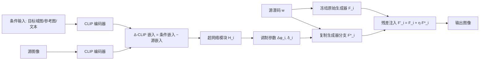

## 一句话总结

通过 CLIP 条件化的超网络（hypernetwork）动态调制预训练 StyleGAN2 的生成器权重，HyperGAN-CLIP 用一套统一架构同时完成多域单样本适配、参考图引导合成与文本引导编辑三类任务，且无需针对每个任务或每个域单独训练模型。

## 研究背景

StyleGAN 系列在高清图像生成上表现出色，但把预训练生成器迁移到新任务、新域时仍面临数据稀缺的困境：

- **传统域适配**通过少样本微调生成器，往往在"域特征保真度"与"源域图像质量"之间难以两全，容易过拟合与模式坍塌。
- **基于 CLIP 的引导方法**（如 StyleGAN-NADA、HairCLIP）受限于训练时出现过的属性，对分布外图像和新描述泛化差。
- **逐次编辑优化方法**灵活但推理时计算开销大。

更关键的是，现有方法通常一个模型只解决一个任务或一个目标域。作者希望用**单一统一框架**、每个目标域只用**一张样本图**，同时覆盖域适配、参考图合成、文本编辑三类需求。

## 方法

### 整体框架

HyperGAN-CLIP 建立在预训练的 StyleGAN2 之上。核心思路是：不直接改动原始生成器，而是复制一个生成器分支，由 CLIP 条件化的超网络模块调制该分支权重，生成"源域缺失的域特定特征"，再通过残差特征注入（residual feature injection）把这些特征融合回冻结的原始生成器。条件输入（目标域参考图 / 域内参考图 / 文本描述）统一经 CLIP 编码器映射到共享空间，因此同一套架构可接受图像或文本作为引导。

### 关键设计一：残差特征注入

第 $$i$$ 层的最终特征通过把缩放后的调制特征注入原始特征得到：

$$F'_i = F_i + \eta \cdot F^*_i$$

其中缩放系数 $$\eta = 0.1$$，保证训练初期最终特征仍贴近原始分布，从而稳定训练、保留源域身份、避免模式坍塌。原始特征 $$F_i = F'_{i-1} \circledast \theta_i + b_i$$ 使用预训练权重，调制特征 $$F^*_i = F_{i-1} \circledast \theta^*_i + b_i$$ 使用调制后的权重。

### 关键设计二：CLIP 条件化超网络与 Δ-CLIP 嵌入

调制权重定义为 $$\theta^*_i = \delta_i \cdot f(\phi_i + \Delta\phi_i, s_i)$$，其中权重偏置 $$\Delta\phi_i$$ 和通道缩放 $$\delta_i$$ 由超网络模块预测：

$$\Delta\phi_i, \delta_i = H_i(\Delta c)$$

这里 $$\Delta c$$ 是 **Δ-CLIP 嵌入**，即条件输入的 CLIP 嵌入与源图像 CLIP 嵌入之差。用差值而非原始嵌入让模型只关注源域缺失的属性，把输入居中到零附近简化训练；作者发现直接用原始 CLIP 嵌入会明显改变身份、降低画质。每个超网络模块只由两层全连接构成，引入参数量远小于基础生成器，因此单一模型即可适配多个域。

### 关键设计三：多任务损失与 CLIP 条件化判别器

总损失为多项加权组合：

$$L = \lambda_1 L_{CLIP} + \lambda_2 L_{CLIP\text{-}Across} + \lambda_3 L_{CLIP\text{-}Within} + \lambda_4 L_{cGAN} + \lambda_5 L_{Contrastive} + \lambda_6 L_{ID} + \lambda_7 L_{L2} + \lambda_8 L_{LPIPS}$$

- **全局与方向性 CLIP 损失**：$$L_{CLIP} = 1 - \langle c_{recon}, c_{target}\rangle$$ 保证语义一致；方向性损失 $$L_{CLIP\text{-}Across}$$、$$L_{CLIP\text{-}Within}$$ 约束跨域和域内的语义位移对齐，缓解模式坍塌和内容丢失。
- **CLIP 条件化判别器** $$L_{cGAN}$$：以冻结的 CLIP ViT 主干为骨架、仅训练最外层头部，用投影判别器方式条件化于 CLIP 嵌入，配合可微数据增强应对每域仅一张图的稀缺问题，加速收敛并防坍塌。
- **对比适配损失** $$L_{Contrastive}$$：让同域为正对、异域为负对，学习域特定变换。
- **身份损失** $$L_{ID}$$ 用 ArcFace 特征保留源身份；**L2 与 LPIPS 损失**做重建与感知对齐。

同一个为参考图合成训练的模型，可直接用文本的 Δ-CLIP 嵌入 $$\Delta c_{text} = CLIP(t_{target}) - CLIP(t_{source})$$ 来做文本引导编辑，无需任何文本训练数据（$$t_{source}$$ 用如 "face" 的通用提示）。

## 实验结果

在 FFHQ 上适配到 101 个新域、在 AFHQ 上从 Cat 扩展到 52 个动物域，与需要逐域单独训练或统一建模的多种 SOTA 方法对比。多域适配定量结果（FID 越低越好，Quality/Diversity 越高越好）：

| 方法 | AFHQ FID↓ | AFHQ Qual↑ | AFHQ Div↑ | FFHQ FID↓ | FFHQ Qual↑ | FFHQ Div↑ |
|------|-----------|------------|-----------|-----------|------------|-----------|
| Mind-The-Gap | 72.90 | 0.93 | 0.04 | 45.93 | 0.73 | 0.10 |
| StyleGAN-NADA | 71.15 | 0.93 | 0.04 | 49.48 | 0.90 | 0.04 |
| Adaptation-SCR | 70.84 | 0.92 | 0.03 | 45.88 | 0.59 | 0.06 |
| HyperDomainNet | 105.90 | 0.78 | 0.05 | 100.92 | 0.67 | 0.11 |
| DynaGAN | 72.16 | 0.94 | 0.02 | 28.94 | 0.83 | 0.14 |
| Ours | 71.93 | 0.94 | 0.04 | 24.74 | 0.81 | 0.16 |

在 FFHQ 上本方法取得最低 FID（24.74）与最高多样性（0.16），且用单一统一模型即可完成；AFHQ 上与最优方法持平。参考图引导合成上，本方法在 FID（8.73）、源身份保持（ID source 78.73）与 CLIP 语义相似度（90.78）均优于 BlendGAN、TargetCLIP、MimicBrush 等。文本引导编辑上，即便完全无文本训练，仍显著超过同为文本无关训练的 DeltaEdit，并在多属性编辑上与需要文本数据的方法保持竞争力。16 人用户研究进一步佐证了三类任务上的领先或持平表现。

## 亮点与局限

**亮点：**
- 用一套 CLIP 条件化超网络 + 残差注入架构统一了域适配、参考图合成、文本编辑三类任务，避免为每任务/每域单独建模。
- Δ-CLIP 嵌入让模型只学习缺失属性，配合小型超网络模块，单模型支持多域且参数增量极小。
- 文本引导编辑无需任何文本训练数据，直接借助 CLIP 的图文共享空间实现。

**局限：**
- 依赖全局 CLIP 图像嵌入，细粒度属性（如特定局部细节）有时难以精确迁移；作者提出用 $$CLIP(x_{target}) + \alpha CLIP(t_{target})$$ 混合图文嵌入作为缓解。
- 三类任务虽共享架构，但仍需各自独立的训练流程，尚未做到真正一次训练全部覆盖。作者展望用 mixture-of-experts 加路由机制训练单一模型。

## 延伸思考

- 超网络 + 残差注入的"冻结主干 + 可调分支"范式，与扩散模型里的 ControlNet/LoRA 思路异曲同工，都是在保留强预训练先验的同时以低成本注入条件控制，值得对比其在身份保持与可控性上的权衡。
- Δ-CLIP 嵌入把"只学差异"作为设计原则，这一居中化技巧对其他基于 CLIP 引导的编辑方法（尤其易改变身份的场景）可能是通用的稳定化手段。
- 作者提出的 MoE + 路由方向若落地，可能真正统一多任务训练流程；如何设计路由信号（图像 vs 文本 vs 域标识）以避免任务间干扰，是有价值的后续问题。
- 方法整体仍绑定 StyleGAN2 的潜空间与生成质量上限，面向更开放域或更高分辨率时，把同类超网络思路迁移到扩散生成器上是自然的扩展方向。
