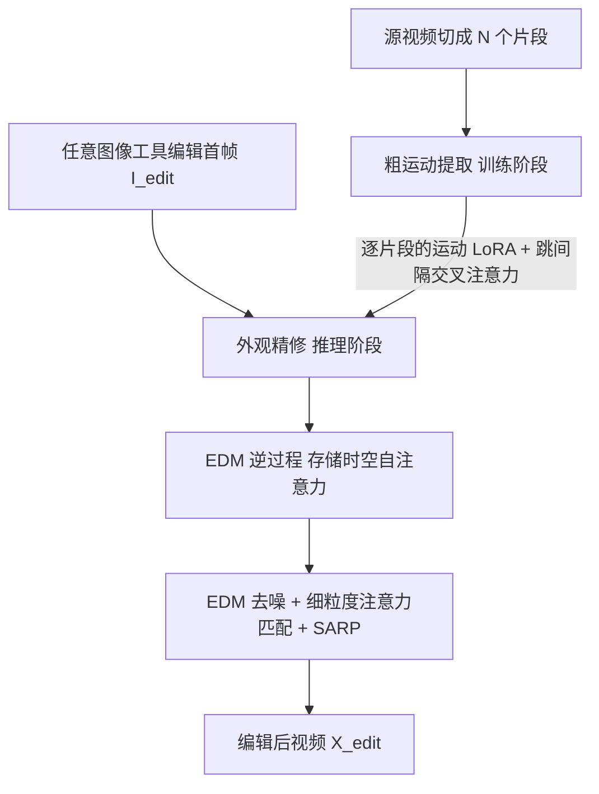

## 一句话总结

用户只需用任意图像编辑工具修改视频的**第一帧**，I2VEdit 就能借助预训练的图生视频（Image-to-Video, I2V）扩散模型，把这份编辑自适应地传播到整段视频，在保持源视频运动和外观一致的同时，支持全局编辑、局部编辑和适度的形状变化。

## 研究背景

图像编辑领域已经拥有大量高质量、多样化的工具（如 Photoshop、EditAnything、InstructPix2Pix 等），而视频编辑因为要额外处理时间维度上的一致性和跨帧空间相关性，发展相对滞后。现有基于扩散模型的视频编辑方法各有局限：

- 基于文生图模型扩展的方法（注意力操控、光流/深度约束、单样本微调）大多只擅长**全局风格迁移**，难以在不影响无关区域的前提下做精细的局部编辑，或容易因过拟合源视频而降低编辑质量。
- 运动定制方法（VMC、MotionDirector 等）能大致复现源视频运动，但难以精确控制外观。
- 早期基于示例的图像到视频风格化方法（如 Ebsynth）在形状和结构变化时质量受限；训练无关的 AnyV2V 则容易出现时序不一致和结构走样。

作者的核心思路是：把"内容编辑"与"运动/时序一致性保持"两个问题**解耦**——在第一帧上用任意强大的图像编辑工具完成内容编辑，再用 I2V 模型把编辑传播到其余帧，从而直接复用现成的图像编辑生态。

## 方法

### 整体框架

I2VEdit 以 Stable Video Diffusion（帧长 14）作为基础 I2V 模型。给定源视频 $$X_{src}$$ 和编辑后的首帧 $$I_{edit}$$，先把源视频切成 $$N$$ 个片段 $$\{x_1^{src},\dots,x_N^{src}\}$$，然后经过两条流水线：

- **粗运动提取（训练阶段）**：为每个片段训练运动 LoRA，配合跳间隔交叉注意力，缓解自回归长视频生成的质量衰减。
- **外观精修（推理阶段）**：对源片段做 EDM 逆过程并存下时空自注意力，再以编辑首帧为条件做 EDM 去噪，用细粒度注意力匹配自适应地对齐运动与外观。

### 关键设计 1：运动 LoRA + 跳间隔交叉注意力（SIC）

只在**时序注意力层**加 LoRA 来捕获源视频的粗运动，不使用空间 LoRA 和外观去偏时序损失（作者发现它们会让 I2V 模型训练不稳定），因为 I2V 模型本身已有足够能力把生成外观对齐到条件图。

长视频用自回归策略生成时，用上一片段的末帧作为下一片段条件会带来信息损失和质量落差。为此在片段 $$x_1^{src}$$ 上做 EDM 逆过程，保存各步时序自注意力的 key/value；训练其余片段时把它们与当前时序自注意力的 key/value 拼接，实现与首片段的跳间隔交叉注意力：

$$K_s = [K'; K],\quad V_s = [V'; V]$$

$$Z_s = \text{Attention}(Q', K_s, V_s) = \text{softmax}\left(\frac{Q'(K_s)^T}{\sqrt{d}}\right)V_s$$

由于 key/value 携带外观特征，这一策略在首帧质量不高时也能保留原始外观。推理时 $$K,V$$ 来自 $$x_1^{edit}$$ 的去噪过程，与后续编辑片段做跳间隔交叉注意力。

### 关键设计 2：平滑区域随机扰动（SARP）

作者发现确定性的 EDM / DDIM 逆过程在源视频含**大片平滑区域**（如恒定白背景）时经常失败：U-Net 训练时从未见过无噪声的平滑区域，导致逆过程出现域差。SARP 在平滑区域加入小扰动，使逆得的隐变量更接近高斯分布。先用 Sobel 梯度阈值检测平滑区掩码 $$M_{sarp}$$，再加噪：

$$x_{sarp}^{src} = (x_i^{src} + \alpha \cdot \epsilon)\odot M_{sarp} + x_i^{src}\odot(1 - M_{sarp}),\quad \epsilon\sim\mathcal{N}(0,1)$$

其中 $$\alpha$$ 是相对像素值很小的噪声尺度（实验取 0.005）。该技术对文生图模型（SD）的 DDIM 逆过程同样有效。

### 关键设计 3：细粒度注意力匹配

在源片段逆过程中存储隐变量 $$z_T$$ 与时空自注意力图 $$\{a_t^{src}\}, \{b_t^{src}\}$$，去噪时对空间和时序自注意力分别做匹配。

对空间自注意力，先算编辑帧与源帧注意力的差异图并在通道维聚合、归一化到 $$[0,1]$$：

$$a_t^{diff} = a_t^{edit} - a_t^{src},\qquad \hat{a}_t^{diff} = \sum_c a_{t,c}^{diff}/2$$

由于空间自注意力含结构信息，$$\hat{a}_t^{diff}$$ 表征源帧与编辑帧的结构差异：局部编辑中高值表示新生成的编辑物体，低值表示应保持一致的未编辑区域。据此生成加权注意力：

$$M_t^{diff} = \begin{cases} 1, & \hat{a}_t^{diff} > thr \\ \hat{a}_t^{diff}, & \hat{a}_t^{diff} \le thr \end{cases}$$

$$a_t^w = a_t^{edit}\odot M_t^{diff} + (1 - M_t^{diff})\odot a_t^{src}$$

对时序自注意力用"注意力选择器"分三阶段处理：第一阶段 $$t\in[0, \beta_1 T)$$ 直接用 $$b_t^{src}$$ 替换；第二阶段 $$t\in[\beta_1 T, \beta_2 T)$$ 只替换大降采样因子的注意力；第三阶段 $$t\in[\beta_2 T, T]$$ 保持不变以保留精细编辑细节。不同编辑任务的阶段划分不同（局部编辑 $$\beta_1=0.5,\beta_2=0.8$$；一般全局风格迁移 $$\beta_1=0.8,\beta_2=0.9$$；含大形状变化 $$\beta_1=0.4,\beta_2=0.5$$）。

## 实验结果

基础模型为 Stable Video Diffusion（帧长 14），LoRA 秩为 32，每片段训练 250 步，分辨率 576×1024，单张 A100。测试视频来自 Pexels、DAVIS 2017、UBC Fashion 等，涵盖动物、车辆、人物；首帧编辑用 EditAnything、AnyDoor、InstantStyle、Instruct-Pix2Pix 生成。作者对 32 名参与者做用户研究，评估运动保持（MP）、未编辑区外观对齐（AA）、编辑质量（EQ）、时序一致性（TC）以及与首帧的外观一致性（AC），并按 LOVEU-TGVE 用帧间平均 CLIP 分做自动评估。

主实验（用户偏好占比，越高越好；自动评估为 CLIP 时序一致性）：

| 方法 | 局部编辑 MP↑ | AA↑ | EQ↑ | TC↑ | 其他任务 MP↑ | AC↑ | TC↑ | 自动 TC(局部)↑ | 自动 TC(其他)↑ |
| --- | --- | --- | --- | --- | --- | --- | --- | --- | --- |
| Ebsynth | 0.11 | 0.12 | 0.06 | 0.08 | 0.21 | 0.17 | 0.17 | 2.38 | 2.38 |
| AnyV2V | 0.18 | 0.18 | 0.22 | 0.19 | 0.11 | 0.10 | 0.10 | 2.38 | 2.40 |
| Pika | 0.07 | 0.11 | 0.06 | 0.07 | - | - | - | 2.43 | - |
| Ours (w/o AM) | 0.15 | 0.13 | 0.16 | 0.17 | 0.25 | 0.26 | 0.27 | 2.38 | 2.42 |
| **Ours** | **0.49** | **0.47** | **0.49** | **0.49** | **0.43** | **0.47** | **0.47** | 2.40 | 2.42 |

在所有人工评估维度上 I2VEdit 均取得最优偏好，其他任务的自动时序一致性也领先。消融实验表明：SARP 能显著改善含恒定像素区域视频的逆过程（Anderson 正态性检验统计量在 SVD 上从 2785.10 降到 91.48，越低越接近高斯）；跳间隔交叉注意力（SIC）在首帧质量偏低、片段较多时更好地保留外观细节；细粒度注意力匹配（AM）明显提升运动准确性、外观一致性与整体编辑质量。

## 亮点与局限

亮点：

- **解耦思路优雅**：把内容编辑交给成熟的图像编辑工具、把时序/运动一致性交给 I2V 模型，直接复用整个图像编辑生态，灵活性远超纯文本引导的视频编辑。
- **自适应保持**：细粒度注意力匹配能根据编辑幅度自适应地在"保留源结构"和"生成新内容"之间权衡，兼顾全局、局部与适度形状变化。
- **两个实用小技巧**：SARP 解决了平滑区域逆过程失败的域差问题（对 SD 同样有效），SIC 缓解了自回归长视频的质量衰减。

局限：

- 明确将**运动本身的编辑**排除在范围之外，只能沿用源视频运动，无法改变运动轨迹。
- 需要为每个片段训练运动 LoRA（每片段 250 步），逐片段训练带来额外的时间开销。
- 定量评估以用户研究为主，客观指标仅有帧间 CLIP 时序一致性，缺乏更全面的自动化度量；不同编辑类型还需手工调节时序注意力的阶段划分参数。
- 仅支持"适度"形状变化，大幅结构改变仍具挑战。

## 延伸思考

- 把首帧编辑升级为多关键帧或轨迹引导，或许能突破"运动不可编辑"的限制，实现内容与运动的联合编辑。
- SARP 揭示的"训练分布里没有无噪声平滑区"是扩散逆过程的一个通用痛点，这一视角可能迁移到其他基于 inversion 的编辑/重建任务。
- 逐片段 LoRA 训练是效率瓶颈，能否用一次性的运动表征或前馈式运动编码替代，是走向实时/交互式视频编辑的关键。
- 随着更强的原生 I2V 基座（更长帧长、更高分辨率）出现，这套"首帧引导 + 注意力匹配"的框架有望进一步减少对逐视频微调的依赖。
