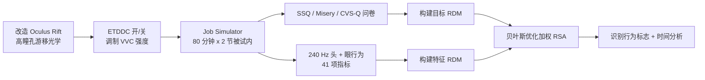

## 一句话总结

作者改造一台 Oculus Rift 制造出高"瞳孔游移"（pupil swim）光学畸变，用 80 分钟真实游戏（Job Simulator）的被试内实验证明瞳孔游移会加剧视觉不适，眼动追踪动态畸变校正（ETDDC）能缓解不适，并借助表征相似性分析（RSA）从 41 项头/眼行为指标中找出眨眼与前庭眼反射等可比问卷更早、更敏感反映不适的行为标志。

## 研究背景

- 领域现状：衡量 VR 中的视觉不适与视觉诱发晕动症（VIMS）主要依赖自评问卷（金标准是 SSQ）。为了让问卷能测到足够大的信号，研究者往往用"坐着看虚拟过山车"这类强烈视觉-前庭冲突（VVC）在 10~30 分钟内快速诱发不适。
- 核心痛点：这类极端、非自然的范式与"以舒适为设计目标的真实使用场景"差异很大——头/眼行为高度依赖任务，短时高冲突下得到的行为规律未必能推广到自然游玩；而且短时程、无"无冲突"基线、把多个条件塞进一节的设计会引入混淆（把条件效应和时间效应混在一起）。此前只有一项工作直接考察瞳孔游移与 VIMS 的关系，且未能给出确凿结论。
- 本文 idea：不靠虚拟相机运动，而是从硬件层面人为放大瞳孔游移来诱发 VVC，在一个专为舒适设计的真实游戏里做长时程（2 × 80 分钟）被试内实验；再用 RSA 把问卷与海量行为指标放到同一表征空间中，挖掘真正与主观不适相关、且能更早预警的行为标志。

## 方法

整体框架分两条线：先用一台定制高瞳孔游移头显在自然游戏中采集主观问卷 + 高频头眼行为数据，再用带贝叶斯优化加权的 RSA 把行为指标与 SSQ 对齐，找出与不适最相关的行为特征并分析其时间演化。

关键设计：

1. **高瞳孔游移光学 + ETDDC**：把 Oculus Rift 的镜片换成两片凸面相对的现成平凸镜（Edmond Optics 33-384），得到 1.3 m 虚像距离、85° 清晰视场，但畸变刻意做得比基准设计更强、瞳孔游移显著大于市售头显。瞳孔游移是一种随注视方向变化的几何畸变（用户看到的图像与其头/眼运动应对应的透视图之间不一致）。作者在 OpenXR 系统层实现基于光场门户（Light Field Portal）的畸变表示与眼动追踪动态校正，使 ETDDC 能作用于所有 Meta PC VR 内容；开启 ETDDC 即减小瞳孔游移，关闭（仅静态校正网格）则保留大瞳孔游移，从而在不改动虚拟相机运动的前提下可控地引入/消除 VVC。头眼行为用 Tobii 双目眼动仪（240 Hz）与 OpenXR 六自由度头部数据记录。

2. **长时程被试内自然实验**：38 名视力正常参与者各完成两节 80 分钟、除 ETDDC 开关外完全相同的 Job Simulator 游玩（厨师/办公/店员/机修四类任务各 20 分钟，顺序标准化、开关顺序在被试间平衡，两节间隔至少 24 小时）。戴前/摘后做完整 SSQ，节中每 20 分钟口头做简版 Misery Scale 与 CVS-Q。这是迄今最长、最自然的视觉不适研究，用被试内设计比较个体自身在两种条件下的相对变化，规避了个体差异带来的噪声。

3. **RSA + 贝叶斯优化加权**：把"高/低 SSQ Total 会话 × 10~80 分钟时间点"构成 16×16 表征差异矩阵（RDM）。为 6 个问卷问题和 41 项头眼指标各自构建特征 RDM（以 38 名参与者为"通道"，用欧氏距离度量条件间差异），再经 min-max 归一化后用贝叶斯优化寻找一组权重（和为 1），使加权特征 RDM 与目标 SSQ RDM 的 Spearman 秩相关 $$\rho$$ 最大。为提升泛化，先对 80% 参与者子采样、bootstrap 30 次并做 50 轮优化迭代。相比线性回归，RSA 不强依赖线性假设、能整体刻画指标间的自然聚类。

4. **时间滑窗分析**：用 30 分钟滑窗（RDM 缩为 8×8）、每次前移 10 分钟重复上述加权，考察问卷与行为在不同时间点区分"更舒适/更不舒适会话"的能力，判断哪种信号能更早预警不适。

## 实验结果

主实验对比问卷与行为两类信号对"高/低 SSQ Total 会话"的区分能力（Spearman $$\rho$$，含留出泛化与随时间演化）：

| 信号来源 | 全数据拟合 $$\rho$$ | 留出泛化 $$\rho$$ | 首个 30 分钟窗 $$\rho$$ | 达到 $$\rho\approx0.86$$ 所需时间 |
| --- | --- | --- | --- | --- |
| 行为指标（头/眼） | 0.85 | 0.60 | 0.86 | 第一个时间窗即达到 |
| 问卷（SSQ 相关问题） | 0.42 | 0.41 | 0.62 | 约需多 20 分钟 |

关键观察：

- **瞳孔游移确实加剧不适、ETDDC 能缓解**：混合效应线性模型显示开启 ETDDC 时 SSQ Total 显著下降（$$\beta=-8.86\pm3.51,\ t_{111}=-2.53,\ p=0.01$$）；A/B 偏好中 29/38（76.3%）参与者更偏好开启 ETDDC 的画质，仅 9/38（23.7%）偏好静态校正，说明多数人能察觉到瞳孔游移。
- **总体不适量级不高**：两节平均 SSQ Total 为 25.5 ± 18.7，与既往大量短时高冲突研究（≥20 分钟组 27.4 ± 3.1）相当，但本实验时长远超它们——提示在为舒适设计的自然游玩中，控制时长后 VIMS 量级可能明显低于刻意放大 VVC 的实验。
- **眨眼是最强行为标志**：行为侧最优权重压倒性地由眨眼行为贡献（80%），其后为前庭眼反射（8%）、注视（7%）、扫视（4%）；不适更重时参与者眨眼时长约增加 15~30 ms（总体平均 322 ms），前庭眼反射头动约慢 1~3 度/秒（总体 95 百分位约 44.2 度/秒）。问卷侧最优拟合（$$\rho=0.42$$）则主要来自与头显佩戴相关的头痛（80%）。
- **行为比问卷更早预警**：问卷的 $$\rho$$ 随时间从 0.62（10~40 分钟）升至 0.86（50~80 分钟），而头眼行为在第一个时间窗就达到 0.86 且始终不低于该值——即问卷要多花约 20 分钟才追平行为信号。

## 亮点与局限

亮点：

- 用纯硬件手段（放大瞳孔游移 + ETDDC 开关）而非虚拟相机运动来诱发/消除 VVC，首次在自然游玩中直接证明瞳孔游移会加剧 VIMS，为头显光学设计提供了可操作的舒适性证据。
- 迄今最长、最自然的视觉不适被试内研究（2 × 80 分钟），并把 ETDDC 落到 OpenXR 系统层，可覆盖整个 Meta PC VR 内容库。
- 首次把 RSA 引入 VIMS 研究，结合贝叶斯优化得到可解释权重，从 41 项指标中稳健地识别出眨眼等行为标志，且这些标志比简版问卷更早、更准地区分舒适度差异。

局限：

- 结论基于单一游戏、单一畸变类型（瞳孔游移）与 38 名视力正常者，眼/头行为高度依赖任务与个体，是否能推广到其他 VR 体验或其他不适来源仍需验证。
- 行为标志的识别依赖事后（post-hoc）优化分析，尚未给出可即时、普适使用的判别器；30 分钟窗长是 RSA 的硬约束，限制了更细的时间分辨率。
- 大量细节（完整模型、SSQ 子量表、41 指标 RDM）放在补充材料中；作者也指出 30 分钟初版实验（43 名不同参与者）未见会话间舒适度差异，难以断定是真无差异还是问卷不够敏感。

## 延伸思考

- "眨眼时长/前庭眼反射速度"作为客观、可实时采集的不适前兆，指向一条比问卷更快的舒适度监测路径，可用于自适应地触发舒适性干预（如动态降低畸变、提示休息）。
- 用硬件缺陷（可控瞳孔游移）而非相机运动来诱发 VVC 的范式，为分离"光学畸变"与"运动冲突"两类 VIMS 成因提供了干净的实验杠杆，值得推广到 VAC、延迟等其他冲突源。
- RSA + 贝叶斯加权给出的可解释权重，天然适合作为微调既有 VIMS 预测模型（回归/神经网络）的桥梁，把新采集的行为数据接入已有模型体系。
