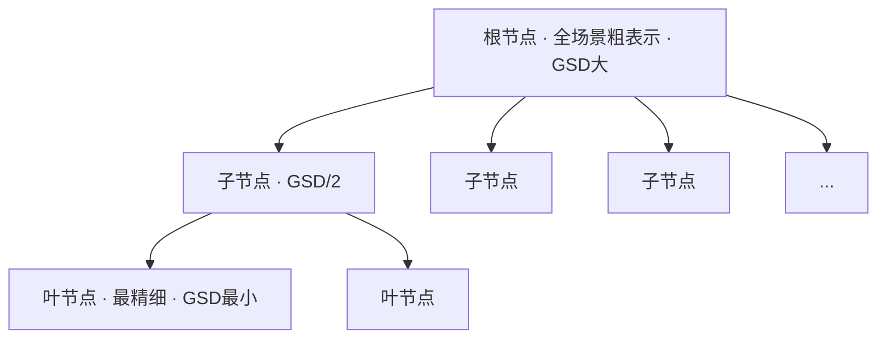

## 一句话总结

把游戏引擎和 Google Earth 里经典的 LoD（细节层次）思想搬进 NeRF：用一棵八叉树把大场景同时在**空间**和**尺度**两个维度上切分，让渲染任意一帧只需加载 $$O(\log n)$$ 的参数量，既大幅降低显存/带宽，又天然消除了远景的走样。

## 研究背景

NeRF 在小物体和小范围场景上的新视角合成已经很成熟，但要表示城市乃至整个地球这种超大场景时会遇到根本性的空间复杂度问题——整个模型根本塞不进手机或消费级 PC 的内存，必须切块存到磁盘或云端按需拉取。

现有的大场景方案（Block-NeRF、Mega-NeRF 等）走的是"只在空间维度切块"的路子：把场景均匀划成小格，渲染时只加载相机附近的块。但这类方法有两个硬伤：

- **鸟瞰/缩小视角时崩溃**：人在导航时习惯先缩小看全局、定位目标、再放大。一旦要看整个场景的俯瞰图，所有块都得同时载入内存，空间复杂度退化成 $$O(n)$$，直接把设备内存打爆。
- **走样严重**：单一尺度的表示对远景高频信号采样率不足，产生明显的锯齿和摩尔纹。

另一条路是"只在尺度维度切分"（PyNeRF、Tri-MipRF 等多分辨率特征网格），抗锯齿好，但缺少空间划分，渲染一个近景特写就得加载整个最精细层，同样难以扩展。

本文的核心 idea：**同时在空间和尺度两个维度做层次划分**，用一棵八叉树把两条路线合二为一，从而把渲染的空间复杂度真正压到 $$O(\log n)$$。

## 方法

### 整体框架

InfNeRF 为目标场景构建一棵 LoD 八叉树。根节点用一个小 NeRF 粗略表示整个场景，每往下一层就把立方体切成 8 个子立方体，子节点描述更精细的子区域。每个节点绑定一个独立的小 NeRF（本文用 Instant-NGP，参数量大致相当），只负责表示自己那块轴对齐包围盒（AABB）在特定尺度下的密度与颜色。

关键定义是节点的地面采样距离（GSD），它衡量该节点能表达的分辨率：

$$\text{GSD} = \frac{\text{length of AABB}}{\text{grid size}}$$

由于所有节点共享相同的网格尺寸，每下降一层，立方体边长减半，GSD 也减半，细节翻倍。

### 关键设计 1：基于采样球半径的抗锯齿渲染

按采样理论，射线上的一个采样点不是无穷小的点，而是一个有体积的球，其半径与像素大小和深度成正比：

$$r \approx \text{depth} \times \frac{\text{pixel width}}{2 \times \text{focal length}}$$

给定采样球 $$(x, r)$$，就去找 AABB 包含 $$x$$ 且 GSD 与 $$r$$ 匹配的那个节点来查询。层级由下式决定：

$$\text{level} = \left\lfloor \log_2 \frac{root.gsd}{r_{prt}} \right\rfloor$$

相机远离场景时采样球都很大，全部落到根节点，得到平滑无锯齿的远景；相机拉近时球变小，估计转移到叶节点，得到锐利细节。**父节点本身就是子节点的低通滤波降采样版本**，所以抗锯齿几乎零额外成本。

为消除层级切换时的"突跳"（popup）效应，作者没有像 PyNeRF 那样在相邻层间插值（会翻倍计算量），而是用一个更简单的招数——对采样球半径做随机扰动：

$$r_{prt} = r \times 2^p, \quad p \sim U(-0.5, 0.5)$$

借助人眼的自然混合效应平滑层级过渡，不增加任何计算开销。

### 关键设计 2：基于 SfM 稀疏点的树剪枝

理想八叉树对非均匀采样的场景并不高效。作者用 SfM 得到的稀疏点近似场景几何：每个被 $$M_i$$ 张图观测到的稀疏点视为 $$M_i$$ 个采样球，找出它们在理想深八叉树中对应的节点，只保留这些节点及其祖先，其余剪掉。相比 Mega-NeRF 按空间占用均匀切分，这种做法在细节丰富区自动长出更深的分支、在粗糙区保持浅分支，是更智能的资源分配。剪枝很鲁棒：即使误剪了某个低纹理区的子树，该区域仍能由父节点以较粗的方式重建。

剪枝后最优节点可能不存在，于是渲染时递归下降，若被剪枝节点打断就回退（revert）到父节点估计。额外开销只是 $$\log(n)$$ 次浮点比较和内存读取，相比 NeRF 前向可忽略。

### 关键设计 3：$$O(n)$$ 复杂度的分布式训练

训练用 L2 的 RGB 损失，外加三项正则：透明度损失 $$\mathcal{L}_{trans} = -\|\exp(-\sigma(x))\|_1$$（把天空等未观测区的密度压到 0，去掉挡住鸟瞰的雾状伪影）、来自 Mip-NeRF 360 的畸变损失、以及衡量层间密度差异的正则损失。

- **金字塔监督**：无人机近距离拍摄缺乏多分辨率信息来监督高层节点，于是反复降采样构造图像金字塔，低分辨率图产生更大的采样球，自然监督到高层节点。
- **分布式训练**：把八叉树分成"上层树"（0 到 L-1 层，所有设备共享，走 all-reduce）和"下层森林"（各子树分配到不同设备独立更新）。当采样球降到本设备没有的子树时，由共享的父节点代为前向。以四层树、共享根节点为例，上层树只占全部参数的约 0.17%，通信开销极小，可跨机器高效并行。

## 实验结果

主实验在 Mill 19 与 UrbanScene3D 的四个真实城市大场景上进行（每个约两千张 4K 图、40 亿像素、跨越 1 km，比一般 NeRF 场景大约 200 倍）。八叉树限制为 4 层，GSD 从根节点的 0.4 m 到叶节点的 5 cm，总模型约 3 GB。评测同时报告满分辨率的 PSNR0 与跨 6 个分辨率的平均 PSNR/SSIM/LPIPS。

| 方法 | Residential PSNR / SSIM / LPIPS | Sci-Art PSNR / SSIM / LPIPS | Rubble PSNR / SSIM / LPIPS | Building PSNR / SSIM / LPIPS |
|---|---|---|---|---|
| Nerfacto | 24.31 / 0.772 / 0.216 | 26.48 / 0.827 / 0.182 | 26.09 / 0.692 / 0.336 | 22.94 / 0.663 / 0.325 |
| PyNeRF | 24.13 / 0.753 / 0.299 | 24.85 / 0.815 / 0.242 | 27.08 / 0.744 / 0.347 | 24.93 / 0.743 / 0.279 |
| Mega-NeRF | 22.85 / 0.748 / 0.265 | 24.22 / 0.808 / 0.202 | 26.02 / 0.730 / 0.294 | 22.43 / 0.696 / 0.282 |
| **InfNeRF** | **25.46 / 0.820 / 0.158** | **26.96 / 0.839 / 0.192** | **27.92 / 0.781 / 0.203** | **24.70 / 0.740 / 0.242** |

（表中为跨 6 分辨率的平均指标）在多分辨率渲染上，InfNeRF 平均超过 Nerfacto 1.31 dB、PyNeRF 1.01 dB，比 Mega-NeRF 高出 2.4 dB。而在与 Nerfacto 同等模型大小下，满分辨率 PSNR0 也略胜约 0.3 dB，说明八叉树划分和受限内存没有牺牲画质。

空间复杂度上：渲染缩小轨迹的一帧时，InfNeRF 所需内存只有纯空间划分方案（InfNeRF leaf）的 **17%**、纯尺度划分方案（Nerfacto-s）的 **12.3%**。消融显示金字塔监督对低分辨率画质至关重要（去掉后 32× 分辨率 PSNR 从 27+ 崩到 8.5），剪枝可把某场景八叉树压到仅 19 个节点（占完整树的 26%）。

## 亮点与局限

**亮点**

- 真正把渲染空间复杂度做到 $$O(\log n)$$，训练维持 $$O(n)$$，理论上 $$\log n \approx 20$$ 就能把地球表示到厘米级。
- 抗锯齿是"免费副产品"——父节点即子节点的低通版本，无需额外插值计算；半径随机扰动的层级平滑技巧简洁有效。
- 对底层 NeRF 模型无假设，可无缝接入 Instant-NGP、triplane 等后续进展，框架通用。
- 分布式训练通信开销极低（共享上层树仅占约 0.17% 参数），天然可并行扩展。

**局限**

- 重建时间和计算负担仍显著高于成熟优化过的传统摄影测量方法，实用化还需提速。
- 论文尚未把不同来源（卫星、飞机、无人机）、不同时间和尺度的图像融合进同一棵八叉树。
- 尺度层级仍是离散的，虽有半径扰动缓解，但本质上是在离散层间做近似。

## 延伸思考

InfNeRF 最有启发的一点是把图形学几十年沉淀的 LoD/HLoD 工程智慧"翻译"进神经场——它没有发明全新的表示，而是用八叉树这个古老结构把 Mega-NeRF（空间划分）和 PyNeRF（尺度划分）两条独立路线正交地组合起来，说明大场景问题的关键往往在于**组织结构**而非单个表示的表达力。

一个自然的追问是：同样的 LoD 树能否套到 3D Gaussian Splatting 上？作者在相关工作里也提到了 Hierarchical Gaussians、CityGaussian 等尝试。由于 GS 渲染更快，"八叉树 + 按需拉取高斯"的组合可能是通向实时地球级导航的更现实路径。另外，透明度损失去雾、金字塔监督补足多分辨率信息这些工程细节，对任何做无人机航拍重建的人都有直接借鉴价值。
