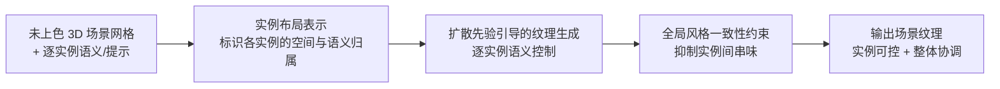

## 一句话总结

InstanceTex 提出面向 3D 室内场景的"实例级可控"纹理合成方法：借助一种实例布局(instance layout)表示，让扩散先验既能对场景中每个物体实例做精确的语义控制，又能保持整个场景的整体风格一致。

> 说明：本篇为基于公开摘要与出版元数据整理的概览，未能获取论文全文，方法细节与实验数据以原文为准，文中不含具体数值。

## 研究背景

给未上色的 3D 场景生成高质量纹理，是游戏、影视、室内设计与 VR/AR 资产制作的关键环节。随着文本到图像扩散模型的成熟，一条主流路线是把 2D 扩散先验"蒸馏"到 3D 表面上：要么用得分蒸馏采样(score distillation)优化场景外观，要么通过深度条件的多视角生成与修复逐步为网格上色。这类方法在单物体或整场景的"全局"文本控制上取得了明显进展。

但把它们直接用于**多实例组成的完整场景**时会遇到瓶颈：一句全局文本提示难以为场景里每一件家具、每一面墙分别指定材质与风格，容易出现语义串味(不同物体的外观相互污染)、实例边界模糊、以及难以在"逐物体的精细控制"与"整体风格协调"之间取得平衡。换句话说，场景纹理生成缺少一种**能把控制粒度下沉到实例、同时约束全局一致性**的表示与机制。

InstanceTex 正是针对这一空档：它引入实例布局表示，作为连接"逐实例语义意图"和"扩散先验生成能力"的桥梁，从而实现实例级可控的场景纹理合成。相关工作谱系上，它一头连接文本到纹理/场景纹理的扩散蒸馏与多视角生成路线，另一头借鉴了布局先验、条件控制(如向扩散模型注入额外条件)与场景图/布局驱动生成的思路。

## 方法

InstanceTex 的核心是"用实例布局表示驱动扩散先验"，在为整个场景合成纹理时，把语义控制解耦到单个实例，同时用全局约束维持风格统一。整体可理解为下面的流程。

**关键设计一：实例布局表示(instance layout representation)。** 这是方法的中枢——为场景中的每个物体实例建立清晰的空间归属与语义标识，使得"这块表面属于哪个实例、应遵循哪条语义/风格意图"变得明确。有了这层表示，控制信号就能在渲染/生成过程中被路由到正确的实例上，从而支持逐实例的精确语义控制，而不是只有一个笼统的全局提示。

**关键设计二：扩散先验的实例级引导。** 方法把预训练文本到图像扩散模型作为外观先验，在为场景上色时以实例布局为条件进行引导，使每个实例获得与其语义意图相符的纹理。这类"以 2D 扩散先验指导 3D 表面外观"的范式(得分蒸馏 / 深度条件多视角生成)是近年场景与物体纹理生成的主流技术底座。

**关键设计三：整体风格一致性约束。** 仅有实例级控制会带来风格割裂或实例间语义污染的风险。InstanceTex 在实例可控的同时施加全局层面的约束，让不同实例的纹理在色调、材质气质上彼此协调，形成风格统一的完整场景。这正是"实例可控"与"整体一致"这对张力的平衡点。

从扩散生成的通用形式看，这类方法通常从噪声出发、在条件 $$c$$(此处包含实例布局与逐实例语义)引导下迭代去噪得到目标外观，可抽象为条件生成 $$x \sim p_\theta(x \mid c)$$；其中实例布局把条件 $$c$$ 结构化为"逐实例"的形式，是实现细粒度可控的关键。

## 实验结果

受限于未获取全文，此处不复现具体数值，仅概述评估框架。论文面向 3D 室内场景纹理合成任务，将 InstanceTex 与文本驱动的场景/物体纹理生成路线进行对比，评估维度大致覆盖如下方面：

| 评估维度 | 关注点 |
|---|---|
| 实例级可控性 | 能否按逐实例语义意图精确上色、边界清晰不串味 |
| 整体风格一致性 | 不同实例纹理在全局是否协调统一 |
| 视觉质量与保真度 | 纹理细节、清晰度与观感 |
| 文本/语义符合度 | 生成外观与给定语义提示的一致程度 |

综合公开摘要的表述，方法的主张是：相较仅支持全局控制的既有方案，实例布局表示带来了更精确的逐实例语义控制，并在此基础上维持了整场景的风格一致性。

## 亮点与局限

亮点：把"控制粒度"从整场景/单物体下沉到**实例级**，用实例布局表示作为可控性的载体，直击场景纹理生成中"多物体各自可控 + 全局协调"的核心矛盾；充分复用成熟的 2D 扩散先验，不必从零训练大模型即可获得高质量外观；面向真实的室内多实例场景，贴近资产生产的实际需求。

局限(基于任务性质的合理推断，非原文断言)：依赖预训练扩散先验，生成质量与语义理解受底座模型能力约束；实例布局的准确性与场景实例划分质量可能直接影响控制效果；蒸馏/多视角上色类方法通常计算开销较大、逐场景优化耗时；对复杂遮挡、精细图案或跨实例风格迁移等困难情形的表现仍需原文实验佐证。

## 延伸思考

InstanceTex 最值得关注的思路是"用一层结构化表示把控制粒度对齐到语义单元"。这与二维布局到图像(layout-to-image)、场景图驱动生成的发展方向一致：当生成目标由多个可辨识实体组成时，给模型一个"谁是谁、各自要什么"的显式结构，往往比堆叠更强的全局提示更有效，也更利于抑制实体间的语义串味。

顺着这条线可延伸的问题包括：实例布局能否进一步承载材质、光照乃至可编辑性等更丰富的属性，实现"选中某个实例即改其外观"的交互式场景纹理编辑；如何在实例可控与全局一致之间给出可调节的权衡旋钮；以及把该范式从室内静态场景推广到室外大场景或含动态物体的场景。对"表示决定可控性"的这类工作，其价值常常不止于当前任务，而在于提供一种可迁移的结构化控制思路。
