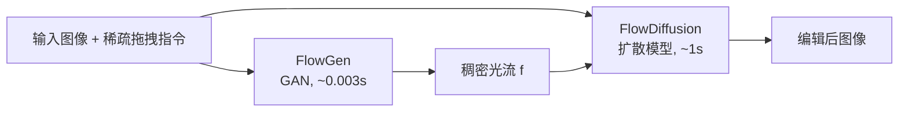

## 一句话总结

InstantDrag 把拖拽编辑拆成"稀疏拖拽→稠密光流"和"光流条件下的图像生成"两步，用一个轻量 GAN（FlowGen）加一个免优化扩散模型（FlowDiffusion）在约一秒内完成无需掩码、无需文本提示的真实图像拖拽编辑。

## 研究背景

拖拽编辑自 DragGAN 起因其像素级精确控制而流行，但主流方法（DragDiffusion、DragonDiffusion、SDE-Drag、Readout Guidance 等）普遍依赖逐图像的隐空间优化、DDIM 反演或复杂的引导策略，单次编辑常需数十秒到数分钟，且往往还要用户额外提供可动区域掩码与文本提示，严重削弱了交互性。同时 DDIM 反演会丢失高频细节，导致真实图像编辑质量下降。

作者据此提出四个目标：速度、真实图像编辑质量、去除对用户掩码的依赖、去除对文本提示的依赖。核心思路是训练专用模型、彻底摆脱推理时优化与反演。一个关键难点是缺乏"输入图 + 拖拽指令 + 编辑结果"的三元组配对数据，作者转而从真实视频中挖掘运动信息。

## 方法

整体框架把任务解耦为两个专门网络：

**FlowGen：稀疏拖拽到稠密光流的一步翻译。** 把运动生成视为图像翻译问题，采用 Pix2Pix 式 GAN 从头训练。生成器输入 5 通道（3 通道 RGB + 2 通道稀疏拖拽），输出 2 通道稠密光流；判别器为加深的 PatchGAN，输入 7 通道。用 GroupNorm 替代 InstanceNorm，并对每次判别器更新配合四次生成器更新（每次采样不同稀疏流）以增强鲁棒性。损失由对抗损失与重建损失组成：

$$
\mathcal{L}_{adv} = \mathbb{E}_{x,f}[\log D(x, f_s, f)] + \mathbb{E}_{x,f}[\log(1 - D(x, f_s, G(x, f_s)))]
$$

$$
\mathcal{L}_{rec} = \mathbb{E}_{x,f}\left[\lVert f - G(x, f_s)\rVert_2\right]
$$

**FlowDiffusion：光流条件下的免优化生成。** 以 Instruct-Pix2Pix 为基线微调 Stable Diffusion，但把编辑信号从文本转移到额外的光流通道。U-Net 输入 10 通道（4 通道隐噪声 + 4 通道隐图像 + 2 通道光流），文本 token 全部替换为空 token，省去文本编码器以减少计算。采用对图像与光流分别设引导尺度 $$s_I, s_F$$ 的无分类器引导：

$$
\tilde{\epsilon}_\theta(z_t, c_I, c_F) = \epsilon_\theta(z_t, \varnothing, \varnothing) + s_I\,[\epsilon_\theta(z_t, c_I, \varnothing) - \epsilon_\theta(z_t, \varnothing, \varnothing)] + s_F\,[\epsilon_\theta(z_t, c_I, c_F) - \epsilon_\theta(z_t, c_I, \varnothing)]
$$

训练时丢弃图像条件的概率为 5%、丢弃光流条件为 10%，避免模型仅凭光流而无图像作条件。

**伪拖拽指令采样。** 拖拽本身是欠定问题，用户输入点数差异极大。作者先用 $$U(0,1)$$ 初始化稀疏流，对背景赋 $$-\infty$$，对网格位置加 $$v_g$$、对关键点（人脸用 dlib 关键点子集）加 $$v_s$$，再选 top-$$k$$ 点、其余置零，其中 $$k$$ 在预设范围内随机。实验表明这种随机策略兼具单点与稠密网格的优点：单点会引起非目标区域乱动，过多点则只产生局部稀疏运动。

**背景一致性与光流归一化。** 用分割掩码把 $$I_1$$ 的前景对象与 $$I_2$$ 的背景合成（背景掩码用 15×15 核膨胀以容错），作为 FlowDiffusion 的输入条件而非修改真值 $$I_2$$，从而让模型学会忽略合成扰动、正确重建 $$I_2$$（掩码仅训练时使用）。归一化上：FlowGen 用逐样本归一化（损失直接算在光流上，避免过小尺度导致不稳定），FlowDiffusion 用固定尺寸归一化（保留真实运动尺度，避免运动过大或过小）。

## 实验结果

在 TalkingHead-1KH 上用 68 个 dlib 关键点生成拖拽指令，取 100 对帧作原图与真值编辑图评测（O 表示相对原图、E 表示相对编辑真值）：

| 方法 | 输入 | 时间(s) | 显存(GB) | PSNR-O↑ | LPIPS-O↓ | CLIP-O↑ | CLIP-E↑ |
|------|------|--------:|---------:|--------:|---------:|--------:|--------:|
| DragDiffusion | 图/拖拽/文本/掩码 | 75.3 | 11.6 | 23.83 | 0.194 | 0.957 | 0.945 |
| DragonDiffusion | 图/拖拽/文本/掩码 | 11.0 | 6.6 | 21.53 | 0.233 | 0.895 | 0.891 |
| SDE-Drag | 图/拖拽/文本/掩码 | 53.0 | 7.4 | 15.71 | 0.347 | 0.666 | 0.665 |
| Readout Guidance | 图/拖拽/文本 | 55.4 | 19.2 | 25.44 | 0.205 | 0.892 | 0.885 |
| **InstantDrag（本文）** | 图/拖拽 | **1.1** | **3.4** | **26.51** | **0.154** | **0.957** | **0.948** |

InstantDrag 相比同类方法最快约 75×、显存最省约 5×，在内容保持类指标（PSNR-O、LPIPS-O）与 CLIP 相似度上领先。基于 66 份问卷的人类评测（指令遵循、身份保持、总体偏好三项）显示本文在零样本人脸编辑与总体偏好上表现突出。DragDiffusion 因基于点追踪与优化能把点精确移动到目标位置，本文则更侧重一致性与运动的合理性。FlowGen 生成器 54M 参数，FlowDiffusion 860M；采样用 DPM++ 20 步。

## 亮点与局限

亮点：将拖拽编辑解耦为运动生成与运动条件生成，各用最合适容量的模型；免反演、免优化，天然保留高频细节，无需掩码或文本；仅需图像与拖拽即可交互，速度接近实时；虽仅在真实人脸视频上训练，却能泛化到绘画、卡通等域。

局限：因学习信号来自光流估计网络，难以处理光流网络无法捕捉的超大位移；仅在人脸视频上训练，对非人脸场景在不微调时偶有身份保持或运动准确性不足；通用场景需在测试时用 10~60 秒短视频微调（约 20 分钟）。

## 延伸思考

把"运动"作为显式中间表示（光流）而非隐式地塞进隐空间优化，是该工作提速的关键——它让扩散模型只需专注"给定运动如何渲染一致图像"。这提示了一个更一般的范式：把编辑意图翻译成结构化条件（光流、深度、分割等）再交给条件生成模型，可能比端到端反演优化更快也更可控。若能用更大规模、更多样运动的视频数据训练 FlowGen 与 FlowDiffusion，其通用场景能力有望进一步打开；而如何突破光流对大位移的表达上限，或引入分层/长程运动表示，是延续这条路线的自然方向。
