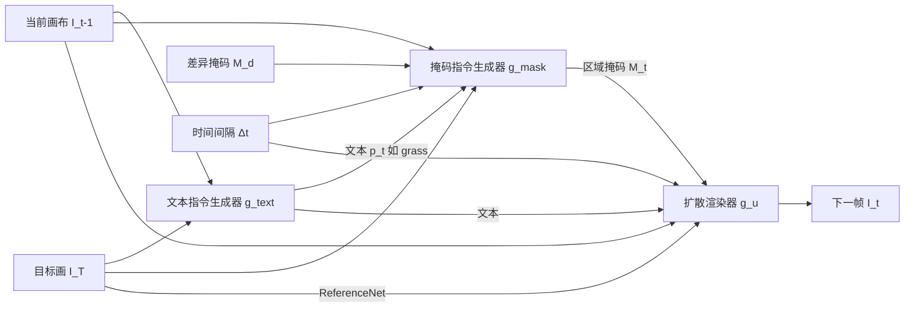

## 一句话总结

给定一幅成品画作，通过"文本+区域"指令引导的扩散渲染器，从空白画布出发自回归地逐步更新，重建出一段类人绘画过程的延时视频。

## 研究背景

我们看画时只能看到最终结果，却看不到艺术家的创作过程。网络上存在大量记录整幅画作绘制过程的延时视频，它们揭示了分层、由后到前的作画顺序、以及一次专注一个语义区域等人类绘画规律。作者希望从这些真实绘画视频中学习这些规律，从而为任意画作预测一段合理（并非精确复原）的绘制过程。

已有方法分两类：一类是基于笔触的渲染（stroke-based），依赖手工设计的绘画原则，无法真正模仿人类过程，且参数化笔触只能得到目标画的近似版本；另一类是基于像素的生成，其中最相关的 Timecraft 从真实绘画视频学习，但只能处理 $$50\times50$$ 的低分辨率块，缺乏整体语义上下文。作者观察到，纯像素方法难以捕捉绘画的语义信息，因此需要引入显式的语义控制。

## 方法

整体是一个自回归图像生成问题：给定目标画 $$I_T$$，从空白画布 $$I_0$$ 出发，重建 $$T$$ 个关键帧 $$\{\hat{I}_1, ..., \hat{I}_T\}$$，每次转移对应固定时间间隔。核心是将"生成指令"与"渲染画布"解耦为两阶段。

**两阶段解耦设计**：受人类作画习惯启发——先决定"画什么、画在哪"，再落笔。第一阶段生成语义指令：文本指令 $$\hat{p}_t$$ 说明该画什么语义内容，区域掩码 $$\hat{M}_t$$ 指明落笔的焦点区域。第二阶段用扩散渲染器结合这两类指令来更新画布。消融显示，去掉掩码会一步画完整座山，去掉文本会在完成山之前误画出绿色湖面，二者缺一不可。

**文本指令生成器**：基于视觉语言模型 LLaVA 1.5，将目标图与当前图水平拼接作为单图输入，$$\hat{p}_t = g_{text}([I_T, I_{t-1}], p)$$，用真实文本指令做全监督微调。它不仅捕捉语义，还学到了由后到前的作画顺序（如云叠在天空上、花叠在草上）。单步评估中文本准确率 72%，远超初始化用的原始 LLaVA（31%）。

**掩码指令生成器**：基于 Stable Diffusion 的 UNet（不加噪声输入），综合四个因素：当前图与目标图、文本指令 $$p_t$$、差异掩码 $$M_d$$、时间间隔 $$\Delta t$$。差异掩码由感知距离阈值 $$\alpha=0.2$$ 二值化得到，记为 $$D(I_T, I_{t-1}, \alpha)$$。空间输入为 $$[E_I(I_T), E_I(I_{t-1}), M_d]$$，条件输入为文本嵌入与时间嵌入拼成的 78 个 token：

$$\hat{M}_t = g_{mask}([E_I(I_T), E_I(I_{t-1}), M_d], [g_p(p_t), g_t(\Delta t)])$$

用二值交叉熵监督下采样后的真实掩码。

**扩散渲染器**：基于 Stable Diffusion 去噪 UNet $$g_u$$，用 ReferenceNet $$g_r$$ 注入目标图特征，浅层 CNN 编码 $$[I_{t-1}, M_t]$$，并引入时间编码器 $$g_t$$（NeRF 式位置编码，$$21\to768$$ 维）建模每步耗时、以及 next CLIP 生成器 $$g_c$$ 预测下一帧的 CLIP 特征。训练损失为标准扩散去噪目标：

$$L = \mathbb{E}_{s,z_0,\epsilon}\|g_u(z_s, c, s) - \epsilon\|_2^2$$

训练时统一用真实文本、掩码与当前帧作为输入，以缓解误差累积；测试时从空白画布起用固定时间间隔（默认 20 秒）自回归生成，直至更新极小时终止。

## 实验结果

数据集为 294 个丙烯风景画绘制视频（265 训练 / 29 验证，训练/验证各 7261 / 783 对）。与三个基线在验证集上比较，评估作画顺序类人性、更新焦点一致性、收敛速度、时间间隔遵循度与视频质量五个方面。

| 方法 | LPIPS ↓ | IoU ↑ | DDC ↓ | DTS ↓ | FID ↓ |
|------|---------|-------|-------|-------|-------|
| Paint Transformer | 0.643 | 0.104 | 94.61 | 6.057 | 337.3 |
| Timecraft | 0.602 | 0.251 | 153.2 | 9.964 | 289.8 |
| SVD | 0.500 | 0.197 | 135.5 | 8.577 | 168.3 |
| Ours-TG（去文本生成器） | 0.399 | 0.400 | 39.41 | 2.120 | 161.1 |
| Ours-CE（去 CLIP 生成器） | 0.371 | 0.402 | 34.16 | 1.346 | 158.4 |
| **Ours（间隔 20 秒）** | **0.364** | **0.418** | **32.66** | **1.273** | **150.6** |

完整模型在全部五项指标上超过所有基线与消融变体。人类研究中（33 名参与者、8 幅画），本方法平均评分为 SVD 的 1.9 倍、Paint Transformer 的 2.1 倍、Timecraft 的 3.0 倍。消融表明：时间嵌入对 DDC/DTS 影响显著；掩码指导对 IoU 关键；ReferenceNet 与 next CLIP 生成器均带来提升。

## 亮点与局限

亮点：将"绘画过程重建"形式化为自回归图像生成，并把"画什么/画在哪/怎么画"解耦成文本指令、区域掩码与扩散渲染三部分，从真实视频学到分层与由后到前的作画规律，而非依赖手工原则；时间间隔可控制单步更新范围，从而调节所需帧数；还涌现出一个有趣性质——由差异掩码按序号加权合成的"时间图"近似目标画的（逆）深度图，印证了对由后到前分层原则的学习。

局限：仅在风景丙烯画上训练，难以泛化到肖像等其他类型（会产生不自然结果）；受训练数据限制画风种类有限；结果是"合理"重建而非对某幅画真实创作过程的精确复原。

## 延伸思考

该工作展示了用大规模真实过程视频学习"人类如何做事的顺序与分层"这一元能力，其两阶段"指令生成 + 条件渲染"范式可迁移到其他增量创作过程（如 3D 建模、素描、书法、设计稿演进）的重建。用扩散模型时坚持"训练时喂真值输入"来抑制自回归误差累积，也是长序列生成任务值得借鉴的稳定化策略。若能扩展到更大更多样的数据集与更多画种，并引入用户交互式控制作画顺序，有望成为绘画教学与创作辅助的通用工具。
