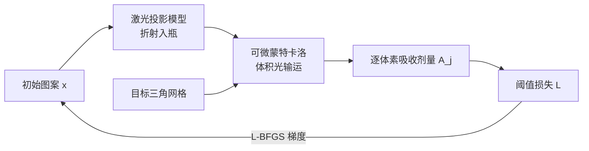

## 一句话总结

把断层体积增材制造（TVAM）的光照图案计算重新表述为一个物理级可微渲染的逆问题，用蒙特卡洛体积光输运模拟替代传统的 Radon 变换/反投影，从而首次在光学层面统一处理吸收、散射、折射与非常规容器几何，显著提升在散射树脂中的打印保真度。

## 研究背景

TVAM 是一种新兴的体积 3D 打印技术：把强度随时空调制的光图案投射到旋转的光敏树脂小瓶上，当某处累计光剂量超过聚合阈值时该处才固化。它无需逐层打印、无需支撑结构，可在几十秒内成型厘米级物体。

传统 TVAM 的图案计算建立在（带衰减的）Radon 变换及其伴随算子——反投影之上。这一框架本质上是把 TVAM 当作 CT 扫描仪的逆过程。但 Radon 变换是一个高度简化的物理模型，无法刻画真实打印中的诸多效应：

- 吸收沿光线的指数衰减；
- 瓶壁界面的折射与内反射；
- 树脂中颗粒（如生物打印中的细胞）引起的体积散射；
- 非圆柱形（如方形）容器带来的复杂光路。

其中散射尤为关键：在含活细胞的生物材料中，细胞会散射入射光，导致对比度下降。既有工作（Madrid-Wolff 等）把散射近似为一次均匀空间卷积，再用反卷积补偿，但需要针对每种介质重新拍照标定，且被绑死在特定损失函数与打印几何上。

本文主张：把图案计算表述为物理级逆向渲染问题，用一个可微的任意吸收/散射介质光输运模拟来求解。三点贡献：

- TVAM 过程在任意树脂下的可微体积渲染表述；
- 一种改进的积分体离散化方案，可恢复小于体素尺寸的细节；
- 一个能适配现有各类 TVAM 装置与树脂的通用优化框架。

（注：本文暂不建模氧扩散等时间相关效应，但认为框架可自然扩展。）

## 方法

### 整体框架

方法把打印图案 $$x$$ 当作可优化变量，前向过程是一次可微的蒙特卡洛体积渲染 $$R(x)$$，输出树脂体内每个体素的吸收剂量 $$A_j$$；再对剂量施加损失 $$\mathcal{L}$$，用梯度优化反解出最优图案。

### 关键设计 1：基于辐射传输方程的前向模型

前向模拟以辐射传输方程（RTE）为基础，沿光线累积发射与内散射，并用透射率项建模衰减：

$$
L_i(\mathbf{x}, \boldsymbol{\omega}) = \int_0^s T(\mathbf{x}, \mathbf{x}_t)\big[\mu_a(\mathbf{x}_t) L_e(\mathbf{x}_t, \boldsymbol{\omega}) + \mu_s(\mathbf{x}_t) L_s(\mathbf{x}_t, \boldsymbol{\omega})\big]\,dt + T(\mathbf{x}, \mathbf{x}_s) L_o(\mathbf{x}_s, -\boldsymbol{\omega})
$$

由于树脂充分混合、消光系数空间均匀，透射率退化为熟悉的 Beer–Lambert 定律：

$$
T(\mathbf{x}, \mathbf{x}_q) = \exp(-\mu_t\, q)
$$

散射用 Rayleigh 相函数（405 nm 下的亚波长 TiO$$_2$$ 纳米颗粒）：

$$
f_p(\mathbf{x}, \boldsymbol{\omega}', \boldsymbol{\omega}) = \frac{3}{16\pi}\big(1 + (\boldsymbol{\omega}\cdot\boldsymbol{\omega}')^2\big)
$$

测量量是每个体素的吸收功率，用一个二值盒式重要性函数 $$W_e^{(j)}$$ 定义体积"传感器"：

$$
A_j = \int_{\mathbb{R}^3}\int_{S^2} L_i(\mathbf{x}, \boldsymbol{\omega})\, \mu_a(\mathbf{x})\, W_e^{(j)}(\mathbf{x}, \boldsymbol{\omega})\, d\boldsymbol{\omega}\, d\mathbf{x}
$$

借助双向渲染的内积对称性，可从光源一端出发采样，一条光线同时贡献多个体素：

$$
A_j = \langle L_i, W_e^{(j)}\rangle = \langle L_e, W_i^{(j)}\rangle
$$

### 关键设计 2：三种体积累加器

沿光线累积吸收剂量的效率决定了整体性能，文中给出三种策略：

- **Simple（自由飞行采样）**：无偏但方差极大，仅累积到单个体素，低消光下光线常直接逃出树脂，不实用。
- **Ratio（比率追踪）**：引入人为放大的主导消光 $$\bar{\mu}_t \gg \mu_t$$，沿光线多点累积并做无偏加权，用计算换方差。
- **Analytic（解析积分）**：由于重要性是盒式滤波，体素内吸收可解析积分，配合 DDA 逐体素步进：

$$
a_j = L_i \int_{t_0}^{t_1} \mu_a\, e^{-\mu_t t}\, dt = L_i\, \frac{\mu_a}{\mu_t}\big(e^{-\mu_t t_0} - e^{-\mu_t t_1}\big)
$$

解析累加器消除了吸收累积的全部方差（仅剩散射本身的方差）。文中还指出：对该式做一阶 Taylor 展开（$$\mu_t \Delta t \ll 1$$）即退化为传统的带衰减反投影，说明既有方法只是本方法的一阶近似。

由于从不优化介质光学属性、渲染对发射强度是线性的，梯度无需专门的伴随积分器，用常规自动微分即可。线性性还让 L-BFGS 的线搜索只需一次额外渲染：

$$
\alpha^* = \arg\min_{\alpha}\ \mathcal{L}\big(R(x) + \alpha R(p)\big)
$$

配合低方差累加器，L-BFGS 仅增加约 38% 单步开销却收敛快得多。

### 关键设计 3：面向表面的离散化（sub-voxel 细节）

传统做法先把目标网格转成二值占据栅格，低分辨率下丢失亚体素细节。本文把未修改的三角网格直接嵌入场景，把每个体素按目标表面切成"内部" $$V_j^\bullet$$ 与"外部" $$V_j^\circ$$ 两块，分别记录吸收 $$A_j^\bullet, A_j^\circ$$，并按体积占比加权：

$$
\mathcal{L} = \sum_j w_j^\bullet\, \mathcal{L}^\bullet(A_j^\bullet) + w_j^\circ\, \mathcal{L}^\circ(A_j^\circ)
$$

采用 Wechsler 等的阈值损失时，展开为：

$$
\mathcal{L} = \sum_j w_j^\bullet\Big[\mathrm{ReLU}(A_j^\bullet - 1)^2 + \mathrm{ReLU}(T_U - A_j^\bullet)^2\Big] + w_j^\circ\, \mathrm{ReLU}(A_j^\circ - T_L)^2
$$

其中三项分别对应"物体内强制聚合""避免过聚合""物体外抑制聚合"。这样即使在 $$16^3$$ 的极低优化分辨率下也能恢复出小于体素的特征。

## 实验结果

在散射树脂中优化 3DBenchy 图案，与 Radon、带衰减 Radon（Absorption）、反卷积（Deconvolution）等方法对比。指标含交并比 IoU、过程窗口 $$\Gamma$$（允许阈值偏差的宽度，越大越易打印）、图案效率 $$\eta$$、耗时 T。

| 方法 | IoU (%) ↑ | $$\Gamma$$ (%) ↑ | $$\eta$$ (%) ↑ | T (s) ↓ |
|------|-----------|--------------|-------------|---------|
| Radon | 82.45 | 4.49 | 3.25 | 346 |
| Absorption | 85.97 | 6.29 | 3.19 | 346 |
| Deconvolution | 93.48 | 3.60 | 0.54 | 1219+198+112 |
| Ours ($$L_2$$) | 99.31 | 3.60 | 3.19 | 2825 |
| **Ours** | **100.00** | **6.29** | 2.80 | 2825 |

本方法用阈值损失取得近乎完美的仿真打印，且过程窗口最宽。核心优势在于：把散射直接纳入物理前向模型后，可自由选择目标函数（既有反卷积法被绑死在 $$L_2$$）。当扫描散射反照率 $$\alpha$$ 与散射系数 $$\mu_s$$ 时，naive 方法随散射迅速退化、反卷积也逐渐变差，而本方法在直到消光过高无法打印之前始终保持高保真。实体打印同样验证：反卷积图案偏暗，需要约 4.5 倍曝光时间，导致烟囱等细节欠聚合、船底过聚合；本方法则给出更均匀的剂量分布与更高保真度。此外还首次演示了方形容器打印与倾斜旋转轴（6.8°）减轻条纹（striation）的实验。

## 亮点与局限

亮点：

- 将 TVAM 图案计算从简化的 Radon 框架提升到物理级可微渲染，统一处理吸收、散射、折射、内反射与任意容器几何；
- 解析累加器消除吸收累积方差，并从数学上把带衰减反投影揭示为其一阶近似；
- 面向表面的离散化在极低体素分辨率下仍恢复亚体素细节，大幅降低计算成本；
- 无需像反卷积那样对每种介质重新拍照标定，散射颗粒只需一次表征即可复用；
- 首次演示方形瓶与倾斜旋转轴打印。

局限：

- 计算成本高，优化比反卷积慢约一个数量级、比单次打印慢约两个数量级；
- 不建模时间相关效应（氧扩散、预聚合引起的散射/折射变化、光引发剂消耗），这些在长时间打印中显著影响细节；
- 仍需人工二分搜索确定最佳曝光参数；
- 条纹现象通过倾斜轴仅被减轻而非消除，更大倾角效果尚待实验验证。

## 延伸思考

- 把时间作为测量方程中额外的积分维度，将氧扩散、聚合诱导折射率变化等纳入前向模型，有望端到端优化并自动确定曝光时间，摆脱人工调参。
- 生物材料打印中，细胞比 TiO$$_2$$ 颗粒更大且不均匀，其光学属性需实验估计，是把该框架推向生物打印的关键一步。
- 作者指出 TVAM 的数学形式与放疗中的逆向治疗规划相关（都是优化辐射投影以在目标区域集中剂量），方法思路可能迁移到医疗剂量规划等领域。
- 该工作展示了"物理级可微渲染 + 逆问题"范式在制造领域的通用性：只要前向物理过程可微，就能把设备设计与图案/参数优化统一到同一优化框架中。
