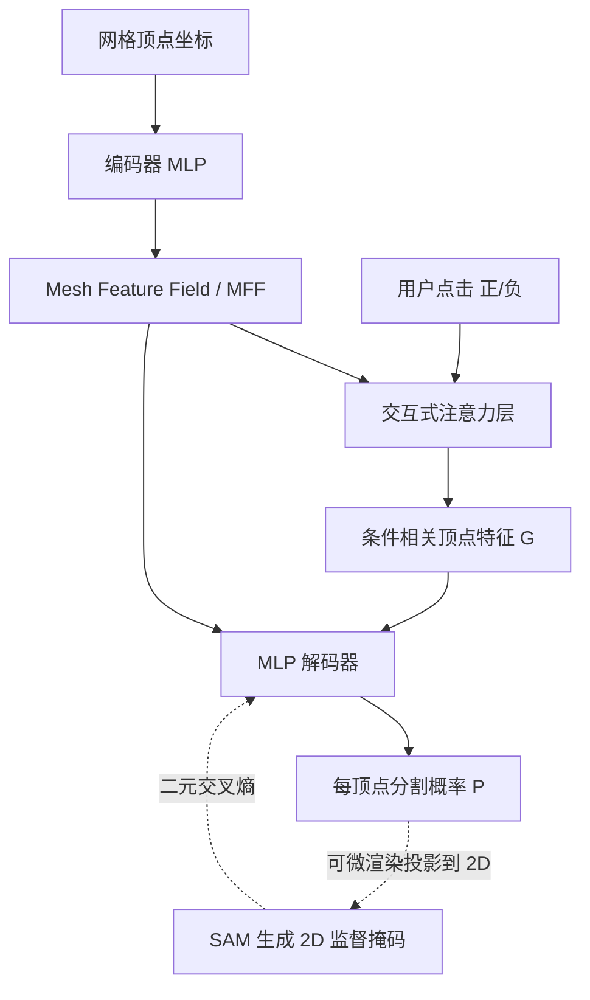

## 一句话总结

iSeg 把 2D 分割基础模型（SAM）的知识蒸馏到 3D 网格上，并通过一个可处理任意数量正/负点击的"交互式注意力"模块，让用户仅靠在网格表面点几下就能得到细粒度、且 3D 一致的形状分割。

## 研究背景

3D 形状的细粒度交互式分割在 CAD、3D 建模、工程仿真、医学分析等领域都很重要，但难点在于：如何从"点击"这种极少的输入推断用户意图，又如何应对几何差异巨大的各种形状。

现有方法有两条主线，各有局限：

- **数据驱动的监督分割**：依赖标注好的 3D 数据集，受限于特定形状域和预定义的部件标签，难以迁移和修改。
- **借助 2D 基础模型（文本驱动）**：把预训练 2D 模型的知识提升到 3D，摆脱了对 3D 数据集的依赖，但文本难以精确描述细粒度的空间区域（比如"章鱼的第四条腿"或对应某个具体点的区域）。

更关键的是，用 2D 模型做 3D 分割存在**遮挡不一致**问题：同一语义区域的被遮挡部分，可能在任何单一 2D 视角下都无法同时可见，导致 3D 分割难以保持一致。iSeg 因此选择**完全在 3D 中操作**，用户点击和推断区域都直接作用在网格表面，从构造上保证 3D 一致性。

## 方法

### 整体框架

iSeg 由两部分组成：一个把顶点坐标映射为深层语义特征的**编码器**（构建 Mesh Feature Field，MFF），和一个结合顶点特征与用户点击、预测每顶点归属概率的**解码器**（内含交互式注意力层）。整个模型针对单个网格优化，无需任何真值标注；训练时把 3D 点击与预测区域投影到多个 2D 视角，借助预训练的 SAM 做监督。

### 关键设计一：Mesh Feature Field（MFF）与知识蒸馏

编码器学习一个函数 $$\phi: \mathbb{R}^3 \to \mathbb{R}^d$$，把每个顶点嵌入为特征向量 $$\phi(v_i)=f_i$$，所有顶点特征构成 $$F \in \mathbb{R}^{n \times d}$$。训练时通过可微渲染把高维顶点属性投影到 2D：

$$
I^{\theta}_{f} = \mathcal{R}(\mathcal{M}, f, \theta) \in \mathbb{R}^{w \times h \times d}
$$

同时把彩色渲染图送入 SAM 编码器 $$E_{2D}$$ 得到参考特征图 $$I^{\theta}_{e}$$，在多个随机视角 $$\Theta$$ 上最小化二者差异：

$$
\mathcal{L}_{enc} = \frac{1}{|\Theta|} \sum_{\theta \in \Theta} \| I^{\theta}_{f} - I^{\theta}_{e} \|^2
$$

MFF 独立于用户输入进行优化，得到一个**条件无关**的特征场，刻画网格固有的语义属性；它把多视角、彼此不一致的 2D 嵌入融合成 3D 表面上一致的特征场。

### 关键设计二：交互式注意力层

这是支持"任意数量、任意类型点击"统一模型的核心。它扩展了标准缩放点积注意力：网格特征 $$F$$ 映射为 Query，正/负点击顶点的特征分别映射为 Key 和 Value：

$$
Q = F W_Q, \quad K_{\{pos,neg\}} = F_{\{pos,neg\}} W^K_{\{pos,neg\}}, \quad V_{\{pos,neg\}} = F_{\{pos,neg\}} W^V_{\{pos,neg\}}
$$

将正负点击的 Key、Value 拼接后，让网格顶点对点击做注意力，得到条件相关的顶点特征：

$$
G = \mathrm{softmax}\left(\frac{Q K^{T}}{\sqrt{d}}\right) V \in \mathbb{R}^{n \times d}
$$

该层把可变长度的交互输入压缩成定长输出，并且对点击顺序**置换不变**、对顶点顺序**置换等变**——非常契合网格数据结构。

### 关键设计三：分割预测与 2D 监督

解码器把先验固有嵌入 $$f_i$$ 与后验条件相关特征 $$g_i$$ 拼接后经 MLP $$\psi$$ 输出每顶点概率：

$$
p_i = \psi(f_i, g_i) \in [0, 1]
$$

监督同样迁移到 2D：把概率图可微渲染成概率图像 $$I^{\theta'}_{p}$$，把 3D 点击投影为 2D 提示交给 SAM 得到掩码 $$I^{\theta'}_{m}$$，用二元交叉熵训练：

$$
\mathcal{L}_{dec} = \frac{1}{|\Theta'|} \sum_{\theta' \in \Theta'} \mathrm{CE}(I^{\theta'}_{p}, I^{\theta'}_{m})
$$

训练数据仅用**约 3% 顶点**（最远点采样选取），每个视角再采样一个可见顶点作为第二个正/负点击，要求其相应扩大或缩小区域。尽管 2D 监督信号高度不一致，iSeg 仍能从噪声中恢复出连贯的 3D 分割函数，并对被遮挡区域也保持一致分割。

## 实验结果

在 PartNet 数据集上（170 个网格，覆盖所有类别，每个网格随机取 5 个测试顶点作单点击）与 InterObject3D 及自建的 SAM Baseline 对比，iSeg 在准确率和 IoU 上均大幅领先：

| 方法 | Accuracy ↑ | IoU ↑ |
| --- | --- | --- |
| InterObject3D | 0.54 | 0.38 |
| SAM Baseline | 0.76 | 0.51 |
| iSeg（本文） | **0.95** | **0.90** |

此外，40 名参与者、20 个网格的感知用户研究（1~5 分评价分割有效性）中，iSeg 得 4.55 分，明显高于 SAM Baseline（3.02）与 InterObject3D（2.54）。iSeg 还展示了在被遮挡表面上的原生 3D 分割、跨域特征迁移（如人的"肚子"对应飞机的"腹部"）、以及对未见顶点、未见视角、未见点击数量（训练时最多两次点击，推理可用更多）的强泛化能力。训练为一次性离线过程（3000 顶点约 3 小时，单张 A40），推理每次点击约 0.7 秒。

## 亮点与局限

**亮点**

- 完全在 3D 中操作，用户点击与分割区域直接作用于网格表面，**从构造上保证视角一致性**，能分割任何 2D 视角都看不全的被遮挡区域。
- 交互式注意力把可变数量、正/负点击统一进单一模型，具备置换不变/等变性，训练仅用两点击却能泛化到多点击。
- 无需真值标注，逐网格优化即可捕捉其独特部件；MFF 条件无关，支持跨域分割等额外用途。

**局限**

- 分割结果**不严格遵循网格对称性**（如山羊头部两侧分割区域略有差异），因为模型并未被训练成对称一致。
- 使用在欧氏空间操作的 MLP 处理 3D 形状存在潜在局限（作者在补充材料中讨论）。
- 逐网格优化虽为一次性离线，但对每个新形状都需数小时训练。

## 延伸思考

iSeg 的思路——把 2D 基础模型的知识蒸馏成 3D 表面上一致的特征场，再用轻量交互模块解码——具有很强的可迁移性。作者指出 MFF 这类条件无关的语义特征场可服务于分割以外的任务，如关键点对应、纹理迁移等。一个自然的问题是：能否用测地或内蕴（而非欧氏 MLP）表示来缓解对称性与几何一致性问题？以及能否摊销逐网格优化成本，训练一个跨形状共享、可快速适配新网格的通用模型，从而把"数小时离线优化"变成"秒级前馈"，让交互式 3D 分割真正实时化。
