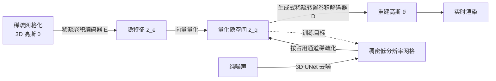

## 一句话总结

L3DG 首次把 3D 高斯基元作为生成目标，通过在 VQ-VAE 压缩得到的隐空间上做 3D 扩散，实现从纯噪声无条件生成可实时渲染的物体乃至房间级 3D 高斯场景。

## 研究背景

3D 内容生成是游戏、影视、AR/VR 的基础需求。近年体积渲染（NeRF、3D 高斯）因梯度传播平滑、渲染逼真而成为主流场景表示，其中 3D Gaussian Splatting 兼具实时渲染速度和可优化性，是生成建模的理想载体。

然而直接对 3D 高斯做生成建模非常困难：

- 生成模型需同时理解场景结构与真实外观，且要适配大小不一的场景；
- 3D 高斯是无序、稀疏、数量可变的集合（物体约 8k 个，房间约 200k 个），难以统一到一个规整的隐流形上。

已有工作要么局限于单物体（如逐形状优化的 SDS 类方法），要么受限于基于网格的辐射场分辨率而无法生成精细结构，也难以扩展到房间尺度。L3DG 的目标就是设计一个可扩展、渲染高效的 3D 高斯无条件生成模型。

## 方法

整体框架分两阶段：先用稀疏卷积的 VQ-VAE 把稀疏网格化的 3D 高斯压缩到一个低分辨率隐空间，再在该隐空间上训练 3D 扩散模型。生成时从纯噪声去噪出隐特征，稀疏化后经解码器还原为高保真 3D 高斯，即可任意视角实时渲染。

### 稀疏网格化的 3D 高斯

为给无序高斯点云恢复空间结构，先把场景空间离散成体素大小 $$d$$ 的稀疏网格，每个体素至多绑定一个高斯基元。基元中心用体素索引 $$\kappa_i$$ 加上位移重参数化：

$$\boldsymbol{\mu}_i = \mathbf{y}_{\kappa_i} + \psi(\boldsymbol{\delta}_i)$$

其中 $$\psi(\boldsymbol{\delta}) = 1.5\tanh(\boldsymbol{\delta})\,d$$，允许基元在本体素及相邻体素内移动。每个体素存放参数 $$\boldsymbol{\theta}_{\kappa_i} = (\boldsymbol{\delta}_i, \mathbf{s}_i, \mathbf{r}_i, \boldsymbol{\gamma}_i, \alpha_i)$$。同时引入新的稠密化策略（相邻基元移入且视空间位置梯度超阈值时在空体素新建基元）并按 3DGS 方式剪枝，用 $$L_{3DG}$$ 优化。

### 基于 VQ-VAE 的 3D 高斯压缩模型

用 Minkowski Engine 的稀疏卷积实现编码/解码，瓶颈处用大小为 $$K$$ 的码本做向量量化：

$$\mathbf{z}_e = E(\boldsymbol{\theta}),\quad \mathbf{z}_q = \text{quantize}(\mathbf{z}_e),\quad \hat{\boldsymbol{\theta}} = D(\mathbf{z}_q)$$

两次 stride 2 下采样带来 64 倍体积压缩，每体素仅存 4 元码本项（码本规模 <10k）。关键设计是解码器用**生成式稀疏转置卷积**，能在上采样时生成新坐标，从而在没有编码器缓存坐标的情况下独立解码扩散生成的隐网格；每次上采样后用线性层将体素分类为占用/空闲以剪枝。总损失包含承诺损失、RGB 颜色损失、VGG 感知损失和占用的二元交叉熵：

$$\mathcal{L}_{comp} = \lambda_{commit}\mathcal{L}_{commit} + \lambda_{RGB}\mathcal{L}_{RGB} + \lambda_{perc}\mathcal{L}_{perc} + \mathcal{L}_{occ}$$

其中感知损失 $$\mathcal{L}_{perc} = \|\Phi_{VGG}(\hat{I}) - \Phi_{VGG}(I)\|_2^2$$，在多视角（物体 $$M{=}4$$、房间 $$M{=}12$$）渲染上计算。

### 隐空间 3D 高斯扩散

为了让内容能在空间任意位置生成，压缩后的稀疏网格先转为低分辨率稠密网格（$$32^3$$），并额外去噪一个占用通道以便还原稀疏结构。前向过程逐步加噪：

$$\mathbf{z}_t = \alpha_t \mathbf{z}_0 + \sigma_t \boldsymbol{\epsilon}$$

采用 v-prediction 参数化，网络输出与干净样本的关系为：

$$\hat{\mathbf{z}}_0 = \alpha_t \mathbf{z}_t - \sigma_t \hat{\mathbf{v}}_\phi(\mathbf{z}_t, t)$$

训练用 MSE 监督 $$\mathcal{L}_{diff} = \|\hat{\mathbf{z}}_0 - \mathbf{z}_0\|_2^2$$。扩散模型是适配到 3D 的 UNet，用 DDPM 1000 步采样生成。生成的隐样本按占用通道稀疏化后送入解码器得到高保真 3D 高斯。

## 实验结果

在 PhotoShape Chairs 上做无条件生成，L3DG 在感知与几何指标上全面领先（MMD、KID 已乘 $$10^3$$）：

| Method | FID ↓ | KID ↓ | COV ↑ | MMD ↓ |
|--------|------|------|------|------|
| π-GAN | 52.71 | 13.64 | 39.92 | 7.387 |
| EG3D | 16.54 | 8.412 | 47.55 | 5.619 |
| DiffRF | 15.95 | 7.935 | 58.93 | 4.416 |
| **Ours** | **8.49** | **3.147** | **63.80** | **4.241** |

FID 相比 DiffRF 提升约 45%。ABO Tables 上 FID 从 DiffRF 的 27.06 降到 14.03。运行时上（RTX A6000），得益于高斯光栅化，渲染每帧仅 0.91ms（512×512），比 DiffRF 快约 50 倍；生成一个形状 13s，接近 DiffRF（21s）的一半。消融显示去掉压缩模型会导致 FID 从 14.03 暴跌到 197.1，去掉感知损失或 RGB 损失也明显变差。此外还展示了在 3D-FRONT 上无条件生成房间级场景的能力（隐空间维度与物体级一致）。

## 亮点与局限

亮点：

- 首个将 3D 高斯作为隐扩散生成目标的方法，兼顾单物体高保真与房间尺度可扩展；
- 稀疏卷积 VQ-VAE 把每体素压到 4 元码本项，极大降低扩散的复杂度，且隐空间维度对物体和房间一致；
- 生成式稀疏转置卷积让解码器可独立生成坐标，解决了从纯噪声生成时无编码器缓存坐标的难题；
- 高斯表示带来实时渲染，比辐射场基线快约 50 倍。

局限（作者指出）：

- 隐 3D 表示和网络规模是扩展到更大场景、更高保真的瓶颈，计算资源限制了进一步探索；
- 目前仅在 PhotoShape、ABO、3D-FRONT 等合成数据集上训练，缺乏场景级真实数据的 3D 监督（高保真 DSLR 采集的 3D 场景数据集仍稀缺）。

## 延伸思考

- 两阶段"压缩 + 隐扩散"范式几乎复刻了 2D Latent Diffusion 的成功路径，说明关键在于找到一个既紧凑又可独立解码的 3D 隐表示；生成式稀疏转置卷积的"边解码边长坐标"是把这套思路搬到稀疏 3D 的核心工程创新。
- 无条件生成是起点，接入文本/图像条件、或用空间子分（spatial subdivision）策略缓解显存瓶颈，是走向更大场景和可控生成的自然方向。
- 房间级生成对真实数据的依赖提示：3DGS 生成的进一步突破可能更多取决于高质量场景级 3D 数据的积累，而非单纯扩大模型。
