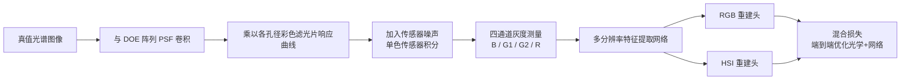

## 一句话总结

用一个 2×2 的衍射透镜阵列 + 各孔径独立的彩色滤光片替代传统"单透镜 + 拜耳传感器"，并与重建网络端到端联合优化，实现单次曝光高光谱成像，在合成数据上比现有单衍射透镜/编码孔径方案的光谱重建 PSNR 高出 5 dB 以上，真机可在 429–700 nm 内恢复 31 个光谱波段。

## 研究背景

高光谱成像（HSI）需要在多个精细波段上采集同一场景的图像，在医学成像、遥感、农业监测、模式识别等领域用途广泛。传统扫描式采集需要长曝光和复杂硬件，难以做到实时。基于压缩感知的快照式 HSI 通过编码调制在一次曝光中同时压缩空间或光谱信息，成为热门方向。

近年来，端到端（E2E）联合优化衍射光学元件（DOE）与重建网络的"学习型光学"取得进展，但现有快照光谱系统存在两个固有局限：

- 通常搭配现成的拜耳（Bayer）彩色传感器，其光谱响应曲线并非为 HSI 优化，限制了光谱保真度。
- 单透镜设计依赖单个 DOE 同时编码光谱信息并保持所有波长下的空间分辨率，光谱编码能力受限；而定制彩色滤光片又受制于昂贵耗时的光刻与镀膜工艺，难以与单衍射透镜结合。

本文的核心思路是把彩色滤光片纳入光学设计，改用多孔径方案：用逐孔径的彩色滤光片配合多孔径衍射透镜阵列，让每个通道拥有独立的空间编码与光谱响应，从而在空间和光谱两个维度上都扩展了光学编码的自由度。

## 方法

### 整体框架

系统由光学模块与计算模块组成。光学模块包含一个衍射多透镜阵列、一组逐孔径的彩色滤光片，以及一个单色（monochrome）传感器；传感器通过多个通道以各自独立的编码方式捕获场景。随后一个协同设计的深度神经网络从传感器测量中重建出高光谱图像与 RGB 图像。DOE 阵列、逐孔径彩色滤光片和重建网络三者通过一个混合损失函数端到端联合优化。

### 关键设计 1：多孔径前向成像模型

以 2×2 子孔径阵列为例。每个子 DOE 单元的入射波场被放在其孔径上的彩色滤光片调制。设彩色滤光片透过曲线为 $$T_c(\lambda)$$（$$c=1,2,3,4$$ 表示颜色通道），经 DOE、滤光片和传感器采集得到的图像为：

$$I_c(x,y) = \int_{\lambda_{min}}^{\lambda_{max}} \big[ \mathrm{PSF}_c(x,y,\lambda) * L(x,y,\lambda) \big]\, T_c(\lambda)\, T_s(\lambda)\, d\lambda$$

其中 $$[\lambda_{min}, \lambda_{max}]$$ 为光谱范围，$$T_s(\lambda)$$ 是单色传感器的原生透过曲线。每个子 DOE 的 PSF 采用旋转对称衍射透镜表示，焦距 $$f$$ 即 DOE 到传感器的距离，各子透镜共享该焦距；DOE 的复透过函数写作：

$$P(r_m,\lambda) = \exp\!\big(i k\, (h(x,y)(n(\lambda)-1))\big)$$

其中波数 $$k = 2\pi/\lambda$$，$$n(\lambda)$$ 为基底折射率，$$h(x,y)$$ 为子 DOE 单元的高度图。传感器噪声建模为逐像素的高斯–泊松噪声：

$$S_c(x,y) = \eta_p\big(I_c(x,y),\sigma_p\big) + \eta_g\big(I_c(x,y),\sigma_g\big)$$

最终得到四张编码后的灰度图像 $$S_c(x,y)$$，输入到重建网络。

### 关键设计 2：多分辨率重建网络

重建网络分两部分：一个特征提取模块，从传感器测量中做多尺度特征提取；随后一对重建头，分别根据提取的特征恢复 RGB 或 HSI 输出。特征提取模块借鉴图像分类网络思路，在三个分辨率层级（1×、2×、4× 下采样）设置并行卷积流以保留高分辨率特征，用拼接层聚合不同分辨率的特征以实现流间信息流动，并用跳连保留传感器测量捕获的全部纹理细节。重建头是 $$5\times 5$$ 卷积块，分别专门用于 RGB 或 HSI 重建。

### 关键设计 3：面向制造的混合损失

整个管线用混合损失训练：

$$\mathcal{L} = \mathcal{L}_{recon} + \mathcal{R}_{PSF} + \mathcal{R}_{T}$$

重建损失进一步拆分为：

$$\mathcal{L}_{recon} = \omega_1 \mathcal{L}_1^{RGB} + \omega_2 \mathcal{L}_{perc}^{RGB} + \omega_3 \mathcal{L}_1^{Spectral}$$

其中 $$\mathcal{L}_1$$ 为逐像素 L1 损失，$$\mathcal{L}_{perc}$$ 为基于 LPIPS 的感知损失（作用于 RGB 重建），权重 $$\omega_1,\omega_2,\omega_3$$ 经验设为 $$100, 1, 100$$。

两个正则项面向可制造性：$$\mathcal{R}_{PSF}$$ 关注学习到的 PSF 中心强度、抑制过度模糊的 PSF：

$$\mathcal{R}_{PSF} = \begin{cases} 0 & \text{if } P_{center} \ge P_{target} \\ P_{target} - P_{center} & \text{if } P_{center} < P_{target} \end{cases}$$

其中 $$P_{center}$$ 为学习 PSF 中心 $$30\times 30$$ 裁剪区的总强度，目标值 $$P_{target}$$ 经验设为 0.9。$$\mathcal{R}_{T}$$ 计算彩色滤光片曲线的一阶导数，促使滤光片设计平滑、抑制多峰曲线，避免局部极值，从而便于制造。

## 实验结果

在 CAVE 数据集（32 张未见过的图像）上与两类基线对比：RGB→光谱直接重建方法（HRNet、MST++，均为 NTIRE 光谱重建挑战赛冠军），以及端到端优化的衍射光学快照系统（QDO、SCCD）。训练用 CZ_HSDB 与 ICVL（共 278 张），在未见的 CAVE 上评测。除 SSIM/PSNR 外，还用 Delta E（RGB 域感知差异，$$<1$$ 视为人眼不可察）和 SAM（光谱角映射，越小越好）作为域特定指标。

| 方法 | RGB SSIM | RGB PSNR | Delta E | HS SSIM | HS PSNR | SAM↓ |
|------|----------|----------|---------|---------|---------|------|
| 本文方法 | 0.96 | 38.01 | 1.30 | 0.92 | 32.82 | 0.21 |
| HRNet (2020) | - | - | - | 0.88 | 26.76 | 0.40 |
| MST++ (2022b) | - | - | - | 0.833 | 24.85 | 0.41 |
| SCCD (2021) | 0.84 | 32.27 | 2.53 | 0.74 | 27.43 | 0.59 |
| QDO (2022) | 0.74 | 26.19 | 4.32 | 0.67 | 23.60 | 0.45 |

本文方法在高光谱域相比 SCCD 提升 5.4 dB PSNR、RGB 域提升 5.7 dB；相比 MST++、HRNet 分别高出 7.97 dB、6.04 dB（PSNR）。QDO 因单透镜设计和设计阶段的重量化限制表现最差；MST++ 因过拟合特定采集设置（JPEG 压缩、相机标定）在跨设置时下降明显。

多孔径配置消融（Table 2）表明：独立空间调制（DOE 阵列）显著优于单 DOE 共享调制；定制彩色滤光片优于固定 RGGB 拜耳滤光片。例如"DOE Array w/ Fixed Curve"在 HS 域为 30.32 dB，低于本文完整方法的 32.82 dB，验证了定制光谱编码的价值。

## 亮点与局限

亮点：

- 首次把彩色滤光片纳入 E2E 优化，并用多孔径阵列取代"单 DOE + 拜耳 CFA"，让每个通道拥有独立的空间编码与光谱响应，大幅扩展了空间×光谱两维的编码自由度。
- 面向制造的正则项（PSF 中心强度约束 + 滤光片平滑约束）让优化结果更贴近可实际加工的器件。
- 有真机原型验证，对照 Specim IQ 扫描式高光谱相机，在室内外多种光照下恢复 429–700 nm 的 31 个波段。

局限：

- 原型在学术设施中加工，光学元件制造质量低于业界最先进工艺，导致衍射效率损失和图像雾霾伪影。
- 2×2 配置下整幅传感器测量面被多通道瓜分，牺牲了空间分辨率：2048×2048 传感器只能得到 1024×1024 的重建分辨率。作者指出用更高分辨率传感器可缓解这一权衡。

## 延伸思考

- 多孔径思路本身不局限于 2×2，扩展到更大阵列时如何在"通道数（光谱编码能力）"与"每通道分辨率"之间取得更好平衡，是值得探索的方向；配合更高像素传感器或亚像素超分重建或许能兼顾两者。
- 面向制造的正则项体现了"设计–制造一致性"的重要性——从仿真到真机的性能落差主要来自加工误差，若把更精确的制造模型（衍射效率、镀膜误差）纳入前向模型，可能进一步缩小仿真与实拍差距。
- 相比 RGB→光谱的纯算法外推，本方法用物理光学编码引入了真实的光谱信息，缓解了逆问题的病态性和过拟合风险，这对需要跨相机、跨场景泛化的高光谱应用尤为关键。
