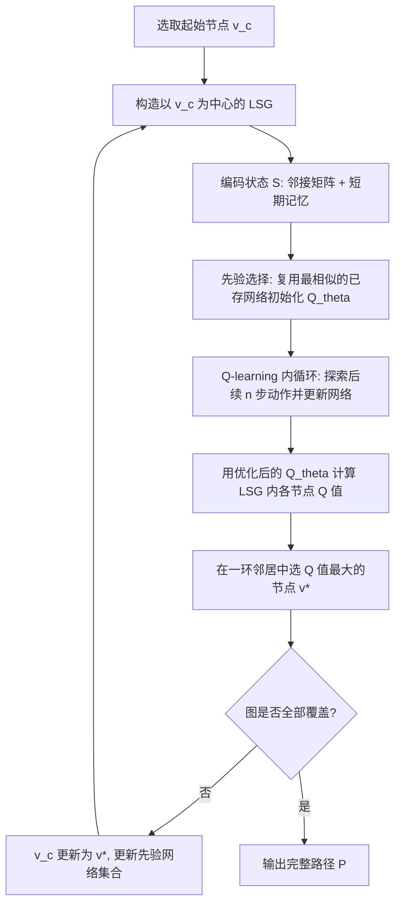

## 一句话总结

把 3D 打印的走刀路径规划抽象成"在给定图上求最优遍历序列"的问题，用一个基于深度 Q 网络（DQN）的"下一步最佳节点"在线规划器（on-the-fly），配合局部搜索图（LSG）与先验网络复用机制，在大规模、结构多样的图上高效生成兼顾不同制造目标的打印路径。

## 研究背景

许多 3D 打印工艺的路径规划都可以统一表述为：在无向图 $$G=(E,V)$$ 上，找到一条遍历所有节点/边的最优访问序列，节点坐标对应打印头位置、顺序对应打印次序。难点在于两方面：不同模型的图结构差异极大（拓扑连接、实体数量高度多变），且单个图规模巨大（实验中可达上万节点、近 4 万条边）。

已有做法各有短板：

- 直接对整张大图做学习式全局求解（如 AlphaGo 类方法）不现实，现有强化学习方法通常只能处理不到 200 个节点的小图，且训练动辄需要数百小时。
- 启发式方法（贪心选择、带回溯的深度优先搜索 DFS）只能得到局部最优，质量普遍不如暴力搜索（BFS）。
- 暴力搜索能在局部搜索范围内逼近全局最优，但复杂度为 $$O(k^n)$$（$$k$$ 为节点度数、$$n$$ 为局部搜索范围环数），一旦局部窗口稍大就无法承受，尤其在需要碰撞检测和有限元变形分析的场景下。

本文主张：用一个学习式规划器替换局部窗口内的暴力搜索，在保持相近决策质量的同时把复杂度从 $$O(k^n)$$ 降到 $$O(n^2)$$。

## 方法

### 整体框架

规划器采用"逐节点探索"的在线策略：每一步以当前节点 $$v_c$$ 为中心构造一个局部搜索图 LSG（通过广度优先搜索取 $$n$$ 环邻居），把它编码为状态输入 DQN，网络输出 LSG 内各节点的 Q 值，再在 $$v_c$$ 的一环邻居中选取 Q 值最大的节点作为"下一步最佳节点"，如此反复直到覆盖整张图。

规划问题被建模为马尔可夫决策过程：状态空间由 LSG 配置构成，动作空间是从中心节点移动到 LSG 内其他节点，转移函数模拟打印过程（线框用有限元与碰撞检测、连续纤维估计转角、金属计算温度场），奖励函数按不同工艺定义。网络训练遵循贝尔曼方程：

$$y = r + \gamma \max_{a^*}\left\{\bar{Q}(S', a^*)\right\}$$

$$L = (y - Q(S, a))^2$$

其中 $$\gamma \in (0,1)$$ 为折扣因子，$$\bar{Q}$$ 为定期同步的目标网络。

### 关键设计一：LSG 状态表示与图案编码（Pattern Encoding）

LSG 被转成邻接矩阵 $$A=[a_{i,j}]_{m\times m}$$，元素为归一化边长；若两点无边或该边已被路径占用则置 0（表示不允许再走）。为让"结构相似的 LSG 得到相似的矩阵图案"，作者提出图案编码：将 LSG 用共形参数化展平成平面图，固定 $$v_q$$ 与 $$v_c$$ 于 $$(-1,0)$$ 和 $$(0,0)$$（防止不必要的旋转），再按展平后节点的 $$x$$、$$y$$ 坐标排序索引。实验表明该编码显著提升了相似 LSG 之间邻接矩阵的相似度，是后续先验复用的基础。

### 关键设计二：短期记忆的三维状态

单个邻接矩阵只反映当前静态结构，作者把它扩展成三维状态 $$S=[A, A^\dagger, A^\ddagger]_{m\times m\times 3}$$，其中 $$A^\dagger$$、$$A^\ddagger$$ 分别附加了前一步和前两步的归一化移动边长，编码路径的时序历史信息。对已走过的动作 $$v_r\to v_s$$，状态从 $$[A,A^\dagger,A^\ddagger]$$ 更新为 $$[A^*,A,A^\dagger]$$。LSG 节点数上界约为 $$1+3n(n+1)$$，即 $$O(n^2)$$，实验中取 $$m=50n$$ 即可覆盖所有样例（节点度数通常小于 7）。

### 关键设计三：先验网络复用的加速机制

若每个节点都从头训练，效率极低。作者维护一组已学网络 $$\Theta=\{\theta_k\}$$ 及其对应状态 $$\{S_k\}$$（取 $$K=10$$），通过下式计算当前状态与历史状态的相似度：

$$\rho_k = \rho(S, S_k) = \frac{1}{\lambda}\left(1 + \lVert S - S_k \rVert_F\right)^{-1}$$

其中 $$\lVert\cdot\rVert_F$$ 为 Frobenius 范数，$$\lambda=0.76$$。选相似度最高的网络作为初始权重 $$\theta \equiv \theta_s,\ s=\arg\max_k\{\rho_k\}$$，从而大幅减少收敛所需迭代。新网络并入集合时，会剔除相似度最高的冗余状态以保持多样性。这一机制得益于图案编码把结构相似性映射为状态相似性。

### 关键设计四：面向拓扑的卷积与多工艺奖励

网络用行列卷积算子（Edge-to-Edge 与 Edge-to-Node）而非标准 2D 卷积，以便在邻接矩阵中跨越远距离节点传递拓扑信息。E2E 卷积对每个元素按同行同列权重聚合：

$$a^*_{i,j} = \sum_{k=1}^{m} w_{i,k}a_{i,k} + \sum_{k=1}^{m} w_{k,j}a_{k,j}$$

整个网络由两层 E2E、一层 E2N 卷积加两层全连接构成。步数折扣采用高斯型函数（越靠近 LSG 中心权重越大）：

$$\Gamma(i) = 0.9\exp\left(-\frac{(i-\mu)^2}{2\sigma^2}\right) + 0.1$$

三种工艺的奖励函数不同：

- 线框打印：碰撞项（碰撞记 $$-1000$$，5 轴时用最小旋转角惩罚）加最大位移项，$$r_i=\Gamma(i)(C(v_{i-1},v_i)+U(v_{i-1},v_i))$$，位移由梁单元有限元评估。
- 连续碳纤维（CCF）：奖励转角与边长，$$r_i=\Gamma(i)(A(v_i)+D(v_{i-1},v_i))$$，惩罚大于 $$2\pi/3$$ 的急转弯、鼓励小于 $$\pi/3$$ 的平缓转角，允许每条边最多走两次以保证一笔连续。
- 金属 LPBF：以最小化高温区面积为目标，节点只可访问一次，$$r_i=-\Gamma(i)T(v_i)$$（重复访问记 $$-1000$$），温度场按热核施加与扩散更新。

## 实验结果

在配备 Intel Core i7-13700F 与 RTX 4080 的 PC 上用 Python 实现，可在最多约 39k 条边的模型上成功规划路径。CCF 打印质量与已有对偶图 DFS 方法（带回溯）的对比最能体现优势：

| 模型 | 急转弯数（≥120°）DFS | 急转弯数 本文 | 路径长度(m) DFS | 路径长度(m) 本文 |
|------|------|------|------|------|
| Bearing | 31 | 8（↓74.19%） | 12.49 | 9.04（↓27.62%） |
| Gear | 626 | 44（↓92.97%） | 29.46 | 21.10（↓28.38%） |
| Shell | 730 | 49（↓93.29%） | 31.06 | 22.51（↓27.53%） |

其他关键结果：

- 线框打印：Bunny 模型部分结构最大位移仅 0.86mm（喷嘴直径 1.0mm），可成功打印多达数千根杆件的模型；相比暴力搜索，当 $$n=5$$ 时 BFS 耗时是本文方法的 15~18 倍，$$n=6$$ 时 BFS 在 Bunny 上需超过 214 小时而本文仅需约 2.05 小时。
- CCF 力学验证：Shell 试件用本文路径拉伸断裂力提升 29.00%，同时纤维用量减少 27.53%。
- 金属打印翘曲：Femur 模型本文路径最大变形 1.84mm，相比 zigzag（2.45mm）降低 24.90%、相比棋盘格路径（2.43mm）降低 24.28%。
- 先验复用加速在各模型上普遍把主计算时间进一步压缩约三到四成。

## 亮点与局限

亮点：

- 用统一的"图上遍历"框架 + 可替换奖励函数，覆盖线框、连续纤维、金属三类差异极大的打印工艺，通用性强。
- on-the-fly 的 LSG 策略把复杂度从 $$O(k^n)$$ 降到 $$O(n^2)$$，让学习式规划器首次能扩展到上万节点的大图。
- 图案编码 + 先验网络复用是核心巧思，把"结构相似性"转化为"可复用的网络先验"，显著加速收敛。
- 所有结果都有真机物理实验（UR5e 机械臂、双材料喷头、LPBF 设备）与力学/翘曲测量支撑。

局限：

- 起始节点靠启发式随机选取，规划完成前无法预知是否可行，失败时需重启外循环重选起点。
- 规划器主要基于局部 LSG 状态，缺乏全局拓扑信息，需借助多尺度图（如 Reeb 图分区后先做粗粒度 BFS）来弥补。
- 碰撞避免的奖励只考虑局部扫掠体，全局碰撞未纳入；"跳转"作为被动动作处理，频繁跳转会引起拉丝或金属密度不均。
- 在小图上并不优于暴力搜索——其定位是在大规模图上以效率换取接近 BFS 的质量。

## 延伸思考

- 该工作本质是"用可复用的局部策略近似昂贵的局部暴力搜索"，这一思路可迁移到其他需要在大图上反复做昂贵局部评估的规划问题（如加工序列、装配规划、布线）。
- 图案编码依赖共形参数化把局部图展平对齐，若节点度数变化更大或存在强非平面结构，编码相似性可能退化，值得探索更鲁棒的图同构感知表示或直接用图神经网络（文中 GCN 对比显示质量相近但内存效率略低）。
- 多尺度"粗图 BFS + 细图 DQN"的分层结构提示了一条可扩展路线：把全局拓扑决策与局部路径生成解耦，未来或可端到端联合学习两级策略。
- 奖励函数目前需按工艺手工设计，若能从物理仿真或真机反馈中自动学习/校准奖励，将进一步降低迁移到新工艺的门槛。
