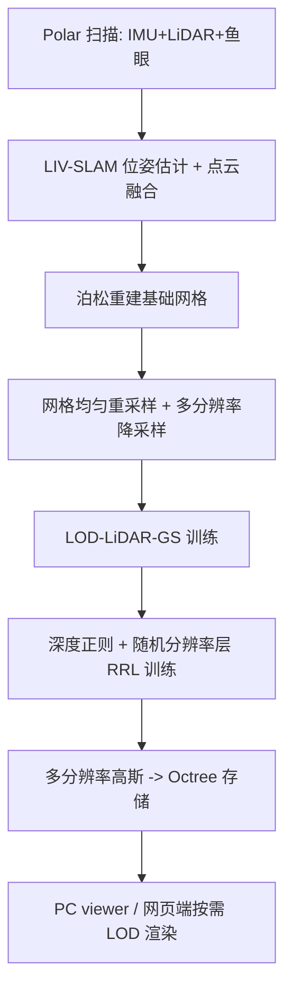

## 一句话总结

针对地下车库这类弱纹理、重复图案、反射/透明表面密集的大规模室内场景，LetsGo 用自研手持扫描仪 Polar 采集 RGBD 数据，把标定后的 LiDAR 点云注入 3D 高斯泼溅，配合深度正则与多分辨率 LOD 表示，实现高保真且可在轻量设备（网页端）实时渲染的大规模车库建模。

## 研究背景

大规模车库是一类普遍却棘手的场景：颜色单调、图案重复、地面墙面大面积无纹理，车辆玻璃透明且表面常有反射，地下环境还接收不到 GPS 信号。这些特性让传统的 Structure from Motion（SfM）与 Multi-View Stereo（MVS）难以建立可靠的特征对应，相机位姿估计与稠密重建频频失败。

纯 LiDAR 方案虽能提供几何信息，但点云稀疏、有空洞，且不携带每点的 RGB 颜色，难以还原高频纹理外观。NeRF 类隐式表示渲染质量高，却训练慢、算力开销大，且难以接入传统图形管线。3D Gaussian Splatting（3DGS）以显式高斯重新表达几何与外观，兼具质量与效率，但它仍依赖 SfM 提供的稀疏点云和相机参数——这正是车库场景的短板。此外，随着场景规模增大，完整加载海量高斯会超出高端 GPU 的显存能力，更别提在笔记本、平板上实时渲染。

## 方法

整体框架分为数据采集、几何初始化与 LiDAR 辅助高斯训练、多分辨率 LOD 表示与轻量渲染三大部分。Polar 设备（IMU + LiDAR + 鱼眼相机）先采集 RGBD 数据，用 LiDAR-Inertial-Visual SLAM 估计相对位姿，融合点云后用泊松重建生成基础网格；网格上均匀重采样出干净点云并按分辨率分层，作为高斯初始化输入；训练时在光度损失外加入无偏深度正则；最终得到可按视点距离动态选层的多分辨率高斯表示，支持 PC 高性能 viewer 与网页端渲染。

### 关键设计 1：Polar 手持扫描仪与 GarageWorld 数据集

Polar 集成 6K 分辨率、180°×180° 视场、30 FPS 的鱼眼相机，2.6M 点/秒、精度 1~1.5 cm、最远 50 m 的 LiDAR，以及 IMU；配备迷你 PC 做实时 SLAM，可用手机预览点云。采集时沿轨迹前、后、左、右各扫一遍确保覆盖，行进速度约 $$1.0\pm0.2\ \mathrm{m/s}$$。据此构建了首个大规模车库数据集 GarageWorld，含 8 个车库（6 个地下、1 个多层室内、1 个室外顶层），涵盖平坡、螺旋/环形路径、机械停车系统等多样结构。

### 关键设计 2：LiDAR 辅助高斯 + 无偏深度正则

沿用 3DGS 的高斯参数化，协方差由缩放与旋转构造：

$$\Sigma = R S S^{T} R^{T}$$

用 LiDAR 重采样点云替代 SfM 点云初始化高斯（记为 3DGS\*/LiDAR-GS）。核心创新是深度正则：不直接用高斯中心深度，而是沿光栅化管线计算射线与高斯交点处的期望深度：

$$D_{G} = \sum_{i\in N} d_{i}\,\alpha_{i}\,T_{i}, \qquad T_{i} = \prod_{j=1}^{i-1}\left(1-\alpha_{j}\right)$$

其中每个高斯的交点深度 $$d_i$$ 由协方差矩阵元素修正得到，而非取中心。深度损失以 LiDAR 深度先验为监督：

$$\mathcal{L}_{depth} = \sum_{k\in K}\left\lVert D_{G}^{k}-D^{k}\right\rVert_{1}$$

总损失为光度项加深度项：

$$\mathcal{L}_{total} = \mathcal{L}_{rgb} + \lambda_{depth}\,\mathcal{L}_{depth}$$

其中 $$\lambda_{depth}=0.8$$。该正则显著抑制地面的漂浮伪影（floaters），让高斯核更贴合真实几何。

### 关键设计 3：多分辨率 LOD 表示与随机分辨率层训练

用间距属性 $$\tau$$（点间最小距离）刻画点云分辨率，从最细的 $$\tau$$ 起不断加倍降采样，直到点数低于阈值 $$\epsilon_p$$，从而得到多层点云（$$\tau=4.0\ \mathrm{cm}$$，$$\epsilon_p=10{,}000$$）。每层高斯独立优化，克隆/分裂阈值按层级 LOD 值缩放：

$$s_{k} = \min\!\left(\beta_{s}^{\,L-1-l},\ s_{max}\right), \qquad l\in[0, L-1]$$

其中 $$\beta_s=\sqrt{2}$$、$$s_{max}=4.0$$。渲染时按投影深度选择层级：

$$L(d) = \mathrm{clamp}\!\left(\left\lfloor L^{\,1-d/d_{max}}\right\rfloor,\ 0,\ L-1\right)$$

低分辨率层负责低频内容、高分辨率层补高频细节。为避免某些区域在固定层级上过拟合，提出随机分辨率层（RRL）训练：每个训练样本以 50% 概率用多层 LOD 组合、50% 概率用单一层渲染。最终多分辨率高斯被组织进 Octree 存储，网页端 viewer 只按当前视锥与 LOD 策略按需从磁盘加载可见块，实现粗到细的渐进渲染，突破显存限制。

## 实验结果

在 GarageWorld、ScanNet++、KITTI-360 上与多种方法对比（带 \* 表示均用本文 LiDAR 点云初始化）。LOD-LiDAR-GS 在大规模场景（GarageWorld、KITTI-360）上全面领先，在小规模 ScanNet++ 上取得次优；网页端在 MacBook Air M2 上也保持了可用质量。

| 方法 | GarageWorld PSNR↑ | GarageWorld LPIPS↓ | KITTI-360 PSNR↑ | KITTI-360 SSIM↑ | ScanNet++ PSNR↑ |
| --- | --- | --- | --- | --- | --- |
| 3DGS* | 23.52 | 0.412 | 20.39 | 0.698 | 27.41 |
| Mip-Splatting* | 22.08 | 0.448 | 20.19 | 0.682 | 25.74 |
| F2-NeRF | 18.88 | 0.552 | 18.60 | 0.653 | 23.59 |
| NGP | 20.68 | 0.507 | 21.21 | 0.655 | 28.72 |
| Splatfacto* | 25.45 | 0.261 | 14.76 | 0.481 | 28.35 |
| OCT-GS* | 25.19 | 0.315 | 21.52 | 0.692 | 31.55 |
| LoG-GS* | 21.53 | 0.278 | 18.62 | 0.671 | 27.80 |
| Ours (LOD-LiDAR-GS) | **25.77** | **0.210** | **24.53** | **0.811** | 29.19 |
| Ours (Web) | 22.56 | 0.211 | 19.20 | 0.586 | 22.79 |

消融结论：深度正则有效消除地面漂浮伪影；LOD 渲染策略让实时 viewer 在 RTX 3090 上比原版 3DGS SIBR viewer 快约 3~4 倍且质量相当；点云质量实验表明从网格采样的点云优于直接用 LiDAR 点云，4 cm 间隔在质量与训练时间间达到较好平衡（例如 Arts Center 2 cm 需约 10 小时、4 cm 仅约 2.4 小时，PSNR 从 25.87 略降到 25.70）；RRL 训练缓解了对相机分布敏感的过拟合。网页端加载约 200 万高斯仅需 1.29~1.36 秒，叠加预载的 300 万高斯后仍维持 60 FPS（受浏览器内存限制上限 2 GB）。

## 亮点与局限

亮点：
- 抓住车库场景痛点，用 LiDAR 点云替代失效的 SfM 初始化，并证明这一策略能普遍增益多种 3DGS 变体。
- 无偏深度正则从光栅化交点而非高斯中心计算深度，几何监督更准确，显著抑制漂浮伪影。
- 多分辨率 + Octree + 按需加载的 LOD 方案，首次让大规模车库能在笔记本/平板网页端实时渲染。
- 发布首个大规模车库数据集 GarageWorld（8 个场景、多样结构），为自动驾驶、定位导航、VFX 等应用提供支撑。

局限：
- 依赖自研 Polar 硬件与较重的采集流程（单场景端到端 12~16 小时，含数据采集、预处理与训练），复现门槛高。
- 网页端渲染质量明显低于 PC 端（如 GarageWorld PSNR 从 25.77 降到 22.56），且用 CPU 排序、受 2 GB 内存上限约束。
- 泊松网格重建对反射/透明表面（车窗）仍不理想，几何精度受限。
- 主要面向静态场景，未涉及动态物体与光照变化建模。

## 延伸思考

LetsGo 的核心逻辑是"用主动传感的几何先验补足被动视觉在退化场景中的失败"，这一思路可迁移到隧道、矿井、大型仓库等同样弱纹理、无 GPS 的封闭空间。深度正则中"沿射线交点计算期望深度"的做法，为高斯泼溅与几何监督的结合提供了更严谨的范式，值得在表面重建（如 2DGS/GaussianSurfels）方向进一步融合。多分辨率 Octree + 按需流式加载则指向一个现实问题：如何让超大规模显式表示脱离高端 GPU、走向消费级终端与云端流送——这与点云 LOD（Potree 等）传统技术的结合仍有想象空间。此外，GarageWorld 作为专门数据集，可能推动车库定位、自动泊车仿真等下游任务的标准化评测。
