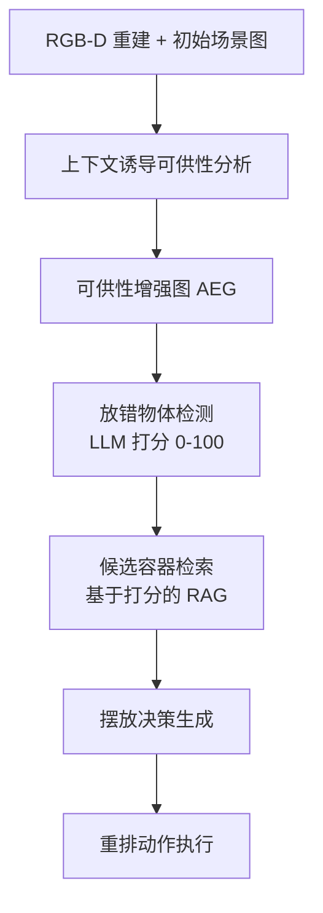

## 一句话总结

不依赖人工示范，直接从室内场景本身挖掘物体功能与用户偏好：用多模态大模型把普通场景图升级为"可供性增强图"（AEG），再据此检测放错位置的物体并为其规划正确摆放位置。

## 研究背景

家庭整理（household rearrangement）任务要求机器人找出被放错位置的物体，并把它们放回合适的地方。这件事既依赖客观的常识知识（例如书一般放书架），又依赖主观的用户偏好（例如同一个柜子，主人可能当衣柜也可能当书架用）。

大语言模型（LLM）凭借强大的常识推理能力，在零样本场景重排任务上表现亮眼，但存在两个痛点：

- **缺乏场景落地（grounding）**：LLM 本身不知道当前这个场景里每个物体的具体功能和摆放习惯，需要把场景信息喂给它才实用。
- **忽略用户偏好**：以往工作如 TidyBot 通过在提示词里显式注入"示范摆放"让 LLM 归纳用户偏好，但这些示范必须针对具体场景收集，非常繁琐；另一些方法则依赖用户反馈做迭代自训练。

本文的核心观点是：**室内场景现有的布局本身就已经蕴含了足够的用户偏好**，只要分析场景上下文就能读出来，无需人工干预。于是用户指令可以简单到"把房子整理一下"，机器人便能基于对物体功能的深入分析自动完成重排。

## 方法

整体框架分为两大阶段：先做上下文诱导的可供性分析，把普通场景图转成 AEG；再基于 AEG 做放错检测与摆放规划。所有关键步骤都在零样本设定下由多模态基础模型（本文用 GPT4V）完成。

**1. 初始场景图与关键帧选择**

假设已从 RGB-D 扫描序列构建出普通场景图 $$S$$：每个节点代表一个物体实例，存有实例 ID、类别、所在房间、重排类型（可搬运 carriable / 容器 receptacle / 其他）；靠得足够近的两个节点之间连边，边上记录关系类型（near / on / support）。重排类型定义沿用 OVMM 挑战赛。为给推理提供视觉上下文，每个节点还关联一张代表性 RGB 关键帧：通过构建物体-图像像素矩阵 $$N \times M$$，对每个物体把它及其邻居在各帧上的投影像素数相加，取投影像素最多的帧作为关键帧，因为它包含最多的周边上下文。

**2. 上下文诱导的可供性分析（local-to-global）**

这是把 $$S$$ 升级为 AEG 的核心，分三步：

- **局部上下文分析**：对每个容器/其他物体，把场景图中邻域的文本内容按模板整理，连同关键帧图像一起构成提示，让 LLM 用思维链（Chain of Thought）推理其功能，输出结构化的"几何与位置 / 关系 / 功能 / 细粒度类别"。例如把普通的"桌子"分析成靠近门口、上面放鞋，进而赋予细粒度类别"入口整理台（Entryway Organizing Console）"。
- **全局上下文分析**：普通场景图只能描述近邻，但功能相关的物体可能相距很远（如沙发与电视）。因此构建"物体-区域(area)-房间(room)"的层级结构：先用 LLM 聚合每个区域内所有物体的局部可供性，生成区域描述与命名；再把房间内所有区域信息作为全局上下文，为每个容器抽取远距离但有意义的功能关联，并在场景图中添加从容器指向相关物体的**语义有向边**。
- **可供性更新**：结合局部分析、全局上下文与新增语义边，用 LLM 更新每个容器的上下文诱导可供性，最终得到既含周边空间上下文又含远距语义上下文的 AEG。

**3. 放错物体检测**

引入基于 LLM 的"摆放打分器"。由于 token 限制无法一次性输入所有可搬运物体，故逐个打分：对每个可搬运物体，输入它的描述、当前所在容器的上下文诱导可供性，以及任务指令"整理房子"，让 LLM 给出 0~100 的合适度分数。以 50 分为阈值，分数不超过 50 的判为放错，并按分数升序排列以便后续规划。

**4. 物体重排规划（打分式 RAG）**

要为放错物体找最合适的容器，需要比较场景中所有相关容器。但把所有容器的可供性一股脑塞进提示会让 LLM 信息过载、失焦、易幻觉。受检索增强生成（RAG）启发：

- **容器候选检索**：把 AEG 中所有容器节点的描述构成数据库。与经典 RAG 按语义相似度检索不同，这里复用打分器（微调提示），按"任务相关度"对每个容器的摆放合适度打分，取分数最高的 top-k 个作为候选。
- **摆放决策生成**：把 top-k 候选容器的上下文诱导可供性连同查询（待重排物体描述 + 任务）喂给决策生成器，LLM 选出最佳容器并附一段分析理由。据此机器人拾取放错物体并放到目标位置，完成重排。

系统在 Habitat 3.0 模拟器中实现为完整的整理机器人。

## 实验结果

作者标注 HSSD 200 数据集构建了面向上下文的新基准（8 个场景、36 个房间、105 个区域、188 个容器，随机摆放生成 4000+ 混乱场景），并邀请标注者操控机器人为每个物体标注 1~5 个合适容器、经多数投票生成排序真值。评测指标包括放错检测的准确率/召回率/精确率/F1，以及重排规划的 Top-k NDCG。

在自建面向上下文基准上与 Housekeep 及随机基线对比（NDCG 取 top-8，检测取阈值 0.5）：

| 方法 | Rearrange NDCG@1 | NDCG@8 | Accuracy | Recall | Precision | F1 |
|------|------|------|------|------|------|------|
| Random | 0.181 | 0.295 | 0.57 | 0.594 | 0.815 | 0.687 |
| HouseKeep | 0.265 | 0.351 | 0.637 | 0.707 | 0.831 | 0.764 |
| Ours | **0.648** | **0.696** | **0.829** | **0.88** | **0.908** | **0.894** |

本方法在重排规划与放错检测两项任务上都显著领先。在 TidyBot 自身基准上，即使不利用其示范摆放（仅当作常规上下文），平均成功率也达 91.4%，略高于 TidyBot 的 90.7%。

消融实验表明：视觉上下文对放错检测更有效，文本上下文对重排更关键，二者结合（含全局上下文）取得最优；LLM 打分式检索显著优于相似度检索和随机选择，能有效过滤大量无关容器、降低 LLM 决策难度。

## 亮点与局限

**亮点**

- 提出"从场景本身挖掘用户偏好"的思路，把繁琐的人工示范/反馈完全去掉，用户指令可简单到一句"整理房子"。
- AEG 通过 local-to-global 的层级聚合，既补足场景图缺失的远距功能关系（新增语义边），又给容器赋予细粒度、可解释的功能标签。
- 用打分式 RAG 替代"把所有容器塞进长提示"，缓解了 LLM 的信息过载与幻觉问题。

**局限**

- 可供性增强完全建立在初始场景图的正确性之上，无法纠正场景图构建阶段引入的错误。
- 依赖 GPT4V 等闭源多模态大模型，成本与可复现性受限；打分阈值（50）等为人工设定。

## 延伸思考

作者提出的未来方向是通过端到端或主动学习联合优化初始场景图，让感知误差不再成为上限。更进一步，AEG 这种"把 LLM 分析结果回写到场景图"的思路可推广到导航、长程操作等其他具身任务：场景图不只是地图，而是可以承载功能与偏好的知识载体。另一个值得探索的点是把"物体现有布局即偏好"的假设与少量显式反馈结合，处理布局本身就杂乱或偏好冲突的真实家庭场景。
