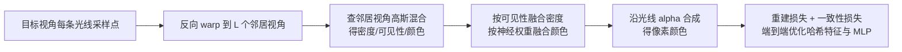

## 一句话总结

用"每条光线一组高斯混合密度"的逐视角局部几何代替全局深度/网格代理，配合可微渲染与神经融合权重，把曲面反射和透明折射这类高频视角相关外观渲染得比 3DGS、Ref-NeRF 更锐利。

## 研究背景

新视角合成有从局部光线插值、图像基渲染（IBR）到全局辐射场的一整条谱系。曲面反射（随相机移动而移动的高光）和透明物体折射是其中最难的两类现象：

- NeRF、3DGS 等全局方法常把反射解释为"表面背后"的虚拟几何。对平面反射这套虚拟几何在所有输入图上都自洽，但对曲面反射难以维持一致，结果就是反射被抹糊。
- Ref-NeRF 这类方法引入法线估计和材质分解，但往往假设远处环境光照、参数自由度增大导致优化歧义，适用场景受限。
- 传统无结构 lumigraph 依赖几何代理（全局或逐视角）来挑选待插值的对应光线，渲染质量完全取决于代理几何的精度，而曲面反射体的几何本身就难以一致重建。

作者的思路是：既然全局一致几何难求，就为每个输入视角定义一个"局部代理几何"，只要在生成某个新视角所用的少量邻居视角之间保持一致即可。这样能把复杂曲面反射体"分片"表示，从而保住锐利反射。

## 方法

整体框架：输入是一组带位姿的图像。为每个视角学习一个局部密度场，每条光线用 $$N=10$$ 个高斯的混合表示密度；所有高斯参数由一个浅层 MLP 编码进逐图的 2D 哈希网格。渲染新视角时，从若干邻居视角反向 warp 采样点，融合密度与颜色，再沿光线做 alpha 合成。整个系统端到端优化。

**1. 逐光线高斯密度混合与解析可见性**

点 $$x = o + t d$$ 的体密度是高斯混合的加权和：

$$\alpha(u,t) = \sum_{n=1}^{N} \omega_n(u)\, g(t; \mu_n(u), \sigma_n(u))$$

关键好处是可见性（透射率）可解析求出，无需数值积分，因为高斯的积分就是其 CDF：

$$v(u,t) = \exp\!\left(-\sum_{n=1}^{N} \omega_n(u)\,(G(t;\mu_n,\sigma_n) - G(s;\mu_n,\sigma_n))\right)$$

其中 $$G(t;\mu,\sigma) = \tfrac{1}{2}\mathrm{erf}\!\left(\tfrac{t-\mu}{\sigma\sqrt{2}}\right) + \tfrac{1}{2}$$。这里密度是沿光线的 1D 表示，因此不像 3DGS 那样能确定 splat 覆盖范围，作者改用光线投射（ray cast）而非泼溅。

**2. Warp、融合与神经混合权重**

密度被视为局部且视角无关的几何，融合时只按可见性加权：

$$\tilde{\alpha}_k = \frac{\sum_i v_i^k \cdot \alpha_i^k}{\sum_i v_i^k}$$

颜色仍带视角相关信息，因此用一个小 MLP 产生的神经混合权重 $$h_i^k = \Phi(x_k, d_k - d_i^k; \theta)$$ 来融合：

$$\tilde{c}_k = \frac{\sum_i h_i^k \cdot v_i^k \cdot c_i^k}{\sum_i h_i^k \cdot v_i^k}$$

相比 ULR/InsideOut 的固定混合权重函数，端到端优化的神经权重能识别"角度虽近但看不到同一反射分量"的邻居光线并降权，从而更好地保留高频反射。

**3. 邻居视角选择（分象限分层）**

仅按光线-视角余弦相似度 $$S_i = \sum_k \frac{(o - x_k)\cdot(o_i - x_k)}{\|o - x_k\|\,\|o_i - x_k\|}$$ 选视角，容易选到"扎堆"的相机，导致某些点观测不足。作者把邻居相机中心投影到目标视角像平面分成四个象限，在每象限内按相似度排序并轮流取，保证邻居分布均衡，避免遮挡边处所有邻居都看不到点。

**4. 一致性损失**

总损失 $$\mathcal{L} = \mathcal{L}_r + 0.01\,\mathcal{L}_c$$。重建损失是 L2 颜色误差；一致性损失用 KL 散度约束"该视角作为目标被融合出的 alpha 权重"与"该视角自身局部密度场的 alpha 权重"一致：

$$\mathcal{L}_c = \sum_k \tilde{w}_k \cdot \log\!\left(\frac{\tilde{w}_k}{w_k}\right)$$

它鼓励遮挡边等依赖密度对齐的区域更一致，也让低纹理等可用多种几何解释的区域收敛一致，显著提升几何精度。

工程实现上还有：2D 哈希网格（16 级、表大小 $$2^{16}$$）压缩存储高斯参数；占用网格从 $$8^3$$ 逐步细分到 $$512^3$$ 加速采样；每条光线先在视差空间采 64 点、再在占用体素内采 128 点；视口外扩 50 像素解决只被目标视角观测的浮空几何；每场景优化 60k 次迭代，单卡 V100 约 4–5 小时。

## 实验结果

作者自建 LGDM 数据集（8 个含显著/复杂反射的场景，67–233 张图，4K 降到 1K，12.5% 作为留出评测视角）。在 LGDM 上全面领先，平均 PSNR 比次优提升 2.64 dB，摘要中称在 PSNR 上超越 SOTA 12.2%–37.1%。

| 方法 | 平均 PSNR↑ | 平均 SSIM↑ | 平均 LPIPS↓ |
|---|---|---|---|
| LLFF | 24.44 | 0.858 | 0.152 |
| NPC | 22.65 | 0.851 | 0.290 |
| Ref-NeRF | 26.60 | 0.868 | 0.328 |
| INGP | 25.43 | 0.868 | 0.294 |
| 3DGS | 27.69 | 0.932 | 0.158 |
| **Ours** | **31.06** | **0.955** | **0.100** |

在公开 Shiny 数据集上与 NeX 定量相当（平均 PSNR 26.43 vs 26.45），但 LPIPS 从 0.165 降到 0.150，且能还原 CD 上的条纹等 NeX 抹糊的细节。在 NeRF 的 Real Forward-Facing 数据集上与 NeX 同为第一梯队。消融显示：去掉一致性损失 PSNR 明显下降（如 Fern 25.58→24.55）；10 个高斯 + 8 个邻居视角是质量与效率的合理平衡；输入视角越稀疏质量越差，降到 1/8 会出现明显伪影。

## 亮点与局限

亮点：

- 用"逐视角、逐光线高斯混合"这种紧凑的局部几何，回避了全局虚拟几何在曲面反射上难以一致的根本问题，反射/折射保持锐利。
- 高斯混合让可见性有解析闭式解（基于 CDF），无需额外数值积分。
- 神经混合权重 + 分象限邻居选择，两个针对 IBR 反射痛点的务实设计。

局限（作者自述）：

- 目标视角在不同邻居集合间切换时，曲面反射会有视觉"snapping"（相对全局方法的模糊，是一种取舍）。
- 未面向快速渲染：952×535 视图在 3090Ti 上约 270 ms，快于 NeRF 但慢于 3DGS。
- 需要密集采集才能达到最高质量，漫反射区域存在冗余重复。

## 延伸思考

这篇工作某种程度上是"经典 IBR 思想 + 现代可微渲染"的一次成功复兴：它没有去追求一个能解释所有视角的全局辐射场，而是承认反射几何的病态性，退回到"局部只需对少数邻居自洽"的更弱约束下，反而在最难的高频视角相关外观上超过了全局方法。作者在结论里也坦言尚不完全清楚"为何局部几何 + 直接颜色混合能比全局几何重建更好地还原视角相关效果"，把它列为需要理论/评测框架支撑的开放问题——这正是值得深挖的点：全局优化在反射上的模糊，究竟是表示能力问题还是优化歧义问题？此外，用高斯混合把可见性做成解析形式的思路，也可能迁移到其他需要沿光线软可见性的可微渲染场景。渲染速度（体采样）和密集采集依赖，则是走向实用需要解决的两个工程瓶颈。
