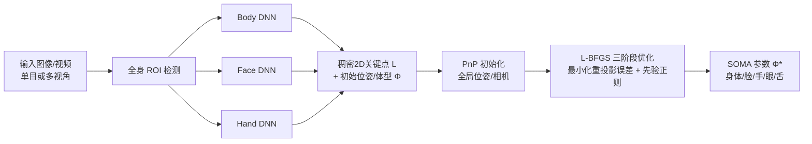

## 一句话总结

提出首个无标记、无标定、无专用硬件的整体式（holistic）人体表演捕捉系统：仅用合成数据训练的神经网络预测稠密 2D 关键点与初始位姿/体型，再结合统一参数化人体模型 SOMA 做优化拟合，同时高精度重建身体、脸（含眼睛、舌头）与双手，并支持任意相机数量与世界坐标结果。

## 研究背景

高质量表演捕捉长期依赖光学标记、精确标定的多相机阵列或专用头戴设备，成本高、需要专家操作且往往只针对身体、脸或手中的单一部分，后期还要人工清洗与拼接不同数据流。

纯机器学习方法虽降低了硬件依赖、能从单张普通相机图像工作，但存在几类短板：直接回归位姿/体型的网络鲁棒但精度不足；预测图像空间特征（2D 关键点）的网络精度高但难以适配任意多相机阵列、难以给出世界坐标结果；且人工标注数据在保真度、隐私与公平性上受限。

本文目标是把两类方法的优点结合起来，做到：直接回归带来的鲁棒性、图像空间特征带来的精度、以及模型拟合带来的对任意相机的适配性，从而实现全自动、生产级质量、覆盖全身的整体捕捉。

## 方法

整体是"合成数据训练 DNN + 参数化模型优化拟合"的混合流水线，全部神经网络只在合成数据上训练。

**关键设计 1：统一参数化模型 SOMA + 全流程一致性。** 作者在 SMPL-H 身体模型与 Wood et al. 人脸模型基础上构建统一的全人体模型 SOMA（希腊语"身体"），网格 12943 个顶点、54 个骨骼关节。网格生成函数为

$$
M(\boldsymbol{\beta},\boldsymbol{\gamma},\boldsymbol{\zeta},\boldsymbol{\psi},\boldsymbol{\theta})
$$

其中 $$\boldsymbol{\beta}\in\mathbb{R}^{300}$$ 为体型、$$\boldsymbol{\gamma}\in\mathbb{R}^{256}$$ 为脸型、$$\boldsymbol{\zeta}\in\mathbb{R}^{9}$$ 为手型、$$\boldsymbol{\psi}\in\mathbb{R}^{224}$$ 为表情、$$\boldsymbol{\theta}\in\mathbb{R}^{54\times3}$$ 为位姿。舌头运动用 12 个 blendshape 表示。由于整个技术栈使用同一模型，2D 关键点直接对应网格上的 3D 点，可直接拟合，避免了标记映射的人工调参与关键点相对网格滑动的问题。

**关键设计 2：仅用合成数据 + 稠密概率关键点。** 用 SOMA 采样身份、位姿、服装、头发、贴图与 HDRI 环境，经 Cycles 渲染生成 SynthBody / SynthFace / SynthHand 三个数据集（各约 10 万张），带无噪声的丰富真值标注。网络采用 HRNet 主干 + 三个 MLP 头（关键点、位姿、体型），全身用 1428 个关键点、每只手 141 个、脸 744 个（含每眼 16 个虹膜边界点、牙齿 12 个、舌头 9 个）。每个关键点建模为圆形高斯 $$L_i=\{\boldsymbol{\mu}_i,\sigma_i\}$$，训练用带权高斯负对数似然损失：

$$
\mathcal{L}_{\text{ldmk}}=\sum_{i=1}^{\vert L\vert }\lambda_i\left(\log(\sigma_i^2)+\frac{\|\boldsymbol{\mu}_i-\boldsymbol{\mu}_i'\|^2}{2\sigma_i^2}\right)
$$

位姿用 6D 旋转表示并加关节平移/旋转重建损失，总损失为关键点、位姿、关节、体型各项的加权和。身体网络还回归位姿与前 10 个体型主成分作初始化；脸网络只保留关键点头。

**关键设计 3：不确定性加权的优化拟合 + 神经位姿先验。** 用 L-BFGS 从网络初始化出发，先 PnP 初始化全局位姿（多视角下用头部模板做无标定的相机定位），再三阶段拟合位姿/表情/体型，可选优化相机外参或焦距。目标函数为

$$
E(\boldsymbol{\Phi},Q;L)=E_{\text{ldmks}}+E_{\text{shape}}+E_{\text{exp}}+E_{\text{pose}}+E_{\text{temp}}+E_{\text{intsct}}+E_{\text{cam}}
$$

数据项为按预测不确定性加权的重投影误差：

$$
E_{\text{ldmks}}=\sum_{i,j,k}^{F,C,\vert L\vert }\frac{\|x_{ijk}-\boldsymbol{\mu}_{ijk}\|^2}{2\sigma_{ijk}^2}
$$

不确定性加权让多视角下遮挡较少的视角占主导、单视角下遮挡区域更多依赖先验。位姿先验 $$E_{\text{pose}}$$ 使用基于 Real-NVP 的 Normalizing Flow 神经先验，通过变量替换公式建模位姿密度：

$$
p_q(q)=p_z\big(T^{-1}(q)\big)\left\vert \det J_{T^{-1}}(q)\right\vert 
$$

## 实验结果

由于整体表演捕捉缺少统一评测集，作者在各子任务上分别评测，且始终使用同一套仅在合成数据上训练的网络（不使用任何 benchmark 训练集，属跨数据集泛化）。下表为 EHF 单视角整体重建误差（mm，MPVPE 为骨盆对齐，PA-MPVPE 为 Procrustes 对齐）：

| 方法 | MPVPE 全身 | PA-MPVPE 全身 | PA-MPVPE 手 | PA-MPVPE 脸 |
|---|---|---|---|---|
| PIXIE | 89.1 | 55.0 | 11.2 | 5.5 |
| OSX | 70.8 | 48.7 | 15.9 | 6.0 |
| PyMAF-X (HR48) | 64.9 | 50.2 | 10.2 | 5.5 |
| SMPLer-X-L32† | 62.4 | 37.1 | 14.1 | 5.0 |
| Multi-HMR-ViT-L/14† | 42.0 | 28.2 | 10.8 | 5.3 |
| Ours | 51.0 | 34.2 | 9.8 | 4.9 |

†为并行工作。本方法在手、脸的 PA-MPVPE 上取得最优，全身指标与并行工作相当；若额外引入被摄者身高这一测量值，可消除单视角的尺度歧义，全身 MPVPE（无骨盆对齐）降至 43.1mm。

其他基准同样有竞争力：NoW 人脸重建单视角中位误差 0.87mm、多视角进一步降至 0.68mm（优于对照方法）；SSP-3D 体型重建 PVE-T-SC 为 11.8，优于同为纯合成数据训练的 BEDLAM-CLIFF（14.2）与总体 SOTA（13.6）；Human3.6M 多视角 MPJPE 为 27.9，显著优于同样未在该集上训练的方法。FreiHAND 手部重建与近期方法相当（PA-MPVPE 8.1），且是唯一未用其训练集的参数化方法。

## 亮点与局限

亮点：
- 首个真正整体式（身体+脸+双手，含眼睛与舌头）、无标记、无标定、无专用硬件、可输出世界坐标的表演捕捉系统，支持任意数量相机。
- 全流程共用同一参数化模型 SOMA，使稠密 2D 关键点与 3D 网格顶点直接对应，避免标记映射调参与关键点滑动。
- 完全依赖合成数据训练，规避隐私与标注噪声，并对公平性有显式控制；跨数据集仍能取得 SOTA/接近 SOTA，体现良好泛化。
- 概率关键点的不确定性加权巧妙统一了多视角遮挡处理与单视角先验回退。

局限：
- 整体质量高度依赖预测的 2D 关键点，交叠的双手或较差的子 ROI 会导致失败；低置信度帧被丢弃并平滑插值，牺牲精度。
- 合成数据缺少特殊姿态、宽松衣物与头发仿真，失败常可追溯到训练数据缺口。
- 优化先验的调参较繁琐；当前实现不支持随时间变化的相机与被摄者位置联合优化。

## 延伸思考

- 该工作再次印证"高质量合成数据 + 强参数化先验"路线在人体视觉中的可行性，尤其在真值标注难以获取的稠密关键点与舌头/眼球等精细部位上优势明显。
- 用 Normalizing Flow 作为可微位姿先验，比传统 GMM/VPoser 更能刻画复杂位姿分布，是缓解单视角欠约束问题的实用手段。
- 作者指出的自然延伸方向——ML 驱动的迭代优化（learned optimizer）以减少手工先验依赖，以及联合优化时变相机与被摄者，是走向"真正任意输入"表演捕捉的关键；结合近期单目全局轨迹估计工作有望进一步打通。
- 公开 SynthBody/SynthFace/SynthHand 数据集对社区训练无隐私顾虑的稠密关键点/整体重建模型很有价值。
