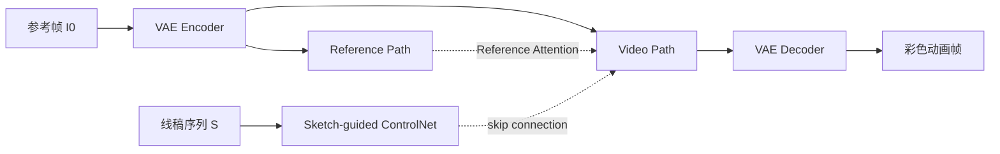

## 一句话总结

首个基于视频扩散模型的参考图引导线稿视频上色框架：以 Stable Video Diffusion 为骨干，通过 Sketch-guided ControlNet、Reference Attention 与面向长视频的顺序采样机制，实现大运动、长时序一致的动画上色。

## 研究背景

动画制作中，艺术家手绘并上色关键帧，中间帧则需按关键帧的风格和色板逐一填充，这一过程重复且耗时。因此，自动为中间帧上色对提升动画产业效率至关重要。

以往的线稿视频上色工作存在两个共同缺陷：

- **依赖逐帧的图像生成模型**：大多数方法只关注相邻帧的连贯性，并将上一帧生成结果作为新参考帧来生成后续帧。这种传播方式会导致误差累积和伪影，即便在连续 10 次采样内也会出现明显问题。
- **基于 GAN 架构**：相比 Transformer 和扩散模型等更新的架构，GAN 的生成能力有限。

作者选择 Stable Video Diffusion(SVD)作为骨干，原因有二：大规模训练数据赋予其强大的高保真视频生成能力；其时序视频模型天然利于生成时序一致的视频。但要将 SVD 适配到本任务，需解决三个挑战：(1) 线稿草图的额外控制；(2) 对动画中大运动的适配；(3) 突破固定帧长限制以生成长视频。

## 方法

整体框架以 SVD(VAE + U-Net,EDM 连续时间扩散框架 + Euler-step 采样)为骨干,在架构上引入 Sketch-guided ControlNet 与 Reference Attention,并在推理阶段设计顺序采样机制生成长动画。

目标是给定参考图 $$I_0$$ 和线稿序列 $$S = s_{[1:N]}$$，生成视频帧序列 $$I_{[1:N]}$$：

$$X_0 = D_\theta(X_T, S, C)$$

其中 $$D_\theta$$ 为去噪器，$$X_T$$ 为高斯噪声初始化的潜变量，$$C = [x_0] \times N$$ 为重复的参考潜变量（$$x_0 = E(I_0)$$ 为编码后的参考帧），与噪声潜变量拼接成第 $$i$$ 个输入 $$[x_0, x_T^i]$$。

**Sketch-guided ControlNet**：将 ControlNet 扩展到视频版本。复制原 U-Net 编码器的全部层（含时序注意力和 3D 卷积层）及其权重，引入零初始化卷积层编码线稿并拼接到克隆编码器的输入，ControlNet 各层输出加到原 U-Net 解码器的跳连上。训练时微调 ControlNet 全部层，使模型同时受参考图与线稿双重条件约束。

**Reference Attention**：动画帧率低、运动大，需在参考帧与待上色帧之间做长距离空间匹配。原 SVD 的问题在于参考潜变量沿通道维与噪声潜变量拼接(空间对齐)阻碍长距离匹配,且时序层是一维的、只考虑同一空间位置的帧间相关。为此,作者新增一条参考路径,输入 $$[x_0, x_T^0]$$ 并跳过所有时序层,在空间自注意力层中让视频路径特征与参考路径特征交互:

$$\text{Attn}(Q_i, K_i, V_i) \rightarrow \text{Attn}(Q_i, [K_i, K'_0], [V_i, V'_0])$$

其中 $$K'_0, V'_0$$ 为参考输入的键值映射。由于 SVD 训练时对每个输入 $$[x_0, x_t^i]$$ 重建对应的 $$x^i$$，参考路径输入 $$[x_0, x_t^0]$$ 也学会重建 $$x_0$$，从而保证其中间特征包含完整的参考信息，实现向大运动远端帧的有效颜色传播。

**面向长视频的顺序采样**：将长为 $$L$$ 的视频按 $$o$$ 个重叠帧划分为多个长为 $$N$$ 的分段，所有分段采样都始终使用第一参考帧 $$I_0$$。为在分段间引入依赖，提出两个模块：

- **Overlapped Blending Module**：将时序混合思想引入重叠帧,在所有去噪步 $$t$$ 用前一分段的中间去噪结果替换当前分段重叠帧的结果:$$D_\theta(X_t^n, S^n, C^n, R) \leftarrow D_\theta(X_t^{n-1}, S^{n-1}, C^{n-1}, R)$$;并将先前生成结果作为参考输入,以放大因子 $$\alpha = 10.0$$ 增强其注意力权重:$$\text{Attn}(Q_i, [K_i, \log\alpha \cdot K'_i], [V_i, V'_i]), i \le o$$。
- **Prev-Reference Attention**：将非重叠帧的自注意力向左平移 3 帧，使其查询重叠帧信息：$$\text{Attn}(Q_i, [K_{i-3}, K'_0], [V_{i-3}, V'_0]), i > o$$，从而把重叠帧恢复的先前内容传播到远端帧，保证跨分段内容一致。

训练使用六部宫崎骏动画共 6,472 个视频片段(平均 58 帧),在 576×320 分辨率下用 4 张 NVIDIA RTX A6000 训练 18,000 步(约 80 小时)。推理时 $$o = 4$$,去噪 $$T = 25$$ 步,单帧平均约 2 秒。

## 实验结果

在 Similar Testset(与训练集风格相近的宫崎骏动画)与 General Testset(其他导演作品)上,与光流法 ACOF、图到图 TCVC、图像 ControlNet+Reference-only、以及插值法 EISAI/SEINE 对比。本方法在所有指标上显著领先,尤其在视频质量(FVD)和时序一致性(TC)上优势明显。

| 方法 | FID↓ | FVD↓ | LPIPS↓ | PSNR↑ | SSIM↑ | EDMD↓ | TC↓ |
|------|------|------|--------|-------|-------|-------|-----|
| ACOF (first) | 25.2291 | 280.1266 | 0.1310 | 19.6044 | 0.8013 | 7.8377 | 1.2265 |
| TCVC (first) | 23.4118 | 217.4509 | 0.1419 | 17.9502 | 0.7587 | 6.4081 | 1.3628 |
| CNet + Refonly | 16.9340 | 170.2000 | 0.1114 | 18.7949 | 0.7844 | 7.1903 | 1.4581 |
| EISAI + CNet | 18.9262 | 227.6656 | 0.1413 | 18.1603 | 0.7314 | 8.2527 | 1.2952 |
| SEINE + CNet | 23.0797 | 836.4528 | 0.1655 | 17.2425 | 0.6504 | 8.6777 | 2.3644 |
| **Ours** | **8.8423** | **40.2711** | **0.0560** | **24.5489** | **0.8790** | **4.3386** | **1.0784** |

（Similar Testset 结果）用户研究中，本方法在 113 位参与者中获得 58.3% 的最高偏好率（CG & CV 组 62.0%、Art & Design 组 52.4%、其他 63.2%）。消融实验表明：去除 Reference Attention 后各项指标退化，大运动区域出现颜色不一致；去除顺序采样方案会降低时序一致性，而 Prev Sample 因误差累积导致所有指标退化；重叠帧数 $$o = 4$$ 是质量与推理速度的最优折中。

## 亮点与局限

**亮点**：

- 首个基于视频扩散模型的参考图引导线稿视频上色框架,突破以往逐帧图像模型和 GAN 架构的局限。
- Reference Attention 通过长距离空间匹配显著提升大运动场景的上色能力。
- 顺序采样机制(Overlapped Blending + Prev-Reference Attention)将固定帧长模型扩展到长时序一致的长视频生成。
- 提出 EDMD 和 TC 两个新指标，用于评估线稿对齐度和时序一致性；模型对不同线稿提取方法（Anime2Sketch、SketchKeras）和手绘线稿均有良好泛化。

**局限**：

- VAE 重建损失与线稿粗糙会导致细小细节（如人脸）丢失或模糊。
- 对部分可见的新物体上色可能不准确：当新角色仅部分入画时，身体易被错误上成邻近物体的颜色，只有全身可见后才准确。

## 延伸思考

- 作者将模型能力建立在大规模预训练视频扩散模型(SVD)之上,体现了"用预训练视频先验解决时序一致性"的思路,这对其他需要跨帧一致的生成任务(如视频编辑、风格迁移)有借鉴意义。
- Reference Attention 本质是把"参考路径"当作可查询的记忆库并跳过时序层，这一设计与图像领域的 Reference-only 有相似之处，但通过训练内化而非仅在推理期使用，避免了大位移下的错误对应，值得在其他参考引导任务中复用。
- 顺序采样中"始终锚定首帧 + 重叠混合 + 注意力平移"的组合，是在不重训模型的前提下扩展生成长度的通用推理技巧，可迁移到其他固定窗口的视频扩散模型。
- 局限中提到的 VAE 重建损失与新物体上色问题，指向未来在卡通域微调 VAE、以及改进视频切分/数据增强以覆盖更多场景切换的方向。
