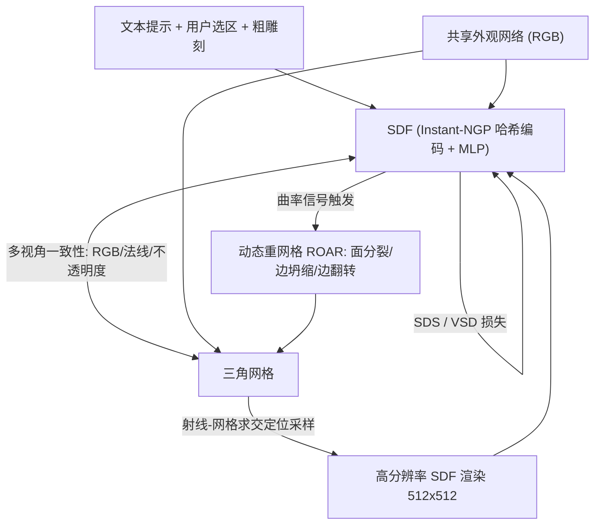

## 一句话总结

MagicClay 提出一种网格与 SDF 联合优化的混合表示，让艺术家能选中网格的局部区域、给一句文本提示，就自动"生长"出符合描述的几何细节，同时严格保持未选区域的几何、纹理与骨骼绑定不变，首次实现对同一网格的可序列化提示式编辑。

## 研究背景

3D 形状生成高度依赖底层表示。近年的神经场表示（NeRF、SDF）对噪声梯度鲁棒、天然适配神经优化框架，在文生 3D 上进展显著；但它们评估代价高（受体渲染分辨率限制），且缺乏几何控制能力——难以让用户定位编辑、施加基于表面的先验（如光滑性），也无法在迭代设计中保留此前赋予的纹理、拓扑等属性。

三角网格则相反：它是工业界主流表示，计算廉价、直观可控，但其自适应、非均匀特性和稀疏梯度使其难以直接用于生成式优化，大形变时不稳定。因此已有工作（如 Magic3D）多采用两阶段流程：先用隐式函数粗生成，再转成网格做精细化或后续编辑。然而两阶段流程易陷入局部极小，且无法扩展到"编辑一个已有 UV 与纹理的网格"这类任务。

MagicClay 的目标是把生成式技术带入传统雕刻工作流：用户用现有笔刷粗略勾勒意图并给出文本，系统据此演化选中部分的几何与三角剖分，全程在原始网格上操作并保留其元数据。

## 方法

### 整体框架

核心是一个**混合隐式-显式表示**：同时维护一个 2-流形三角网格（表面）、一个 SDF（体积），以及一个二者共享的外观网络（编码 RGB 颜色）。两种表示都可微渲染，输出颜色、法线、不透明度三类图。优化时文本引导只注入 SDF，再通过一致性损失和拓扑更新把变化传播到网格；网格则提供表面正则与编辑定位能力，二者互为先验。

### 关键设计 1：借网格加速 SDF 高分辨率渲染

体渲染 SDF 通常每条射线需数百个采样点，是速度与显存瓶颈。由于网格和 SDF 始终保持一致，可用可微网格渲染器高效算出射线与网格的交点，以交点为中心只在其邻域布置极少采样（仅 3 个/射线），即可在 512×512 甚至更高分辨率上渲染 SDF。在这些高分辨率渲染上施加 VSD 损失以捕捉精细细节，同时对 128×128 低分辨率渲染施加常规 SDS，二者结合略微提升效果。

### 关键设计 2：一致性与定位/冻结损失

一致性靠多视角约束：对网格与 SDF 的 RGB 渲染、法线图、不透明度图求 $$L_2$$ 差异（分辨率不同则降采样到低分辨率再比）。

定位编辑分两步：先把非选区网格顶点的梯度清零使其固定；再对 SDF 施加基于采样的冻结损失，鼓励固定顶点附近区域保持不变：

$$s(v_{\text{sampled}}) = 0$$

其中 $$v_{\text{sampled}}$$ 在非优化区域的面上均匀采样。

### 关键设计 3：表示专属正则

利用网格显式性施加拉普拉斯光滑损失，逐顶点定义局部曲率：

$$\delta(x_i) = x_i - \frac{\sum_{j=1}^{N} x_j}{N}$$

其中 $$x_j$$ 是 $$x_i$$ 的 $$N$$ 个邻居；全局光滑损失为

$$L_{\text{smooth}} = \sum_i \lVert \delta(x_i) \rVert$$

采用均匀拉普拉斯而非 cotan 版本，因后者对动态更新中出现的病态三角形更敏感。对 SDF 施加 Eikonal 损失保证其为有效距离场：

$$L_{\text{Eik}} = \sum_x (\lVert \nabla s(x) \rVert - 1)^2$$

此外借鉴 TextMesh 对 SDF 不透明度二值化并施加交叉熵损失，对朝向错误的隐式表面法线施加惩罚。

### 关键设计 4：基于 SDF 的动态拓扑更新

SDS 噪声大，无法像 Continuous Remeshing 那样用 Adam 状态触发拓扑更新。MagicClay 改用 ROAR，以 SDF 作为信号：对每个三角形超采样成 K 个子面，用投影算子把子顶点投到 SDF 的零水平集

$$P(x) = -s(x) \cdot \nabla s(x)$$

得到逼近隐式表面的分片线性面，据其曲率分数决定是否用 $$\sqrt{3}$$ 细分分裂三角形；每条边按其顶点到 1-环平面的二次距离打分，分数低则用 QSlim 坍缩。该过程每次迭代严格降低"最高面分数与最低边分数之差"的能量，具收敛性并保证流形性。着色上采用无需 UV 参数化的 MeshColors 方案，按面积自适应细分每个面来贴合外观网络颜色。

## 实验结果

在"从零文生 3D"任务上与五种方法对比几何质量，指标为文本提示与 25 个多视角渲染之间的 CLIP Score（余弦相似度 ×100，20 条提示基准）。MagicClay 因自带混合表示无需额外抽取网格，在无纹理网格上取得最高分：

| 方法 | T2I 骨干 | 几何表示 | 外观-隐式RGB | 法线-隐式 | 法线-网格(无纹理) |
|---|---|---|---|---|---|
| ProlificDreamer | SD2.1 | NeRF | 22.1 | 21.2 | 20.1 |
| HIFA | SD2.1 | NeRF | 23.2 | 23.1 | 22.0 |
| MVDreams | SD2.1 | NeRF | 25.9 | 25.4 | 24.1 |
| Fantasia3D | SD1.5 | SDF | - | 23.9 | 23.9 |
| TextMesh | DF | SDF | 25.7 | 24.9 | 23.6 |
| **Ours** | DF | SDF | **26.2** | **26.1** | **24.8** |
| 消融 1：无高分辨率渲染 | DF | SDF | 25.8 | 25.2 | 23.1 |
| 消融 2：无低分辨率渲染 | DF | SDF | 22.3 | 21.9 | 21.1 |

消融进一步验证：去掉高分辨率 SDF 渲染、去掉拓扑更新（固定分辨率网格会因过细陷入局部极小、过粗则无细节）、去掉定位/冻结损失（形变会越界破坏原始形状，如"天使翅膀"抹掉了犰狳）都会明显降质。噪声鲁棒性实验表明，在高噪声下网格重建会退化成一团，而 SDF 仍可辨认，混合表示在所有噪声水平上都优于二者单独使用。与 TextDeformer、Latent-NeRF、Vox-E 等编辑方法相比，MagicClay 能加入大尺度复杂几何且严格不改动非选区。

## 亮点与局限

亮点：
- 提出网格+SDF 的混合表示，把 SDF 的抗噪鲁棒性与网格的表面正则、编辑定位能力统一在单步流水线中，几何质量优于同类生成方法。
- 借网格求交定位射线采样，使 SDF 能以每射线仅 3 个采样在 512×512 高分辨率渲染，突破显存瓶颈。
- 首次支持对同一已有网格的局部、可序列化提示编辑，并完整保留未选区的纹理、三角剖分与骨骼绑定，可直接迁移动画。

局限：
- 质量受 SDS 梯度质量制约，各视角把优化拉向不同方向引入噪声，精细细节难以稳定涌现。
- 非交互式：在 A100 上每条提示约需 1 小时，瓶颈在 SDS 损失。

## 延伸思考

作者指出的未来方向是用 inpainting 与深度条件扩散模型加速 SDS 收敛：既然编辑是局部的，渲染图中很多区域本应保持不变，利用这一先验可减少 SDS 固有噪声。更广地看，"隐式负责拓扑演化、显式负责细节与控制并互为正则"的思路，可能适用于其它需要在生成能力与可控编辑之间取得平衡的任务；而把生成式雕刻真正做成交互式工具，仍需在骨干扩散模型效率与单步反馈延迟上有显著突破。
