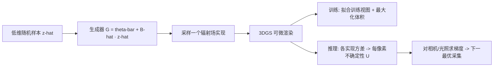

## 一句话总结

把辐射场参数的不确定性建模为参数空间中的一个低维线性流形，用极少的蒙特卡洛采样即可高效训练随机辐射场，并得到可微的不确定性估计，从而对相机视角和光照条件做梯度优化以最优地减少重建歧义。

## 研究背景

从多视角图像重建辐射场是一个病态的逆问题：多个不同的重建结果可以解释同一批观测数据。因此一个稳健的辐射场模型除了给出预测，还应给出对自身认知不确定性（epistemic uncertainty）的度量。作者认为理想的不确定性估计应同时具备三个性质：对所有场景属性给出高质量、表达力强的估计；计算高效不拖累高性能管线；并且可微，从而能通过优化视角、光照等后续采集条件来系统性地提升模型置信度。

已有方法大致分两类。随机式方法在训练中显式优化属性分布（常用变分推断），但往往需要大量采样才能得到稳定估计，效率低；另一类在训练完成后用拉普拉斯近似估计不确定性，结果较粗糙，且由于依赖自动微分，要得到可微不确定性需要计算高阶导数，实践困难。核心难点在于辐射场参数动辄上百万维，完整协方差矩阵不可行，而假设所有参数完全独立又会带来过大的方差。

## 方法

整体框架是一个基于 3D Gaussian Splatting（3DGS）的随机辐射场：把所有可训练参数 $$\boldsymbol{\theta}\in\mathbb{R}^{d_\theta}$$ 都视为随机变量，从参数联合分布中采样即可渲染出辐射场的不同实现。训练与不确定性估计都需要对这些实现做积分，作者用蒙特卡洛采样来估计。关键创新是：把参数分布的支撑体 $$V$$ 限制在一个低维线性流形上，使得只需极少采样就能得到稳定、几乎无噪声的梯度。

**均匀先验的随机辐射场。** 用变分推断框架，将参数分布 $$p(\boldsymbol{\theta})$$ 近似为在紧致超体 $$V$$ 上的均匀分布：

$$
p(\boldsymbol{\theta})=\begin{cases}\frac{1}{\vert V\vert } & \boldsymbol{\theta}\in V,\\ 0 & \text{else.}\end{cases}
$$

选择均匀先验而非高斯先验，是因为高斯先验假设均值附近概率更高；而在单视角等情形下，高斯基元沿深度方向的分布不应对称集中于某个深度，遮挡区域的颜色也应等概率取任意值。训练目标同时鼓励所有实现都拟合训练数据、并让体积尽量大：

$$
\mathcal{L}=\sum_{i=1}^{N_\mathcal{T}}\int_{\boldsymbol{\theta}^*\in V}\big\lVert C_{\boldsymbol{\theta}^*}(\mathbf{r}_i,\boldsymbol{\xi}_i)-C_i\big\rVert\, d\boldsymbol{\theta}^*-\lambda\vert V\vert .
$$

**流形采样（核心贡献）。** 用线性模型生成参数样本，一般形式为 $$G(\mathbf{z})=\bar{\boldsymbol{\theta}}+B\mathbf{z}$$，其协方差为 $$\Sigma=BB^{T}$$。完整的 $$B$$ 规模随参数数量平方增长，不可行；对角化（假设完全独立）表达力太弱，块对角需要针对表示做独立性假设。作者观察到不确定性体的自由度远少于参数量，因此把 $$V$$ 建模为 $$d_\theta$$ 维空间中的 $$k$$ 维线性流形（$$k\ll d_\theta$$）：

$$
G(\hat{\mathbf{z}})=\bar{\boldsymbol{\theta}}+\hat{B}\hat{\mathbf{z}},\qquad \hat{B}\in\mathbb{R}^{d_\theta\times k},\ \hat{\mathbf{z}}\in\mathbb{R}^{k},
$$

对应低秩协方差 $$\hat{\Sigma}=\hat{B}\hat{B}^{T}$$。实践中取 $$k=2$$ 即足够。这样只需 $$(k+1)\times d_\theta$$ 个参数，计算高效，且低有效维度让蒙特卡洛估计几乎无噪声。

**训练细节。** 最终目标把生成器代入蒙特卡洛估计：

$$
\mathcal{L}_{\text{manif}}=\sum_{i=1}^{N_\mathcal{T}}\frac{1}{M}\sum_{\hat{\mathbf{z}}\sim\mathcal{U}([-1,1]^k)}\big\lVert C_{G(\hat{\mathbf{z}})}(\mathbf{r}_i,\boldsymbol{\xi}_i)-C_i\big\rVert-\lambda\lVert\hat{B}\rVert_1.
$$

用 $$\hat{B}$$ 的逐元素 L1 范数作为体积的替代度量（L1 提供恒定梯度，避免梯度消失/爆炸）。为防止 $$\hat{B}$$ 列向量退化线性相关，将其初始化为小正值、经 ReLU 后乘以固定随机符号。得益于流形采样，训练时每次迭代只需 $$M=1$$ 个样本即可稳定收敛，且不增加迭代次数；体积最大化项每十次迭代才施加一次（$$\lambda=1$$，其余置零）。

**可微不确定性优化。** 每视图的不确定性为各实现渲染色相对均值的方差：

$$
U_{\text{manif}}(I(\boldsymbol{\xi}))=\sum_{\mathbf{r}\in I}\frac{1}{M}\sum_{\hat{\mathbf{z}}\sim\mathcal{U}([-1,1]^k)}\big\lVert C_{G(\hat{\mathbf{z}})}(\mathbf{r},\boldsymbol{\xi})-\bar{C}(\mathbf{r},\boldsymbol{\xi})\big\rVert^{2},
$$

推理时用 $$M=2$$。该式对相机位置（经射线 $$\mathbf{r}$$）与辅助参数 $$\boldsymbol{\xi}$$ 平凡可微，因此可用 Adam 做基于梯度的下一最优视角/光照优化，无需在高维空间枚举候选。

## 实验结果

在 NeRF Synthetic 数据集上做主动相机规划：从单相机起步，每 2000 次迭代加入一个相机。作者方法的三种变体（Sel. 逐候选选最高不确定性、Opt. Sel. 在此基础上可微优化、Opt. Rnd. 随机初始化优化）与多种基线比较，报告十次运行、八个场景平均的均值±标准差。

| Method | PSNR↑ (5 cam) | SSIM↑ (5 cam) | LPIPS↓ (5 cam) | PSNR↑ (10 cam) | SSIM↑ (10 cam) | LPIPS↓ (10 cam) |
|---|---|---|---|---|---|---|
| Farthest Point | 21.91 ± 0.03 | 0.836 ± 0.001 | 0.139 ± 0.001 | 25.77 ± 0.05 | 0.899 ± 0.001 | 0.087 ± 0.001 |
| ActiveNeRF | 21.87 ± 0.48 | 0.831 ± 0.010 | 0.144 ± 0.010 | 25.59 ± 0.73 | 0.891 ± 0.011 | 0.093 ± 0.009 |
| FisherRF | 21.24 ± 0.60 | 0.821 ± 0.013 | 0.151 ± 0.012 | 25.89 ± 0.69 | 0.899 ± 0.008 | 0.087 ± 0.007 |
| ACP | 21.09 ± 0.39 | 0.818 ± 0.010 | 0.156 ± 0.009 | 26.20 ± 0.36 | 0.902 ± 0.005 | 0.084 ± 0.004 |
| Ours (Sel.) | 22.38 ± 0.36 | 0.841 ± 0.007 | 0.136 ± 0.006 | 26.99 ± 0.37 | 0.911 ± 0.003 | 0.077 ± 0.003 |
| Ours (Opt. Sel.) | **22.45 ± 0.50** | **0.841 ± 0.009** | 0.140 ± 0.008 | **27.52 ± 0.45** | **0.917 ± 0.005** | **0.076 ± 0.004** |
| Ours (Opt. Rnd.) | 22.02 ± 0.70 | 0.839 ± 0.015 | 0.147 ± 0.012 | 26.78 ± 0.52 | 0.908 ± 0.011 | 0.082 ± 0.008 |

作者方法在所有指标上超过基线：仅用不确定性选择（Sel.）就已超过 state-of-the-art，进一步可微优化（Opt. Sel.）多数情况下再提升质量，且随机初始化（Opt. Rnd.）结果几乎相当，说明优化不易陷入局部最优。在 Mip-NeRF360 上 Ours (Sel.) 同样领先。用全部训练视图训练时，本方法（PSNR 32.11）与原始 3DGS（32.58）质量相当。消融显示低秩方案优于对角/块对角，且 $$k=2$$ 在质量与速度间平衡最佳——比无不确定性的 vanilla 3DGS 仅慢约 14%。

在主动光照规划中，把每个基元的辐射用一个辐射传输矩阵 $$T\in\mathbb{R}^{m\times n}$$（取 $$m=n=16$$）表示，对 16 维 SH 光照条件 $$\boldsymbol{\xi}$$ 可微优化，效果显著优于随机采样和 Sobol 采样等场景无关基线。不确定性质量上用 LF 数据集的 AUSE 评估，在同为 3DGS 表示的对比中优于 FisherRF（平均 0.40 对 0.54）。

## 亮点与局限

亮点：把高维参数不确定性压缩到 $$k=2$$ 的低秩流形，是本文最优雅的观察，既让蒙特卡洛采样几乎无噪声，又使不确定性天然可微（只是渲染实现的均值/方差，无需高阶导数）。由此首次实现对相机参数和高维光照条件的细粒度梯度优化，而非从候选池中挑选。整体只比无不确定性训练慢约 14%，实用性强。

局限：作者指出在 LF 前向场景上 AUSE 不及基于 NeRF 的 Bayes' Rays，可能源于 3DGS 在前向场景的局限以及 NeRF 3D 不确定性场的内在平滑性；只能与同为 3DGS 的 FisherRF 公平比较。方法目前绑定 3DGS 表示，尚未扩展到 NeRF 或其他连续神经表示。用 L1 范数替代真实流形体积也是一种启发式近似。

## 延伸思考

低维流形假设的普适性值得关注：既然辐射场的不确定性自由度远小于参数量，这一低秩结构是否也适用于其他大规模参数模型的不确定性建模（如神经网络权重的贝叶斯近似）？把不确定性做成可微量后，主动采集从"离散选择"变为"连续优化"，这对光台采集、机器人主动扫描等资源受限场景意义重大。后续若能把流形采样推广到 NeRF、Plenoxels 乃至一般连续神经表示，甚至扩展到其他信号模态，可能形成一个通用的可微不确定性框架。
