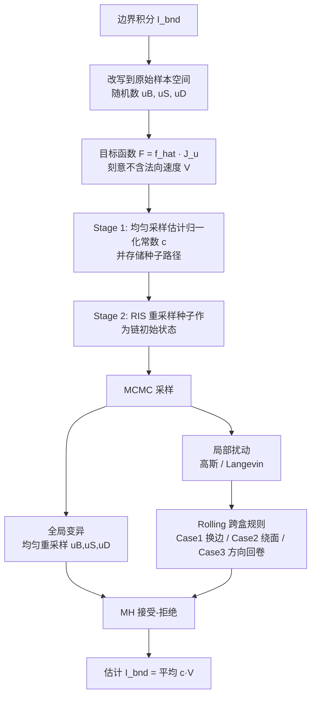

## 一句话总结

针对可微渲染中"边界路径积分"难以采样的问题，本文放弃依赖预计算引导数据结构的做法，改用马尔可夫链蒙特卡洛（MCMC）在原始样本空间（primary-sample space）中直接探索高度碎片化的可见性边界，配合专门设计的局部扰动跳转规则，在高精细网格场景下得到更干净的几何梯度。

## 研究背景

- 领域现状：基于物理的可微渲染要对场景参数（尤其是网格顶点位置这类几何参数）求导，其导数在数学上可拆成"内部积分"与"边界积分"两部分。内部积分与前向渲染同域，可复用成熟采样策略；边界积分则来自可见性等不连续随参数移动而产生，是可微渲染独有且难啃的部分。
- 核心痛点：现有直接采样边界路径的最新方法（如基于层次结构引导、基于投影引导的方案）都依赖在原始样本空间上预计算引导所需的复杂数据结构（kd-tree、octree 等）。当几何被高度细分（highly tessellated）时，原始样本空间变得极度碎片化，加速结构无法准确刻画不连续处的剧烈变化，采样效率随之显著退化。而重参数化类方法虽绕开了直接采样，却要处理散度等难采样量，且往往引入偏差或方差。
- 本文 idea：既然引导结构在碎片化空间里失效，那就干脆不用引导。用 MCMC 在原始样本空间里做探索——关键是设计能"跨越不连续边界"移动的局部扰动规则，让样本在碎裂的目标函数各碎片之间高效游走。由于不需要加速结构，方法对几何复杂度有更好的可扩展性。

## 方法

整体框架：本文聚焦估计微分路径积分中的边界分量 $$I_{bnd} = \int_{\partial\hat{\Omega}} \hat{f}(\bar{p})\, V(p_K)\, d\dot{\mu}(\bar{p})$$。做法是先把这个边界积分改写成原始样本空间上的积分，再用 Metropolis-Hastings 型 MCMC 采样其中的随机数，并针对边界采样的碎片化特性改造局部扰动。

关键设计：

1. **原始样本空间重写与目标函数选择**。边界路径按多方向流程采样：先用三个随机数 $$u_B \in [0,1)^3$$ 采一条"边界射线"（一个数选网格边上的点 $$x_B$$，两个数在共享该边的两面所夹"楔形"中选方向 $$\omega_B$$），再从边界线段两端分别构建光源子路径与探测器子路径。由此边界积分变为原始样本空间上的积分。目标函数刻意取 $$F = \hat{f}(\bar{p})\, J_u$$ 而**不含**标量法向速度 $$V(p_0^D)$$——因为 $$V$$ 可能取负、其求导在渲染时昂贵，且多参数反演时 $$V$$ 会变成向量，难以定义标量目标。$$V$$ 最后通过自动微分 $$\frac{1}{N}\sum_i \mathrm{detach}(c\, n_\partial(p_{0,i}^D)) \cdot p_{0,i}^D$$ 在估计式中补回。

2. **Rolling：让扰动跨越不连续边界**。核心难点是从 $$u_B$$ 到边界射线的映射充满跳变，普通各向同性高斯扰动 $$T_{local}(u_t \to v) = N(v; u_t, \epsilon I)$$ 一旦越过某条边对应的盒子 $$U(E)$$ 边界就几乎必被拒绝。作者观察到：把 $$u_B$$ 限制在某条边 $$E$$ 对应的轴对齐盒 $$U(E)$$ 内时，到边界射线的映射是连续的；越界才剧变。于是设计确定性跳转规则处理三种越界情形——Case 1（越过第一维界，点要离开当前边）：选一条与顶点相连的相邻边并把扰动点"吸附"过去，同时保持世界坐标下方向 $$\omega_B$$ 不变；Case 2（越过第二维界，方向转出楔形）：让射线绕面滚动到该三角形另一条边上得到新位置；Case 3（越过第三维界，方向角超出 $$[0,2\pi)$$）：因方向映射是周期的，直接从盒子对面重新进入。这些规则完全可逆，保证一一对应，从而保证方法无偏。

3. **Langevin 蒙特卡洛与步长缩放**。在 Rolling 基础上引入 LMC（类似 Luan et al. 2020），把局部扰动改为利用目标函数梯度的 $$T_{local}(u_t \to v) = N\!\left(v;\, u_t + \tfrac{1}{2}\epsilon \nabla_u \log F(u_t),\, \epsilon I\right)$$，使提议分布自适应目标形状。作者略去了 Adam 预条件（对碎片化目标收益甚微）。此外对步长做非均匀缩放：把标量 $$\epsilon$$ 换成随各维在路径空间中变化率而定的对角矩阵，让原始样本空间的扰动在路径空间上更均匀。

4. **两阶段完整估计器**。第一阶段用普通蒙特卡洛（均匀采样）独立估计归一化常数 $$c = \int_{\partial\hat{\Omega}} \hat{f}(\bar{p})\, d\dot{\mu}(\bar{p})$$，并顺带存下路径作为"种子"（借鉴 NEE 增强种子质量）；第二阶段用重采样重要性采样（RIS）挑出 $$n_{chains}$$ 条种子作为各条马尔可夫链的初始状态，展开采样后按 $$\langle I_{bnd}\rangle = \frac{1}{N}\sum_i c\, V(p_{0,i}^D)$$ 汇总。全局变异与局部扰动按概率 $$\pi$$ 线性组合，实验取 $$\pi = 0.1$$。

## 实验结果

主实验为三个反演渲染场景（Bunny、Dodoco、Lucy）在等样本配置下评估边界项耗时，与两个 SOTA 基线对比：投影引导的 PSDR_proj（Zhang et al. 2023）与路径空间 warped-area 采样 PSDR_was（Xu et al. 2023）。耗时单位为秒（评估边界项所用时间），数据取自原文表格：

| 场景 | 顶点数 | spp | Ours (秒) ↓ | PSDR_proj (秒) ↓ | PSDR_was (秒) ↓ |
|------|--------|-----|-------------|------------------|-----------------|
| Bunny | 40,000 | 13 | 2.15 | 1.95 | 5.54 |
| Dodoco | 100,000 | 23 | 1.08 | 3.30 | 8.38 |
| Lucy | 50,000 | 9 | 1.05 | 2.89 | 5.40 |

可以看到：在顶点数最多、最精细的 Dodoco（10 万顶点）上，本文方法优势最明显（1.08 秒，约为 PSDR_proj 的 1/3、PSDR_was 的 1/8）；在较简单的 Bunny 上则与 PSDR_proj 相当（略慢），但仍显著快于 PSDR_was。这与"引导法在高细分场景退化、而 MCMC 无需加速结构因而更可扩展"的核心论点一致。

其余实验以文字补充：消融实验（Rolling 三档 MH / MH+rolling / full）表明逐步加入 Rolling 与 LMC+步长缩放能持续降低网格误差；关于链数的实验固定总样本为 900,000、逐步增加链数，发现 500–1000 条链在 200/400/600 迭代下综合效率最好，并被用作后续所有反演实验的设置（约一百万总样本、接受率控制在 0.1–0.6）。Lucy、Bunny、Dodoco 三个含镜面/玻璃等复杂光路的反演场景中，本文在等样本下产生更干净的导数图，进而得到更好的形状重建。

## 亮点与局限

- 亮点：
  - 换了个思路——用 MCMC 直接探索碎片化的原始样本空间，摆脱了引导法对复杂加速结构的依赖，在高精细网格上更具可扩展性。
  - Rolling 跨盒跳转规则设计巧妙且可逆，既能让样本穿越不连续边界，又保证了估计无偏。
  - 把 Langevin MC 引入边界采样，并用步长缩放让扰动在路径空间上更均匀，进一步提升效率。
- 局限：
  - 只处理边界积分，内部积分仍用现有方法；如何用 MCMC/LMC 同时高效估计内部积分尚待研究。
  - 强依赖网格拓扑，向体积、隐式或随机几何的推广是开放问题。
  - 初始种子仅用均匀采样获得，种子质量的改进（如结合引导法）尚有空间；对相关性影响的分析也只是初步。
  - 基于 CPU 系统（Enzyme 自动微分）实现，且与 PSDR_proj 用的是不同后端，比较只能在等样本而非严格等时下进行。

## 延伸思考

这篇工作把前向渲染里成熟的 MCMC/PSSMLT/LMC 思想迁移到可微渲染的边界采样上，思路上与 Metropolis Light Transport、Kelemen 型原始样本空间 MLT 一脉相承，核心创新在于"如何在被不连续切碎的空间里定义可逆的跨片移动"。它与松弛边界（把边界扩成薄带）、重参数化 warped-area 等路线形成对照：后者用连续化换低方差但引入偏差，本文则坚持无偏、用 MCMC 换取在复杂几何上的鲁棒性。值得追问的方向包括：能否把该采样器 GPU 化以缩小与投影引导法在简单场景上的差距；能否用现有引导方法为 MCMC 提供更好的初始种子从而"引导+MCMC"互补；以及在向 SDF、体积或高斯等非网格表示推广时，如何重新定义"边界盒"与跨片跳转规则。
