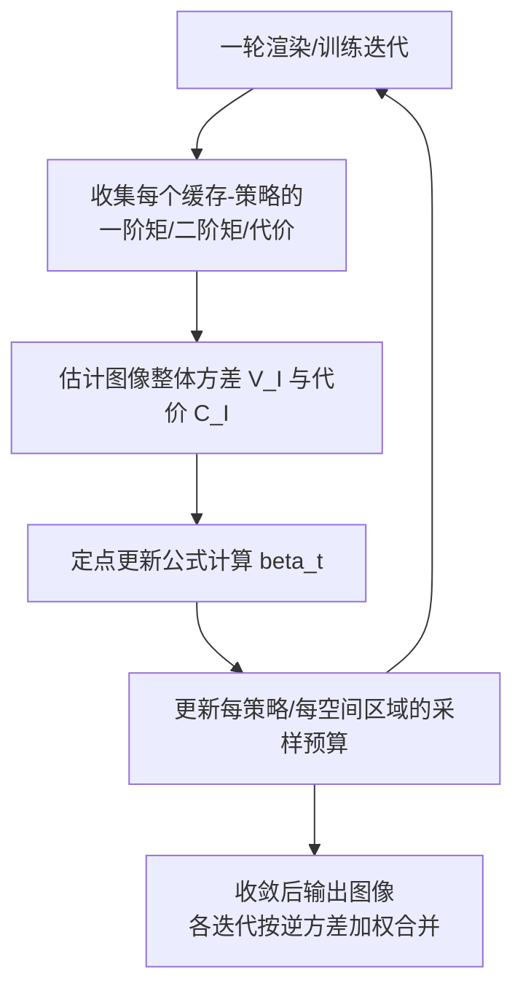

## 一句话总结

MARS 提出了一套面向多重重要性采样（MIS）的多样本预算分配理论：通过一个定点迭代方案，为每个采样策略（BSDF、NEE、引导采样、光路连接等）在空间上单独学习各自的、可连续取值的采样数，从而联合优化俄罗斯轮盘赌（RR）与分裂（splitting），在路径引导与双向路径追踪两个应用上都取得了显著的等时加速。

## 研究背景

蒙特卡洛渲染通过对光路进行采样来估计路径积分：

$$
I_{px} = \int_{\mathcal{P}} f_{px}(\bar{x})\, d\bar{x}
$$

由于没有单一采样分布能在整个定义域上都表现良好，实践中普遍使用 MIS 将多种策略组合起来，取长补短。然而“每种策略应该抽多少样本”这一问题长期缺乏令人满意的自动化方案，通常依赖用户手动调参。

已有工作各有局限（对应原文图 2 中总结的三类）：

- **混合采样（one-sample MIS）**：每步只抽一个样本、只优化策略之间的比例，无法复用路径前缀，也无法在某个交点上局部增加投入。
- **俄罗斯轮盘赌与分裂（RRS，如 EARS）**：能复用路径前缀并优化总样本数，但对所有策略使用相同的分裂因子，无法区分某个策略是否真正有贡献。
- **逐像素的多样本 MIS（如 brute-force 搜索）**：受维度灾难限制，只能优化全局参数或逐像素的布尔决策，无法感知首次弹射之后的空间变化。

作者指出：即便把“最优混合采样”和“最优 RRS”分别做到最好再简单拼接，也无法得到整体最优，二者必须**联合优化**。MARS 的目标正是弥合这道鸿沟。

## 方法

### 整体框架

MARS 把问题建模为：在 $$n_t$$ 个采样策略上，为每个策略分配一个（可空间变化的）连续采样预算 $$\beta_t$$，使整幅图像的效率最大化。多样本 MIS 估计量写作：

$$
\langle I \rangle = \sum_{t=1}^{n_t} \frac{1}{\beta_t} \sum_{s=1}^{\beta_t} \langle I_t(x_{t,s}) \rangle
$$

效率定义为方差与代价乘积的倒数：

$$
E[\langle I \rangle] = \frac{1}{V[\langle I \rangle]\, C[\langle I \rangle]}
$$

其中代价模型为各策略采样数乘以单样本代价再加常量开销：

$$
C[\langle I \rangle] = \sum_{t=1}^{n_t} \beta_t C_t + C_\Delta
$$

方差模型假设各策略互不相关，可拆为各策略方差之和。整个流程是一个**定点迭代**：每一轮渲染收集局部方差、二阶矩与代价估计，代入更新公式求新的 $$\beta_t$$，反复逼近最优分配。

### 关键设计一：连续采样数与随机取整

不再把采样数限制为整数，而是放宽到 $$\mathbb{R}^+$$ 使问题连续化。真正采样时用随机取整函数把实数 $$\beta$$ 概率性地舍入到相邻整数，而估计量仍除以实数 $$\beta_t$$，从而保持无偏。这把 EARS 中“对所有策略统一的分裂因子”推广为“对每个策略独立的预算”。

### 关键设计二：代理（proxy）模型

即便采用平衡启发式，效率关于 $$\beta_t$$ 通常并不凸，因为 MIS 权重会在方差导数中引入耦合项。作者的做法是优化一个**代理目标**：直接丢弃方差导数中与 MIS 权重相关的项，得到简化的导数形式。该代理对“预算无关（budget-unaware）”的权重是最优的；对“预算相关（budget-aware）”的权重其最优点可能偏离真实最优，但实验证明配合该代理的预算相关权重反而稳健地优于理论最优的预算无关分配。

### 关键设计三：定点更新公式

在代理模型下，最小化逆效率得到的最优预算为分段形式（RR 区、分裂区、以及取 1）：

$$
\beta_t = \begin{cases} \sqrt{\dfrac{C[\langle I \rangle]}{C_t} \dfrac{E[\langle I_t \rangle^2]}{V[\langle I \rangle]}} & \text{若 } \beta_t^{RR} < 1 \\[2ex] \sqrt{\dfrac{C[\langle I \rangle]}{C_t} \dfrac{V[\langle I_t \rangle]}{V[\langle I \rangle]}} & \text{若 } \beta_t^{S} > 1 \\[1ex] 1 & \text{其他} \end{cases}
$$

由于 $$\beta_t$$ 也非线性地出现在右侧的 $$C$$ 与 $$V$$ 中，无法解析求解，故沿用类似 EARS 的定点迭代求根，实践中数次迭代即收敛。

### 关键设计四：扩展到路径追踪的空间变化估计

为避免逐像素优化导致过度采样亮区，MARS 对整幅图像的平均相对方差与平均代价构建效率：

$$
E^{-1} = \left( \frac{1}{N_{px}} \sum_{px} \frac{V[\langle I_{px} \rangle]}{I_{px}^2} \right) \left( \frac{1}{N_{px}} \sum_{px} C[\langle I_{px} \rangle] \right)
$$

更新时把路径前缀的通量权重 $$T(\bar{x})$$ 引入，使每个空间区域、每个策略都能获得随路径前缀变化的局部预算。在**路径引导**应用中，局部估计复用引导已有的时空树结构存储各区域各策略的矩与代价，用去噪器提供像素估计 $$I_{px}$$；在**双向路径追踪**中则复用 EARS 的八叉树结构，并把 Mitsuba 的 BDPT 改写为渐进式渲染（各迭代按逆方差加权合并）。为控制方差估计的稳健性，还引入了离群值裁剪、每策略采样数上下限（$$[0.05, 20]$$）等工程处理。

## 实验结果

在路径引导应用中，MARS 与状态最优的 EARS（梯度下降优化混合比例 + EARS 控制样本数）对比，10 个基准场景平均加速 **1.32×**，同时少追踪 17% 的光线。下表摘取原文图 6 中 5 个场景的 relMSE（越低越好，括号内为相对 EARS 的加速比，越高越好），5 分钟等时渲染：

| 场景 | classic RR | EARS（基线） | Ours（预算相关，最优列） |
| --- | --- | --- | --- |
| Living Room | 1.3e−2 (0.48×) | 6.3e−3 (1.00×) | 4.5e−3 (1.39×) |
| Glossy Kitchen | 2.3e−2 (0.56×) | 1.3e−2 (1.00×) | 1.0e−2 (1.27×) |
| Corona Benchmark | 6.1e−2 (0.34×) | 2.1e−2 (1.00×) | 1.4e−2 (1.50×) |
| Bedroom | 6.7e−2 (0.26×) | 1.7e−2 (1.00×) | 1.5e−2 (1.18×) |
| Pool | 1.4e−2 (0.56×) | 7.9e−3 (1.00×) | 5.4e−3 (1.48×) |

在双向路径追踪应用中，MARS 相对应用于 BDPT 的 EARS 平均加速 **1.6×**（少追踪 13% 光线），相对原始 BDPT 加速 **2.6×**；其中 Glossy Kitchen 加速约 74%、Glossy Bathroom 约 79%。两个应用中，预算相关权重都优于预算无关版本（路径引导中预算无关版本表现更差，BDPT 中预算无关版本平均差约 13%）。

## 亮点与局限

亮点：

- 用统一的定点迭代框架把混合采样比例优化与 RRS 总样本数优化**联合**起来，理论上在方差与代价已知时可达最优。
- 决策粒度大幅提升：为每个策略、每个空间区域学习各自随路径前缀变化的连续采样预算，能处理首次弹射之后的空间变化，是逐像素方法做不到的。
- 通用性强，作者在路径引导与双向路径追踪两个不同框架上都验证了稳健且可观的加速，并开源了 Mitsuba 实现。

局限：

- 代理模型对预算相关的 MIS 权重并非严格最优，其最优点可能偏离真实效率最优（作者用一维实验与渲染实验说明偏差可接受）。
- 在平凡场景（如 Cornell Box）中，方法引入的开销可能盖过收益。
- BDPT 中出于组合爆炸的考虑，只对相机路径做分裂/采样分配，光路仍用基于通量的普通 RR；顶点合并、光路缓存、随机连接等更复杂的双向变体留作未来工作。
- 与 EARS 一样，在光泽表面上方差估计存在困难，只是被整体更优的分配所抵消。

## 延伸思考

MARS 的核心洞见是把“抽哪种、抽多少”从两个独立子问题统一为一个可微（经代理近似后可迭代求根）的效率优化问题，这一视角有可能迁移到更广的采样场景：例如为不同长度的光路分别分配预算、或推广到顶点合并与光子映射等混合估计器。另一方面，方法高度依赖局部方差/代价/二阶矩的在线估计质量，如何在噪声更大或样本更稀疏的条件下稳定估计（乃至用神经网络预测这些统计量）是值得探索的方向。此外，代理与真实效率之间的偏差分析，也提示了未来在预算相关权重下寻找更紧致、仍可高效求解的优化目标的空间。
