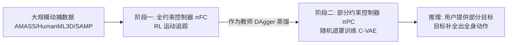

## 一句话总结

MaskedMimic 把物理仿真角色控制统一表述为「运动补全（motion inpainting）」问题：训练单一模型从随机遮罩的部分运动描述（关键帧、任意关节、文本、物体）中还原完整全身动作，从而用一个通用控制器覆盖全身追踪、VR 追踪、路径跟随、摇杆转向、物体交互、文本生成等多种任务，无需为每个任务单独设计奖励和训练。

## 研究背景

物理仿真角色控制希望造出既能听从用户动态指令、又能与场景交互的虚拟角色，应用覆盖游戏、数字人、VR 等。但已有方法存在两条局限：

- **任务专用控制器**：为定位移动、物体交互、VR 追踪等各自训练专门控制器，每个新任务都要重新训练，且高度依赖精心手工设计的奖励函数，容易产生非预期行为。
- **隐空间生成模型**（如 ASE、CALM、PULSE 等）：把动作技能编码进可复用隐空间，再训练高层控制器组合技能。但学到的隐表示往往抽象、缺乏直观语义，用户难以直接控制，仍需为每个新任务额外训练分层控制器。

作者的核心洞察是：动画中的许多任务本质上都可以描述为「给定部分约束，补全其余动作」。因此若训练一个模型专门做「从部分（遮罩）运动描述生成完整动作」，就能获得一个统一、直观的控制接口，并借助多任务联合训练带来正迁移。

## 方法

### 整体框架

MaskedMimic 采用两阶段训练：先用强化学习训练一个「全约束」运动追踪控制器作为教师，再通过行为克隆把它蒸馏成一个「部分约束」的多模态控制器（即 MaskedMimic 本体）。

- **阶段一（全约束控制器 $$\pi_{FC}$$）**：在大型动捕库上用强化学习训练一个 Transformer 结构的全身追踪器，输入完整目标姿态序列 $$g^{full}_t$$、角色当前状态与地形/物体高度图，输出 PD 控制的关节驱动动作。目标是最大化折扣累计回报：

$$
J = \mathbb{E}_{p(\tau\vert \pi)}\left[\sum_{t=0}^{T}\gamma^t r_t\right]
$$

  追踪奖励综合了全局关节位置、全局关节旋转、根部高度、关节线速度/角速度以及能量惩罚：

$$
r_t = w_{gp} r^{gp}_t + w_{gr} r^{gr}_t + w_{rh} r^{rh}_t + w_{jv} r^{jv}_t + w_{jav} r^{jav}_t + w_{eg} r^{eg}_t
$$

- **阶段二（部分约束控制器 $$\pi_{PC}$$）**：把 $$\pi_{FC}$$ 当教师，用 DAgger 在线蒸馏。学生只观测经过随机遮罩函数 $$g^{partial}_t = \mathcal{M}(g^{full}_t)$$ 得到的部分目标，却要复现教师在完整目标下预测的动作，从而学会「补全」。

### 关键设计一：随机遮罩 + 结构化遮罩

遮罩过程随机移除单个目标关节、文本描述、场景信息，让模型学会处理任意组合的部分约束（any-joint-any-time / text-to-motion / object）。关键在于遮罩要**沿时间结构化**：某帧采样的遮罩有一定概率在后续多帧持续，而非每帧重采样。若每帧重采样，跨帧信息会让请求的动作变得不那么模糊，模型反而泛化更差；结构化遮罩保证某些关节连续多帧可见、某些关节始终隐藏，逼近真实用户输入。消融显示去掉结构化遮罩后坐下任务成功率直接归零。

### 关键设计二：带可学习先验的条件 VAE

部分目标是欠定问题（同一约束可对应多种合理动作），因此把 $$\pi_{PC}$$ 建成条件 VAE，包含可学习先验 $$\rho$$、编码器 $$\mathcal{E}$$、解码器 $$\mathcal{D}$$。先验只看部分约束：

$$
\rho\left(z_t \mid s_t, g^{partial}_t\right) = \mathcal{N}\left(\mu_\rho(s_t, g^{partial}_t),\ \sigma_\rho(s_t, g^{partial}_t)\right)
$$

编码器（仅训练时使用，看得到完整目标）被设计为对先验的**残差**，使其分布贴近仅有部分观测的先验：

$$
\mathcal{E}\left(z_t \mid s_t, g^{full}_t\right) = \mathcal{N}\left(\mu_\rho(s_t, g^{partial}_t) + \mu_{\mathcal{E}}(s_t, g^{full}_t),\ \sigma_{\mathcal{E}}(s_t, g^{full}_t)\right)
$$

训练目标是最大化教师动作的对数似然并约束编码器与先验的 KL 散度：

$$
\mathbb{E}\left[\log \mathcal{D}(a \mid s, z) - \alpha D_{KL}\left(\mathcal{E}(\cdot \mid s, g^{full})\ \|\ \rho(\cdot \mid s, g^{partial})\right)\right]
$$

推理时丢弃编码器，直接从先验采样隐变量。消融表明这个**残差先验**至关重要：非残差先验下坐下成功率仅 21.1%。

### 关键设计三：多模态 Token 化 Transformer 与训练技巧

先验用 Transformer-encoder 处理变长多模态输入：每种模态（目标姿态、物体包围盒 8 角点、地形高度图、当前姿态、文本、历史姿态）各有专属编码器 token 化；被遮罩的输入通过 Transformer 掩码机制排除。文本用 XCLIP 视频-语言嵌入以捕捉时序语义。其余训练技巧包括：KL 系数从 0.0001 线性升到 0.01（类 $$\beta$$-VAE 调度）、整段回合固定重参数化噪声以获得时序一致行为、以及提供过去 40 步中采样的 5 帧历史观测以支撑长时文本控制。

## 实验结果

模型在 Isaac Gym 上用 4×A100、16384 并行环境训练约两周，$$\pi_{FC}$$ 约 300 亿步、$$\pi_{PC}$$ 约 100 亿步。数据集聚合 AMASS（关键帧）、HumanML3D（文本）、SAMP（场景交互）。下表为平地全身追踪主实验（Success 为成功率，越高越好；MPJPE 为平均每关节位置误差，单位毫米，越低越好）：

| 模型 | Train Success | Train MPJPE | Test Success | Test MPJPE |
| --- | --- | --- | --- | --- |
| FC (本文全约束教师) | 99.96% | 30.4 | 99.9% | 31.3 |
| PHC+ | 100% | 26.6 | 99.2% | 36.1 |
| MaskedMimic (本文) | 99.4% | 32.9 | 99.2% | 35.1 |
| PULSE | 99.8% | 39.2 | 97.1% | 54.1 |

要点：本文全约束追踪器 FC 相比 PHC+ 在未见动作上把追踪失败率降低了 62.5%，且泛化优于表现出更明显过拟合的 PULSE。在 VR 追踪（仅头+双手）任务上 MaskedMimic 无需专门训练即以显著优势超过 PULSE/ASE/CALM（测试集成功率 98.1%，MPJPE 58.1）。关节稀疏度实验揭示追踪难度层级：脚部最难、手部次之，而骨盆比头/手更易，提示补充骨盆传感器可显著提升动作还原。在多任务（定位移动、转向、伸手）上平地成功率均在 88%~98%；坐物体交互成功率 96.9%，且能泛化到训练未见的物体乃至放在崎岖地形上的沙发。

## 亮点与局限

亮点：

- 用「运动补全」这一统一视角把大量看似不同的角色控制任务纳入单一模型，通过「目标工程」（类比提示工程，用有限状态机在不同目标间切换）无需任务专用训练即可解决新任务。
- 多任务、多环境联合训练带来正迁移，泛化能力优于任务专用与隐空间基线。
- 残差先验 + 结构化遮罩是两个经消融验证的关键设计，缺一显著掉点甚至完全失败。

局限：

- **动作质量**：部分动作有抖动；后空翻、霹雳舞等高难动作难以复现；崎岖地形上倾向沿用标准步态而非规划合适落脚点，缺乏人类式的长时程规划。
- **文本长时推理弱**：对「走四步再举手」这类需长期推理的指令表现不佳，作者推测源于观测历史较短。
- **目标工程依赖人工**：为复杂场景（如人群）设计目标仍费力，作者设想用大语言模型自动化。
- **仅静态场景交互**：尚不能操纵、搬动物体或使用工具，也未涉及多智能体交互。

## 延伸思考

- 「遮罩补全」把生成式建模里被验证过的自监督范式迁移到了物理控制：不需要为每个下游任务定义奖励，而是把「任务」重新表述为「部分观测」，让模型在数据里自然学到条件分布。这种思路可能同样适用于机器人 loco-manipulation（作者后续的 MaskedManipulator 即是延伸）。
- 残差先验的作用值得玩味：它本质上是把「难学的完整目标→隐变量」映射拆成「先验给出部分约束下的基线 + 编码器给出补足偏移」，让先验在推理时独立可用。这种「训练时有额外信息、推理时丢弃」的教师残差结构，对许多需要从稀疏输入还原稠密输出的任务都有借鉴价值。
- 关节稀疏度的难度层级（骨盆比头手更易还原全身）是很实用的工程启示：在 VR/AR 全身重建中增加一个腰部传感器，或用头显信号预测骨盆，可能比增加更多手部信息更划算。
- 当前对文本长时程指令的短板，指向一个开放问题：如何在实时物理控制器里引入更长的记忆或显式规划层，而不牺牲低层控制的鲁棒性与实时性。
