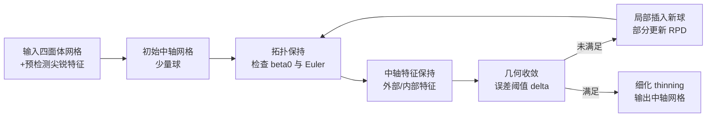

## 一句话总结

MATTopo 提出一种基于体素化受限幂图（volumetric Restricted Power Diagram, RPD）的三维中轴变换计算框架，把"生成中轴网格与输入形状同伦等价"这一全局拓扑约束，转化为对每个受限元素的局部可收缩性检查，从而在同时保证拓扑保持、中轴特征保持与几何收敛的前提下，用远少于以往方法的中轴球数量，鲁棒地处理 CAD 与有机模型。

## 研究背景

中轴（medial axis）是形状的一个低维骨架描述子，定义为到形状边界至少有两个最近切点的球心集合；中轴加上半径函数就构成中轴变换（MAT）。它同时刻画了形状的拓扑等价性与几何凸起，是形状简化、分析、重建等下游任务的基础。

由于精确三维中轴极难计算，主流做法是近似 MAT，但已有方法往往把关键性质当成互相权衡的取舍：

- 体素类方法（如 Voxel Cores）有较强的理论保证，能对 $$C^2$$ 光滑形状做到同伦等价，但在带凸尖锐边和角点的 CAD 模型上几何收敛差、且需极细体素分辨率。
- 点云类方法（Power Crust、SAT、Sphere-Shrinking 等）通常依赖足够稠密的边界采样，其同伦等价性以采样率为条件，且难以保持内部特征（seam/junction）。
- 之前的 surface-RPD 方法 MATFP 首次能保持外部特征（凸尖锐边、角点）和内部特征，几何收敛好，但对生成中轴网格的拓扑不作保证——实验中欧拉示性数会与真值不一致，导致例如"蚂蚁腿断裂"这类下游破坏（用 Q-MAT 简化后仍然断腿）。

本文目标是给出一个既保证与输入形状同伦等价、又能保持中轴特征、并保证几何近似精度的统一框架。

## 方法

### 整体框架

核心洞察：体素化 RPD 是介于输入体积形状与生成中轴网格之间的一个简单而有效的中间结构。给定一组中轴球，RPD 把输入体积剖分为若干受限子区域，而中轴网格 $$M_s$$ 正是该 RPD 的对偶结构（再经细化 thinning）。

RPD 与中轴网格的对偶关系为：

- 受限幂胞（RPC，单球子域）对偶于中轴网格的一个顶点；
- 受限幂面（RPF，两相邻 RPC 的交面）对偶于一条边；
- 受限幂边（RPE，三个 RPC 的交）对偶于一个三角面；
- 受限幂点（RPV，四个 RPC 的交）对偶于一个四面体（最终会被 thinning 剪除）。

基于 Nerve 定理：若一个覆盖的每个有限交集要么为空、要么可收缩，则其 nerve 与被覆盖空间同伦等价。这里输入形状 $$S$$ 是拓扑空间，RPD $$Q(\Gamma)$$ 是它的覆盖，而中轴网格 $$M_s$$ 就是这个覆盖的 nerve。于是全局同伦等价被局部化为：只要每个受限元素（RPC、RPF、RPE）都可收缩，$$M_s$$ 就与 $$S$$ 同伦等价。

判定"可收缩"用两个拓扑指标（假设输入无空腔，故 $$\beta_2=0$$）：

$$
\mathcal{X}(\omega) = \beta_0(\omega) - \beta_1(\omega)
$$

即要求连通分量数 $$\beta_0(\omega)=1$$ 且欧拉示性数 $$\mathcal{X}(\omega)=1$$（后者等价于 $$\beta_1(\omega)=0$$，无环形洞）。

整体流水线：从少量（如 50 个）随机放置、用 sphere-shrinking 生成的中轴球出发，迭代执行三步局部检查与插球，直到拓扑保持与几何收敛都满足：

每次迭代只针对新增球相关的胞做**部分 RPD 更新**，而非重算整张 RPD。

### 关键设计一：局部拓扑保持（CC 数与欧拉示性数）

对每个中轴球 $$m_i$$ 及其相关受限元素做局部检查：

- 若某元素 $$\beta_0>1$$（如某个 RPF 的连通分量为 2，或某个 RPC 断成两块），就在"另一个"连通分量上选一个表面点作为 pin 点，用 sphere-shrinking 插入新球。
- 若某元素 $$\mathcal{X}\neq 1$$（如环面用单球时 RPC 的 $$\mathcal{X}=0$$），则在 RPC 内选取最远的表面三角作为 pin 点插新球。

以环面为例：单球的 RPC 满足 $$\beta_0=1$$ 但 $$\mathcal{X}=0$$；插到两球后 RPC 正常，但其 RPF 出现 $$\beta_0=2$$；需插入第三个球，才让所有受限元素都满足 $$\beta_0=1,\ \mathcal{X}=1$$。

### 关键设计二：分数欧拉示性数（Fractional Euler Characteristic）

难点在于 GPU 上的 RPD 实现通常只算积分或用简单三角网存对偶，不显式保存组合结构，事后重建组合结构代价高。本文提出在 GPU 裁剪（clipping）过程中"顺带"收集欧拉示性数：

- 初始化时，按四面体网格的组合结构给每个顶点/边/面赋一个分数欧拉示性数（被多个单元共享的顶点/边按份额平分，如被两三角共享的顶点记为 $$\tfrac{1}{2}$$）。
- 裁剪时半空间切开三角，新顶点从被切边继承其分数值，新边从被切面继承；对同一个目标球，新生成元素不再继续分摊份额。
- 于是某球 $$m_x$$ 所有受限元素的欧拉示性数可在并行裁剪中即时累加得到。例如某 RPF 由两个凸包 $$A_x,B_x$$ 组成：

$$
\mathcal{X}(A_x)=\Big(1+1+\tfrac{1}{2}+\tfrac{1}{2}\Big)-\Big(1+1+1+\tfrac{1}{2}\Big)+(1)=\tfrac{1}{2}
$$

$$
\mathcal{X}(\omega)=\mathcal{X}(A_x)+\mathcal{X}(B_x)=1
$$

这一策略充分复用了已有的 GPU 体素 RPD 流水线（基于 Ray 等的紧凑半空间数据结构与 Liu 等的 Tet-Cell 裁剪）。

### 关键设计三：特征保持与几何收敛

- **外部特征**：在凸尖锐边上放置零半径 $$T^2_1$$ 球、在角点放零半径 $$T^u_1\ (u\ge3)$$ 球；与 MATFP 不同，本方法从少量非特征球起步，逐步插入零半径特征球，保证所有凸边落在某零半径球的胞内。
- **内部特征**：维护中轴边队列，检查一条边的两端球是否触及相同表面区域（用 RPC 的表面部分判断），对缺失 $$T^3/T^4$$ 球的病态连接插入内部特征球。
- **几何收敛**：对表面采样点计算到最近包络元素（球/锥/slab）的距离，若与包围盒对角线之比超过用户阈值 $$\delta_\epsilon$$，则以该点为 pin 插入新的 $$T^2$$ 球，直到包络体积几何收敛到输入形状。
- **细化**：对偶得到的中轴网格含实心四面体，沿用 MATFP 的几何引导 thinning，按重要度因子 $$\alpha_{ijk}$$（RPE 长度与三球平均直径之比）从小到大剪除 simple pair，CAD 模型停机阈值 $$\sigma=0.3$$、有机模型 $$\sigma=0.1$$。

## 实验结果

在 ABC 数据集前 100 个模型（每个 2048 顶点，与 MATFP 同设置）与 14 个有机模型上评测；实现为 C++/CUDA，硬件 i7-9700K + RTX 2080 Ti。评测指标为欧拉示性数 $$\mathcal{X}$$（与真值 GT $$\mathcal{X}$$ 对比拓扑）与双侧 Hausdorff 距离 $$\epsilon_{max}$$（按包围盒对角线归一化的重建精度）。

与 MATFP 的拓扑保持对比（节选，★为本方法结果）：

| Model ID (GT 𝒳) | MATFP #s | MATFP 𝜖max | MATFP 𝒳 | Ours #s | Ours 𝜖max | Ours 𝒳 |
|---|---|---|---|---|---|---|
| 549 (-6) | 21k | 1.282 | -5 | 7.2k | 1.077 | **-6** |
| 4123 (-3) | 17k | 3.799 | -1 | 5.1k | 1.095 | **-3** |
| 5227 (-5) | 12k | 0.442 | 5 | 3.2k | 1.419 | **-5** |
| 8315 (-4) | 11k | 3.351 | -2 | 1.5k | 1.481 | **-4** |
| 8964 (-72) | 25k | 0.251 | -37 | 8.7k | 0.753 | **-72** |
| 11299 (-24) | 19k | 2.324 | -13 | 5.8k | 0.961 | **-24** |
| 11835 (0) | 21k | 2.252 | -16 | 5.4k | 1.015 | **0** |
| 15094 (-8) | 35k | 1.045 | -4 | 7.2k | 1.462 | **-8** |

本方法在所有列出的模型上都得到与真值一致的欧拉示性数，而 MATFP 均偏离；同时中轴球数量约为 MATFP 的十分之一，重建精度相当甚至更好。

与经典方法在单模型上的对比（GT $$\mathcal{X}=0$$）：PC 用 18k 球得 $$\mathcal{X}=32$$，SAT 用 25k 球得 $$\mathcal{X}=8$$，VC 用 30k 球得正确的 $$\mathcal{X}=0$$，MATFP 用 17k 球得 $$\mathcal{X}=2$$，本方法仅用 3.5k 球即得 $$\mathcal{X}=0$$。有机模型上（如 Fertility）本方法约 4k 球即达到与 PC(14k)/SAT(17k)/VC(36k)/MATFP(11k) 相近的重建精度并保持正确拓扑。运行时间为分钟级（每次 GPU 体素 RPD 计算约 1–3 秒）。

## 亮点与局限

亮点：

- 首个能"自适应、直接"修改中轴网格且无需全局改动依赖结构（体素大小/采样密度）的框架，同时保证同伦等价、中轴特征与几何收敛。
- 用 Nerve 定理把全局拓扑约束局部化为逐元素的可收缩性检查，思路简洁且可并行。
- 分数欧拉示性数可在 GPU 裁剪流程中即时计算欧拉示性数，避免昂贵的组合结构重建。
- 对输入采样密度无假设即可保持生成网格拓扑，且用球数显著更少。

局限：

- 体素 RPD 需在体内用半空间切四面体，比 surface RPD 只切三角更耗时，整体每模型需数分钟；特征保持阶段（外部/内部）尚未充分并行化，是主要耗时来源。
- 当前 GPU 实现对四面体数极大的网格可能失败（如某模型即便用最大长度参数仍超过 550 万四面体）。
- 方法假设输入为单连通、无自交、无空腔的流形四面体网格。

## 延伸思考

- 把"全局拓扑不变量"翻译成"逐单元局部约束 + 局部修补"是一个可迁移的范式：只要能找到合适的中间覆盖结构并诉诸 Nerve 定理，其它几何处理任务（如带拓扑保证的网格简化、层次骨架）或许也能借鉴这种"局部插入原子操作直到指标达标"的迭代思路。
- 分数欧拉示性数本质是把整体组合量拆成可在流式/并行裁剪中累加的份额，这种"随计算即时累计拓扑量"的技巧对其它需要在 GPU 上做拓扑判定的场景（如实时可视外壳、并行网格布尔）有参考价值。
- 运行时瓶颈集中在特征保持阶段而非 RPD 本身，说明未来提速的关键在于把串行的特征检测/插球逻辑并行化；而对超大四面体网格的失败则提示需要分块或层次化的 RPD 计算策略。
