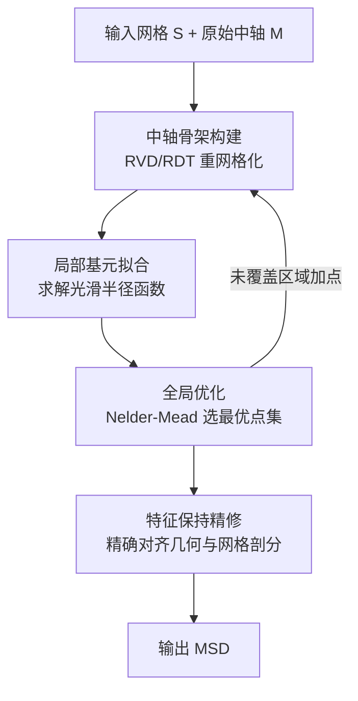

## 一句话总结

提出 Medial Skeletal Diagram（MSD，中轴骨架图）：一种把复杂度从"离散骨架元素"转移到"连续参数"的广义中轴表示，用非均匀、非线性插值的"广义包络基元"极大压缩骨架元素数量，同时保持甚至超过传统中轴的重建精度。

## 研究背景

骨架（skeleton）是理解和操控三维形状的强大工具，广泛用于三维重建、形状分割、角色动画与形状对应。其中中轴（medial axis）及其近似——中轴变换（MAT）——最具代表性：MAT 由一个离散的单纯复形（medial mesh）和定义在每个顶点上的连续半径函数组成，能同时刻画拓扑与几何，并保持同伦性。

但中轴类表示存在一个绕不开的矛盾：骨架结构的**稀疏性**与重建的**完整性**难以兼得。骨架越简单越易解释和编辑，但要忠实重建所有几何细节又需要足够的复杂度。已有大量工作致力于简化中轴的离散部分（Q-MAT、Scale Axis、Coverage Axis、MATFP 等），但简化后的骨架仍受制于过多的元素，且往往以牺牲重建精度为代价。

本文的核心洞见是：中轴离散骨架的复杂度，可以通过增强其连续元素的表达能力来"抵消"。离散元素因组合本质难以优化、易造成计算瓶颈；而连续元素可用成熟的优化框架高效求解。于是作者主动把负担从离散元素数量转移到连续参数数量。

## 方法

### 整体框架

MSD 用一个"广义包络基元（generalized enveloping primitive）"武装的非流形三角网格来表示形状。相比传统中轴使用的均匀、线性插值基元（球、锥、slab），广义基元是非均匀、非线性插值的——例如每个中轴球沿不同方向拥有不同半径，因此能高效覆盖复杂的局部区域（尤其是高曲率尖锐特征），从而大幅减少所需基元数量。传统中轴是其特例。

给定一个封闭流形网格，构建流程如下：

### 关键设计一：广义包络基元

对中轴网格的三类元素（顶点 v、边 e、面 f，记 $$P := \mathrm{cvx}(\{v_k\}_{k=1}^K)$$）定义广义基元。借助 $$\epsilon$$-邻域 $$P_\epsilon$$ 的边界 $$\partial P_\epsilon$$ 的单位法丛，为 $$P$$ 上每点关联一组方向向量 $$d_p(P)$$。给定光滑半径函数 $$r(\cdot): d(P)\mapsto \mathbb{R}^+$$，广义包络基元由隐函数定义：

$$
E_P(x) = \|x - p_x\|_2 - r(d_{p_x}),\quad d_{p_x} = (x - p_x)/\|x - p_x\|_2
$$

其中 $$p_x$$ 是 $$P$$ 上离 $$x$$ 最近的点。当 $$r(\cdot)\equiv \bar{r}$$（均匀、线性插值）时即退化为标准中轴基元。用法丛定义的关键好处是：保证骨架元素始终被包含在基元内部，从而骨架不会跑到形状外部（朴素的"分区域"基元无法保证这一点）。

### 关键设计二：骨架构建（RVD/RDT 重网格化）

从原始中轴 M 上选取一个顶点子集 $$V \subset M$$ 作为约束，对中轴做"重网格化"。构建受限 Voronoi 图（RVD），并取其对偶——受限 Delaunay 三角化（RDT）得到离散骨架。相比逐步网格简化操作（结果依赖操作顺序），RDT 与顺序无关且所需约束顶点数远少于原始中轴。对每个 RVC 修正为单一连通分量；对非零亏格形状（如环面），还需处理"相邻 RVC 共享多个界面"与"骨架元素穿出网格"两种情况，通过加点、约束最短路径重构边与三角形。

### 关键设计三：局部拟合 + 全局优化 + 精修

局部拟合把广义基元离散成三角网格，每个顶点只沿方向 $$d_i$$ 移动距离 $$r_i$$，求解一个二次规划：

$$
r^* = \arg\min_{r\ge 0}\; E_{\text{smooth}}(r) + w\,E_{\text{expansion}}(r),\quad \text{s.t. } r - r_{\max} \le 0
$$

其中 $$E_{\text{smooth}}(r) = r^\top L r$$（图拉普拉斯，防止半径过长、保证局部性），$$E_{\text{expansion}}(r) = \|r - r_{\text{tgt}}\|_2^2$$（推动基元膨胀），约束防止穿透目标网格。因限制变形方向，自由度减少到三分之一，用交替优化平均每个基元仅需 0.08 秒。

全局优化用无梯度的 Nelder-Mead 算法搜索最优点集 $$V^*$$：

$$
V^* = \arg\min_{V\subset M}\; E_{\text{coverage}}(D(V)) + c_1 E_{\text{centrality}}(V) + c_2 E_{\text{count}}(V)
$$

三项分别衡量目标网格的覆盖率（被基元覆盖的顶点面积贡献负能量）、RVC 分布的均匀性（受 Lloyd 松弛启发）、以及对新增顶点数的惩罚。优化采用增量式加点：从极少（甚至 1 个）顶点起步，对未覆盖区域逐步补点。

最后的**特征保持精修**用精确有理算术，让每个基元在靠近目标网格的区域内，几何与网格剖分都与目标"精确匹配"，且保持广义基元定义的一致性。这也使最终重建网格的分辨率只取决于输入网格，而非拟合阶段的密集基元网格。

## 实验结果

在 100 个封闭流形网格（源自 V-HACD、AIM@Shape、McGill 基准）上评估，与 MAT、MATFP、CoACD、LS Skeleton、Point2Skeleton、Coverage Axis 六个基线比较。用两侧平均顶点到表面距离误差 $$\bar{\epsilon}$$ 衡量重建精度。

| 方法 | 离散元素总数 #d (平均) | 连续参数 #c (平均) | 两侧误差 $$\bar{\epsilon}$$ (平均) |
|------|------|------|------|
| MAT | 95,833 | 130,154 | 0.40 (+129%) |
| MATFP | 6,945 | 8,440 | 0.31 |
| LS Skeleton | 114 | 229 | 4.43 (+1324%) |
| Point2Skeleton | 337 | 400 | 2.22 (+615%) |
| Coverage Axis | 632 | 918 | 0.54 (+74%) |
| **Ours (MSD)** | **58** | 94,168 | **0.031 (−90%)** |

MSD 用最少的离散骨架元素（平均 58，比 MATFP 少两个数量级），却取得最低的重建误差，仅为 MATFP 的 10%、MAT 的 7.8%。代价是连续参数更多。补充实验：仅拟合不精修时误差为 0.22（已优于所有基线），精修后再降约 7 倍；重建速度比 MATFP 快 2.4 倍（17.5s vs 41.1s）。压缩比小于 8 时 MSD 精度最优；压缩比超过 8 时 Coverage Axis 反而更好（此时精度更依赖骨架复杂度，而 MSD 骨架偏稀疏）。

作者还展示了多个下游应用：拓扑约束下的形状优化（柔度最小化，比中轴表示平均低 14%）、cut-and-paste 形状生成、网格分解、网格对齐、网格压缩、用户交互设计。

## 亮点与局限

亮点：
- 提出"把复杂度从离散转移到连续"的清晰设计哲学，用广义包络基元统一了从中轴（简单基元+复杂骨架）到星形域（单个复杂基元）的表示谱系。
- 用法丛定义保证骨架始终在基元内部、不跑出形状，理论上优雅。
- 特征保持精修用精确有理算术做到几何与网格剖分的精确匹配，这是现有中轴方法（含 MATFP）缺失的能力。
- 骨架稀疏 + 基元表达力强，使形状生成、拓扑优化等应用变得简单直接。

局限（作者自述）：
- **不保证拓扑保持**：稀疏骨架与保持同伦所需的 $$\epsilon$$-采样密集条件相矛盾，重建形状拓扑可能被破坏。
- **RVD 计算**：用 Dijkstra 算最短路径并非理想，理论上更合适的测地 Voronoi 图（GVD）因中轴非流形而难以计算。
- **中心性与唯一性**：广义基元非凸，难以定义中心性，可能丢失"全局中心性"，且全局最优解不唯一。
- **基元重叠**：相邻基元存在重叠，对形状优化/生成无碍，但在网格分解、物理仿真等需要无交约束的任务中会产生问题。
- **仅线性元素**：当前只用分段线性元素，引入高阶（多项式）曲面元素或可进一步提升表达力。

## 延伸思考

这篇工作最值得借鉴的是它的"复杂度再分配"思路：面对稀疏性与完整性的矛盾时，与其在离散组合空间里硬啃，不如把负担迁移到可微、可高效优化的连续空间。这与神经隐式表示的思想有相通之处——都是用连续函数换取离散结构的简化。

一个自然的问题是：既然 MSD 把大量信息编码进连续半径函数，能否用神经网络直接学习/生成这些广义基元的参数，从而把这套表示接入生成式管线（如扩散模型），实现拓扑可控的三维形状生成？作者已展示了 cut-and-paste 式生成，但更深的神经化仍有空间。

另外，拓扑保持是该方法当前最硬的短板。将其与显式的拓扑约束（如持续同调、link condition）结合，或在稀疏骨架下寻找可证明保持同伦的采样准则，可能是让这类表示走向工业 CAD/仿真可靠使用的关键一步。
