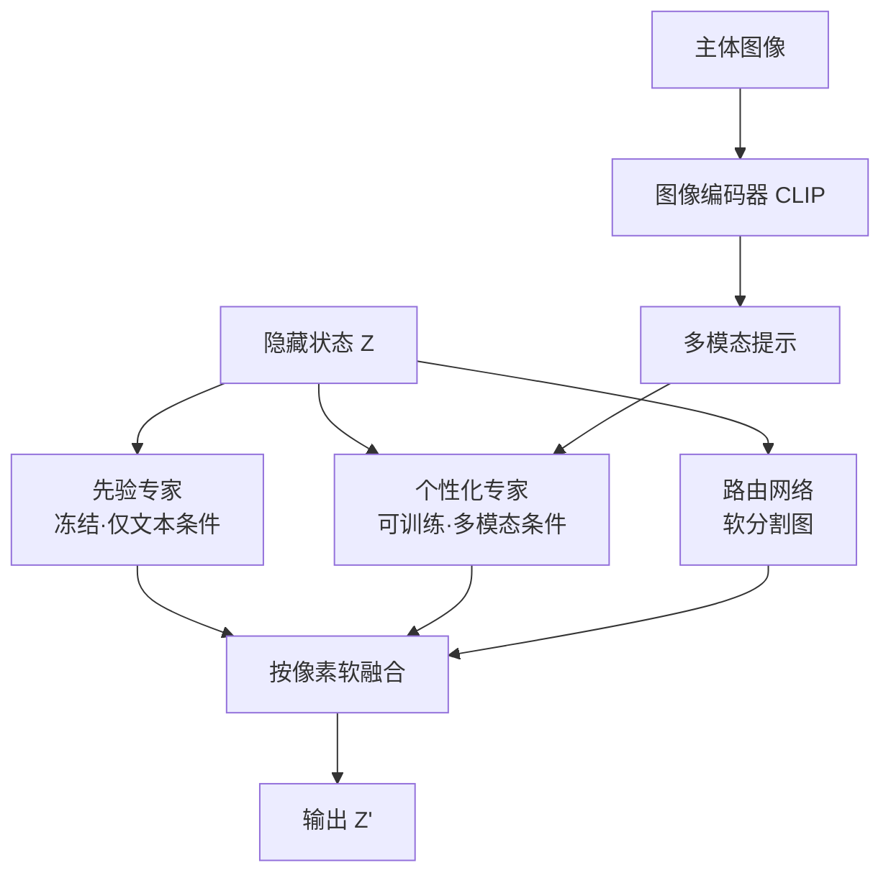

## 一句话总结

借鉴大模型里的混合专家（MoE）思想，把扩散模型的每个注意力层拆成"冻结的先验分支"和"可训练的个性化分支"，再用一个路由网络按像素软融合两者，从而在不破坏原模型生成能力的前提下，实现主体与上下文解耦的多主体个性化图像生成。

## 研究背景

文本到图像扩散模型让"用一句话生成高质量图像"变得触手可及，而个性化（personalization）则希望进一步把用户指定的主体（比如"我和我朋友"）高保真地放进生成结果里。

现有方法的核心痛点在于"先验丢失"。作者把个性化之前的模型称为先验模型（prior model），并指出：基于微调的方法（如 DreamBooth）因为改动了权重，容易过拟合到输入图像的姿态和构图，或难以遵循文本提示；这个问题在多主体场景更严重，个性化后的模型很难生成主体之间自然、多样的交互与构图。即便是针对多主体优化的方法，也往往需要用户额外提供布局控制（分割掩码、边界框、人体姿态），结果显得僵硬、缺乏互动。

作者据此提出三条设计要求：先验保持（生成分布和对文本、随机种子的响应力要像原模型一样丰富）、快速生成（推理式、给新主体不需重新优化）、免布局（不要求用户提供额外的布局控制）。为同时满足这三点，本文提出 Mixture-of-Attention（MoA）架构，把生成的"活儿"分配给个性化分支和非个性化先验分支，让个性化部分只做最小干预。

## 方法

### 整体框架

MoA 把预训练扩散 U-Net 里所有注意力层（自注意力和交叉注意力都算）替换成 MoA 层。每个 MoA 层由两个"专家"和一个路由网络组成：一个从原模型直接拷贝并冻结的先验专家，一个可训练、负责处理图像输入的个性化专家。二者的输出由路由网络按像素软融合。关键在于：主体图像只通过个性化分支注入，而训练时路由被鼓励优先走先验分支，于是最终只有"生成主体所必需的最小信息"才会流向个性化专家，其余像素（背景、上下文）交给先验分支。

### 关键设计一：双专家注意力层

标准注意力用查询 $$Q$$、键 $$K$$、值 $$V$$ 计算 $$Z' = \text{Softmax}(QK^\top/\sqrt{d})V$$。MoA 借用 MoE 的形式，把一层里的输出写成两个注意力专家的软加权：

$$Z_{t,l} = \sum_{n=1}^{2} R^{t,l}_n \odot \text{Attention}(Q^{t,l}_n, K^{t,l}_n, V^{t,l}_n), \quad R^{t,l} = \text{Router}_l(Z_{t,l}).$$

两个专家都用预训练注意力层初始化，先验专家保持冻结，个性化专家参与微调。每层有各自的路由，每个专家有各自的投影矩阵。在交叉注意力层里，两个专家吃的条件不同：先验专家只吃纯文本条件（完全保留先验），个性化专家吃融合了图像的多模态提示。

### 关键设计二：多模态提示注入

给定主体图像 $$I$$，先用预训练图像编码器提取特征 $$f = E_{\text{image}}(I)$$，再把它拼接到对应文本词（比如"man"）的嵌入上，得到多模态嵌入 $$m = \text{Concat}(f, t)$$。这里的巧思是把图像特征绑定到具体文本词、并交给交叉注意力层按原有方式处理，从而既复用了原模型的文本理解与图文组合能力，又让"注入多张图像"变得平凡简单。作者进一步用一个学习到的位置编码，把多模态嵌入按扩散时间步 $$t$$ 和 U-Net 层 $$l$$ 做时空条件化：

$$\bar{m}_{t,l} = \text{LayerNorm}(m) + \text{LayerNorm}(\text{PE}(t,l)).$$

消融显示，去掉这个时空条件会明显削弱身份保持能力。

### 关键设计三：路由损失与只用前景重建损失

路由网络学习逐层、逐时间步的软分割图。训练时用一个损失鼓励背景像素（不属于主体的部分）走先验分支，而前景像素不设显式目标：

$$L_{\text{router}} = \|(1 - M) \odot (1 - R)\|_2^2, \quad R = \frac{1}{\vert \mathcal{L}\vert }\sum_{l \in \mathcal{L}} R^l_0,$$

其中 $$M$$ 是主体前景掩码，$$R^l_0$$ 是第 $$l$$ 层先验分支的路由权重。实践中排除了 U-Net 首尾若干层（它们编码低级特征，与"主体 vs 上下文"关系不大）。

正因为有冻结的先验分支天然负责保先验，MoA 摆脱了以往方法在"全图重建损失（保先验）"与"前景掩码重建损失（保主体）"之间折中的困扰，可以只用前景重建损失。总损失为掩码重建损失、路由损失与借鉴 Fastcomposer 的平衡目标损失之和：

$$L = L_{\text{masked}} + \lambda_r L_{\text{router}} + \lambda_o L_{\text{object}}.$$

## 实验结果

模型基于 Stable Diffusion v1.5，图像编码器用 CLIP ViT-L/14，在 FFHQ 上训练，用 CelebA 的 15 个主体做定量评测。评测指标为身份保持（IP，用 FaceNet 计算生成图与输入图的人脸相似度）和提示一致性（PC，用 CLIP 图文相似度）。单主体设定下的自动化定量结果如下：

| 方法 | 免优化 | IP ↑ | PC ↑ |
| --- | --- | --- | --- |
| ELITE | 是 | 0.228 | 0.146 |
| DreamBooth | 否 | 0.273 | 0.239 |
| Custom-Diffusion | 否 | 0.434 | 0.233 |
| Fastcomposer | 是 | 0.514 | 0.243 |
| Subject-Diffusion | 是 | 0.605 | 0.228 |
| Mixture-of-Attention（本文） | 是 | 0.555 | 0.202 |

作者坦承在自动化指标上只是与 Fastcomposer 等基线打平：MoA 倾向于生成布局更多样、主体更小的图像，而小人脸区域会拉低这类自动指标的得分。但从定性对比看，MoA 生成的图像在构图多样性和主体与上下文的交互上明显更好——比如提示"骑自行车"时，基线里自行车几乎看不见、也没有明显交互，而 MoA 能生成真正的交互场景。

## 亮点与局限

亮点：核心思路优雅，把 MoE 的软路由搬进注意力层，用"冻结先验 + 最小干预个性化"从架构上根除了身份保持与提示一致性之间的取舍。由于对基础模型改动极小、且语义在 U-Net 块之间得到保留，MoA 天然兼容 ControlNet（加姿态控制）、DDIM 反演（真实图像换主体）、风格 LoRA 等既有技术，并解锁了主体替换、主体渐变（对图像特征插值）、时间流逝（对"kid"与"person"词嵌入插值）、多角色叙事等应用。多主体、免布局、单次前向、免测试时微调是它相较此前方法的突出优势。

局限：受底层 Stable Diffusion 限制，难以生成高质量小人脸，而多人交互场景往往需要全身远景、恰恰会产生小脸；对复杂多人交互、计数等组合概念仍力不从心，这源自 SD 和 CLIP 本身的短板；此外由于训练时输入主体与重建目标表情相同，模型把"身份"和"表情"耦合在一起，缺乏基于文本的表情控制能力。

## 延伸思考

这篇工作最有启发的地方是把"个性化"重新框定为"最小干预"问题：不去改动原模型权重，而是在旁边并联一条可训练通路，用可学习的路由决定每个像素该听谁的。这种"冻结主干 + 旁路专家 + 软路由"的范式其实很通用，作者在结论里也点出可以推广到视频、3D/4D 等基础模型上。另一个值得琢磨的点是自动化指标与人类感知的错位——IP/PC 打平甚至不占优，但可控性和多样性上的质变，才是这个架构真正的价值所在，这提醒我们评测个性化生成时不能只看人脸相似度和图文相似度。作者提到的"用视频里不同帧作为输入以解耦身份与表情"，也是一个自然且值得探索的后续方向。
