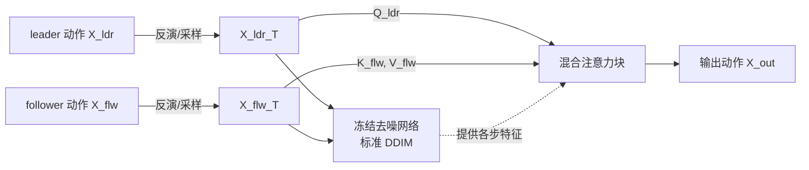

## 一句话总结

通过分析预训练运动扩散模型自注意力层中 Query/Key/Value 的语义分工，MoMo 在推理时以"混合注意力"把领导者（leader）动作的整体轮廓迁移到跟随者（follower）动作上，同时保留后者的细腻风格，实现无需训练、无需配对的零样本运动迁移。

## 研究背景

人体运动合成是机器人、游戏、动画等领域的基础任务，扩散模型已成为主流合成范式。在图像与视频领域，人们已经普遍利用预训练模型权重中蕴含的先验，通过操控注意力层的潜在特征实现零样本编辑。然而运动领域的预训练先验几乎未被探索：

- 图像具有规则的二维空间结构和大量自由度，而运动定义在三维骨架上、只有一维时间轴、自由度少得多，因此图像模型的结论无法直接迁移。
- 现有扩散运动编辑方法大多只在运动特征空间（如旋转角）上操作，受限于固定关节集合或固定操作，且依赖文本控制，难以传达细微的风格差异（motifs）。
- 早期能操控潜在特征的方法诞生于扩散模型之前，无法利用其丰富先验。

作者把运动拆成两个概念：**运动轮廓（outline）**——组织关键动作块的结构化计划（如步伐节奏、迈步时序）；**运动风格（motifs）**——传达情绪与个性的细微姿态与手势。目标是把 leader 的轮廓（"做什么、何时做"）迁移给 follower，同时保留 follower 的 motifs（"怎么做"）。

## 方法

整体框架：MoMo 使用一个冻结的预训练运动扩散模型（实验中采用 MDM 的 Transformer decoder 变体作为骨干）。输入是两段噪声张量 $$X^{ldr}_T$$ 与 $$X^{flw}_T$$（来自真实动作的 DDIM 反演，或从高斯噪声采样）及各自文本提示。输出动作 $$X^{out}_T$$ 用 leader 的初始噪声初始化，并配上 follower 的文本提示。每个时间步 $$t$$，三段噪声动作同时送入去噪网络：$$X^{ldr}_t$$ 与 $$X^{flw}_t$$ 走标准 DDIM 去噪，而 $$X^{out}_t$$ 走"混合注意力"。

关键设计一：自注意力元素的语义分工。作者对自注意力层的 Q、K 特征做 PCA 降维后用 K-Means 聚类可视化，发现轮廓与 motifs 信息虽同时存在于 Q 和 K 中，但**轮廓信息在 Q 中更主导，motifs 信息在 K 中更主导**。具体表现为：Q 中周期性子动作（如迈步）被归入同一簇、且时间信号明显；K 中则按动作风格（走、转身、下蹲）分出不同簇。这意味着不同周期性动作的 Q 特征相似，可被来自其他动作的 K"理解"，从而解释了运动迁移为何可行。有趣的是，Q 在没有像 PFNN 那样显式监督的情况下就编码了运动的相位信息。

关键设计二：混合注意力块（mixed-attention）。回顾自注意力，Q/K/V 由输入隐藏张量 $$IH$$ 线性投影得到，注意力输出为

$$A_n = \mathrm{softmax}\!\left(\frac{q_n \cdot K^{T}}{\sqrt{\vert IH_n\vert }}\right),\quad \hat{h}_n = A_n \cdot V$$

MoMo 在输出动作的自注意力块中，注入来自 leader 的 Query 以及来自 follower 的 Key、Value：

$$OH^{out} = IH^{out} + \mathrm{softmax}\!\left(\frac{Q^{ldr}\cdot K^{flw\,T}}{\sqrt{\vert IH_n\vert }}\right) V^{flw}$$

即用 leader 的 Q 去检索 follower 中语义最相关的 K，再据此加权聚合 follower 的 V。于是输出动作既继承 leader 的轮廓，又保留 follower 的 motifs。实践中该式在扩散步 90→10（共 100 步）、第 2 到 12 层（共 12 层）间应用。

关键设计三：基于注意力的隐式对应。对每个 leader 帧的 Query，在 follower 中激活最高（$$q^{ldr}_n\cdot K^{flw\,T}$$）的帧即为其"最近邻"，实验显示这种对应在语义上自然对齐（如"上升/下降"子动作分别匹配到 follower 的"上升/下降"帧），无需额外监督。

关键设计四：运动反演（motion inversion）。运动领域此前极少使用扩散反演，编辑因而局限于生成动作。MoMo 借助 DDIM 反演，把应用范围扩展到真实与生成动作两类。

## 实验结果

作者构建了运动迁移基准 MTB（HumanML3D 测试集子集，含 842 对 leader-follower 动作），用 FID 评估质量、足部接触相似度评估对 leader 轮廓的遵循、R-precision 与对 follower 位置/旋转相似度评估对 motifs 的保留。

| 模型 | FID ↓ | R-Precision (top3) ↑ | Leader 足接触相似 ↑ | Follower 旋转相似 ↑ | Follower 位置相似 ↑ |
|---|---|---|---|---|---|
| NN 运动空间 | 6.17 | 0.385 | 0.830 | 1.00 | 1.00 |
| + softmax | 11.9 | 0.312 | 0.756 | 0.994 | 0.986 |
| NN 潜在空间 | 3.63 | 0.384 | 0.798 | 0.981 | 0.966 |
| MoST [2024] | 15.2 | 0.240 | 0.824 | 0.207 | 0.227 |
| MDM Inpainting [2023] | 3.51 | 0.213 | 1.00 | 0.244 | 0.329 |
| MoMo Gen.（本文） | **2.33** | 0.439 | 0.816 | 0.993 | 0.972 |
| MoMo Inv.（本文） | 2.50 | **0.490** | 0.793 | 0.933 | 0.856 |

MoMo 在 FID 与 R-precision 上最优，相似度指标可比；相似度最高的基线（如最近邻变体因直接复制 follower 特征）却在 FID 和 R-precision 上明显较差。运行在生成动作上的版本略优于运行在反演动作上的版本。消融实验（约 200 组配置）确认了层 2-12、扩散步 10-90 的最佳范围，并验证输出动作复用 follower 文本提示为最优选择。

## 亮点与局限

亮点：
- 首次揭示运动扩散自注意力中 Q 偏轮廓、K 偏 motifs 的分工，并据此设计混合注意力，属新洞见。
- 完全在推理期工作，无需训练、无需配对数据，可适配任意使用自注意力的运动合成骨干。
- 统一处理风格迁移、空间编辑、动作迁移、分布外（OOD）合成等多种子任务。
- 是唯一利用运动 DDIM 反演的方案，可编辑真实与生成动作。

局限：
- 依赖预训练骨干（MDM）的能力与其数据分布（HumanML3D），骨干的表达上限会传导到输出。
- 运行在反演真实动作上的版本在部分相似度指标上弱于生成版本，反演保真度仍是挑战。
- 缺乏公认统一基线，评测依赖作者自建的 MTB 基准与从各特例改造的对比方法。

## 延伸思考

- Q/K/V 的语义分工是否是运动扩散骨干的普遍属性？在基于 UNet 或不同架构的运动模型中该分工是否依然成立，值得系统验证。
- 该"混合注意力"迁移思路能否推广到多 leader 或多 follower 的组合编辑、乃至时间可变长的长序列拼接场景。
- 反演保真度是制约真实动作编辑的瓶颈，结合更精确的反演技术（如图像域中出现的改进反演方法）可能进一步提升真实动作迁移质量。
- 轮廓与 motifs 的解耦程度目前依赖聚类的经验观察，如何给出更定量、可控的解耦度量，会让迁移强度变得可调。
