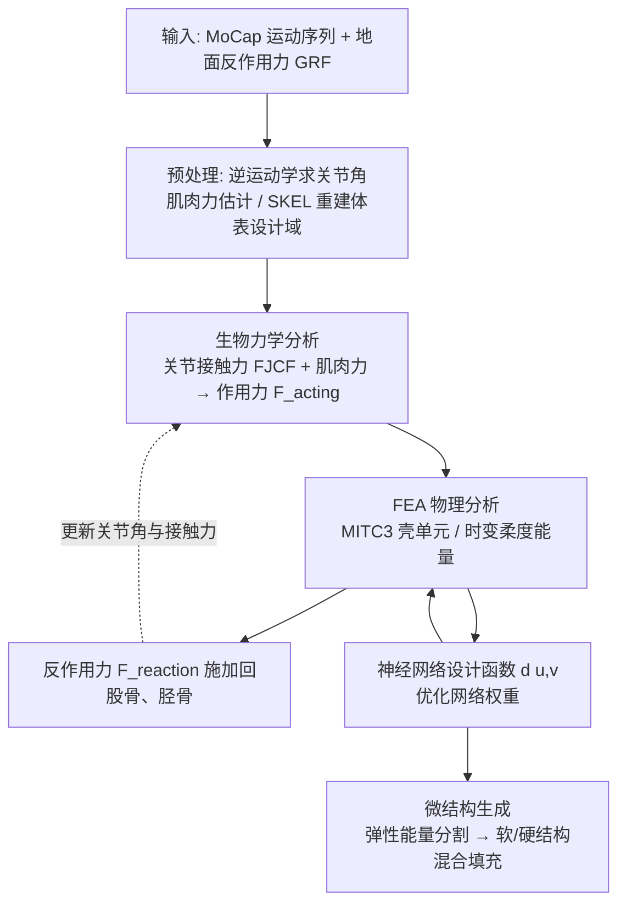

## 一句话总结

给定人体运动捕捉数据与地面反作用力，本文用一个端到端可微管线把"生物力学分析 + FEA 物理分析 + 时变拓扑优化"闭环耦合起来，以神经网络参数化护具表面的弹性分布，自学习得到软/硬微结构的最优布局，从而制造出既能限制额状面（frontal plane）危险旋转、又能保留矢状面（sagittal plane）活动度的个性化预防性护具。

## 研究背景

关节损伤及其长期后遗症是全球性的健康负担，可穿戴的预防性护具（如护膝、护踝）通过限制与损伤风险相关的关节运动来降低受伤概率。一个好的护具需要"限制该限制的、保留该保留的"：例如生物力学研究指出，减小膝关节额状面的外展/内收角、踝关节的内翻/外翻角可降低前交叉韧带（ACL）撕裂和踝扭伤风险；而矢状面上保持充分的屈曲活动度对落地缓冲、保护关节又至关重要。

现有的仿真驱动设计方法通常采用两阶段流程：交替更新生物力学分析的输入（护具设计与反作用力）和物理分析的输入（作用力）。这类方法需要分别开发、再人工迭代整合，难以充分利用拓扑优化来生成"分布式弹性"。核心难点在于：不同的护具设计会产生不同的反作用力，反过来又改变人体的运动学（kinematics）与动力学（kinetics）结果，二者是强耦合的。

本文的核心思路是把整个设计问题写成一个闭环、可微的端到端管线：把护具表面的设计域参数化到一个神经网络上，通过自学习确定网络系数；同时把生物力学分析和 FEA 物理分析紧密耦合——护具在上下边界处产生的反作用力会施加回股骨和胫骨，触发关节接触力和关节角的更新，进而影响下一轮优化。最后用软/硬两种超弹性微结构在同一种硅胶材料上物理实现优化得到的弹性分布。

## 方法

整体管线包含四个主要部分：生物力学分析、物理分析、基于神经网络的设计函数表示、以及微结构生成；此外还有一个生物力学数据预处理环节。

**关键设计 1：时变拓扑优化模型。** 借鉴密度法（SIMP）的思想，设计域 $$d(u,v)$$（类比"密度"）由神经网络参数化，网络系数 $$\theta$$ 即设计变量。运动场景下载荷随时间变化，记为 $$F(t)$$，共 $$N_t$$ 帧（多数按 15 fps 采样，步态例子 60 fps）。优化目标是最小化所有帧中"最坏"的柔度能量：

$$\min_{d}\ \max_{\{t_i\}}\ \left(\tfrac{1}{2}\,U^{T}K(d)\,U\right)$$

约束为 $$K(d)U=F_{acting}(t_i)$$ 与体积约束 $$\sum_{e=1}^{N_l} f_V(d_e)\cdot V_e\le V_0$$。其中 FEA 采用 MITC3 壳单元（能考虑厚度与弯曲），全局刚度矩阵 $$K(d)=\cup_e\big(f_E(d_e)\cdot k_0\big)$$ 由设计变量经杨氏模量函数 $$f_E$$ 调制。实践中用 $$p$$-norm（$$p=20$$）近似跨帧最大柔度。护具反作用力由 $$F_{reaction}(t_i)=K(d)U(t_i)-F_{acting}(t_i)$$ 得到，再回代到 OpenSim 求解器更新关节角与接触力，形成闭环。

**关键设计 2：生物力学作用力建模。** 作用在关节上的净载荷同时考虑被动（关节与体重）和主动（肌肉支撑）成分。通过关节反作用分析（JRA）在 GRF 和护具反作用力下求关节接触力 $$F_{JCF}$$；肌肉建模为折线，用激活度（$$[0,1]$$）估计肌肉力之和 $$\sum F_{mus}$$。总作用力定义为：

$$F_{acting}=F_{JCF}(F_{GRF},F_{reaction})-\sum F_{mus}$$

体表设计域则用 SKEL 参数化人体模型 $$(\beta,q)$$ 从扫描体拟合得到，并用最小二乘保角映射把护具面参数化到 $$(u,v)\in[0,1]$$ 域，圆柱状护具需引入切缝线并约束两侧设计变量一致。

**关键设计 3：单层高斯神经网络设计函数。** 设计函数被定义为单层网络，权重和约束为 1：

$$d(w_1,\dots,w_{N_w})=\sum_{i}^{N_w} w_i\,\psi_i(u,v),\qquad \sum_i^{N_w} w_i=1$$

激活函数取高斯型 $$\psi_i(u,v)=\exp\big(-\sigma^2((u-u_i)^2+(v-v_i)^2)\big)$$（$$\sigma=4.0$$），中心在 $$(u,v)$$ 域上均匀采样。这种少层、非线性的网络（$$N_w=10000$$ 个神经元）便于收敛，网络后接投影把 $$d$$ 限制在 $$[0,1]$$。

**关键设计 4：弹性能量分割与双微结构混合。** 用可压缩 neo-Hookean 模型评估每个单元的弹性能量：

$$W_e=\max_{\{t_i\}}\Big(\tfrac{\mu_e}{2}(I_e(t_i)-2)-\mu_e\log A_e(t_i)+\tfrac{\lambda_e}{2}(\log A_e(t_i))^2\Big)$$

据此用自调谐谱聚类把设计域分为软区（高弹性能量，需柔性）和硬区（低弹性能量，需刚性），分别填入低刚度和高刚度微结构。微结构用周期性隐式函数表示 $$f_M(d,u,v)=d(u,v)-f_{cell}(\hat u,\hat v)$$，杨氏模量-体积比关系用三次多项式拟合。两类结构在边界处按分割图 $$f_{seg}$$ 平滑混合，杨氏模量则按 $$f_{\bar E}=(1-f_{seg})f_{E,soft}+f_{seg}f_{E,firm}$$ 融合。

**损失设计。** 总损失由五项归一化加权组成：关节稳定性 $$\mathcal{L}_1$$（保留矢状角、抑制额状角）、弹性能量密度 $$\mathcal{L}_2$$、柔度 $$\mathcal{L}_3$$、体积分数 $$\mathcal{L}_4$$、切缝连续性 $$\mathcal{L}_5$$：

$$\mathcal{L}_{total}=\omega_1\mathcal{L}_1+\omega_2\mathcal{L}_2+\omega_3\mathcal{L}_3+\omega_4\mathcal{L}_4+\omega_5\mathcal{L}_5$$

权重取 $$\omega_1=0.5,\ \omega_2=0.8,\ \omega_3=0.6,\ \omega_4=0.3,\ \omega_5=0.02$$。其中 $$\mathcal{L}_3$$ 保证足够支撑（控制额状角），$$\mathcal{L}_2$$ 保留矢状面灵活性，二者共同处理"支撑性 vs 活动度"的权衡。

## 实验结果

作者用硅胶（30A 硬度）浇注制造了针对网球发球动作的左膝护具，用 12 台 Vicon 相机的动捕系统做真人试穿，在深蹲（bending）与落地（landing）两个关键时刻对比各种护具条件下的关节角。矢状角越接近无护具越好（保留活动度），额状角越接近 0 越好（关节稳定）。

| 护具条件 | 深蹲-矢状 | 深蹲-额状 | 落地-矢状 | 落地-额状 |
|---|---|---|---|---|
| 无护具（基准） | 0 | 0.825 | 0 | 16.519 |
| 未优化护具（图7b） | 1.413 | 1.990 | 28.141 | 11.39 |
| 未优化护具（图7c） | 78.049 | 4.045 | 33.091 | 7.537 |
| 未优化均匀 Voronoi 结构 | 144.148 | 1.782 | 72.579 | 2.315 |
| 商用护具 | 44.788 | 0.076 | 15.478 | 0.200 |
| **优化护具（本文）** | **1.374** | **0.526** | **0.052** | **1.310** |

本文优化护具在落地时把额状角从无护具的 16.5° 压到约 1.3°（显著提升稳定性），同时矢状角几乎不受限制（接近无护具，落地矢状角 0.052），而商用护具和均匀刚性护具虽也能压低额状角，却明显牺牲了矢状面的屈曲活动度。消融实验表明：去掉柔度损失 $$\mathcal{L}_3$$ 会导致护具上下环之间缺乏高密度连接、支撑不足；去掉弹性能量损失 $$\mathcal{L}_2$$ 则会多出额外高密度区域、限制运动。管线还展示了针对步态的双侧膝护具（提供外侧支撑）和针对网球落地冲击的踝护具（保护足内侧、抑制外翻）。

## 亮点与局限

**亮点：**
- 首次把生物力学分析、FEA 物理分析和时变拓扑优化组合成一个闭环、可微的端到端框架，显式建模了"护具反作用力反过来改变运动学/动力学"这一被以往方法忽略的耦合。
- 用神经网络（单层高斯激活）参数化设计域，天然可微、便于梯度优化，也提供了连续的场表示。
- 把优化得到的连续弹性分布落地为软/硬两类微结构的实际布局，并用同一种硅胶材料浇注制造，真人试穿验证有效。
- 面向"分平面精细控制"的损失设计巧妙处理了支撑性与活动度之间的权衡。

**局限：**
- FEA 所用网格的密度与质量会影响仿真精度。
- 仅把模型简化为软/硬两类区域，引入了显著简化；用更多种类微结构有望进一步改进。
- 护具形状来自 SKEL 模型拟合扫描体，拟合本身会带来误差。
- 分析中忽略了对骨结构的 FEA，也未考虑不同护具弹性引起的反作用力对肌肉力的改变，这些简化可能影响精度。

## 延伸思考

- 闭环耦合生物力学与结构优化的思路可推广到外骨骼、矫形器、运动鞋垫等更广泛的可穿戴力学器件设计。
- 当前把弹性场离散为二元软/硬区域是主要精度瓶颈之一，若能让微结构类型本身也进入连续可微的优化空间（多材料/功能梯度微结构），或能得到更平滑、更贴合力学需求的分布。
- 反作用力对肌肉激活的反馈被忽略，而真实穿戴中肌肉会重新分配发力；把肌肉控制模型（如肌肉驱动的角色控制器）纳入闭环，可能让优化更贴近真实生理响应。
- 验证目前依赖物理试穿而非仿真，因为带微结构护具的肌骨仿真本身很难；发展"护具-人体"耦合的高效可微仿真将是让设计闭环彻底数字化的关键。
