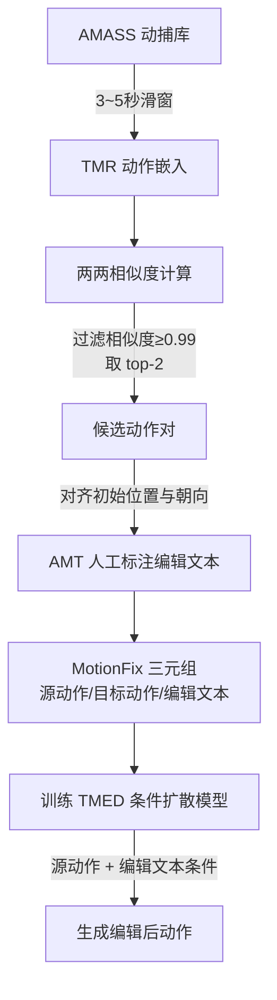

## 一句话总结

本文提出文本驱动的 3D 人体动作编辑任务，通过半自动构建的三元组数据集 MotionFix（源动作、目标动作、编辑文本）训练一个同时以源动作和编辑指令为条件的扩散模型 TMED，能按自然语言指令对已有动作做局部或整体的忠实修改。

## 研究背景

文本已经成为控制人体动作生成的主流方式，但由于高层语言指令天然带有歧义，一次生成往往难以精确对应动画师心中想要的动作，需要后续反复编辑。动作编辑比静态姿态编辑更复杂，可能涉及改变速度、调整循环动作的重复次数、修改某个身体部位的姿态，或编辑某段时间区间。

已有方法各有局限：一类需要手动选择身体部位（如上肢/下肢），只能做局部修改；一类基于时序或空间组合，只能做动作的加减；风格迁移类方法依赖有限的风格标签。这些工作都被限定在特定编辑类型上，无法处理开放式的语言指令编辑。

核心障碍在于缺乏训练数据。与文本图像编辑不同（InstructPix2Pix 可借助成熟的文生图大模型自动造数据），目前没有能忠实泛化到任意文本的 3D 动作生成模型；同时动态编辑比静态图像编辑更复杂，PoseFix 那种基于关节距离的规则化描述方式也无法迁移到动态动作上。本文因此走了一条不依赖生成模型的路线：从已有动捕数据中自动挖掘相似动作对，再由人工描述其差异。

## 方法

整体分两部分：先半自动构建 MotionFix 数据集，再基于三元组训练条件扩散模型 TMED。

关键设计一：基于检索嵌入的候选对挖掘。数据构建的核心难点是找到"足够相似又足够不同"的动作对——差异太大标注者只能重述目标动作，差异太小则无编辑可言。作者用对比训练的动作检索模型 TMR 提取动作嵌入，对 AMASS 中每个动作做动作到动作检索，过滤掉相似度 $$\geq 0.99$$ 的近乎相同对，取 top-2 最相似者进入标注池。相比设定固定阈值（TMR 相似度跨样本不好标定），top-k 选择更稳健。每对动作还对齐初始平移和重力轴朝向，避免标注冗余的平移/旋转差异。最终得到 6730 组三元组，按 80%/5%/15% 划分为 5387/330/1013。

关键设计二：双条件扩散模型 TMED。借鉴 InstructPix2Pix，模型同时以源动作 $$M_S$$ 和编辑文本 $$L$$ 为条件生成目标动作。在扩散过程中对目标动作 $$M_T$$ 逐步加噪得到 $$M_T^t$$，去噪网络 $$D$$ 根据时间步 $$t$$、文本 $$L$$、源动作 $$M_S$$ 和噪声目标 $$M_T^t$$ 预测去噪后的目标动作，训练目标为最小化：

$$
\mathbb{E}_{\epsilon \sim \mathcal{N}(0,1),\, t,\, L,\, M_S}\left[\left\| D\left(M_T^t; t, L, M_S\right) - M_T \right\|\right]
$$

模型直接预测去噪后的目标动作（而非噪声），视觉效果更好。架构上，文本用冻结的 CLLP（ViT-B/32，取全部 77 个 token 输出）编码，源动作和噪声目标动作各经一层共享线性投影，二者拼接时插入可学习的分隔符 SEP 以区分边界，全部输入统一到维度 $$d=512$$ 后送入 Transformer 编码器。

关键设计三：双条件的无分类器引导。将条件概率展开为：

$$
P(M_T \mid M_S, L) = \frac{P(L \mid M_S, M_T)\, P(M_S \mid M_T)\, P(M_T)}{P(L, M_S)}
$$

训练时随机丢弃条件（单独丢源动作 5%、单独丢文本 5%、两者同丢 5%、全用 85%），从而支持对两个条件分别设置引导强度 $$s_{M_S}$$ 和 $$s_L$$。采样时的修正得分估计为：

$$
\tilde{e}_\theta(M_T, s_{M_S}, s_L) = e_\theta(M_T, \varnothing, \varnothing) + s_{M_S} \cdot \left(e_\theta(M_T, M_S, \varnothing) - e_\theta(M_T, \varnothing, \varnothing)\right) + s_L \cdot \left(e_\theta(M_T, M_S, L) - e_\theta(M_T, M_S, \varnothing)\right)
$$

关键设计四：动作表示。用 SMPL 参数序列表示动作，丢弃形状参数取平均体型。全局平移用相邻帧差分表示以获得更平滑的轨迹；从骨盆朝向中分离出 $$z$$ 旋转，将全局朝向分为 $$xy$$ 朝向和 $$z$$ 朝向差分（12 维）；身体姿态用 6D 旋转表示并附加去除 $$z$$ 旋转后的局部关节位置。每帧维度 $$d_p = 207$$（3 维全局平移 + 12 维全局朝向 + 192 维身体姿态），直接回归 SMPL 参数以省去昂贵的后处理优化。

## 实验结果

评测提出了新的动作到动作检索指标：给定生成动作，衡量能否检索回目标动作（generated-to-target，主指标）或源动作（generated-to-source，反映与源的接近度）。用在自有表示上重训的 TMR 作特征提取器，gallery 大小 32，报告 R@1/R@2/R@3 和平均排名 AvgR。基线基于 HumanML3D 文本-动作对训练的 MDM 及其变体（$$S$$ 表示从源动作初始化，BP 表示用 GPT 检测需编辑的身体部位并冻结其余部位）。

| 方法 | 训练数据 | g2t R@1 | g2t R@3 | g2t AvgR | g2s R@1 | g2s AvgR |
|------|----------|---------|---------|----------|---------|----------|
| GT | n/a | 100.0 | 100.0 | 1.00 | 74.01 | 2.03 |
| MDM | HumanML3D | 4.03 | 10.48 | 15.55 | 2.62 | 15.88 |
| MDM$$_S$$ | HumanML3D | 3.63 | 10.08 | 15.64 | 2.62 | 15.84 |
| MDM-BP$$_S$$ | HumanML3D | 38.10 | 54.84 | 6.47 | 60.28 | 4.23 |
| MDM-BP | HumanML3D | 39.10 | 54.84 | 6.46 | 61.28 | 4.21 |
| **TMED** | **MotionFix** | **62.90** | **83.06** | **2.71** | **71.77** | **1.96** |

TMED 在目标检索上以 R@1 62.90 大幅领先所有基线，且 generated-to-source 指标（71.77）接近 GT（74.01），说明它既忠实执行编辑又保留源动作。所有基线中从噪声初始化优于从源动作初始化，基于 GPT 身体部位检测的强基线明显优于朴素基线，但仍显著落后于用三元组训练的 TMED。数据规模消融显示 10%/50%/100% 数据对应 R@1 为 19.25/47.08/62.90，且未见饱和；引导强度消融表明需在两个条件间取得平衡（$$s_L = 2$$，$$s_{M_S} = 2$$ 为最佳），偏向任一极端都会下降。

## 亮点与局限

亮点：提出并定义了文本驱动动作编辑这一新任务；通过挖掘现有动捕数据 + 人工标注差异的方式绕开"无可靠生成模型造数据"的困境，得到首个支持动作编辑训练的三元组数据集；双条件扩散与双向无分类器引导设计让模型能同时听从编辑文本又尊重源动作；提出的动作到动作检索指标为该任务建立了新基准；直接回归 SMPL 参数便于接入动画流程。

局限：模型对长而复杂的编辑文本处理吃力，难以兼顾所有细节；有时忠实执行了文本却偏离源动作（如步幅正确但位置没延续，或蹲下方向相反）；泛化到 TMR 相似度较低（训练中未见）的动作对时表现受限；数据集中 55% 的候选对因"差异太大无法简单描述"被跳过，反映挖掘策略对可编辑对的覆盖仍有边界。

## 延伸思考

这项工作把图像领域 InstructPix2Pix 的"指令式编辑"范式成功迁移到 3D 动作，核心洞见在于用检索嵌入空间来自动定位"可被简洁描述差异"的样本对，这种"以检索代替生成来造编辑数据"的思路对其他缺乏配对数据的编辑任务（如网格、点云、场景编辑）具有借鉴价值。数据规模未饱和的趋势暗示扩大标注可进一步提升，而对长指令和低相似度对的失败也指向未来方向：引入更强的文本理解或分解复杂编辑为多步、结合物理约束以保证编辑后动作的合理性，以及探索交互式的多轮编辑闭环，让动画师能像修图一样迭代打磨动作。
