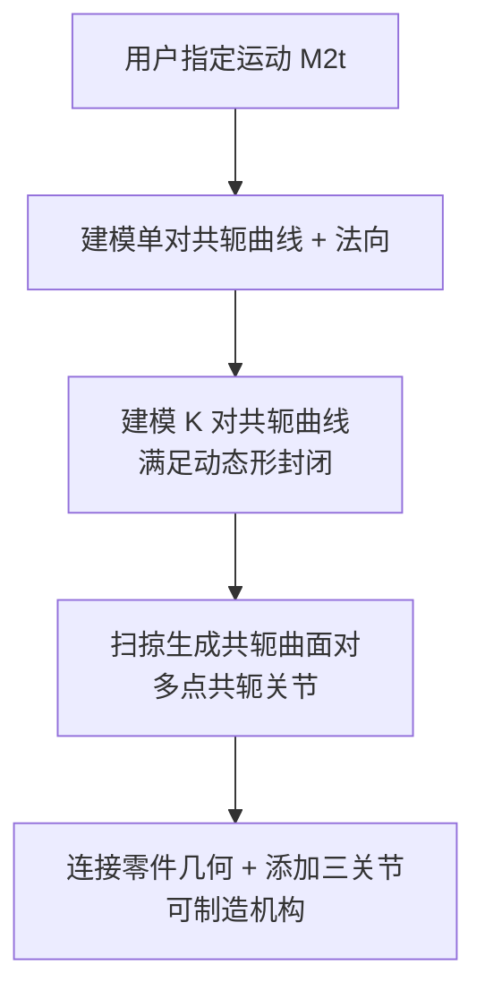

## 一句话总结

提出"多点共轭机构"（mpcMech）——一种仅含两个运动件的新型机构，把一对带多个接触点的共轭曲面建模为驱动-从动关节，并借助新提出的"动态形封闭"条件，用单一驱动电机精确生成用户指定的复杂 3D 运动（最高 3 自由度）。

## 研究背景

机构（mechanism）是由关节连接的运动件组成，用来把输入运动（通常是电机的旋转）转化为期望的输出运动。传统做法要生成复杂运动，必须把连杆、齿轮、凸轮等多个简单形状的零件组合起来，形成拓扑复杂的复合机构。这带来三个问题：装配与维护复杂、各零件制造误差累积导致运动功能退化、整体结构臃肿。

一个新兴思路是把复杂运动"编码"进机构的自由曲面几何，借助 3D 打印低成本制造。近期工作在 3D 凸轮-从动机构、曲面齿轮副等方向做了尝试，但这些机构只能生成复杂度有限的运动，例如 2 自由度运动空间中球面上的路径。

本文从"共轭曲面对"这一新视角切入。根据共轭曲面理论，一对机械零件即是一对始终保持接触、传递相对运动的共轭曲面，接触实体可以是点、线段或曲面片。传统机构主要依赖线共轭（如齿轮副）和面共轭（如转动副）传递运动，而"点共轭"很少被用于人造机构设计（尽管在人体/动物骨骼这类生物机构中存在）。作者的核心想法是：用共轭曲面对之间的**多个共轭点**来传递复杂运动。

面临两大挑战：其一，已有共轭曲面理论只给出点共轭的基本条件，却没有给出"一个曲面能否持续把运动传给另一个曲面"的判据；其二，共轭曲面对要成为可工作的两运动件机构，须同时满足多点共轭、连续运动传递、曲面可制造等多重要求。

## 方法

### 整体框架

mpcMech 由三个零件构成：做 1 自由度周期旋转的**驱动件**（driver）、输出用户指定运动的**从动件**（follower）、以及静止支撑两者的**支撑件**（support）。三个关节中，驱动-支撑关节为转动副，从动-支撑关节决定从动件运动空间（如球面副对应 3 自由度旋转），而核心是**驱动-从动关节**——即维持多个共轭点的多点共轭关节。

按从动件运动类型将机构命名为 mpcMech_$$N_R$$R$$N_T$$T，本文聚焦三类：mpcMech_1R（转动副）、mpcMech_1R1T（圆柱副）、mpcMech_3R（球面副）。

整体建模流程自底向上：

### 关键设计一：动态形封闭条件

作者把共轭曲面对与机器人抓取中的**形封闭**（form closure）建立联系。形封闭指一组静止接触点在不依赖摩擦的前提下完全固定一个刚体。已知结论：固定 $$n_v$$ 自由度的物体至少需要 $$n_v + 1$$ 个接触点。用广义速度 $$u = [v^\top, \omega^\top]^\top \in \mathbb{R}^6$$ 描述刚体的无穷小运动，接触点 $$p_k$$（法向 $$n_k$$）约束的运动集合为

$$U_k = \{u \mid \hat{n}_k \cdot u < 0\}, \quad \hat{n}_k = \begin{bmatrix} n_k \\ p_k \times n_k \end{bmatrix}$$

形封闭要求刚体运动空间 $$U$$ 被所有接触点约束集合覆盖：$$U \subset \bigcup_{k=1}^{K} U_k$$。

作者把它推广为**动态形封闭**：驱动曲面须在整个运动周期 $$t \in [0, T)$$ 的任意时刻都对从动曲面形封闭，

$$U \subset \bigcup_{k=1}^{K} U_k(t), \quad \forall t \in [0, T)$$

对应地，共轭点数须满足 $$K \geq N + 1$$（$$N$$ 为从动-支撑关节自由度数）。该条件可等价重写为一个更利于优化的凸包判据：

$$0 \in \mathrm{interior}\left(\mathrm{conv}(\{\tilde{n}_k(t)\}_{1 \leqslant k \leqslant K})\right), \quad \forall t \in [0, T)$$

其中 $$\tilde{n}_k(t)$$ 是广义法向在 $$U$$ 所张子空间上的归一化投影。这一条件正是把"共轭曲面对"转化为"可工作两运动件机构"的理论基础。

### 关键设计二：单对共轭曲线建模

先把点共轭的四个基本条件（接触点重合、接触法向重合反向、相对速度垂直于公法向、诱导法曲率非负）转成可建模形式。把从动侧共轭曲线 $$c^2_k(t)$$ 建模为 3D 闭合三次 B 样条（8 个控制点），驱动侧曲线与轨迹曲线由接触点重合条件

$$F^2_1 M_1(t) c^1_k(t) = p_k(t) = M_2(t) c^2_k(t)$$

直接导出。曲线上每点附一个单位法向，法向角 $$\{\theta_k(t)\}$$ 用 1D 闭合三次 B 样条（10 控制点）表示以保证法向随时间平滑。通过优化平滑项 $$E_{\text{smth}}$$、切向共线项 $$E_{\text{tang}}$$、法向垂直项 $$E_{\text{norm}}$$、共面项 $$E_{\text{plan}}$$ 得到便于制造的共轭曲线对（用 SLSQP 求解，约束曲线长度控制从动件尺寸）。

### 关键设计三：K 对共轭曲线的联合优化

要让 $$K$$ 对共轭曲线整体满足动态形封闭，作者定义原点到凸包表面的有符号距离 $$\mathrm{dist}(t)$$，并构造两个目标项：$$E_{\text{valiTime}}$$ 统计整个周期内满足条件的时间比例，$$E_{\text{maxDist}}$$ 评估最坏时刻（受抓取质量度量启发）。约束包括每对曲线的广义法向不垂直于运动空间、以及 $$K$$ 对曲线沿 $$z$$ 轴分段不相交以避免干涉。求解策略是：先为每对共轭曲线生成多样候选，再用遗传算法组合出满足动态形封闭的解；从 $$K = N + 1$$ 起逐步增大 $$K$$ 直到可行，并搜索合适的驱动-从动距离 $$d_x$$ 以获得紧凑机构。

最后沿共轭曲线扫掠截面（从动件用半椭圆、驱动件用矩形并按共轭运动逐步"雕刻"出凹槽关节）得到共轭曲面对，再连接各分离部件、添加三个关节，完成可 3D 打印的完整机构。

## 实验结果

作者在 C++ 与 libigl 上实现，在 3.2GHz CPU、16GB 内存的 MacBook 上运行，整体建模耗时 5~24 分钟。用 Ultimaker S5 打印机、tough PLA 材料制作物理样机验证。三类机构的共轭曲线对数量随从动件运动空间自由度升高而增大，且实际所需数量略多于理论下界 $$K \geq N+1$$：

| 机构类别 | 从动-支撑关节 | 从动件运动空间 | 理论最少曲线对数 | 建模所得曲线对数 |
| --- | --- | --- | --- | --- |
| mpcMech_1R | 转动副 | 1-DOF 旋转 | 2 | 3 |
| mpcMech_1R1T | 圆柱副 | 1-DOF 旋转 + 1-DOF 平移 | 3 | 4 |
| mpcMech_3R | 球面副 | 3-DOF 旋转 | 4 | ≥4 |

两组物理实验验证运动学性能：其一，mpcMech_1R 把 1 自由度匀速旋转转为非匀速旋转（前半圈慢、后半圈快，时序比约 2:1），实测从动件连续被驱动且时序比接近设定的 2；其二，mpcMech_3R 生成球面上"八字形"曲线的 3D 运动，物理样机与虚拟结果在四个关键位姿的正视图/侧视图下完全一致。作者也指出样机较简单、运行不够顺滑，可能源于制造公差与摩擦。

此外展示三个应用：单驱动低成本机械手（抓取-翻转-放置盒子）、划桨驱动小船的机构、控制直升机飞行的机械玩具（机构可在驱动轴垂直于地面等不同朝向下工作）。与球面四杆机构对比表明：mpcMech 能沿相同路径生成末端位姿显著变化的运动，与球面连杆机构形成互补。

## 亮点与局限

亮点：
- 首个能生成 2 自由度以上运动空间（含 3 自由度旋转）的两运动件机构，拓扑极简、仅两个运动件。
- 在共轭曲面理论与机器人形封闭之间建立新联系，提出动态形封闭条件，为这类机构提供了坚实的理论判据。
- 把复杂运动编码进自由曲面几何，配合 3D 打印实现精确运动生成，并用物理样机与多个应用验证。

局限：
- 只处理几何与运动学，忽略动力学，无法预测机构可承受的负载。
- 无法保证对任意复杂运动都建模成功——运动过于复杂时共轭曲线几何会过于复杂，导致可制造曲面建模失败。
- 假设输入为 1 自由度周期旋转（单驱动），尚未支持多自由度输入。
- 物理样机运行不够顺滑，复杂机构的良好制造仍是未来工作。

## 延伸思考

- 动态形封闭把"运动传递"重新表述为"随时间连续覆盖运动空间的形封闭序列"，这种把机构学问题借用机器人抓取理论的跨领域视角，很可能推广到其他接触-传动问题（如可重构装配、欠驱动手爪）。
- "用几何复杂度换取拓扑简洁度"是核心权衡：零件数从多降到二，代价是曲面几何变复杂且高度依赖 3D 打印精度，这在承载与耐磨场景下的工程可行性值得进一步研究。
- 作者提出的多点共轭思想已在后续 mpcGear（多点共轭齿轮机构）等工作中延续，将单驱动扩展为多驱动、并与非圆齿轮/高副连杆组合，或能显著扩大可实现的灵巧运动范围。
