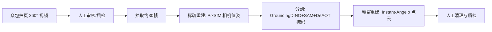

## 一句话总结

MVImgNet2.0 把真实物体多视图数据集从 220k 扩展到 520k 个物体、515 个类别，并借助 360° 拍摄与更强的相机位姿、分割、稠密重建标注流程显著提升数据质量，为大规模 3D 重建模型提供更强的先验。

## 研究背景

深度学习的进步很大程度上由大规模数据驱动，2D 领域已有 ImageNet（约百万图像、1000 类）这样的超大数据集。而 3D 领域受限于采集与标注成本，数据规模长期偏小：合成数据（ShapeNet、Objaverse）存在与真实世界的域差异且高质量样本比例低（Objaverse 约 80 万模型中仅约 10% 用于训练），真实扫描数据（GSO、OmniObj3D 等）规模只有数千到万级。

MVImgNet 首次用手机多视图拍摄的方式构建了约 220k 物体、238 类的大规模真实数据集，但相较 2D 数据集规模仍然偏小，且存在三点不足：多为 180° 视角、前景掩码不够精确、相机位姿误差较大。本文提出 MVImgNet2.0，将规模与类别翻倍，并在采集与标注两方面全面升级，缩小与 2D 数据集之间的差距。

## 方法

整体是一条"众包拍摄 + 半自动标注"的数据构建流水线：拍摄者上传约 10 秒的手机环绕视频，专家清洗员按规则审核，再从每段视频抽取约 30 帧，依次完成相机位姿估计、前景分割、稠密点云重建，最后由人工质检过滤失败样本。

相较 MVImgNet，2.0 的核心升级集中在四个关键设计：

**1. 360° 采集与规模扩展。** 拍摄要求视频尽量覆盖物体 360° 视角（新增 300k 视频中约 230k 为 360°），以支持更完整的形状学习；同时新增 277 个全新类别、扩充 70 个已有类别，使总规模达到 520k 物体、515 类。

**2. 更精确的相机位姿（稀疏重建）。** 用 Pixel-Perfect SfM（PixSfM）替代经典 SfM，通过基于稠密特征的关键点调整与 bundle 调整两步细化，对光滑、少纹理表面的位姿估计尤其鲁棒，经典 SfM 在这类物体上常常失败。

**3. 更准的前景掩码（分割）。** 用"检测—分割—跟踪"三段式流水线替代原来的 CarveKit：先用开集检测器 Grounding-DINO 以类别名作文本提示生成候选框，再用 SAM 以框为提示生成掩码，并按尺寸、到边界距离、连通分量数等初筛，最后用视频跟踪器 DeAOT 引入时序一致性得到精确掩码。

**4. 更高质量的稠密点云（稠密重建）。** 用基于神经表面重建的 Neural-Angelo（工程上采用 Instant-Angelo 实现）替代 COLMAP 的 MVS，将多分辨率哈希编码融入神经 SDF 表示，得到更精确、更完整的点云；仅对 360° 视角物体重建点云。

## 实验结果

实验聚焦 3D 重建。在逐场景重建中，仅替换训练用相机位姿标注（MV1-Anno → MV2-Anno），INGP 与 3DGS 的 PSNR 均显著提升，验证了更高质量的位姿标注。在可泛化（类别无关）重建上，用 LGM（多视图）与 LRM（单视图）对比不同训练数据来源，主实验结果如下：

| 模型 | 训练数据 | PSNR↑ | SSIM↑ | LPIPS↓ |
|------|----------|-------|-------|--------|
| LGM | Objaverse（合成） | 23.59 | 0.932 | 0.050 |
| LGM | MV1-Data | 25.49 | 0.951 | 0.035 |
| LGM | MV2-Data | 26.01 | 0.953 | 0.034 |
| LGM | MV1 + MV2 | 26.41 | 0.956 | 0.032 |
| LRM | Objaverse（合成） | 20.76 | 0.929 | 0.065 |
| LRM | MV1-Data | 21.42 | 0.932 | 0.059 |
| LRM | MV2-Data | 21.97 | 0.935 | 0.056 |
| LRM | MV1 + MV2 | 22.27 | 0.936 | 0.033 |

结论有三点：真实数据训练在真实物体重建上优于合成数据（LGM 约 +1.9dB、LRM 约 +0.7dB）；规模相近时 MV2-Data 因质量更高优于 MV1-Data（两者均约 +0.5dB）；将 MV2 并入 MV1 可进一步涨点。TriplaneGaussian 实验进一步表明 360° 数据 + 更完整点云监督（MV2-Anno）相比 Objaverse 在渲染质量上约 +1.0dB PSNR、Chamfer 距离更低。训练数据因子分析显示：更大规模、更多类别、更高 360° 视角比例都能持续提升 LGM 表现。

## 亮点与局限

亮点：把真实多视图 3D 数据集推到 520k/515 类的规模，接近 2D 数据集量级；360° 采集 + 三项标注全面升级带来实打实的质量提升；用逐场景与大重建模型两类实验系统验证了数据的价值，并拆解了规模/类别/视角三个因子的独立贡献；数据、点云与标注代码将公开。

局限：作者指出排除了建筑等大型物体和动物等难以稳定成像的动态对象；稠密重建的标注质量仍有提升空间；多数视频只围绕单一中心物体，相机轨迹较单调（绕主体环绕），对复杂多物体场景与更复杂轨迹的支持不足。

## 延伸思考

这项工作的价值在于"数据即先验"——它用工程化的众包 + 半自动标注流水线，把真实世界的几何与纹理信息规模化地喂给大重建模型。值得关注的是数据质量与数据规模的权衡：实验中规模相近但质量更高的 MV2-Data 反而更有价值，说明在 3D 领域盲目堆量不如提升标注保真度。未来若能纳入"硬类别"（大型建筑、动态动物）、引入多物体复杂场景与多样相机轨迹，并随稠密重建技术进步持续升级点云标注，这类数据集有望成为通用 3D 重建与生成模型的基础底座。
