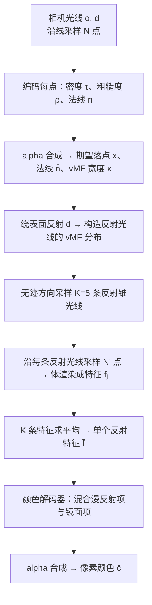

## 一句话总结

不再用一个昂贵的大 MLP 去"记住"每个点在每个视角下的出射光，而是从相机光线的落点**投射反射锥并在 NeRF 几何里做光线追踪**，采样反射到的场景内容特征，再用一个廉价小网络解码成颜色——从而以接近普通视图合成的训练开销，渲染出对远处环境和近处物体都一致、且随视角平滑移动的高质量反射。

## 研究背景

NeRF 在重建和渲染高光泽（specular）物体时一直很吃力，因为这类表面的外观会随视角快速变化。近期工作（如 Ref-NeRF）把出射辐射重参数化为反射方向的函数，显著改善了对**远处环境光照**的镜面反射，但存在两个根本局限：

- **无法渲染近处内容的一致反射**：把出射辐射建模为只依赖反射方向的函数，等价于假设反射的都是无穷远的环境光。当镜面里映出的是场景中较近的物体时，这种假设失效，反射内容不随视角正确移动。
- **依赖大而慢的 MLP**：要在每个点的 MLP 权重里编码"从任意位置看整个环境"的能力，网络容量必须很大，训练和渲染都极慢，难以扩展到带精细反射的真实大场景。

反向渲染（inverse rendering）一类方法虽然物理上更完备，但要在整个半球上做蒙特卡洛积分（几百到几千条采样光线），通常比标准 NeRF 慢几个数量级。

本文的核心洞见是：与其让网络"背下"出射辐射，不如**把光线追踪引入 NeRF 的渲染模型**——反射本质上就是光线打到表面后弹射进场景其它部分，直接追踪这些反射光线就能天然得到近处与远处都一致的反射，同时把每点表达复杂视角函数的负担卸掉。

## 方法

### 整体框架

表示层基于 Zip-NeRF：多尺度哈希网格存 3D 特征，一个极小 MLP（1 层、宽 64）解码密度，一个较大 MLP（3 层、宽 256）解码颜色。关键观察是——查询密度和特征很便宜，真正贵的是解码颜色。于是把昂贵的视角相关外观改成"追踪+廉价解码"：

整个流程只投射少量反射光线（每像素 5 条），且每条反射光线上的查询只需密度与特征、不需重复解码颜色，因此开销可控。

### 关键设计 1：反射锥追踪与 vMF 方向分布

先沿相机光线把量 alpha 合成，得到期望落点与法线：

$$\bar{\mathbf{x}} = \sum_{i=1}^{N} w^{(i)} \mathbf{x}^{(i)}, \qquad \bar{\mathbf{n}} = \sum_{i=1}^{N} w^{(i)} \mathbf{n}^{(i)}$$

再把视线绕法线镜像得到反射方向：

$$\mathbf{d}' = \mathbf{d} - 2(\bar{\mathbf{n}} \cdot \mathbf{d})\,\bar{\mathbf{n}}$$

单条反射光线无法表达非完美镜面，也忽略了 Zip-NeRF 是投射像素锥而非光线。于是把反射光线建模成一个以 $$\mathbf{d}'$$ 为中心的 von Mises–Fisher（vMF，球面高斯）分布，其宽度同时受像素锥半径 $$\dot{r}$$ 和表面粗糙度 $$\bar{\rho}$$ 影响：

$$\bar{\kappa}^{-1} = \dot{r} + \bar{\rho}$$

为让反射锥在表面处的截面与入射锥吻合，需要按粗糙度把反射锥的原点朝表面方向平移：

$$\mathbf{o}' = \bar{\mathbf{x}} - \|\mathbf{o} - \bar{\mathbf{x}}\|\,\frac{\dot{r}}{\dot{r} + \bar{\rho}}\,\mathbf{d}'$$

当粗糙度为 0 时不平移，退化为关于表面的完美镜像。

### 关键设计 2：无迹方向采样估计反射特征

目标是估计 vMF 分布下体渲染特征的期望：

$$\bar{\mathbf{f}}^{\star} = \mathbb{E}_{\boldsymbol{\omega} \sim \text{vMF}(\mathbf{d}', \bar{\kappa})}\big[\bar{\mathbf{f}}(\boldsymbol{\omega})\big] = \int_{S^2} \bar{\mathbf{f}}(\boldsymbol{\omega})\,\text{vMF}(\boldsymbol{\omega}; \mathbf{d}', \bar{\kappa})\,d\boldsymbol{\omega}$$

用蒙特卡洛随机采样太贵（每条样本都要体渲染）。借鉴 Zip-NeRF 的思路，用一小组代表性样本近似——但操作放在 2D 方向域而非 3D 欧氏空间。具体用**无迹方向采样**选 $$K=5$$ 条光线：令 $$\mathbf{d}'_1 = \mathbf{d}'$$，其余放在围绕 $$\mathbf{d}'$$、半径由 $$\bar{\kappa}$$ 决定的圆上，保持均值与集中度。每条光线体渲染成特征后取平均：

$$\bar{\mathbf{f}}(\mathbf{d}'_j) = \sum_{i=1}^{N'} w_j^{(i)}\,\mathbf{f}\big(\mathbf{x}_j^{(i)}\big), \qquad \bar{\mathbf{f}} = \frac{1}{K}\sum_{j=1}^{K} \bar{\mathbf{f}}(\mathbf{d}'_j)$$

### 关键设计 3：方向域的反射特征降权（抗锯齿）

高粗糙度时采样光线之间相距较远，容易产生走样。把 Zip-NeRF 的"特征降权"迁移到方向域，对相对于 vMF 锥过小的体素特征乘一个小系数：

$$\mathbf{f}_{aa}(\mathbf{x}) = \text{erf}\big(\sqrt{8\boldsymbol{\nu}\sigma(\mathbf{x})}\big)^{-1} \odot \mathbf{f}(\mathbf{x})$$

关键差异在于尺度 $$\sigma(\mathbf{x})$$ 的定义。由于大场景要用收缩函数 $$\mathcal{C}$$，Zip-NeRF 用 3D 雅可比会使远处点的 $$\sigma \to 0$$（几乎不降权），导致远处反射严重走样。本文改用**限制在 2D 方向域的雅可比行列式**：

$$\sigma(\mathbf{x}) = \gamma \cdot (\dot{r} + \bar{\rho})\,\|\mathbf{x} - \mathbf{o}'\|\,\sqrt{\det \mathbf{J}^{dir}_{\mathcal{C}}(\mathbf{x})}$$

这样远处点的尺度趋向常数 $$\sigma \xrightarrow{\|\mathbf{x}\| \to \infty} 2\gamma(\dot{r} + \bar{\rho})$$（实验中 $$\gamma = 16$$），从而对远处内容也能正确降权，这对防止远处光照反射走样至关重要。

### 关键设计 4：颜色解码与非对称法线损失

颜色解码器借鉴 UniSDF，用漫反射项与镜面项的凸组合（混合系数 $$\beta^{(i)}$$ 由几何编码器输出）：

$$\mathbf{c}\big(\mathbf{x}^{(i)}, \mathbf{d}\big) = \beta^{(i)}\,\mathbf{c}_v\big(\mathbf{x}^{(i)}, \mathbf{d}\big) + \big(1 - \beta^{(i)}\big)\,\mathbf{c}_r\big(\mathbf{x}^{(i)}, \mathbf{d}'\big)$$

其中镜面项 $$\mathbf{c}_r$$ 吃进反射特征 $$\bar{\mathbf{f}}$$。与 UniSDF 不同的是 $$\beta$$ 作用在 3D 空间而非图像空间，反射特征被广播到相机光线的每个采样点，有利于早期几何模糊时的收敛。

几何上用一个**非对称预测法线损失**，对从几何法线流向预测法线、以及反向的梯度分别配不同权重：

$$\mathcal{L}_{pred} = \lambda_n\,\mathcal{L}_p(w, \mathbf{n}, \text{sg}(\tilde{\mathbf{n}})) + \lambda_{\tilde{n}}\,\mathcal{L}_p(\text{sg}(w), \text{sg}(\mathbf{n}), \tilde{\mathbf{n}})$$

实验用 $$\lambda_n = 10^{-3}$$、$$\lambda_{\tilde{n}} = 0.3$$，让预测法线既贴合密度法线又更平滑，避免过度平滑或欠约束导致法线收敛到错误解。

## 实验结果

主实验在 Ref-NeRF 的 3 个真实场景加作者新采集的 4 个真实场景上评测，指标只统计高光区域（masked metrics）。训练用 8 块 V100，单场景约 100 分钟（Zip-NeRF 约 50 分钟、UniSDF 约 200 分钟）。

| 方法 | PSNR↑ | SSIM↑ | LPIPS↓ |
|---|---|---|---|
| UniSDF | 33.38 | 0.961 | 0.042 |
| Zip-NeRF | 33.09 | 0.960 | 0.041 |
| Ref-NeRF* | 32.59 | 0.957 | 0.042 |
| Ours 单降权锥 | 33.63 | 0.964 | 0.038 |
| Ours 单膨胀锥 | 33.72 | 0.964 | 0.038 |
| Ours 无降权 | 33.63 | 0.964 | 0.038 |
| Ours 用 3D 雅可比 | 33.65 | 0.963 | 0.039 |
| Ours 无近场反射 | 33.30 | 0.962 | 0.040 |
| **Ours（完整）** | **33.91** | **0.965** | **0.036** |

（Ref-NeRF* 是用 Zip-NeRF 的几何/采样/优化流程但保留 Ref-NeRF 外观模型的增强基线。）消融显示：去掉锥追踪只查询无穷远特征就无法重建近场反射；单条反射光线、不降权、或用 3D 雅可比代替 2D 方向雅可比都会让反射变得走样、连带损害表面几何重建。作者同时在 mip-NeRF 360 的 9 个以漫反射为主的场景上验证方法不局限于高光场景，与 SOTA 持平。

作者特别强调：图像误差指标（PSNR/SSIM）受相机标定误差、光照变化等主导，并不足以衡量视角相关外观的质量；本方法真正的优势——反射随视角平滑一致地移动——在补充视频里比数字提升更明显。

## 亮点与局限

**亮点**

- 用光线追踪替代"大 MLP 记忆出射辐射"，是思路上的范式转变：反射的一致性来自几何本身，而非网络容量，因此近场/远场反射都自然正确且随视角平滑移动。
- 只投射 5 条反射光线、反射光线上不重复解码颜色，训练开销与普通视图合成同量级（约 100 分钟），远快于反向渲染类方法。
- 把抗锯齿从 3D 迁移到 2D 方向域的降权设计很关键，专门解决了收缩空间下远处反射走样这一被 Zip-NeRF 忽视的问题。
- 非对称法线损失、独立反射特征、多锥采样三者对准确恢复几何都不可或缺，消融交代得很扎实。

**局限**

- 只从相机光线的**期望落点**发射反射，难以处理半透明表面。
- 相机操作者常映在反射面上，模型未建模这一误差来源。
- 现有图像指标无法充分反映反射运动的真实感，量化提升偏小、主要靠视频定性说明。

## 延伸思考

这篇工作最有启发的地方在于——它把"视角相关外观"这个 NeRF 里一直靠暴力网络容量硬扛的问题，重新识别为一个**光线传输**问题，然后只借一层反射的光追就把一致性问题解决掉了。这提示我们：很多神经场里"学不好"的东西，可能本质是把物理结构塞进了黑箱，显式还原一部分物理反而更省更准。

一个自然延伸是把这套"反射锥 + 方向域抗锯齿"迁移到 3D Gaussian Splatting——GS 渲染更快，但同样苦于近场反射不一致，若能在其上做类似的一次弹射光追，可能是通往实时高光场景渲染的现实路径。另外，作者只做单次反射、只从期望落点出发，如果推广到多次弹射或对透明/嵌套反射建模，就更接近完整的实时可微光线追踪了，但计算与收敛的平衡会是难点。
