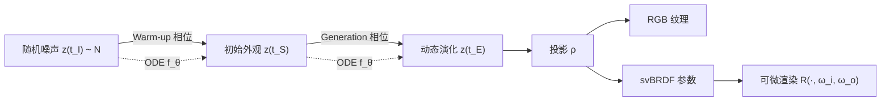

## 一句话总结

用神经常微分方程（Neural ODE）从单个示例视频中"发现"支配动态外观演化的微分方程，从而生成随时间变化视觉统计（如生锈、腐烂、融化、风化）但空间平稳的动态纹理与可重光照的 svBRDF。

## 研究背景

自然界的图案很少是静止的，往往随时间演化，例如落叶变色、金属生锈、蜡熔化。图灵早在 1952 年就用反应-扩散微分方程描述生物图案的形成，图形学也曾借助手工设计的微分方程来合成纹理，但一直缺乏从数据中自动发现这些方程的方法。

以往的动态纹理研究大多把动态纹理拆分为"静态外观 + 运动"两部分（two-stream 方法），假设纹理在时间上是平稳的，目标示例多为海浪、旗帜、火焰这类"外观不变、只有运动"的现象。这类方法无法处理外观本身随时间发生剧变——即形状、颜色的彻底改变、新元素的产生与旧元素的消失——的情况。

本文聚焦于**时间上异构的外观**：每一帧仍是空间平稳的纹理（空间统计均匀），但这些统计量随时间变化。作者指出，仅对逐帧施加损失做逐像素优化无法恢复帧间一致性，即使匹配了运动也不行。因此需要学习一个 ODE 来模拟潜状态的动力学，并将其投影为动态颜色。同时作者进一步把 RGB 动态外观推广到可重光照的 svBRDF。

## 方法

### 整体框架

输入是一段 RGB 图像序列 $$\hat{L}(t): \mathbb{R} \to \mathbb{R}^{3\times H\times W}$$，其视觉特征统计随时间变化；输出是一个时变外观模型 $$L_\theta(t)$$，在区间 $$[t_S, t_E]$$ 内任意时刻都匹配目标。核心思想是：不直接在 RGB 空间建模，而是在一个隐（latent）坐标空间中定义 ODE，再投影到外观。

隐状态序列记为 $$z(t): \mathbb{R} \to \mathbb{R}^{C\times H\times W}$$，其时间演化由一个可学习的神经 ODE 参数化：

$$\frac{dz}{dt}(t) = f_\theta(z(t), t)$$

其中 $$f_\theta$$ 是一个卷积网络，根据当前状态和时间预测状态更新。从初始条件出发通过 ODE 求解器积分得到未来任意时刻的隐状态：

$$z_\theta(t_N) = z(t_I) + \int_{t_I}^{t_N} f_\theta(z(t), t)\, dt$$

### 关键设计一：两相位模拟（Warm-up + Generation）

一个重要创新是 ODE 不从 $$t_S$$ 开始，而是从更早的 $$t_I$$ 开始"预热"，即 $$t_I < t_S < t_E$$。预热相位 $$[t_I, t_S]$$ 从随机噪声 $$z(t_I) \sim N$$ 出发，逐渐演化出 $$t_S$$ 时刻的初始外观，此阶段唯一的监督只有目标的首帧 $$\hat{L}(t_S)$$；生成相位 $$[t_S, t_E]$$ 则复现动态外观的演化。单一 ODE 模型同时承担"去噪"（预热）和"演化"（生成）两项任务，这在生成建模中属首次。若没有预热，视频首帧将只是噪声。

### 关键设计二：隐空间投影与可重光照

投影 $$\rho$$ 把隐状态映射到外观。对 RGB 变体，采用 $$C=3+9$$ 通道，投影仅抽取前 3 个通道：

$$\rho_{\text{RGB}}(z) = Ez$$

其中 $$E$$ 是抽取矩阵。对可重光照的 svBRDF 变体，隐状态有 $$C=9+9$$ 通道，前 9 通道是 svBRDF 参数（漫反射反照率、镜面反照率、两轴粗糙度、法线高度图等），投影耦合了一个可微渲染器：

$$\rho_{\text{svBRDF}}(z) = R(Ez, \boldsymbol{\omega}_i, \boldsymbol{\omega}_o)$$

BRDF 采用 Cook-Torrance 微表面模型（各向异性 GGX 分布、Smith-GGX 几何项、Schlick 菲涅耳近似）外加一个 Lambertian 漫反射叶。

### 关键设计三：在线训练方案与损失

优化目标为：对任意正态初始隐状态，ODE 的解都要在区间内匹配目标：

$$\min_\theta\ \mathbb{E}_{z(t_I)\sim N,\, t_N\sim U(t_S,t_E)}\big[D(L_\theta(t_N), \hat{L}(t_N))\big]$$

直接每次从头模拟到随机时刻代价高昂。作者提出"在线迭代"方案：把积分区间分成小段逐步近似，每次迭代复用上一步的终态作为新的起点，把平均积分时长从超过一半区间降到 $$\frac{t_E - t_S}{R-1}$$（刷新率 $$R=6$$），以牺牲部分梯度精度换取效率。

损失由三项组成：

$$D = w_G D_{\text{Global}} + w_L D_{\text{Local}} + w_I D_{\text{Init}}$$

全局统计 $$D_{\text{Global}}$$ 在 VGG 特征空间用切片 Wasserstein 距离（SWD）度量；局部统计 $$D_{\text{Local}}$$ 对随机裁剪块求和，用于 svBRDF；初始化损失 $$D_{\text{Init}}$$ 用空间随机打乱强制极端平稳性，为 svBRDF 提供良好初始化以消除烘焙光照伪影。三者构成不同程度平稳性约束的谱系，每个训练相位只开启其中一项。

## 实验结果

作者构建了两个新数据集：22 段空间平稳、时变的 RGB 纹理，以及 21 段（另说 14 段真实 + 7 合成）闪光灯拍摄的时变材质视频。评估从**真实感**（Gram / SWD 损失，越小越好）与**时间连贯性**（感知轨迹的"非直线度" Non-Str.，越小越好）两个维度进行。

下表为主实验的数值结果（Table 1，RGB 部分）：

| 方法 | Gram ↓ | SWD ↓ | Non-Str. ↓ |
|------|--------|-------|-----------|
| Gatys | 0.005 | 0.013 | 2.050 |
| Ulyanov | 0.032 | 0.043 | 2.073 |
| Two-stream | 0.006 | 0.015 | 1.777 |
| DyNCA | 3.216 | 1.924 | 1.499 |
| SinFusion | 4.372 | 1.900 | 1.749 |
| **本文** | 0.042 | 0.050 | **0.720** |
| Exemplar（参考） | — | — | 1.531 |

逐帧优化方法（Gatys、Two-stream）在真实感（Gram/SWD）上占优但连贯性差；本文方法在连贯性上遥遥领先，Non-Str. 仅 0.720，甚至比示例视频本身（1.531）更连贯——因为 ODE 的演化特性平滑掉了拍摄中的闪烁、抖动等伪影。svBRDF 部分本文在中心光照和新光照下的真实感均优于 MaterialGAN、Henzler、MatFusion、Look-ahead、Deschaintre 等基线（Non-Str. 0.984，最优）。

用户研究（$$N=15$$）中，RGB 真实感 66% 偏好本文、连贯性 78% 偏好本文；svBRDF 由于对比对象是非生成式的重建方法，本文真实感（25%）略低于 MatFusion（40%），但多样性偏好高达 45%，远超次优的 18%。

## 亮点与局限

**亮点：**
- 首次提出从图像序列中"发现"支配时变外观的微分方程，无需专家先验知识，隐空间自行学习类似化学-物理过程的潜状态。
- 单一神经 ODE 同时完成去噪（预热）与演化（生成），并配以高效的在线迭代训练方案。
- 通过耦合可微渲染，将动态外观推广到可重光照的 svBRDF，并贡献了首个时变材质外观数据集。
- 时间连贯性显著优于逐帧优化与 two-stream 类方法，从根本上避免了闪烁。

**局限：**
- 假设外观空间平稳，对局部性强的现象（如 patina 只在特定区域生长）会被"平稳化"处理，丢失空间特异性。
- 采用参数化 BRDF 模型，无法表达次表面散射等效应（如融化奶酪）。
- 纹理损失只比较视觉统计，不严格保结构，某些规则图案（如陶瓷对角条纹）会被扭曲。
- 每个示例都要单独过拟合训练一个 ODE，未在大数据集上建立通用先验；未做去掉预热相位的消融（作者认为其必要性显而易见）。

## 延伸思考

- 把"外观演化"建模为可学习的微分方程，本质上是让网络去逼近未知的化学/物理动力学。这为可解释的材质老化、风化模拟提供了新思路：隐状态是否能被约束为具有物理意义的量（浓度、温度、湿度），从而实现可控编辑？
- 预热相位统一去噪与演化的思想，与扩散模型有相通之处，但本文不用 score 函数、且中间态即为视频帧。这种"把中间态当作输出序列"的范式或许可推广到一般的生成式视频建模。
- 空间平稳性假设是解耦时空的关键，但也是最大限制。如何在保持连贯演化的同时允许空间非平稳（局部起始、扩散前沿）的外观变化，是值得探索的方向——注意力层的引入（对 RGB 有效）已是一个初步尝试。
- 从"忒修斯之船"的引言可见作者的哲学动机：材质外观剧变而"材质仍是同一个"，寻找光照与时间不变的表示或许有助于理解材质的"本质"。
