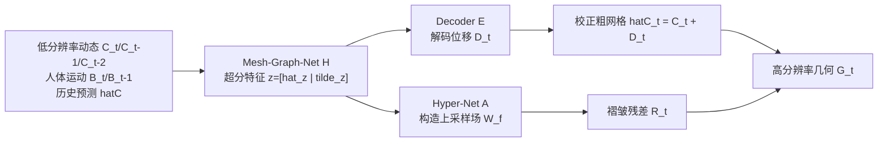

## 一句话总结

用低分辨率布料模拟作为输入，通过 mesh-graph-net 提取超分特征、hyper-net 构造每个粗网格三角形上的连续上采样隐式场，在校正粗网格形状的同时生成高频褶皱残差，从而轻量、高效地把低分辨率布料动态"超分"为带精细褶皱的高分辨率几何。

## 研究背景

高分辨率布料模拟能重现由人体—服装复杂交互产生的精细褶皱，是高视觉质量的关键。但直接提高网格分辨率会带来昂贵的计算开销，也给数据传输与存储带来困难，不适合智能手机等低预算设备。相对地，低分辨率模拟更容易获取、更适合低预算场景。

已有的深度学习方法常把布料形变分解为高、低频分量，或借助法线图作为中间表示来增强上采样后的低频网格；也有工作用基于网格的图神经网络在上采样的高分辨率网格上添加褶皱细节。但这些方法要么依赖法线图渲染与法线引导形变的额外计算，要么直接在高分辨率网格上处理形变，仍然受制于时间开销与几何复杂度。

本文把"高效产出高保真高分辨率几何"重新表述为一个超分辨率任务：以易获取的低分辨率模拟为输入，端到端地重建高频褶皱细节，用于压缩高分辨率数据或加速精细褶皱模拟。

## 方法

### 整体框架

给定低分辨率布料动态序列 $$\{C_t\}$$ 与底层人体运动 $$\{B_t\}$$，GDSR 预测位移 $$D_t$$ 来校正粗网格形状得到 $$\hat{C}_t$$，同时合成褶皱细节残差 $$R_t$$，最终生成高分辨率几何 $$G_t$$。网络由三个模块组成：

方法建立在低、高分辨率网格在 UV 空间中语义 2D 模式的一致性上：高分辨率网格的每个上采样顶点可以用粗网格三角形的重心坐标 $$(u,v)$$ 与三个顶点线性组合表示：

$$S[C,f,u,v] = (1-u-v)c_{f0} + u c_{f1} + v c_{f2}$$

### 关键设计 1：超分特征与人体交互编码

图节点特征不仅包含粗网格顶点的法线、速度、加速度，还显式检测服装—人体交互。对每个粗网格顶点，用射线投射估计的有符号距离场找到最近人体顶点，定义交互向量：

$$p_t^i := \mathrm{ReLU}[\sigma_b - (c_t^i - b_t)\cdot n_t^b]\, n_t^b$$

同时考虑上一帧顶点与人体的交互 $$\hat{p}_t^i$$，并把历史位移 $$d_{t-1}^i$$ 与速度作为节点特征，实现滚动预测。Mesh-Graph-Net 经过 Feature Encoder、Graph Process（消息传递步数 $$S=6$$，2-ring 分层图）、Feature Decoder 三阶段，把 128 维节点特征升到 640 维，再切分为 128 维位移特征 $$\hat{z}$$ 与 512 维细节特征 $$\tilde{z}$$。

### 关键设计 2：粗网格形状校正

考虑到粗网格形状对褶皱细节表现有显著影响，Decoder E（一个 MLP）用三角形三个顶点的位移特征在局部坐标 $$H_f$$ 下解码位移，然后对相邻三角形取平均得到顶点位移：

$$d = \frac{1}{\vert f\vert }\sum_f H_f[\tilde{d}_{f_c}]$$

最终校正网格为 $$\hat{C} = C + D$$。

### 关键设计 3：隐式上采样场生成褶皱残差

Hyper-Net A 用三角形三个顶点的细节特征解码隐式函数参数 $$\{w\}_f = A[\tilde{z}_{f0},\tilde{z}_{f1},\tilde{z}_{f2}]$$，构造连续上采样细节褶皱场 $$W_f$$。每个高分辨率顶点以重心坐标解码褶皱残差 $$r_k = W_f[1-u_k-v_k, u_k, v_k]$$，最终顶点位置为：

$$g_k = S[\hat{C}, f, u_k, v_k] + \hat{H}_f[r_k]$$

其中 $$W_f$$ 是 5 层 MLP，采用复数 Gabor 小波激活函数（Wire，频率控制 $$\omega_0=5$$、扩展控制 $$\alpha_0=10$$），以更好地重建高频特征。

### 关键设计 4：损失与显式碰撞处理

采用 L1 损失。粗网格校正同时约束几何、法线、拉伸与剪切；褶皱细节生成采用基于 UV patch 的策略，并引入预训练 VGG 的法线图特征损失来捕捉更合理的高频褶皱。训练时先设 $$\lambda_c=1.9$$、$$\lambda_w=0.1$$（粗校正是细节生成的前提），逐步调整至两者均为 1。此外在粗网格层面检测服装—人体、服装层间碰撞，并把检测结果传播到高分辨率网格上高效解决碰撞。

## 实验结果

在固定体型下，用两段舞蹈序列（swing、house）、五套服装训练；测试时额外生成七段运动与五套服装，评估对未见运动、未见服装、未见体型的泛化能力。方法支持滚动预测，在 walking 序列上评估长达 1500 帧的鲁棒性。

主文给出的运行效率数据（未优化的 PyTorch 实现）：

| 指标 | 数值 |
| --- | --- |
| 网络存储大小 | 65 MB（与网格尺寸无关） |
| 高分辨率顶点数 | 43,257 |
| 粗网格顶点数 | 5,010 |
| 单帧合成总耗时 | 0.115 s |
| 其中低分辨率模拟（Marvelous Designer） | 0.083 s |

与 DDE（基于法线图风格迁移）和 PhysGraph（在上采样高分辨率网格上运行的图网络）对比：DDE 因未考虑粗网格形状影响且法线引导形变会平滑掉细节而丢失部分高频；PhysGraph 用相同数据训练时无法有效收敛、产生噪声网格。GDSR 捕捉到更接近高分辨率模拟参考的精细褶皱。消融显示，去掉 Decoder E 的两个变体 GDSR(-r)、GDSR(-d) 均无法产生清晰高频细节，验证了粗网格校正的必要性。

## 亮点与局限

亮点：
- 把布料细节增强重构为"超分"任务，直接在原始低分辨率网格上操作，无需法线图中间表示与法线引导形变。
- 用 hyper-net 构造局部连续上采样场，不受网格拓扑限制，能对未见运动、体型、服装类型（含单层与多层、蕾丝与褶裙等高频结构）泛化。
- 显式引入服装—人体交互特征，且用粗网格碰撞检测传播来高效处理高分辨率碰撞。
- 网络轻量（65 MB），单帧约 0.115 s，具备实时高分辨率布料模拟的潜力。

局限：
- 缺乏描述织物摩擦的图特征，无法捕捉受层间摩擦影响的褶皱细节。
- 基于低分辨率碰撞检测，当相交顶点距离超过预定阈值时仍有未解决的碰撞，尤其在多层服装中。
- 仅在单一织物材质上训练。

## 延伸思考

把褶皱作为定义在粗网格三角形上的隐式上采样场，本质上是"几何超分"与神经隐式表示的结合，思路上与图像/视频超分相通但更进一步——它还联合校正了低分辨率内容本身，而非仅在静态低分内容上做上采样。作者提出的未来方向也颇具想象空间：用局部网格的有符号距离场解决动态多层服装碰撞、把褶皱合成与外观渲染统一以获得更好的时空一致性，以及用条件实例归一化或元学习支持多材质与服装定制。对低预算设备上的实时布料动态而言，这类"低分模拟 + 神经超分"的范式值得持续关注。
