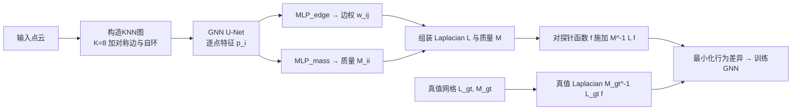

## 一句话总结

用图神经网络在点云的 KNN 图上直接学习边权，得到一个行为高度逼近真值 Laplacian 算子的"神经 Laplacian 算子"（NeLo），把误差相比已有方法降低一个数量级，从而让各类基于 Laplacian 的几何处理算法可以直接跑在点云上。

## 研究背景

Laplacian 算子是 3D 几何处理的核心工具，广泛用于形状分析、参数化、平滑、编辑、谱处理等。它在流形三角网格上有成熟的定义（如余切 Laplacian），但在点云上仍是一个开放问题：点云缺乏良定义的流形结构，而 Laplacian 本质上是度量函数在流形上局部变化的微分算子。

以往方法的主流思路是围绕每个点用 K 近邻构造局部三角剖分来近似底层流形，再据此定义 Laplacian。这条路存在两个痛点：一是局部三角剖分本身困难，在含噪声、薄结构或尖锐特征处往往与真实流形不一致；二是这些方法常有多个需要人工调节的参数，鲁棒性与精度都不理想。

从矩阵视角看，Laplacian 由两个关键因素决定：图结构和边权。以往工作都在费力优化图结构（追求 Delaunay 化、尽量流形化）。本文反其道而行：干脆直接用点云平凡构造的 KNN 图（它甚至不是合法的三角剖分），转而去学习合适的边权。

## 方法

整体框架：对输入无向点云构造 KNN 图，用一个 U-Net 结构的 GNN 提取逐点特征，再用两个 MLP 分别解码出刚度矩阵的边权和质量矩阵的对角元。由于 KNN 图与真值网格的连接性完全不同，无法直接监督边权，作者用"探针函数"来比较两个算子的行为并训练网络。

关键设计一：行为模仿式训练（核心思想）。作者不追求让学到的算子等同于真值算子，而是"像鸭子一样叫就当它是鸭子"——只要在一批函数上的行为足够接近，就视为同一个算子。对网格上任意函数，可计算其真值 Laplacian：

$$\Delta_{gt} f = M_{gt}^{-1} L_{gt} f$$

用学到的 $$L, M$$ 在点云上算出 $$\Delta f$$，训练损失为两者之差：

$$\mathcal{L}_{laplacian} = \sum_{f \in \mathcal{F}} w_f \left\| M^{-1} L f - M_{gt}^{-1} L_{gt} f \right\|_2^2$$

其中平衡权重 $$w_f = \dfrac{1}{mean(\vert M_{gt}^{-1} L_{gt} f\vert ) + \epsilon}$$，$$\epsilon=0.1$$。另加一项质量矩阵对角损失 $$\mathcal{L}_{mass}$$ 加速收敛，总损失 $$\mathcal{L} = \mathcal{L}_{laplacian} + \lambda \mathcal{L}_{mass}$$，$$\lambda=0.1$$。

关键设计二：探针函数的构造。理论上点云上任意函数都可展开为真值 Laplacian 特征向量的线性组合，但求全部特征向量代价太高。作者用两组探针函数：谱探针取真值 Laplacian 前 64 个非常数低频特征向量（并按特征值缩放 $$f_i = \dfrac{f_i}{\lambda_i + \epsilon_1}$$ 防止被大特征值主导）；空间探针用随机频率的三角函数补充高频行为：

$$f(p) = \frac{1}{2k}\sin\left(k\psi(ax+by+cz) + \phi\right)$$

其中频率 $$k \in \{2^{m/2}\}$$，$$\psi$$ 为 $$[0.75,1.25]$$ 的频率噪声，$$\phi$$ 随机相位。谱探针尤其重要：它在薄结构的正反两面取值差异显著，迫使网络区分空间上很近但几何上属于不同表面的点。

关键设计三：局部感知的图卷积与全 1 输入信号。为保证平移不变性与可扩展性，网络输入不使用绝对坐标，而是全 1 向量（外加每点邻居数）。图卷积显式引入相对位置与边长：

$$p_i = W_0 p_i + \sum_{j \in \mathcal{N}(i)} \left( W_1 \cdot [p_j \, \| \, v_{ij} \, \| \, l_{ij}] \right)$$

边权与质量由两个带 Softplus/ReLU 激活的轻量 MLP 从特征解码，$$w_{ij} = \Phi_{edge}((p_i - p_j)^2)$$ 天然保证对称，激活函数保证非负，从而使算子满足对称性、局部性、非负权、半正定等良好性质。

## 实验结果

在 ShapeNet 子集（12k 形状、17 类，约 80%/20% 划分，测试集 2402 个模型）上，用施加探针函数后与真值 Laplacian 结果的 MSE、MSE 大于 1.0 的比率（$$R_{MSE>1}$$）和稀疏度进行评测。总体结果如下：

| 方法 | MSE | $$R_{MSE>1}$$ | 稀疏度 |
|------|-----|--------------|--------|
| Graph (uniform) [Taubin 1995] | 0.2444 | 11.17% | 9.8 |
| Heat [Belkin et al. 2009] | 0.2386 | 15.68% | 10.1 |
| NManifold [Sharp & Crane 2020] | 0.1181 | 5.80% | 8.2 |
| Ours (NeLo) | **0.0049** (×24) | **0.12%** (×50) | 9.8 |

在近乎相同稀疏度下，NeLo 相比最强基线把 MSE 降低约 24 倍、$$R_{MSE>1}$$ 降低约 50 倍，尤其在飞机机翼、桌腿、平板、桌角等薄结构与尖锐特征处优势明显。方法还展现出强泛化能力（在 ScanNet 场景上零微调可用）、可扩展性（可处理约 23 万点，是训练平均点数的约 50 倍）以及良好的谱性质（特征向量/特征值与真值几乎难以区分）。

消融显示：空间+谱探针组合效果最好（总 MSE 0.0049），仅用空间探针会大幅退化（0.0210）；$$K=8$$ 在表达力与计算量间最平衡；自设计的图卷积优于 GraphSAGE 与 GATv2。在 Kinect v2 真实扫描数据上同样显著领先（MSE 0.0034 对比 NManifold 的 0.0246）。

## 亮点与局限

亮点：
- 观念转变——放弃改进图结构、直接学边权，绕开了局部三角剖分这一长期难点。
- "行为模仿 + 探针函数"的训练范式巧妙解决了 KNN 图与真值网格连接性不一致、无法直接监督边权的问题，且该范式可推广到梯度、散度等其他微分算子。
- 学到的算子严格满足对称、局部、非负权、半正定等几何处理所需性质，可即插即用于热扩散、测地距离、Laplacian 平滑、谱滤波、ARAP 变形等下游算法。

局限：
- 无收敛保证——点云密度趋于无穷时不保证收敛到真值算子；输入密度远偏离训练分布时性能可能下降。
- 精度上限受限于真值网格的 Laplacian-Beltrami 算子；对干净且均匀采样、易于重建高质量网格的点云（如立方体平面），传统三角剖分方法在平坦区域可能反超。
- 真值 Laplacian 用 libigl 计算，钝角三角形可能产生负权边；若改用内蕴 Delaunay 三角剖分可支持更多样的训练数据。

## 延伸思考

这篇工作的启发性在于把"难以显式定义的算子"变成"可用数据模仿的行为"。当某个数学对象在离散域上定义困难，但存在一个真值参照（网格上的算子）和一组可探测其行为的测试函数时，就可以用行为对齐来间接学习——这与知识蒸馏、算子学习的思路相通。

一个自然的方向是作者自己指出的：把同样的探针+GNN框架推广到梯度、散度、Hessian 等微分算子，从而把整套离散外微分（DEC）工具箱搬到点云上。另一个值得探索的点是"质量自适应"——论文提到可加入一个分类机制，自动判断输入点云质量并在传统三角剖分方法与 NeLo 之间切换，以弥补干净点云上的精度上限问题。此外，全 1 输入信号带来平移不变性但牺牲了旋转等更强的对称性，如何在保持可扩展性的同时引入更强等变性，是后续网络设计的开放问题。
