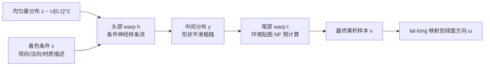

## 一句话总结

用一个"小而通用的神经样条流头部 warp"叠加"按环境贴图预计算的尾部 warp"的复合结构，高效地对环境光照与材质项的乘积做近似重要性采样，从而在直接光照估计中显著降低方差。

## 研究背景

在蒙特卡洛渲染中，每个像素的光照积分方差取决于采样 PDF 是否接近被积函数。表面反射方程可写为

$$
L_o(\mathbf{x}, \boldsymbol{\omega}_o) = \int_{\Omega} f_r^{\perp}(\mathbf{x}, \boldsymbol{\omega}_o, \boldsymbol{\omega})\, L(\boldsymbol{\omega})\, V(\mathbf{x}, \boldsymbol{\omega})\, \mathrm{d}\boldsymbol{\omega}
$$

其中 $$f_r^{\perp}$$ 是余弦加权 BRDF，$$L$$ 是远处环境光，$$V$$ 是可见性。方差在 $$p \propto f_r^{\perp}\cdot L\cdot V$$ 时最小。

实践中通常对各因子分别构造估计器，再用多重重要性采样（MIS）组合。但 MIS 本质是"混合分布"而非"乘积分布"，往往过于保守，在复杂材质与光照下方差仍偏高。真正接近整体乘积的分布才是降方差的关键。

归一化流（NF）作为生成模型能构造灵活分布并支持精确似然与高效采样，很适合此任务；但直接用一个紧凑 NF 去拟合随条件变化的复杂乘积，容量不足、拟合很差。本文要解决的正是"如何在保持模型紧凑（可实时）的同时，拟合复杂且随条件变化的乘积分布"。

## 方法

整体思路是把"分布的复杂性"与"分布的条件依赖性"分开处理：不用一个庞大的条件 NF 直接生成乘积样本，而是让一个紧凑的条件**头部 warp**（neural spline flow）先把均匀分布变形为一个平滑的中间分布，再交给一个无条件的**尾部 warp**（由环境贴图导出）把中间分布拉成最终的复杂乘积分布。

目标是采样 $$p^{*}(x \mid \mathbf{c}) \propto p_1(x)\cdot p_2(x \mid \mathbf{c})$$，其中 $$p_1$$（环境光）形状复杂但无条件，$$p_2$$（BRDF）形状简单但依赖着色条件 $$\mathbf{c} \triangleq (\boldsymbol{\omega}_o, \mathbf{n}, \boldsymbol{\rho})$$。模型是两个 warp 的复合：

$$
f(z \mid \mathbf{c}; \boldsymbol{\theta}) \triangleq (t \circ h)(z \mid \mathbf{c}; \boldsymbol{\theta}) = t\big(h(z \mid \mathbf{c}; \boldsymbol{\theta})\big)
$$

**关键设计一：头尾复合作为归纳偏置。** 头部网络无需学习环境贴图的精细结构（这部分由尾部 warp 精确承担），只需专注于低维的条件变化，使拟合任务大幅简化。这与"直接拟合 $$p_2$$"不同，后者得不到正确的乘积分布。

**关键设计二：圆周有理二次样条 + 均匀基分布的头部 warp。** 头部基于 neural spline flow，采用圆周变体以适配 lat-long 方位角的环绕特性；用单位方形上的均匀基分布 $$p_Z = \mathcal{U}[0,1]^2$$ 强制紧凑支撑，保证 $$\mathcal{Y}$$ 中每个点在 $$\mathcal{Z}$$ 中都有原像（避免 NeuSample 那样的越域拒绝）。头部由条件编码器 + 2 个耦合层构成，仅约 36k 参数。

**关键设计三：平滑的 NF 尾部 warp。** 常见的行列边缘法或层次法虽可快速构造，但不连续，会破坏输入样本分层、干扰头部优化。作者改用一个较大的 NF（128 bins、16 耦合层）拟合环境贴图，得到平滑映射，并将其正/逆映射与 PDF 在 1k 分辨率离散化为查找表，采样与 PDF 评估退化为双线性插值查表。

**训练：前向 KL + 熵正则。** 用从目标 $$p^{*}_X$$ 抽取的样本最小化前向 KL 散度（等价于最大似然）：

$$
\mathcal{L}_{\mathrm{KL}}(\boldsymbol{\theta}) = -\mathbb{E}_{x \sim p^{*}_X}\big[\log \vert J_f(z; \boldsymbol{\theta})\vert ^{-1}\big] + \text{const}
$$

为抑制 KL 过度激进拟合高密度区导致的萤火虫噪点，加入熵正则项：

$$
\mathcal{L}(\boldsymbol{\theta}) = \mathcal{L}_{\mathrm{KL}}(\boldsymbol{\theta}) + \lambda\, \mathcal{L}_{\mathrm{H}}(\boldsymbol{\theta}), \qquad \mathcal{L}_{\mathrm{H}}(\boldsymbol{\theta}) = \mathbb{E}_{x \sim p^{*}_X}[-\log p_X(x; \boldsymbol{\theta})]
$$

取 $$\lambda = 0.0001$$。对低维条件（如仅法向），头部还可进一步烘焙成极小直方图（16×32 个 8×8 直方图，约 132KB）以获得实时推理速度。

## 实验结果

方法在 Mitsuba 3 波前路径追踪器中实现，以 MSE 为指标，在等采样数与等渲染时间下对比 MIS 与流式 RIS。下表汇总余弦加权发光体采样（Diorama 场景）在等时对比：

| 方法 | MSE | 时间 | 相对 MIS |
| --- | --- | --- | --- |
| MIS | 0.68 | 14 ms | 1.0× |
| Ours / NF | 0.21 | 47 ms | — |
| Ours / Baked | 0.25 | 18 ms | 2.4× MSE 降低 |

在 Temple 场景，余弦加权模型相比 MIS 全图方差降低约 2.2×；烘焙直方图变体在等采样数下达到等时性能。微表面材质（Droid 场景）在固定粗糙度下明显优于 MIS 与 RIS；粗糙度作为额外条件时头部拟合变差，但与 BRDF 采样做 MIS 组合仍能在等采样数下降噪。神经材质（NeuMIP）与阴影捕捉合成应用中，方法均优于 emitter、cosine、NeuSample 等基线。

## 亮点与局限

亮点：
- 复合 warp 把"复杂性"与"条件性"解耦，让紧凑神经流也能拟合复杂乘积分布，这是核心洞见。
- 尾部 warp 预计算离散化后查表推理近乎瞬时；低维条件时头部可烘焙成极小直方图，做到等时优于 MIS。
- 平滑尾部 warp（NF）相比层次 warp 将 MSE 减半，验证了平滑性对头部优化的重要性。
- 框架通用，可直接扩展到神经材质与阴影捕捉单遍合成。

局限：
- 模型容量刻意压得很小，粗糙度作为条件时潜向量表达力不足，等时下打不过 RIS。
- 训练需要目标分布样本（前向 KL）；作者发现反向 KL 在复合 warp 下训练不稳定。
- 不显式建模可见性，剩余噪声主要来自可见性；训练需按环境贴图预计算与烘焙。

## 延伸思考

- 作者提出可将模型蒸馏为多个轻量固定粗糙度子模型来缓解表达力瓶颈，这暗示"一个大条件模型 vs 一组小专用模型"的工程权衡在实时渲染中值得探索。
- 复合 warp 的思想更普适：任何"已知高效采样的复杂因子 + 需学习的简单条件因子"的乘积采样，都可套用"神经头 + 解析/预计算尾"的范式，例如体散射、区域光或路径引导。
- 尾部 warp 的平滑性与分层保持之间的关系提示：在把神经采样接入 MIS/RIS/ReSTIR 等既有管线时，映射连续性会直接影响下游降方差效果，是一个容易被忽视的实现细节。
