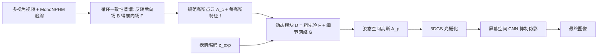

## 一句话总结

NPGA 把 3D Gaussian Splatting 与神经参数化头部模型（NPHM）的富表情空间结合起来，通过循环一致性蒸馏把后向形变场转成可光栅化的前向形变场，并为每个高斯配备潜在特征来增强动态表达力，从多视角视频中重建出高保真、可精细控制的头部虚拟人。

## 研究背景

从真实多视角采集重建可动画、可自由视角渲染的照片级头部虚拟人，是图形学的核心问题之一，且往往要求实时渲染。近来 3D Gaussian Splatting（3DGS）凭借高效渲染与照片级质量被广泛用于数字人与头部虚拟人。

实现可控性最主流的做法是借助 3D 可变形模型（3DMM），用解耦的身份与表情参数空间来驱动虚拟人。但传统 3DMM 是线性的，其表情空间的表达上限受限；作者认为底层表情空间的质量直接决定了虚拟人的可控性与细节锐度：若输入表情编码流与观测图像相关性不足，优化会退化为病态问题并过拟合。

为此，NPGA 改用神经参数化头部模型 MonoNPHM 作为底层表情先验，它比经典公开 3DMM（如 FLAME、BFM）提供更细粒度、更稠密（含眼、发、牙）的表情控制，并良好地解耦身份与表情。核心难点在于：MonoNPHM 使用把点从姿态空间映射回规范空间的**后向形变场**，无法直接用于基于光栅化的 3DGS 渲染。

## 方法

整体框架由两大部分组成：一个规范空间的高斯点云 $$A_c$$，以及一个动态模块 $$D$$，后者在给定表情编码时把规范高斯前向形变到姿态空间再用 3DGS 渲染。动态模块进一步拆成两个 MLP：承接 NPHM 先验的粗形变网络 $$F$$，以及负责其余细节的网络 $$G$$。

**循环一致性蒸馏（前向化 NPHM 先验）。** MonoNPHM 的后向形变把姿态点 $$x_p$$ 映回规范点 $$x_c = B(x_p; z_{id}, z_{exp})$$。作者不用迭代求根去数值求逆，而是直接蒸馏出一个前向形变网络 $$F$$ 作为 $$B$$ 的逆，损失为循环一致性：

$$
L_{cyc}(x_c) = \| B(F(x_c, f(x_c))) - x_c \|_2^2
$$

此阶段规范空间尚未离散成高斯，用低分辨率 64×64 triplane 作为可在任意点查询的特征场 $$f(x_c)=\mathrm{TriPlane}(x_c)$$。$$F$$ 只需对 NeRSemble 中六个身份统一训练一次。

**每高斯潜在特征 + 双网络动态。** 规范高斯在标准 3DGS 属性（位置、旋转、尺度、不透明度、球谐）之外，增加每高斯特征 $$f \in \mathbb{R}^{N\times 8}$$，为每个基元提供描述其动态行为的语义信息。粗网络预测中心偏移 $$\delta^F_\mu = F(\mu, f; z_{exp}) \in \mathbb{R}^3$$；细节网络对所有属性预测偏移 $$\delta^G_a = G_a(\mu, f; z_{exp})$$，用来表达皱纹、血流/遮挡引起的外观变化等超出先验的动态。与 GaussianHeadAvatar、HeadGAS 不同，NPGA 让每高斯特征也参与**位置**偏移预测，使形变模块在更高维空间中运作。

**Laplacian 正则 + ADC 调整。** 增强的动态表达力需要正则化以避免过拟合训练表情。基于规范高斯中心的 $$k$$NN 图施加 Laplacian 平滑项，同时约束到每高斯特征 $$f$$ 与属性偏移 $$\delta^G_a$$：

$$
R_{lap}(x) = \left\| \frac{1}{|\mathcal{N}_i|} \Big( \sum_{j\in\mathcal{N}_i} x_j \Big) - x_i \right\|_2^2
$$

此外用小偏移正则、尺度正则，并对自适应密度控制（ADC）改用广义平均聚合视空间梯度：

$$
M^e_i = \left( \frac{1}{N} \sum_{t\in T} \tau^e_t \right)^{1/e}
$$

其中 $$e=1$$ 即默认 3DGS；取 $$e=2$$ 让聚合更接近取最大值，使少数可见帧即可触发致密化，对口腔内部、牙齿等长期被遮挡区域尤为重要。硬性不透明度重置也替换为更温和的逐步小幅衰减方案。

**优化目标。** 联合优化规范参数与 $$G$$（$$F$$ 以极小学习率并配 warm-up 微调），最小化 RGB 渲染与 CNN 精修的光度项：

$$
L = \| I - \hat{I}_{rgb} \|_1 + \lambda\big(1 - \mathrm{SSIM}(I, \hat{I}_{rgb})\big) + \lambda\big(1 - \mathrm{SSIM}(I, \hat{I}_{cnn})\big)
$$

## 实验结果

在公开多视角视频数据集 NeRSemble 上选取六个受试者，用 15 台相机训练、正面相机评估，held-out 的 "FREE" 序列用于自重演（self-reenactment）测试，评测聚焦面部区域。主实验对比自重演任务：

| 方法 | PSNR↑ | SSIM↑ | LPIPS↓ |
|------|-------|-------|--------|
| MVP | 27.19 | 0.919 | 0.114 |
| GaussianAvatars | 27.77 | 0.926 | 0.104 |
| GHA | 26.81 | 0.914 | 0.077 |
| GHA_NPHM | 26.60 | 0.911 | 0.078 |
| Ours_BFM | 28.82 | 0.924 | 0.076 |
| **Ours** | **30.26** | **0.934** | **0.055** |

NPGA 相比此前最佳约提升 2.6 PSNR、0.021 SSIM。有趣的是，仅把 MonoNPHM 表情码喂给 GHA（GHA_NPHM）反而略差，说明单靠更强表情码不足以提升效果，NPHM 的运动先验作为初始化才是关键。消融显示：每高斯特征带来更锐利重建但会产生"漂浮"基元伪影，Laplacian 平滑与屏幕空间 CNN 逐步消除伪影并缩小训练/测试泛化差距；让每高斯特征影响位置偏移（对比 Ours-δμ）以及调整后的 ADC（对比 Ours-ADC）都对细节重建有明显贡献。此外还在真实单目 RGB 视频上验证了跨重演动画能力。渲染速度在 550×802 下约 31 FPS（含 CNN），去掉 CNN 达 43 FPS。

## 亮点与局限

亮点：
- 用循环一致性蒸馏优雅解决了 NPHM 后向形变场与光栅化渲染不兼容的问题，把富表情神经先验成功引入 3DGS 虚拟人。
- 每高斯潜在特征同时参与位置与外观形变，配合 Laplacian 正则，在提升动态表达力的同时抑制伪影。
- 针对动态场景改进 ADC（广义平均聚合 + 温和不透明度衰减），显著改善口腔内部、牙齿、皱纹等难区细节。

局限：
- 可控性与重建质量从根本上受限于底层 3DMM 能解释的范围；颈部、躯干、舌头、眼球转动等 NPHM 表情空间不覆盖的区域难以可靠动画，甚至可能因过拟合产生伪影。
- 作为数据驱动方法，效果受限于每人可用的训练数据量。
- 未针对训练/渲染效率做优化，单人训练约需 30 小时。

## 延伸思考

作者指出的自然方向是扩展底层参数化模型的覆盖范围（引入颈部乃至全身），从而让虚拟人状态描述更完整。更具潜力的是利用大规模多视角头部数据集，借助 3DGS 的高效渲染与光度优化去学习一个比 NPHM 保真度更高的**通用**头部模型，替代当前"每人一套先验+蒸馏"的范式。另一个值得关注的点是追踪鲁棒性：文中显示即使 MonoNPHM 追踪在极端表情下失败，得益于表情潜空间的平滑性，虚拟人仍能产出合理动画——这提示表情先验的平滑性本身可作为对抗追踪噪声的隐式正则。作者也强调了照片级虚拟人在 deepfake、身份盗用等方面的伦理风险，呼吁配套可靠的媒体真实性检测。
