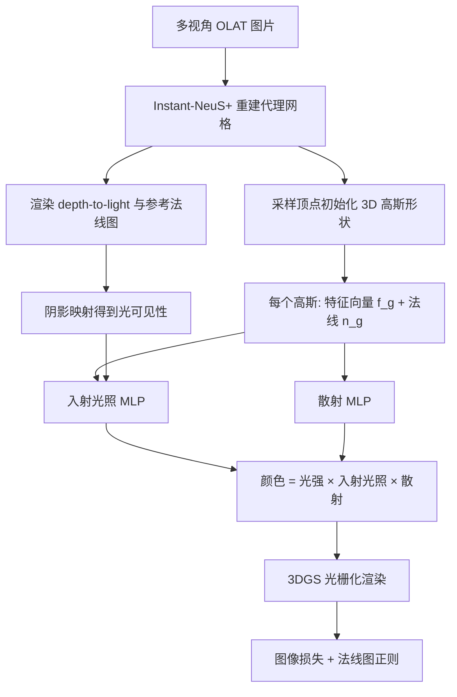

## 一句话总结

把 3D 高斯泼溅（3DGS）扩展成可重照明表达：给每个高斯赋予可学习特征向量作为外观场索引，并把外观场拆解为"入射光照函数"与"散射函数"两个 MLP，配合代理网格提供的法线与阴影可见性提示，从多视角单点光源（OLAT）照片中重建出对毛发、织物、半透明体等各类物体都通用、且能实时交互重照明的模型。

## 研究背景

物体重照明是图形学的长期目标，广泛用于文物数字化与在线商品展示。真实外观来自几何、材质、光照的复杂耦合，解耦它们本身是高度病态的问题。

现有方法主要有两条路线。一条从恒定环境光下的多视角图片重建外观，采集轻便（手机绕拍即可）但只覆盖很窄的外观变化范围。另一条用精心设计的光照图案采样更宽的外观变化，重建更准确。本文沿用后者，采用 Deferred Neural Lighting（DNL）的 OLAT 采集方式：手持相机拍多视角，单个移动点光源从不同位置照亮物体，既提供丰富的光照信息又保持轻量采集。

已有可重照明表达存在明显短板：

- 基于网格或参数化材质模型（如微表面模型）的方法只擅长实心不透明表面，难以描述毛发、织物这类体积性物体。
- NRHints 用 MLP 建模渲染过程且对各类物体表现较好，但它基于 NeuS 的 SDF 表面表达，对极细结构会产生模糊伪影；且体渲染需要数分钟才能渲一帧，远达不到实时。

本文希望兼顾"通用材质表达 + 高保真细节 + 实时渲染"。

## 方法

整体框架：先用 OLAT 图重建一个代理网格，再用它初始化并辅助一组可重照明的 3D 高斯；每个高斯的颜色由"衰减后的光强 × 入射光照值 × 散射值"三者相乘得到，最后经 3DGS 光栅化器前向渲染成图并用真值监督。

关键设计一：代理网格（Instant-NeuS+）。在 Instant-NSR-pl 的快速 NeuS 基础上，额外用入射光方向、光距、可见性提示与高光提示（借鉴 NRHints）来条件化颜色 MLP，以缓解几何与材质的歧义：

$$c = \Phi_{color}(f_{sdf}, n_{sdf}, w_o, w_i, d, v_{cue}, s_{cue})$$

用 Marching Cubes 从 SDF MLP 提取网格。该网格为高斯提供三样东西：形状初始化的顶点样本、用于阴影映射的 depth-to-light、以及参考法线。

关键设计二：分解式 MLP 着色。不像 NRHints 用一个统一 MLP 吃下所有输入，而是把外观场拆成两个各司其职的函数，从而获得更好的亮度精度。

光强按物理上正确的平方反比律衰减：

$$\omega_{int} = \frac{\omega_e}{\lVert p - x_l \rVert^2}$$

入射光照函数表示每个高斯接收到的单位光强占比，涵盖光透射与前缩（foreshortening）效应。它用阴影映射得到的可见性 $$v(p, w_i) \in \{0,1\}$$（在点光源视角渲深度图，高斯到光源距离不超过观测深度即视为可见，加小偏置抑制阴影粉刺），并把前缩项 $$\max(n_g \cdot w_i, 0)$$ 一并输入：

$$f_i = \Phi_{incident}(w_i, f_g, v(p, w_i)\max(n_g \cdot w_i, 0))$$

得到标量 $$f_i \in [0,1]$$，无需显式监督即可近似地表示非染色、视角无关的效应（含光透射）。

散射函数描述材质如何散射光，输入入射光方向、视角方向、高斯特征与高斯法线，输出 RGB 散射值：

$$f_s = \Phi_{scatter}(w_i, w_o, f_g, n_g)$$

它不服从固定反射规则，可同时纳入直接与间接光照以表达多种材质。每个高斯的观测颜色为：

$$c_g = \omega_{int} \cdot f_i \cdot f_s$$

关键设计三：几何提示（法线 + 可见性）。3DGS 本身离散，难得到参与光材交互的准确法线，也难产生正确阴影/高光。因此给每个高斯一个可学习法线（用网格顶点法线初始化）来条件化散射函数以改善高光；用阴影映射的可见性来改善阴影。

关键设计四：训练与损失。用 3DGS 光栅化器额外渲一张法线图 $$T_g$$，由参考网格法线图 $$T_{ref}$$ 监督以正则化法线。总损失在 3DGS 的图像损失（L1 + D-SSIM）之上加法线 L1：

$$L = (1-\lambda_1)L_1(O_g, O) + \lambda_1 L_{D\text{-}SSIM}(O_g, O) + \lambda_2 L_1(T_g, T_{ref})$$

其中 $$\lambda_1 = 0.2$$、$$\lambda_2 = 0.1$$，特征/法线与两个 MLP 学习率取 $$1\text{e-}3$$。

## 实验结果

在 7 个真实 OLAT 场景上评测（4 个来自 DNL，3 个来自 NRHints），涵盖不透明表面、半透明体、毛发、织物。训练仅用 500–1000 张图（与 NRHints 一致），DNL 则约需 1 万张。

DNL 4 个场景的定量平均对比：

| 方法 | PSNR ↑ | SSIM ↑ | LPIPS ↓ |
| --- | --- | --- | --- |
| DNL | 33.35 | 0.933 | 0.102 |
| NRHints | 32.42 | 0.929 | 0.104 |
| Ours | 33.15 | 0.948 | 0.071 |

在 DNL 场景上，本方法仅用 DNL 十分之一的输入图，PSNR 略低但 SSIM 与 LPIPS 全面更优，且在毛发、织物、点状高光等纹理丰富区域有更多高频细节。

NRHints 3 个场景的定量平均对比：

| 方法 | PSNR ↑ | SSIM ↑ | LPIPS ↓ |
| --- | --- | --- | --- |
| NRHints | 36.023 | 0.975 | 0.064 |
| Ours | 36.715 | 0.980 | 0.053 |

在 NRHints 场景上三项指标全面领先。

资源与性能对比：DNL 约需 1 万张图、约 20h（13 GPU）训练、推理 1–2s；NRHints 约 500–1000 张、约 20h（4 GPU）、推理约 1min；本方法约 500–1000 张、约 1h（1 GPU）、推理约 30ms，达到实时。

消融（7 场景平均）：

| 变体 | PSNR ↑ | SSIM ↑ | LPIPS ↓ |
| --- | --- | --- | --- |
| w/o normals | 34.5751 | 0.9613 | 0.0635 |
| w/o visibility | 33.9564 | 0.9596 | 0.0647 |
| w/o normals and visibility | 33.5752 | 0.9585 | 0.0659 |
| PBR Shading | 24.9865 | 0.8998 | 0.1146 |
| Union Shading | 33.8797 | 0.9603 | 0.0645 |
| Ours | 34.6826 | 0.9617 | 0.0629 |

去掉法线高光变差、去掉可见性阴影变差；参数化 PBR 着色只能描述可被微表面模型良好刻画的材质，对各向异性反射、半透明、镜面互反射等失效，指标大幅下滑；把所有输入喂给单一网络的 Union Shading 在亮度精度上不如分解式设计。

## 亮点与局限

亮点：

- 首个把 3DGS 与精心设计的分解式 MLP 着色结合、面向 OLAT 通用重照明的表达，不对几何/材质做假设，因而对不透明面、半透明体、毛发、织物都通用。
- 用代理网格为高斯提供法线（改善高光）与可见性提示（改善阴影），弥补 3DGS 几何不准的短板。
- 在细节质量上达到 SOTA，同时把训练降到约 1 小时、渲染做到实时（约 30ms/帧），支持交互式改视角与改光源位置。

局限（据方法定位推断）：

- 依赖代理网格的质量，网格重建误差会传导到法线与阴影可见性提示。
- 沿用 OLAT 单点光源采集设定，仍需相对可控的采集流程，而非任意环境光下的随手拍摄。
- 散射与入射光照均用 MLP 隐式建模，不输出可编辑的显式材质参数（如反照率、粗糙度），在需要材质编辑/迁移的场景不如参数化 PBR 直观。

## 延伸思考

把外观场分解为"入射光照 × 散射"是本文亮度精度优于单一网络的关键，这种"物理结构先验 + 神经网络灵活性"的折中值得推广到其他逆渲染任务。相比强行套用微表面模型，用 MLP 表达散射换来了对毛发/半透明等疑难材质的通用性，代价是失去显式可编辑材质——如何在保留通用性的同时导出可编辑属性（例如再蒸馏出近似 BRDF）是有价值的方向。此外，方法对代理网格与阴影映射的依赖提示：显式几何提示对提升 3DGS 类表达的光照真实感（高光、阴影）确有必要，未来或可探索无需外部网格、由高斯自身联合优化出可靠可见性与法线的路径。
