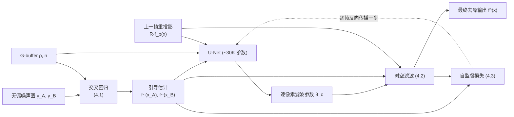

## 一句话总结

本文提出一种混合式交互渲染去噪框架：先用改造后的"交叉回归"（cross-regression）从两张互斥的无偏噪声图生成低噪声的引导估计（pilot estimates），再用一个小型 U-Net 以纯在线（逐帧、无需外部数据集）的自监督方式学习时空滤波参数，从而在保留几何边缘的同时也保留阴影等非几何边缘。

## 研究背景

交互式蒙特卡洛（MC）路径追踪每像素只能分配极少样本（例如 2~4 spp），生成的图像序列无偏但噪声大、时序不稳定。图像去噪是一种简单实用的后处理手段：把无偏但含噪的序列换成有偏但更平滑的序列。

现有两类方法各有短板：

- **经典方法**（如 SVGF 的交叉双边滤波、BMFR 的分块回归）依赖 G-buffer（纹理、法线）作为引导，能保留几何边缘，但 G-buffer 无法刻画阴影等由光照变化产生的**非几何高频边缘**，因而容易把这些细节糊掉。基于误差分析（估计逐像素 MSE 再调平滑）的自适应方案需要足够样本，只适用于离线场景。
- **监督学习的神经去噪**能更好地保留复杂边缘，但需要准备大量"含噪序列 + 无噪真值"的外部训练集，人工成本高。

本文目标是兼取两者之长：既有经典方法"无需外部数据集"的简洁性，又有神经网络的鲁棒去噪能力。核心思路是用**在线学习**——只用运行时的图像序列逐帧更新网络参数，从而摆脱对外部数据集的依赖。

## 方法

### 整体框架

每帧输入为：将路径追踪样本拆分成两组得到的两张无偏噪声图 $$y_A, y_B$$、G-buffer（纹理 $$\rho$$、法线 $$\boldsymbol{n}$$），以及上一帧去噪结果的重投影 $$\mathcal{R}\hat{f}_p(\boldsymbol{x})$$。

处理流程如下：

### 关键设计一：交叉回归（Cross-Regression）

经典局部回归假设解释变量 $$\boldsymbol{x}_i$$ 无噪声，用带权最小二乘拟合局部线性函数：

$$
\begin{bmatrix}\alpha_c\\ \beta_c\end{bmatrix}=\arg\min_{\tilde{\alpha}_c,\tilde{\beta}_c}\sum_{i\in\Omega_c} w_{c,i}\left(y_i-\tilde{\alpha}_c-\tilde{\beta}_c^{T}(\boldsymbol{x}_i-\boldsymbol{x}_c)\right)^2
$$

若像 BMFR 那样只用 G-buffer 作解释变量，就无法预测非几何边缘的颜色变化，导致过度模糊。本文的改造是：把噪声颜色本身也纳入解释变量，并做"交叉"拟合——**用一张图（如 A）的颜色构造线性函数去拟合另一张图（B）的颜色**。以 buffer A 为例，解释变量差分定义为：

$$
\boldsymbol{x}^A_i-\boldsymbol{x}^A_c=\left[\frac{y^A_i-y^A_c}{\hat{\sigma}^A_i+\hat{\sigma}^A_c+\epsilon},\ \rho_i-\rho_c,\ \boldsymbol{n}_i-\boldsymbol{n}_c\right]^{T}
$$

回归权重同样按颜色差与方差自适应：

$$
w^A_{c,i}=\exp\left(-\frac{\lVert y^A_i-y^A_c\rVert^2}{(\hat{\sigma}^A_c)^2+(\hat{\sigma}^A_i)^2+\epsilon}\right)
$$

分别用 A 的变量拟合 B、用 B 的变量拟合 A，得到两张**引导估计** $$\tilde{f}(\boldsymbol{x}_A)$$ 与 $$\tilde{f}(\boldsymbol{x}_B)$$。关键性质：$$\tilde{f}(\boldsymbol{x}_A)$$ 与 $$y_A$$ 强相关（因为它是 $$y_A$$ 的线性函数），与 $$y_B$$ 相关性低——这个"低互相关"是后续自监督学习不过拟合噪声的前提。相比直接输出回归结果，交叉回归利用了完整含噪着色信息，能同时降噪并保留几何/非几何边缘。

### 关键设计二：神经网络驱动的时空滤波

一个简化版 U-Net（两次下采样/上采样，卷积通道 [8,16,32,16,8]，约 30K 参数）以两张引导估计、G-buffer 和上一帧重投影为输入，末层 $$1\times1$$ 卷积逐像素输出六个滤波参数 $$\boldsymbol{\theta}_c=[\theta^A_c,\theta^B_c,\theta^\rho_c,\theta^n_c,\theta^p_c,\theta^\alpha_c]$$。对每张估计做时空滤波（以 A 为例）：

$$
\hat{f}(\boldsymbol{x}^A_c)=\theta^\alpha_c\frac{\sum_{i\in\Omega'_c} m^A_i\,\tilde{f}(\boldsymbol{x}^A_i)}{\sum_{i\in\Omega'_c} m^A_i}+(1-\theta^\alpha_c)\,\mathcal{R}\hat{f}_p(\boldsymbol{x}_c)
$$

其中交叉双边权重 $$m^A_i$$ 由颜色、纹理、法线、像素位置的差分与网络推断的带宽共同决定。两张滤波结果按权重合并为最终输出：

$$
\hat{f}(\boldsymbol{x}_c)=\frac{\hat{f}(\boldsymbol{x}^A_c)\sum_{i\in\Omega'_c} m^A_i+\hat{f}(\boldsymbol{x}^B_c)\sum_{i\in\Omega'_c} m^B_i}{\sum_{i\in\Omega'_c} m^A_i+\sum_{i\in\Omega'_c} m^B_i}
$$

### 关键设计三：逐帧在线自监督学习

网络参数随机初始化、无任何预训练，每帧仅做一步反向传播。损失由空间项和时间项组成：

$$
\mathcal{L}=\frac{1}{\vert \mathcal{I}\vert }\sum_{c\in\mathcal{I}}\frac{1}{2}(\mathcal{L}^s_c+\mathcal{L}^t_c)
$$

空间损失用"一张 buffer 的去噪输出去逼近另一张 buffer 的引导估计"，因两者互相关低，可衡量差异而不过拟合噪声：

$$
\mathcal{L}^s_c=\frac{1}{2}\left(\frac{\lVert\hat{f}(\boldsymbol{x}^A_c)-\tilde{f}(\boldsymbol{x}^B_c)\rVert^2}{\lVert\tilde{f}(\boldsymbol{x}^B_c)\rVert^2+\epsilon}+\frac{\lVert\hat{f}(\boldsymbol{x}^B_c)-\tilde{f}(\boldsymbol{x}^A_c)\rVert^2}{\lVert\tilde{f}(\boldsymbol{x}^A_c)\rVert^2+\epsilon}\right)
$$

时间损失把去噪输出与上一帧重投影的引导估计对齐，保证时序稳定：

$$
\mathcal{L}^t_c=\frac{1}{2}\left(\frac{\lVert\hat{f}(\boldsymbol{x}^A_c)-\mathcal{R}\tilde{f}_p(\boldsymbol{x}^B_c)\rVert^2}{\lVert\mathcal{R}\tilde{f}_p(\boldsymbol{x}^B_c)\rVert^2+\epsilon}+\frac{\lVert\hat{f}(\boldsymbol{x}^B_c)-\mathcal{R}\tilde{f}_p(\boldsymbol{x}^A_c)\rVert^2}{\lVert\mathcal{R}\tilde{f}_p(\boldsymbol{x}^A_c)\rVert^2+\epsilon}\right)
$$

思路上承接 Noise2Noise 用"两张噪声图"训练的自监督范式，但交叉回归先把极噪的少样本输入转成更准的引导估计，使自监督学习在交互式流式输入下依然稳健。训练用 Adam，学习率 0.001，颜色采用对数变换（log transform）处理 HDR。

## 实验结果

在 5 个场景（Bistro、Bistro Dynamic、Emerald Square、Staircase、Music Room，各 300 帧动画，Full HD，Emerald Square 用 4 spp、其余 2 spp，参考图 2K spp）上，与经典方法（SVGF、BMFR）和监督方法（NVIDIA OptiX、NBG）对比。输入由 ReSTIR PT 生成，其储层拆成两组得到 $$y_A,y_B$$。

各场景平均误差（relL2 / 1−SSIM，越低越好；粗体为最优）：

| 方法 | 学习类型 | Bistro | Bistro Dynamic | Emerald Square | Staircase | Music Room |
|---|---|---|---|---|---|---|
| ReSTIR PT（输入） | - | 1.2797 / 0.4536 | 0.5141 / 0.5076 | 41.5661 / 0.2992 | 2.5075 / 0.2631 | 0.7543 / 0.5008 |
| SVGF | 无监督 | 0.9551 / 0.1787 | 0.1399 / 0.1501 | 0.4106 / 0.2950 | 0.0350 / 0.0608 | 0.0621 / 0.0863 |
| BMFR | 无监督 | 1.8255 / 0.2687 | 0.1798 / 0.2070 | 0.6799 / 0.3700 | 0.0262 / 0.1138 | 0.0782 / 0.1196 |
| OptiX | 监督 | 0.0901 / 0.1494 | 0.0219 / 0.1570 | 0.1536 / 0.2032 | 0.0086 / 0.0806 | 0.0169 / 0.0905 |
| NBG | 监督 | 0.7553 / 0.1943 | 0.0750 / 0.1697 | 0.5379 / 0.2682 | 0.0568 / 0.1056 | 0.0429 / 0.1020 |
| **本文 Ours** | 自监督 | **0.0409 / 0.1270** | **0.0196 / 0.1170** | **0.0470 / 0.1718** | **0.0052 / 0.0400** | **0.0115 / 0.0648** |

本文方法在全部 5 个场景的两项指标上均取得最优，相比输入 ReSTIR PT 的 relL2 误差缩小 26× 到 884×，且在不使用任何外部训练集的前提下超过监督方法 OptiX 与 NBG。

补充实验要点：

- **不同采样方案**（普通 PT / ReSTIR DI / ReSTIR PT）：OptiX 与本文方法从更好的采样中获益最明显；即便用最噪的普通 PT 输入，本文方法也与 OptiX 相当（Bistro 上误差为 OptiX 的 1.23 倍，Emerald Square 上为其 1/2.04）。
- **消融**：只用交叉回归结果作输出会残留噪声、时序不稳；只用神经网络（输入换成 $$y_A,y_B$$）则过度模糊；两者结合的混合框架效果最佳。
- **每帧开销**（RTX 4090，1920×1080）：交叉回归 2.27 ms、U-Net 推理 4.60 ms、时空滤波 4.09 ms、反向传播 11.30 ms，合计 22.26 ms。约一半时间花在运行时训练的反向传播上；相比 ReSTIR PT 本身约 65 ms/帧的成本，该开销在交互式场景可接受。

## 亮点与局限

亮点：

- 无需任何外部数据集与预训练，网络随机初始化后纯在线逐帧学习，兼具经典方法的简洁与神经方法的边缘保持力。
- 交叉回归的"低互相关双估计"设计巧妙地为自监督损失提供了稳健的监督信号，避免过拟合噪声。
- 在少样本交互式输入下同时保留几何与非几何（阴影）边缘，指标上超越工业级监督去噪器。

局限：

- 假设无偏像素颜色的噪声在空间上不高度相关；当 ReSTIR PT 的时空复用把 firefly 扩散成相关离群点时，所有被测方法（含本文）都难以去除。
- 依赖 G-buffer 引导，当景深或运动模糊导致 G-buffer 本身含噪时会受影响。
- 运行时训练开销较大（约一半时间在反向传播），距离真正实时仍有差距。

## 延伸思考

- 在线自监督"边渲染边学习"的范式，把训练成本从离线数据集准备转移到了运行时算力，对没有匹配训练数据的新场景/新渲染器尤其友好；其代价是每帧反向传播的固定开销。作者提出的按需更新（仅在必要帧反向传播）、更高效的 GPU 网络实现，是通向实时的自然方向。
- "交叉回归"的核心是构造两路低互相关但都比原始输入更干净的信号，这一思想与 Noise2Noise、自监督后校正一脉相承，或可迁移到其他缺乏真值的重建/滤波任务。
- 对相关离群点的鲁棒处理，可能需要与降低邻域相关性的 ReSTIR 变体协同设计，或在损失中显式建模离群点，这是把该框架推向更通用去噪器的关键一步。
