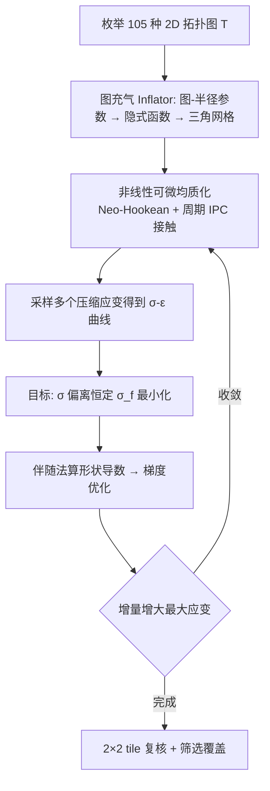

## 一句话总结

通过拓扑枚举 + 含自接触的非线性可微均质化 + 梯度形状优化，设计出一族在大范围压缩下反作用力近乎恒定的 2D 周期微结构，可挤出成 3D 打印的高性能减震缓冲材料。

## 研究背景

机械冲击广泛存在于车辆悬挂、鞋底、座椅减震、机器人、假肢矫形器等场景。冲击防护分两类：一次性的灾难性防护（碰撞、跌落，靠塑性/断裂材料吸能）和周期性的常规防护（靠弹性结构可复用）。本文聚焦后者。

理想减震材料需要一种反直觉的高度非线性响应：把带缓冲层的物体落到刚性表面时，缓冲层要尽量拉长减速时间、降低作用于物体的峰值力。作者用简单模型推导出理想应力-应变曲线应当是**恒定应力**：设物体动能为 $$\frac{1}{2}mv^2$$，接触面积 $$A$$、缓冲层厚 $$h$$，物体在应变 $$\epsilon$$ 处受力 $$F=A\sigma(\epsilon)$$，要求缓冲层能吸收全部动能：

$$Ah\int_0^1 \sigma(\epsilon)\,d\epsilon \geq \frac{1}{2}mv^2$$

在此约束下最小化峰值应力，最优解正是常数 $$\sigma(\epsilon)=\sigma_f$$，其中 $$\sigma_f = mv^2/(2Ah)$$。而常见材料像弹簧，力随形变增大，远离理想。泡沫、瓦楞纸等靠复杂几何逼近理想，但缺乏系统的优化设计。既有工作要么手工设计拓扑、只做一两个参数扫描，要么用拓扑优化但无法处理接触、只能到 40% 压缩和有限力范围。

## 方法

整体是"外层枚举拓扑 + 内层形状优化"的流水线，核心难点在于把周期超材料的均质化推广到**大变形 + 自接触 + 非线性基材**三重条件下，并且要可微以支持梯度优化。

**关键设计一：图充气式隐式形状表示。** 每个微结构由一张标注了节点半径与位置的图 $$T$$ 定义，嵌入 $$a\times b$$ 的矩形并施加反射对称以减少参数。充气算子 $$\Psi_T$$ 把图转成隐式曲面再用 marching squares 三角化，得到周期网格顶点 $$\bar{q}=\Psi_T(r,a,b)$$。顶点对形状参数的导数（形状速度）通过隐函数微分获得。相比拓扑优化，这种表示能鲁棒、可微地处理接触，避免了拓扑优化中空腔单元在接触时趋于奇异导致的收敛与精度问题。

**关键设计二：含接触的非线性均质化。** 把位移分解为宏观线性变形与周期涨落 $$u(x)=\tilde{u}(x)+Gx$$，$$G$$ 取对称以剔除旋转。对每个采样的竖向应变 $$G_{11}=\epsilon$$，求解允许其他方向自由变形的非线性弹性问题：

$$\min_{\tilde{u},G} W(\tilde{u},G)\quad \text{s.t.}\ G_{11}=\epsilon$$

其中 $$W=W_e+W_c$$ 为 Neo-Hookean 弹性能与接触势垒能之和。有效应力由体积平均给出：

$$\bar{\sigma}(\epsilon)=\frac{1}{\vert V\vert }\int_\Omega \sigma(\nabla_x\tilde{u}+G)\,dx$$

接触采用适配周期边界的 IPC：只需考虑一个单元与其左、下相邻单元，用 $$2\times 2$$ tile 做碰撞检测与势垒计算，因周期性无需考虑右、上侧。

**关键设计三：优化目标与增量策略。** 给定目标应力 $$\sigma_f$$，在压缩应变区间 $$[0.1,\epsilon]$$ 上最小化有效应力对目标的偏差：

$$J(q):=\sum_i \left(\frac{\bar{\sigma}_i(1,1)}{\sigma^*}-1\right)^2 + w\left(\vert G^{01}_i\vert -0.05\right)_+^2$$

第二项惩罚压缩下的剪切，避免相邻单元反向剪切互锁。求解用增量加载法：先在 [10%,30%] 达标，再逐步提高最大应变并以上一步结果热启动，避免直接大压缩时接触力过大导致的收敛崩溃。形状导数用伴随法，只需额外解一个线性方程。由于对称形状 + 非对称变形导致解不唯一，作者不直接对瞬态仿真优化；并在优化成功后用更贵的 $$2\times 2$$ tile 复核，剔除单胞与 tile 曲线不一致的形状再重优化。

## 实验结果

在 105 种拓扑上，对 14 个目标应力（300–20000）× 7 种压缩形变（20%–70%）跑增量优化，约耗 145k CPU 小时，筛出 6 种覆盖最广的拓扑构成材料族。用 Prusa Mk3s、TPU 打印（高 10cm、厚 2.6cm）并在 INSTRON 5966 万能试验机上做压缩测试；仿真用改造版 PolyFEM。

| 对比项 | 基线（[28] 扩展 χ 形结构） | 本文优化族 |
| --- | --- | --- |
| 恒定平坦响应可达压缩率 | ~55% | 最高 70% |
| 是否含接触优化 | 否 | 是 |
| 拓扑来源 | 手工设计 + 低参数网格搜索 | 105 拓扑系统枚举 + 形状优化 |
| 包裹防护中物体最大应力 | 无保护 $$1.2\times10^6$$ Pa | 有保护 $$7.6\times10^4$$ Pa（降约 94%） |

跌落测试中，优化结构的峰值加速度约为同尺寸软材料实心块的一半，且冲击后能回弹复用。消融实验显示：忽略接触会使实测响应远高预期且不平坦；线性弹性模型在 5% 压缩后即偏离实验，Neo-Hookean 则贴合，证实非线性基材模型不可或缺；拓扑优化表示在接触临界时空腔趋于奇异，难以精确处理接触。

## 亮点与局限

亮点：首次系统地把形状优化用于减震结构；把非线性均质化扩展到大变形 + 自接触 + 非线性基材并保持可微；隐式图充气表示天然规避了拓扑优化处理接触的困难；仿真与物理实验、跌落实验多重验证，且结构弹性可复用。

局限：均质化问题非凸高度非线性，存在多个鞍点/局部极小，偶发线搜索失败；恒定应力响应可覆盖的力范围仅约两个数量级；部分压缩后的微结构并非完全周期，导致防护效率损失；目前限于 2D 挤出结构、小角度（≤20°）非轴向载荷，未含动态惯性、摩擦与塑性。

## 延伸思考

作者已指出向 3D 微结构、复杂几何边界（如菱形单元）、多轴载荷、动态惯性/摩擦均质化以及塑性模型扩展的方向。值得思考的是：恒定力响应本质是一种"能量吸收密度最大化"的几何编码，能否与数据驱动/神经代理模型结合，把 145k CPU 小时的昂贵均质化-优化流水线大幅加速？此外，非对称变形导致的解不唯一与非周期性 tile 行为，提示宏观均质化假设在这类强接触超材料上存在理论边界，如何刻画并利用这种多稳态是有趣的开放问题。将可微接触均质化的框架迁移到可控刚度、可编程超材料等更广的功能设计，也颇具潜力。
