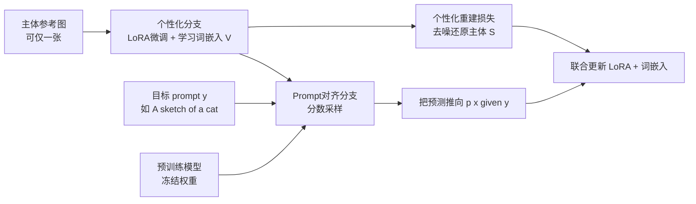

## 一句话总结

PALP 把个性化训练从"追求通用"改成"针对单条目标 prompt 精修"，在个性化重建损失之外再挂一条基于分数蒸馏的 prompt 对齐分支，让微调后的模型既能牢记新主体、又不丢失目标 prompt 里的风格、场景等要素。

## 研究背景

文生图模型可以按文本生成风格、地点、时间各异的图像，个性化方法（如 Textual Inversion、DreamBooth）进一步允许把用户自己的主体——某只猫、某个玩具、某个人——塞进生成结果里。做法通常是拿几张（甚至一张）主体图去微调预训练模型。

核心痛点是一个跷跷板式的权衡：为了记住主体的辨识性特征，微调必然要在小数据集上多走几步，但走得越久模型越过拟合，会把训练图的背景、颜色一并背下来，从而"忘掉"目标 prompt 里描述的风格与场景；反过来靠强正则或早停来保住 prompt 对齐能力，主体的相似度又保不住。对于"一张草图风格的我的猫在巴黎"这类同时含有风格、地点、主体的复杂 prompt，现有方法尤其难两头兼顾。

本文的 idea 是换个前提：既然训练时目标 prompt 已知，而预训练模型本就认识 prompt 里除新主体外的所有元素（草图、巴黎、雪夜……），那就不追求对任意 prompt 都好，而专注把单条 prompt 做到极致，并用预训练模型自身的先验去"锚住"个性化模型，防止它遗忘 prompt 要素。作者称之为 prompt-aligned personalization（prompt 对齐的个性化）。

## 方法

整体是一个双分支框架，两条路在同一训练步里同时优化：

关键设计有几点：

**1）个性化分支只动小部分权重。** 沿用 LoRA 只更新自注意力和交叉注意力层的权重子集 $$\theta_{LoRA}\subseteq\theta$$，同时为主体 $$S$$ 学一个新词嵌入 $$[V]$$，用"A photo of [V]"这类通用 prompt 配合重建损失去噪。

**2）对 $$\hat{x}_0$$ 做 prompt 对齐，而非直接拿目标 prompt 当训练条件。** 因为手里根本没有"草图版的我的猫"这种图，无法直接监督。作者转而约束模型对干净样本的估计 $$\hat{x}_0$$（由噪声预测反推：$$\hat{x}_0 = \frac{x_t - \sqrt{1-\bar\alpha_t}\,G_\theta(x_t,y)}{\sqrt{\bar\alpha_t}}$$）去贴合目标 prompt 的分布 $$p(x\mid y)$$。评估对齐损失时用的是预训练权重、且去掉占位符 $$[V]$$，因此这一项等于用预训练模型的先验把预测拉回 prompt 语义。

**3）用 DDS 残差方向代替原始 SDS。** 直接用 SDS 会把预测推向"某类一般猫"的分布中心，导致过饱和、多样性差、主体身份受损。作者改用 Delta Denoising Score 的思路，取个性化模型预测 $$G^\beta_{\theta_{LoRA}}(\hat{x}_t,y_P)$$ 与预训练模型预测 $$G^\alpha_\theta(\hat{x}_t,y_c)$$ 之间的残差方向作为对齐梯度：

$$\nabla L_{PALP} = \tilde{w}(t)\left(G^\alpha_\theta(\hat{x}_t,y_c) - G^\beta_{\theta_{LoRA}}(\hat{x}_t,y_P)\right)\frac{\partial \hat{x}_0}{\partial \theta_{LoRA}}$$

其中 $$y_P$$ 是个性化 prompt（"A photo of [V]"），$$y_c$$ 是干净 prompt（"A sketch of a cat"）。实验发现让两个引导尺度不平衡（$$\alpha>\beta$$）、且两条分支共用同一噪声，比各自采样独立噪声的 prompt 对齐更好。

**4）几乎零额外开销且数值稳定。** 对齐梯度正比于个性化梯度，二者共享同一次对文生图模型的反传，所以 prompt 对齐分支无需额外反传，甚至可以借更大模型的引导去提升小模型的个性化效果。此外该缩放项在大 $$t$$ 时数值很大，作者按 $$\sqrt{\bar\alpha_t}/\sqrt{1-\bar\alpha_t}$$ 反向重标定，使各时间步的梯度更新更均匀。

## 实验结果

基于 Stable Diffusion v1.4，与 P+、NeTI、TI+DB 等多样本方法在含至少四个要素的复杂 prompt 上比较。评测用 CLIP-score 衡量与干净目标 prompt 的文本对齐，用 CLIP 特征相似度衡量主体保持（评测用的 CLIP 与 SD 内部的 CLIP 不同，避免度量失真）。

| 方法 | 风格对齐↑ | 类别对齐↑ | 氛围1↑ | 氛围2↑ | 目标prompt↑ | 图像对齐↑ |
|------|------|------|------|------|------|------|
| P+ | 0.244 | 0.257 | 0.217 | 0.218 | 0.308 | 0.673 |
| NeTI | 0.235 | 0.264 | 0.22 | 0.214 | 0.310 | 0.695 |
| TI+DB | 0.237 | 0.279 | 0.22 | 0.216 | 0.319 | 0.716 |
| Ours | 0.245 | 0.272 | 0.23 | 0.224 | 0.340 | 0.681 |

PALP 在文本对齐上全面领先，图像对齐略低于 TI+DB。作者指出 TI+DB 图像对齐最高恰恰是因为过拟合：它在"类别 prompt"上贴合最好，但在"风格 prompt"上明显更差，而风格化本就该带来外观变化，所以对齐略降是合理代价。用户研究进一步支持这一点：PALP 的文本对齐（用户能在图中找到的 prompt 要素占比）达 91.2%、个性化偏好 72.1%，均为最高。

## 亮点与局限

亮点：把"针对单条 prompt 精修"这一看似受限的设定，转化为可以充分调用预训练先验的优势；对齐分支几乎不增加显存和计算，还能跨模型规模借力；无需在大规模数据上预训练，对缺数据的领域更友好；稍加修改即可支持多主体组合，以及"以单幅画作为灵感"这类超出纯文本条件的新应用（单张图也能个性化）。

局限：方法本质是为单条目标 prompt 优化，换 prompt 需要重新训练，不是一次训练到处可用的通用个性化器；依赖预训练模型确实认识 prompt 中除主体外的所有要素，若 prompt 含模型本身不熟悉的概念，对齐先验就无从发力；分数蒸馏类引导固有的过饱和/多样性下降问题只是被缓解而非根除。

## 延伸思考

"训练时已知目标 prompt"是个很强但常被忽视的信息，PALP 把它当成锚点而不是负担，这个视角可以迁移到其它微调场景——凡是知道下游用途的定制，都可以考虑用冻结的基础模型先验去约束微调方向，防止灾难性遗忘。另一个值得玩味的点是"跨模型引导"：对齐梯度不需反传大模型，意味着可以用大模型当"老师"在线指导小模型个性化，这为轻量部署下的高质量定制提供了思路。代价是每条 prompt 都要单独优化，若能把多条 prompt 的对齐先验蒸馏进一次训练，或与编码器式的即时个性化结合，可能是通向"既通用又对齐"的下一步。
