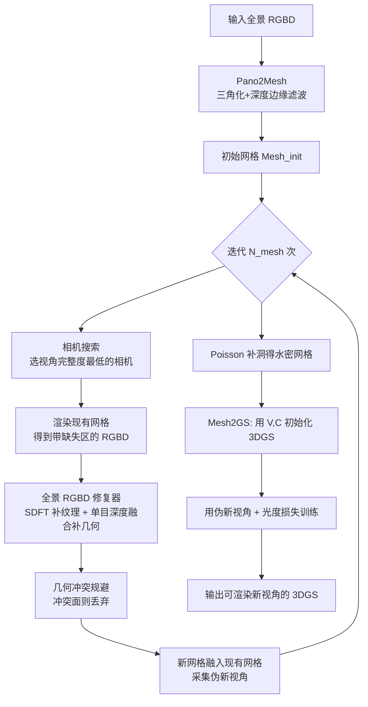

## 一句话总结

只用一张室内全景图，先把它转成初始网格，再借助一个全景 RGBD 修复器迭代补全遮挡区域并沿途采集"3D 一致的伪新视角"，最后把网格转成 3D Gaussian Splatting 并用这些伪视角训练，从而重建出能合成高保真新视角与细节几何的完整室内 3D 场景。

## 研究背景

从单张图重建 3D 场景一直是难题。多视角方法（3DGS、NeuralRecon 等）质量高，但需要大量在多个位置拍摄的图像，采集成本高；单视角 3D 生成方法（RealFusion、DreamGaussian、One-2-3-45 等）靠从大规模 3D 物体数据集蒸馏知识，做单个物体不错，但室内场景里充满"开放词表物体"（语义未定义/难识别），加上高质量先验稀缺，这类方法难以奏效。

针对单全景输入，已有工作各有短板：

- **PERF**（当前 SOTA 的单全景新视角方法）用协同 RGBD 修复沿预定义轨迹逐步补全并训练 NeRF，但训练视角太少导致欠拟合，密集顺序修复轨迹又会引入不良上下文和误差累积，遮挡区常出现过平滑纹理和无意义几何。
- **LucidDreamer** 用点云渲染生成伪新视角来训 3DGS，但点云没有表面，相机靠近时孔洞暴露，伪视角 3D 不一致，训出的 3DGS 出现严重鬼影。
- **Text2Room** 用 Stable Diffusion + 深度预测迭代生成房间网格，但线性深度对齐会导致表面裂缝与误差累积，边长滤波会误删输入纹理，Poisson 重建又带来过平滑。

本文要解决的核心是：在极其有限的单全景 3D 条件下，既忠实保留用户拍到的内容与几何，又能为大面积遮挡区推断出 3D 一致、细节丰富的新纹理与几何，并与已有场景无缝融合。

## 方法

整体流程分三步：Pano2Mesh 生成初始网格 → 迭代网格补全（全景 RGBD 修复 + 视角搜索 + 几何冲突规避）→ Mesh2GS 转成 3DGS 并用采集到的伪新视角训练。

**1. Pano2Mesh 与深度边缘滤波**
把全景像素反投影到 3D 并对相邻像素三角化，忠实保留输入内容。关键改进是用深度边缘滤波替代 Text2Room 的边长阈值：后者阈值随深度尺度变化，会误删远处内容、又断不开近距离物体；本文用边缘检测器从深度图提取深度边缘掩码 $$M_D$$，把落在边缘上的顶点当作物体轮廓断开，做到尺度不变的过滤，不损伤输入纹理，也让遮挡区边缘更平滑。像素到 3D 的转换用球面投影：

$$x = \sin(\phi)\cos(\theta)D(\phi,\theta),\quad y = \cos(\phi)D(\phi,\theta),\quad z = \sin(\phi)\sin(\theta)D(\phi,\theta)$$

**2. 全景 RGBD 修复器（纹理 + 几何）**
纹理侧提出 SDFT：因为 Stable Diffusion 只吃透视图，直接用会丢失场景整体风格、生成不一致。作者对每个场景用 LoRA 微调 SD 的 U-Net 自注意力层（冻结其余参数），让它学到该全景的风格与特征；修复时把全景按二十面体 $$K=20$$ 个面采样成透视图逐个修复再 warp 回全景，保证每步都以已有内容为条件、无缝拼接、保持原分辨率。
几何侧沿用 360MonoDepth 思路，用 DPT 对各透视图预测深度，再优化每张深度的缩放 $$s(k)$$ 与偏移 $$o(k)$$ 融合到渲染深度。优化目标含四项：

$$\arg\min_{\{s(k),o(k)\}} E_{fix} + E_{align} + E_{normal} + E_{smooth}$$

其中 $$E_{fix}$$ 固定已有深度不被改动，$$E_{align}$$ 约束重叠切向视图深度一致，$$E_{smooth}$$ 保证缩放/偏移空间平滑；特别地用预训练法向估计器加了表面法向约束

$$E_{normal} = \sum_{k\in K}\left(N_{I_{inp}(k)} - N_{\tilde{D}_{inp}(k)}\right)^2$$

让补出的几何表面连续、对齐已有表面，避免裂缝。

**3. 视角搜索 + 几何冲突规避**
不同于 PERF 的顺序轨迹（对同一遮挡区反复以不合适视角修复、误差累积、结果模糊），本文按 Atlanta world 假设从深度图估出房间边界并在房间空间均匀撒点作为候选相机，每次迭代挑"视角完整度最低"（缺失像素最多）的相机来修，最大化每步覆盖、最小化修复步数：

$$\arg\min_{\{k\in K\}} \sum_{(u,v)\in(H,W)} M_{render}(k)(u,v)$$

新内容融入前，从此前视角重渲染检查冲突，用阈值 $$\varepsilon$$ 判定 $$M_{conflict}(k)(u,v) = \lvert I_{inp}(k)(u,v) - R_{mesh}(k)(u,v)\rvert > \varepsilon$$，一旦冲突就丢弃这些新面，保证采集到的伪新视角 3D 一致，避免训练 3DGS 时出现鬼影和过平滑。

**4. Mesh2GS**
Poisson 重建得到水密网格但过平滑。于是用网格顶点/颜色初始化 3DGS，再用采集的伪新视角以光度损失训练：

$$L = L_1(R_{GS}, I_{inp}) + \lambda L_{D\text{-}SSIM}(R_{GS}, I_{inp})$$

由于伪视角本身 3D 一致且逼真，训出的 3DGS 能修复 Poisson 网格的过平滑、恢复细节几何与高保真纹理。

## 实验结果

在 Replica 数据集 8 个单房间场景上评测，每场景固定 150 个朝内的渲染相机轨迹，与 PERF、Text2Room、LucidDreamer 对比（所有方法用同样的输入 RGBD 与相机轨迹）。下表为各场景 PSNR（数字忠于原文）：

| 场景 | Pano2Room | PERF | Text2Room | LucidDreamer |
|------|-----------|------|-----------|--------------|
| Room 0 | **23.29** | 22.58 | 21.55 | 17.50 |
| Room 1 | 25.44 | **26.10** | 24.92 | 18.03 |
| Room 2 | **25.06** | 23.75 | 22.21 | 17.40 |
| Office 0 | **25.15** | 21.15 | 21.68 | 19.25 |
| Office 1 | **31.77** | 30.98 | 23.92 | 20.91 |
| Office 2 | **23.22** | 20.83 | 20.37 | 14.39 |
| Office 3 | **20.93** | 19.69 | 15.77 | 13.98 |
| Office 4 | **26.65** | 22.64 | 23.53 | 15.79 |

除 Room 1 外，Pano2Room 在 PSNR 上全面领先；SSIM/LPIPS 也在多数场景取得最好或接近最好（如 Office 4 SSIM 0.935/LPIPS 0.064，Office 3 SSIM 0.858/LPIPS 0.143 均为最优）。生成一个完整 3DGS 场景约需 40 分钟（含 20 分钟逐场景微调 SD、10 分钟建网格、10 分钟 1 万步 3DGS 优化，A40 GPU），渲染可达 156 FPS。定性上 PERF 遮挡区过平滑、LucidDreamer 鬼影严重、Text2Room 受 Poisson 与不良修复拖累，本文纹理与几何保真度最好。

消融显示五个组件都不可或缺：去掉 SDFT 风格一致性下降、去掉法向约束表面出现裂缝、去掉相机搜索因反复修复而模糊、去掉几何冲突规避出现浮空遮挡、去掉 Mesh2GS 则退回过平滑网格、细节大量丢失。

## 亮点与局限

亮点：
- 首个能从单张全景生成完整 3DGS 的方法，把"低成本单点采集"和"可漫游高保真室内 3D"连了起来。
- 用网格作为中间表示，比点云（无表面、易露孔洞）和纯 NeRF（欠拟合）更能提供 3D 一致的伪监督，从根上抑制鬼影与过平滑。
- 一系列针对性设计（深度边缘滤波、逐场景 SDFT、法向约束深度融合、视角搜索、几何冲突规避）各自解决了此前方法的具体失效模式，消融证实都有效。

局限：
- 多个预训练模型串联、无回改机制，误差会逐级累积；单目深度对玻璃等高反射/透射材质易出错并向后传播。
- 依赖单目深度，距离越远质量越差，长走廊等大场景中远处物体缺乏细节几何。
- 网格由图像栅格反投影而来，远处网格稀疏、近看纹理模糊。
- 假设输入全景包含基本房间结构以便确定相机搜索空间。

## 延伸思考

这篇工作的关键判断是"表示选择决定伪监督质量"：既然单视角信息极度不足，与其让生成模型端到端硬吞，不如先用网格锚住可靠的表面与已拍内容，再让扩散模型只负责"补看不见的地方"，最后交给 3DGS 去恢复细节。这种"几何做骨架、生成做填充、splatting 做精修"的分工，很自然地把误差限制在各自擅长的范围。它的主要软肋——预训练模型串联导致的误差累积——也指向一个明确的改进方向：把目前单向的流水线改成带反馈/联合优化的闭环，让后续步骤能回过头修正深度或修复的错误。此外逐场景 SDFT 微调占了一半耗时，如何用更强的全景原生生成先验或前馈方式替代逐场景优化，是把这套方案推向实时/规模化的关键。
